<!-- CURRENT_STATE_HISTORY_BOUNDARY: requirement-1 -->
> **Current code/readiness summary (reviewed 2026-09-07): [docs/CURRENT_STATE.md](docs/CURRENT_STATE.md).**
> This file retains dated technical notes and historical observations below.
> Older phrases such as "current", "not implemented", "next" or "passed" describe
> their recorded checkpoint, not today's code, database, freshness or permissions.
> File A remains plan authority. Historical counts never grant runtime activation.

<!-- HISTORICAL_CHECKPOINTS_START: original content preserved below -->

# TrendForge System Architecture

## CROSS-015 tradability integration (current, 2026-09-03)

`selection/tradability.py` is the single typed tradability owner. It evaluates
T2T, ASM/GSM/ESM, price bands, market/security status, auctions, F&O ban,
MWPL and MCX mechanics using profile-specific policy, then supplies one hashed
batch to S7. REJECT and WAIT override state; PASS never adds evidence. S8
persists result/component lineage and the frontend only renders backend facts.

ESM, price-band and periodic-auction acquisition now use the existing registry,
resolver/client, strict parsers and canonical `MarketDataStore` last-good path.
The registry is pinned at 126 jobs. The gate reads those normalized objects
directly: current proof is ESM 290 rows, price bands 3,517 rows and an explicit
auction `NIL` valid-empty result. Missing, stale, malformed or conflicting
artifacts remain WAIT. Price-band classification without exact lower/upper
limits also remains WAIT. This closes the named acquisition/integration slice;
it does not activate sources or establish whole-product production readiness.


## Named strategy-source contracts (current, 2026-09-02)

The read-only `profile_source_contracts.py` registry maps PRF-001..007 to exact
mandatory, confirmation and veto source groups. It exposes registration gaps
through `/api/v1/selection/profile-source-contracts` without changing source
activation, scoring, public state, quantity or execution. Intraday profiles
remain WAIT when the postponed OpenAlgo bar contract is unavailable; delayed
macro/ownership sources cannot become live trigger proof.

## R18 governed model-learning layer (current, 2026-09-02)

R18 is implemented and fixture-verified downstream of R16. It binds each model to immutable dataset, feature, formula and model hashes; evaluates challengers only with R16 PIT walk-forward folds, embargo, declared costs and untouched holdout; requires persisted immutable evaluation evidence and human review; and permits automatic demotion but never automatic promotion.

Migration 0014 defines append-only model-registry, evaluation, promotion-review and drift-event tables. It is explicit and not auto-applied. The Paper/ML API and frontend expose model state, dataset age, blockers, drift and rollback history while hiding probability, win rate and performance.

Current observed state is MODEL_NOT_APPROVED / PIT_NOT_APPROVED / WAIT_R18_SCHEMA_NOT_APPLIED. This is the completed fixture boundary, not production model approval.

## Executable-versus-next boundary (current, 2026-09-01)

The implemented research path includes R1/R2, WAIT-only R3, R4/R14/R5, R6, S2-S8 and the R16 PIT substrate. R14 is consumed by R5. R16 provides immutable dataset/replay/label/metric storage and read-only projections, but remains PIT_NOT_APPROVED because only one complete real S8 date exists.

R17-B-F/H/I provide an optional read-only OpenAlgo shadow. R17-G and R9 are postponed. R18 model governance is next and unimplemented; it cannot expose probability, performance, promotion or decision authority while R16 is not approved.

## R17 OpenAlgo fixture-verified shadow boundary (current, 2026-09-01)

The optional OpenAlgo shadow lane remains downstream of the R1-R16 public
source pipeline. `backend/trendforge_api/openalgo_client.py` owns one allowlist
of eight POST market-data routes; all eight now have strict read-only methods.
`source_adapters.py` consumes only validated history and normalizes documented
timezone-aware IST timestamps to UTC. Numeric epochs are accepted only as
numeric JSON values.

```text
OpenAlgo fixture response
  -> response-size and success envelope
  -> numeric/schema/OHLC validation
  -> exact requested identity reconciliation
  -> optional freshness check
  -> normalized read-only result
```

Per-route pacing, bounded transient retry and route-local circuits protect the
local provider. API keys are request-only and redacted from surfaced failures.
Exact NSE/NFO/MCX identity (`openalgo_identity.py`), deterministic reuse of the
existing raw/last-good store (`openalgo_replay.py`) and the dependency-free
stream integrity state machine (`openalgo_stream.py`) are now fixture-verified.
`openalgo_shadow.py` adds one read-only projection after R1-R16. It cannot
change base public state or emit `CONFIRMED`; every DTO is non-executable.

The shadow projection shows cost-aware research levels/quantity and seven
purpose-specific option calculations. PCR, walls, max pain, IV, Black-76
Greeks, liquidity and unsigned gamma remain separately visible, while their
shared chain root/snapshot lineage and zero independent-confirmation count
prevent false independence. The Live Ops renderer keeps compact values in the
primary panel and formulas/hashes in a hidden inspector.

Configuration no longer implies `SHADOW_LIVE`. It stops at
`FIXTURE_VERIFIED`, keeps the effective lane `FREE_OFFICIAL`, and reports
`WAIT_REST_OBSERVATION`. Disabled mode starts no network/socket/storage work
and preserves the R1-R16 base hash. The approved 2026-09-01 R17-G observation reached exact identity and populated
intervals, then failed closed before quotes because the stored Kite session was
invalid. Live provider data, `SHADOW_LIVE`, broker orders and production
authorization are not claimed.

R17-G now has one bounded observer in openalgo_live_probe.py. It reads exact
requested identity rows from the existing OpenAlgo symtoken database in
read-only mode, executes only the pinned REST and server-observed WebSocket
contracts, reconnects once, replays through the existing store and emits a
secret-free, non-executable report. Fixture and real-master checks pass, but
the approved 2026-09-01 run reached populated intervals after TrendForge added
the provider-advertised `60m` token, then failed closed before quotes because the
stored Kite access token was invalid. The user then deferred R17-G as future work;
OpenAlgo stays optional and non-authoritative, R9 stays postponed, and R18-A
model-governance foundation becomes the next active build under the R16
`PIT_NOT_APPROVED` / `MODEL_NOT_APPROVED` ceiling.
Live provider data, SHADOW_LIVE, broker orders and production authorization are
not claimed.
## Official BSE/RBI and calculated-output boundary (current, 2026-08-11)

The single TrendForge collection plane now compiles **119** hash-pinned source
contracts. BSE financial-results and shareholding indexes use bounded official
API windows with strict `Table` validation, default-window warming and a
bounded stdlib browser-session fallback only after `httpx` receives a bare `{}`;
RBI T-bill yields use official release-index
discovery followed by one detail fetch. All three pass through the existing raw
archive, parser, `MarketDataStore`, last-good and scheduler path.

`DerivedMarketOutputService` runs only after source phases and reads committed
last-good objects. It persists content-addressed calculated outputs for exact
Nifty-500 industry peers, option Greeks and prospective PCR/Max Pain. The
fundamental-ratio builder exists but emits nothing until context-aware numeric
iXBRL facts are present. Calculated keys never enter the source registry,
Consensus board registry, Screener score extractor registry or readiness gate.

```text
official source -> acquire -> validate -> raw archive -> normalized last-good
                                                    -> calculated materializer
                                                    -> zero-score objects
                                                    -> catalog projection (sources only)
```

## Files 1-7 free-source recovery boundary (historical, 2026-08-11)

The authoritative requirement ledger is
`docs/fable/evidence/FREE_SOURCE_RECOVERY_77_MATRIX_20260811.csv`: exactly 77
rows across the seven supplied files. Anonymous replacements continue through
the existing resolver/monitor, parser, content-addressed store and last-good
manifest. That checkpoint compiled 116 contracts; the Inventory export had 158
cards and 122 logical keys.

The earlier alternative considered credentialed gaps through `AsyncEndpointClient`. Fifteen Upstox
Analytics contracts are GET-only and read `UPSTOX_ANALYTICS_TOKEN` from the
environment. Missing credentials fail before the network; bearer values are
never placed in URLs, archives, results or logs. Pure normalizers cover profile,
ratios, statements, holdings, actions, competitors, quotes/depth, candles,
option chain, provider Greeks, OI, PCR and Max Pain. The approved current
implementation skips these routes; they are not registered, scheduled or
counted. No order endpoint exists.

ATM IV history uses `iv_rank.py`. It treats expiry separately from snapshot
date, accepts only observed NSE/Upstox IV, deduplicates sessions and stays
`WAIT_INSUFFICIENT_HISTORY` until 252 distinct dates. It is derived,
informational and zero-score.

## Pack 7 access and derivation boundary (2026-08-11)

Pack 7 is a reconciliation layer, not another acquisition plane. Anonymous
official NSE option-chain outputs continue through the existing registry,
resolver, archive, parser and last-good store. Max Pain may be derived from
official open interest in that parser; missing Greeks, IV history and prediction
labels are never synthesized as source data.

Sensibull, Opstra and broker APIs (Dhan, FYERS and Kite) stay outside production.
Upstox now has a disabled-by-default data-only contract and still waits for the
user's read-only Analytics token before live acceptance. Manual
Screener/Trendlyne exports remain explicit user artifacts, not unattended
collectors. This preserves the one-downloader, one-store and zero-score boundary.

## Pack 6 option-chain normalization boundary (2026-08-11)

Pack 6 does not introduce a second scanner parser. Official NSE option-chain
requests continue through `AsyncEndpointClient` or the existing multi-step NSE
resolver, then the shared raw archive, `parse_nse_option_chain`, MD69 validator,
normalizer and SQLite manifest/last-good store.

The parser identity order is contract field -> strike/records field -> request
URL. A row without symbol, expiry or strike after those steps is quarantined;
if no valid rows remain, the source fails closed. Synthetic Greeks are not
created. Dhan live option data remains credential-blocked, while its public
instrument master remains a separate zero-score reference source.

Screener.in and Trendlyne proposals do not bypass access/service boundaries.
Manual user exports may be analyzed separately but are not unattended fetchers
and do not change scoring authority.

## Pack 5 source-flow extension (2026-08-11)

`nse_market_status`, bounded `nse_pit_symbol`, and `rupeevest_mf_flows` use the
same canonical flow: registry/profile -> existing endpoint client or resolver
-> immutable raw archive -> deterministic structured parser -> content-addressed
MarketDataStore last-good -> Inventory export. PIT and RupeeVest are supporting
evidence only; neither becomes a vote or score. RupeeVest is explicitly
third-party and monthly. No browser downloader, second database, cache plane or
scheduler was introduced.

Date: 2026-07-23
Status: IMPLEMENTED_GUARDED_RESEARCH_ARCHITECTURE
Authority: System-boundary reference subordinate to `AGENTS.md` and File A (`docs/fable/new_merge_PLAN_2026-07-18.md`)

## 2026-08-05 MD69 Canonical Collection Boundary

**Maintenance and extension reference:**
[`docs/fable/MD69_REFRESH_OPERATION_REFERENCE.md`](docs/fable/MD69_REFRESH_OPERATION_REFERENCE.md).
It is the current code map for manual refresh, scheduled collection, source
add/remove, last-good retention and panel membership. It supersedes any
conflicting historical MD69 operational wording below.

**2026-08-06 seven-source repair evidence:**
[`docs/fable/MD69_REMAINING_SOURCE_REPAIRS_2026-08-06.md`](docs/fable/MD69_REMAINING_SOURCE_REPAIRS_2026-08-06.md)
records the resolver, retry and structured-parser corrections for NSE SLB,
CFTC, NSE Large Deals, AMFI and NSDL without adding a second downloader.

**2026-08-06 saved-panel overlay evidence:**
[`docs/fable/MD69_SAVED_PANEL_OVERLAY_REPAIR_2026-08-06.md`](docs/fable/MD69_SAVED_PANEL_OVERLAY_REPAIR_2026-08-06.md)
records that the legacy live-fetch kill switch does not hide the read-only,
hash-verified MD69 manifest used by Sector, Consensus and Screener.

MD69-M1 through M7 add one restart-safe collection boundary for the
exact 69 primary inventory feeds:

```text
hash-pinned registry -> IST due scheduler + SQLite lease
  -> existing AsyncEndpointClient or resolver/monitor
  -> validate/normalize -> SHA-256 object store + last-good
  -> 69-entry manifest + health -> timestamp alignment
  -> cloned read-only live-panel overlay
```

The registry remains `PROVISIONAL` and `activation_ready=false`. The current
foreground scheduler runs with the user's visible provisional override; a
Windows logon task was not found, so restart persistence is not claimed. The
API worker does not own a collector. Canonical panel mode reads verified manifests and
never falls back to catalog prices or starts the legacy downloader. M6 used
only fixture transport and temporary evidence storage; M7 then backed up the
database, applied additive schemas, and observed real normalized records. The
override does not convert provisional timing into official evidence.

Closed-session rule added 2026-08-05: canonical mode still reads the latest
verified manifest after the market closes. Same-day saved EOD/research sources
may enter a cloned panel overlay only as `RESEARCH_ONLY`; they cannot satisfy
LIVE eligibility. The SPA clears all old calculation samples before applying
this overlay. A missing current source therefore stays unavailable rather than
borrowing an old row with a new panel-job timestamp.

Current observed behavior: the latest Refresh-button run produced 67 populated
sources and two valid-empty sources. All populated normalized sources can enter
the bounded supporting overlay dynamically, while critical LIVE inputs,
Consensus voters and Screener score extractors remain explicit. The manifest
reader skips newer empty `MISSED` audit manifests, and manual completion forces
a reread of the newly committed manifest. Sector, Consensus, Nifty Filter and
Screener therefore retain names and rows without borrowing old catalog data.

## 2026-07-23 Source-Key Governance Boundary

`source_key_map_review.py` and `source_inventory_compiler.py` expose one
count- and digest-reviewed living map: 118 named inventory keys, 74 runtime
catalog keys, 63 shared keys and 129 unique keys. The 197 generated
`source:<hash>` identities are endpoint lineage, not sources. All 351 endpoints
have explicit map dispositions; 192 remain unassigned and quarantined.
`sourceGovernanceReady=true` means this fail-closed review is complete.
It is independent of `sourceActivationReady=false`; gate-authorized and
execution-authorized counts remain zero.

## Current Build Navigation

File A controls what is built and in what order. `docs/BUILD_STATUS.md` and
`docs/VALIDATION.md` establish what has been observed. After selecting a File A
milestone, use
`docs/fable/remaining_build/REMAINING_PROJECT_BUILD_FILES.md` as a checklist to
locate the relevant code, tests and supporting documents. That file is not a
third plan and cannot override product scope, public states, safety boundaries
or acceptance ceilings.

Historical quantity, trade-intent, bot or broker-flow language elsewhere in
this architecture is non-operative under the current File A research-only
boundary unless a later explicitly approved File A amendment changes scope.

## Current R0 Feature And Indicator Governance

The verified DAT-010 / DAT-011 boundary contains exactly 39 feature contracts
(FTR-001..FTR-039) using File A's 22 mandatory fields. Every evidence claim and
selection run is bound to the registered feature version, evidence family,
correlation group and one engine manifest. The current internal pin is
`trendforge.numpy-pandas` `1.0.0`, observed with NumPy `2.4.3` and pandas
`2.3.3`.

Route-aware lint, closed-bar warm-up, input integrity, runtime package identity
and parity checks fail closed. A URL, parser, module, registry row or HTTP 200
does not establish live usability or activate a feature. The read-only manifest
and lint APIs do not unlock CONFIRMED, production selection, executable
quantity, order intent or broker execution. R0 remains partial while inventory,
compiler, source-activation and linked CROSS/TDG residuals remain open.

The R0 source compiler is now a separate canonical runtime boundary over the
immutable master workbook. The 2026-08-15 pin
`f1abcdce2b451b4ded9d9e9c8eb6bd63fae82853803f60bef60a1651dd52eb0b` preserves
409 input rows and their raw defects, normalizes 387 endpoint identities and
354 compiled source contracts, and exposes all 11 Hybrid H1A0 defect classes.
Compound prefixed rows bind each source key only to its own URL. The 32
overlap groups have exact, typed, versioned dispositions: 20 parent/child
relationships, seven aliases and five distinct shared endpoints. H1A0 is 6/6
with complete lineage and zero unexplained, invalid or stale resolutions.
Missing, empty and malformed inventories fail explicitly.

### R0 residual split and cash A1–C1 path (2026-08-15)

File A **§25.20.1** splits residual R0 work:

| Slice | Status |
|---|---|
| **R0-A** compiler honesty | Closed: H1A0 6/6 on current pin |
| **R0-B** first official cohort | Field-reviewed: six sources, genuine parser-backed fields plus named waivers for shared retry/breaker and missing MWPL artifact; `provenCount=0`, `canVote=false`; API `GET /api/source-inventory/r0b-cohort` |
| **R0-C** remaining inventory | Quarantined and non-voting |

R1 STO-006/007/008 WAIT storage remains. In addition, the **cash research path
A1–C1** is implemented (plan
`docs/fable/remaining_build/R0_R1_R2_LOCKED_PLAN_2026-08-15.md`):

- A1 staging, A2 identity/S0–S1, A3 §25.25.4 WATCH discovery, A4 PIT history/CA
- A5 index context, A6 futures-only shortlist enrich
- C0 use matrix (`can_rank`/`can_veto`), B MWPL_MISSING unless proven
- C1 attention rank when cash `can_rank` (WATCH ceiling)

No live CONFIRMED, no quantity. R2 **named activation** is **not** started.
Final Merge FMR-001/002 are only partially evidenced by this cash slice.

This compiler result is not source activation. Current contracts remain
unresolved, no source is gate-authorized, and
`sourceActivationReady=false`. The older CROSS-002 129-key living map is not
rebuilt; the live union is 176 keys and stays a separate residual. Status
prose, URLs, HTTP success, parser presence, runtime catalog entries and
reviewed overlap dispositions cannot promote maturity. Unverified
mirror/resolver identities and authority caps remain `UNSPECIFIED`.
Wildcards, weak alias evidence, changed contract sets, duplicate/conflicting
resolutions or a changed workbook hash fail closed.

Runtime gate readiness consumes this same compiler result. Fresh structured
rows remain research-visible as `WAIT_SOURCE_ACTIVATION` until both global
activation and per-contract gate permission are proven. Static replacement-map
booleans cannot authorize confirmation; official surveillance and F&O-ban
vetoes remain effective while positive confirmation is disabled.


## 1. Objective And Boundary

TrendForge is a single-user, localhost-first research decision system for NSE stocks and MCX commodities. It scans intraday and swing opportunities, records every WATCH/WAIT/CONFIRMED/REJECT outcome, and exposes read-only evidence with explicit freshness, conflict and no-action reasons. It does not calculate executable quantity or emit order intent.

It is not an order-management system, broker terminal, autonomous portfolio manager, or source of guaranteed predictions.

Architecture priorities:

- evidence lineage over an opaque score;
- fail-closed behavior over availability;
- deterministic risk before confidence;
- point-in-time reproducibility over mutable latest-data joins;
- official/licensed data over wrappers;
- research-only degradation when authoritative inputs are unavailable;
- a small local operational footprint.

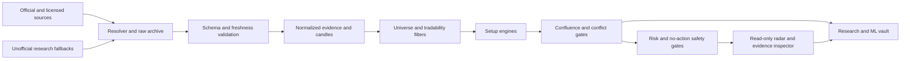

Boundary rules:

- unofficial data cannot independently unlock `CONFIRMED`;
- TrendForge emits read-only evidence, never order or position intent;
- OpenAlgo remains disabled and read-only until separately validated;
- broker credentials never enter source parsers, frontend storage, notes, or ML data;
- the frontend never decides readiness or trading action;
- ML never bypasses deterministic gates.

## 2. Recommended Stack

| Layer | Choice | Reason |
| --- | --- | --- |
| Frontend | Existing HTML/CSS/JavaScript, modularized | Current single-user panel does not justify migration yet |
| API | FastAPI + Pydantic | Existing typed local API |
| Operational DB | SQLite with WAL, foreign keys, busy timeout and migrations | Lowest complexity for one user |
| Analytics | Partitioned Parquet queried with DuckDB | Efficient history, feature and ML queries |
| DataFrame validation | Pandera or equivalent | Source-versioned tabular schemas and invariants |
| Scheduler | APScheduler persistent job store or equivalent | Restart-safe market-calendar jobs |
| Calendar | Locally verified NSE/MCX calendar adapter | Holidays and special sessions are safety-critical |
| Options math | Tested internal Black/BSM plus OpenAlgo Black-76 inputs; QuantLib as an independent reference | IV and Greeks are versioned evidence, not standalone direction signals |
| Logging | Structured JSON with correlation IDs | Replayable source, scan, signal and bot audit |
| Tests | unittest/pytest, Hypothesis, API and browser E2E | Unit, property, integration and visual coverage |

## 3. Major Trade-Offs

### Operational Storage

| Approach | Pros | Cons | Decision |
| --- | --- | --- | --- |
| SQLite WAL | Local, ACID, no server | Single-writer contention | Use now |
| PostgreSQL | Strong concurrency | Added service/maintenance | Defer until multi-user |
| Parquet only | Compact analytics | Weak transactional relationships | Analytics only |

### Scheduler

| Approach | Pros | Cons | Decision |
| --- | --- | --- | --- |
| Current daemon threads | Minimal | Lost on restart, duplicate workers | Replace |
| Persistent APScheduler | Restart recovery and job stores | New dependency | Preferred |
| Celery/Redis | Distributed scale | Excessive complexity | Reject now |

### Data

| Approach | Pros | Cons | Decision |
| --- | --- | --- | --- |
| Direct official parsers | Highest authority and auditability | Schema/anti-bot changes | Primary EOD/regulatory |
| OpenAlgo/broker | Read-only history, option-chain and Greeks client implemented; live credentials and execution remain pending | Broker availability and AGPL service boundary | Primary future intraday |
| yfinance/wrappers | Free and convenient | Unofficial and unstable | Research only |

### Frontend

Retain vanilla JavaScript through functional stabilization. Remove unsafe `innerHTML`, split modules and add browser tests. Reconsider React/Vue only if complexity proves the need.

## 4. Target Module Boundaries

```text
trendforge_api/
  api/              health, sources, scanner, candidates, risk, trade_intents
  domain/           states, instruments, evidence, gates, risk, outcomes
  sources/          authority, contracts, resolver, archive, freshness, parsers
  market_data/      openalgo, candles, corporate_actions, resampling, calendars
  scanners/         universe, liquidity, technical, harmonic, derivatives
                    smart_money, mcx, confluence
  risk/             sizing, portfolio, emotional, slippage
  research/         snapshots, features, outcomes, backtest, model_registry
  jobs/             scheduler, locks, source_jobs, scan_jobs, outcome_jobs
  storage/          database, migrations, parquet, repositories
```

Migrate incrementally from existing flat modules. Do not perform a big-bang rewrite.

## 5. Canonical States

Source fetch:

```text
UNFETCHED, FETCHING, FETCHED_NEW, FETCHED_UNCHANGED,
FETCHED_CHANGED, FETCH_FAILED, ARCHIVED
```

Parser:

```text
WAIT_SOURCE_SNAPSHOT, WAIT_FETCH_REQUIRED, PARSED_METADATA_ONLY,
SCHEMA_MISMATCH, PARSED_EMPTY_VALID, PARSED_EMPTY_INVALID,
STRUCTURED_OK, STRUCTURED_STALE, BROKEN, QUARANTINED
```

Candidate:

```text
PRIORITY_RADAR, READY, WAIT, WAIT_TRIGGER, WAIT_SOURCE, WAIT_STALE,
WAIT_FOMO, WAIT_EMOTIONAL, WAIT_EVENT, WAIT_BASIS_CONFLICT,
WAIT_OI_UNRELIABLE, REJECT, REJECT_DATA_INTEGRITY,
REJECT_LIQUIDITY, REJECT_RISK, NO_TRADE,
LOCKED_NO_TRADE, STOP_TRADING_NOW
```

Each candidate state includes `executable`, ordered reason codes, blocking gate codes, and optional next evaluation time.

Only `STRUCTURED_OK` or a source-contract-approved `PARSED_EMPTY_VALID` may contribute authoritative evidence.

## 6. Evidence Contract

Every normalized evidence row contains:

```text
evidence_id
source_key and authority
source_scope
raw_snapshot_id
parser_output_id
parser_name and version
schema_hash
data_date and published_at
retrieved_at and freshness_state
instrument_id or market_scope
normalized values
quality flags
```

No gate queries arbitrary latest rows. A scan receives an immutable evidence bundle at one cutoff.

## 7. Ingestion Pipeline

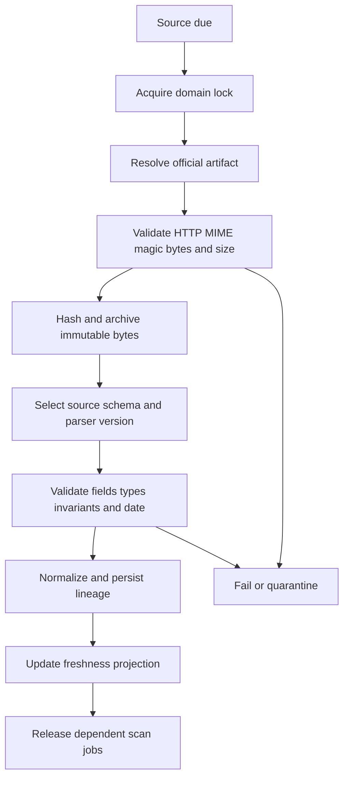

Resolver rules:

- one artifact identity per report family;
- bulk, block, ban and MWPL are separate artifacts;
- validate ZIP/XLSX signatures rather than URL suffix;
- record every attempted URL and error;
- cap response and decompressed size;
- bounded retry for 429/5xx with jitter;
- never silently replace an official executable source with an unofficial source.

## 8. Storage Model

Core entities:

```text
instruments, aliases, contracts
source_definitions, fetch_attempts, raw_artifacts
parser_runs, parser_outputs, evidence_rows
candles, candle_revisions, corporate_actions
universe_snapshots
scan_runs, scan_candidates, candidate_evidence_links
gate_decisions, risk_decisions
trade_intents, bot_acknowledgements, orders_and_fills
outcomes, feature_vectors, model_versions, strategy_versions
account_settings, safety_state_events
```

Rules:

- foreign keys enabled on every connection;
- monotonic migration version;
- immutable content-addressed raw files;
- revised candles retain history;
- candidates link exact evidence/gate rows;
- referenced artifacts cannot be deleted;
- timestamps stored in UTC with exchange timezone retained;
- scans and all candidate/gate rows commit transactionally.

## 9. Candle Architecture

Canonical key:

```text
(instrument_id, timeframe, source_key, timestamp, adjustment_version)
```

Selection priority:

1. OpenAlgo/licensed feed for intraday;
2. official exchange EOD for daily/weekly;
3. verified wrapper for research;
4. yfinance only as `UNOFFICIAL_TEMP`.

Requirements:

- one source series per scan, never mixed;
- OHLC invariants, nonnegative volume and finite values;
- duplicate, gap, future, timezone and out-of-session detection;
- versioned split/bonus/rights/merger adjustment;
- exact NSE/MCX sessions and actual source interval;
- NSE 09:15-13:15 full 4H and 13:15-15:30 partial 135-minute bar;
- atomic Parquet merge/dedupe by canonical key;
- safe path components;
- revision hash controls downstream caches.

## 10. NSE Decision Engine

All active NSE instruments are catalogued. Executable scanning prefilters listing/series, price, 20-day traded value, spread/depth, free float, ASM/GSM/suspension, corporate actions, F&O eligibility and ban state.

Decision layers:

```text
L0 global macro and events
L1 market regime, breadth, India VIX and volatility
L2 sector/industry rotation and relative strength
L3 safety and tradability
L4 smart-money and ownership
L5 OI, MWPL, basis, rollover, IV, Greeks and volume
L6 setup identification
L7 AVWAP, deal anchors, acceptance and supply overhang
L8 deterministic risk and portfolio correlation
L9 emotional and daily-loss safety
L10 trade intent, monitoring and outcomes
```

Hard gates cannot be averaged away by a score.

## 11. Smart-Money Engine

Evidence:

- bulk/block/large deals with side, client, price, quantity and value;
- PIT/SAST/promoter/pledge filings;
- AMFI holdings with publication lag and corporate-action adjustment;
- shareholding/FPI ownership changes;
- buyback/open-offer/control-change events;
- delivery and volume as inferred confirmation, never identity proof;
- SLB as borrow-pressure proxy, never exact short interest.

Quality:

```text
promoter/CEO open-market cash buy -> strongest positive
pledge release -> positive context
buyback execution -> company demand context
ESOP exercise -> weak/neutral
inter-se transfer -> neutral
token director trade -> low weight
pledge creation/invocation -> danger
promoter/PE discounted sale -> supply risk
```

Track deal price, event AVWAP and supply absorption after the filing. An anchor failure invalidates old bullish sponsorship.

## 12. Derivatives Engine

Stock-level requirements:

```text
spot and near/next futures prices
expiry and contract identity
OI change, volume and turnover
MWPL percent and ban
near/next rollover
option prices and OI
implied volatility (IV) history, term structure and skew
Greeks and PCR context
SLB proxy
```

MWPL and expiry reliability are checked before OI interpretation.

```text
price up + OI up     = long build-up
price up + OI down   = short covering
price down + OI up   = short build-up
price down + OI down = long unwinding
```

Participant OI is aggregate market/regime context only.

Current NSE public derivative-context routes:

| Route | Status | Use |
| --- | --- | --- |
| `/api/liveEquity-derivatives?index=stock_opt` | Implemented | Stock option activity for symbol-level research context |
| `/api/liveEquity-derivatives?index=stock_fut` | Implemented | Stock future activity for symbol-level research context |
| `/api/liveEquity-derivatives?index=nse50_opt` | Implemented | Nifty option OI/volume regime context |
| `/api/liveEquity-derivatives?index=nse50_fut` | Implemented | Nifty future OI/volume regime context |
| `/api/liveEquity-derivatives?index=nifty_bank_opt` | Implemented | Bank Nifty option OI/volume regime context |
| `/api/liveEquity-derivatives?index=nifty_bank_fut` | Implemented | Bank Nifty future OI/volume regime context |

These routes are archived and summarized in intraday `marketContext`; they are
not execution proof and cannot unlock READY without the remaining official,
fresh, symbol-level evidence and risk gates.

Current OpenAlgo read-only routes:

| Route | Status | Use |
| --- | --- | --- |
| `POST /api/v1/optionchain` | Implemented in TrendForge client | Strike OI, volume, LTP and IV input |
| `POST /api/v1/optiongreeks` | Implemented in TrendForge client | Single-contract Black-76 IV and Greeks |
| `POST /api/v1/multioptiongreeks` | Implemented in TrendForge client | Bounded batch of 1-50 contracts |
| `POST /api/v1/oi-analytics` | Proposed, not exposed by OpenAlgo | Versioned PCR, Max Pain, walls and OI summaries |
| `POST /api/v1/gex` | Proposed, not exposed by OpenAlgo | Versioned gamma-exposure proxy |

TrendForge computes and stores PCR, Max Pain, OI quadrants, basis, rollover,
walls and concentration from archived option/futures inputs. A public option
chain does not reveal dealer inventory direction, so any aggregate gamma
exposure is named `GEX_PROXY`; it can modify FLOW/risk but cannot prove dealer
positioning or unlock READY.

Symbol beta is a point-in-time risk feature, not a directional trigger. The
target implementation uses `statsmodels.RollingOLS` against the relevant index
with configurable 60/120/252-session windows and stores beta, alpha,
correlation, residual volatility, observation count, benchmark, source cutoff
and calculation version. Missing history, corporate-action breaks or low
correlation produce UNKNOWN and reduce size; they never receive a default beta.

## 13. Harmonic Engine

```text
validated single-source candles
-> confirmed multi-sensitivity pivots
-> pivot occurrence and confirmation timestamps
-> candidate-window enumeration
-> deterministic ratio validation
-> multi-projection PRZ
-> lifecycle and MTF conflicts
-> volume/VWAP/sector/smart-money/OI gates
-> risk plan
```

Target families: AB=CD/ABCD, Gartley, Bat/Alternate Bat, Butterfly, Crab/Deep Crab, Cypher, Shark and Five-0.

Rules:

- XAD uses X-D relative to XA;
- enumerate valid windows instead of only latest five pivots;
- backtests act after pivot confirmation, never at hindsight pivot time;
- PRZ uses converging Fibonacci projections;
- invalidation is pattern structure plus tick/spread buffer;
- pattern-only READY is forbidden.

## 14. MCX Engine

Common requirements:

- active near-month contract and expiry/delivery state;
- MCX OHLCV/OI and near/far basis;
- global benchmark/OI;
- USD/INR translation;
- event calendar;
- CFTC delayed regime context;
- commodity-specific physical and macro drivers.

Gold/Silver: COMEX, USD/INR, DXY, real yields, ETF/physical demand, MCX-COMEX parity and gold/silver ratio.

Crude/NG: WTI/Brent, EIA/API, OPEC, rigs, storage and event-surprise lockouts.

Base metals: LME/SHFE prices and inventories, China demand and global-local basis.

Agriculture: USDA, IMD, acreage, monsoon, MSP, procurement, exports and spot context.

No MCX READY from local price alone, CFTC alone, or a stale global/currency leg.

## 15. Risk And Emotional Safety

Risk inputs:

```text
equity and daily P&L
entry, stop, spread, fees and slippage
lot/tick/margin
liquidity capacity and event/gap risk
existing positions and correlations
confidence calibration tier
emotional safety state
```

Output is quantity or zero with binding caps and calculation version. Confidence applies only after deterministic caps.

Emotional state is a hard pre-trade gate. Daily hard loss, revenge behavior, invalidation averaging and FOMO cannot be overridden by technical confidence or ML.

## 16. OpenAlgo Boundary

The read-only localhost data boundary is implemented for history, option chain,
single-option Greeks and batch Greeks. Credentials remain environment-only and
live broker verification is pending. Order methods are intentionally absent.

OpenAlgo's current OI tracker and GEX pages use logged-in web-session routes;
TrendForge must not call them as if they were stable API-key contracts. Add
versioned `/api/v1/oi-analytics` and `/api/v1/gex` wrappers inside OpenAlgo,
with explicit schemas and timestamps, before enabling those capabilities.
Until then their client status is `PROPOSED_NOT_EXPOSED` and affected evidence
remains UNKNOWN.

OpenAlgo is AGPL-licensed and stays a separately operated localhost service.
TrendForge consumes its documented API contracts; it does not copy OpenAlgo
service code into the TrendForge process. License notices and network-boundary
documentation are retained.

Two phases:

1. TrendForge creates immutable expiring `TradeIntent`.
2. OpenAlgo revalidates live price, quantity, stop, margin, idempotency, safety and instrument identity before any order.

Security:

- bind to `127.0.0.1`;
- local secret from environment configuration;
- HMAC/signing if processes communicate separately;
- idempotency by `signal_id`;
- never persist broker password, OTP, cookie or API secret;
- live adapter disabled until user approval.

## 17. Research, ML And Backtest

Features are frozen point-in-time snapshots: regime, geometry, volume/liquidity, derivatives, smart money, anchors, freshness, event, risk and version metadata.

Outcomes include triggered status, MAE, MFE, target/stop order, time, slippage, fill and false-screen reason.

ML may calibrate confidence, rank eligible candidates, find failure clusters and propose challengers. ML cannot bypass freshness, risk/emotional locks, turn WAIT into READY, or auto-promote itself.

Backtests must model publication lag, corporate actions, survivorship, costs, fills, pivot confirmation and universe membership without lookahead.

## 18. API Contract

Production endpoints are versioned under `/api/v1`:

```text
GET  /health and /system/status
GET  /universe
POST /scans
GET  /scans/{run_id}/candidates
GET  /candidates/{candidate_id}
GET  /sources/status
GET  /sources/{source_key}/artifacts
POST /sources/{source_key}/refresh
GET  /gates/{candidate_id}
POST /risk/evaluate
POST /trade-intents
GET  /trade-intents/{signal_id}
POST /openalgo/events
GET  /research/records
POST /outcomes/label
GET  /performance
GET  /preopen/latest
GET  /preopen/history
POST /preopen/scan
GET  /derivatives/{symbol}
GET  /beta/{symbol}
```

Mutations require request IDs, bounded payloads, validation, audit logs and idempotency where applicable.

## 19. Frontend

First viewport:

```text
persistent command bar
radar queue
selected analysis
real candle/pattern/anchor chart
gate proof and blockers
risk and quantity
source freshness
research history
```

Rules:

- no fake fallback candidates;
- offline means explicit OFFLINE/NO DATA;
- demo mode has persistent banner and `executable=false`;
- candidate cards show source age and cutoff;
- READY shows exact pass/block list;
- render source text as safe text nodes;
- lock state is persisted and shared with risk API;
- rejected/watch records are saved but do not crowd primary radar.

## 20. Caching, Jobs And Performance

- raw files by content hash;
- normalized rows by source hash and parser version;
- candles by source/instrument/timeframe/range;
- pivots/indicators by candle revision hash;
- incremental scans after initial universe pass;
- domain-specific rate limits;
- persistent job locks and abandoned-run recovery;
- cache expiry never exceeds evidence cutoff;
- status APIs query metadata, not every Parquet row.

## 21. Security, Logging And Operations

Required context: timestamp, level, correlation/job/run/signal IDs, source/snapshot/parser, instrument, state transition, duration and stack trace.

Monitor source age/failures, schema mismatch, scan duration, DB locks, disk space, candidate states, bot rejection/duplicates and model calibration.

MVP deployment:

- isolated locked environment;
- localhost Windows process/service;
- restricted CORS and local bot token;
- daily SQLite backup and weekly restore test;
- raw/Parquet checksum manifest;
- no internet-facing port.

Authentication is mandatory before LAN/internet exposure.

## 22. Failure Recovery

| Failure | Behavior |
| --- | --- |
| Source 403/429/5xx | Backoff, show last valid as stale, block current gate |
| Schema change | Quarantine, retain raw bytes, block gate |
| DB locked | Bounded retry; no partial scan publication |
| Disk full | Stop ingestion/scanning safely |
| OpenAlgo unavailable | Research record only, executable false |
| Duplicate signal | Idempotent rejection |
| Price beyond allowed move | Expire intent and mark WAIT_FOMO |
| Model degradation | Prior champion or research-only |
| Restart during scan | Resume or deterministically abandon |

## 23. Architecture Acceptance

The user confirmed the single-user local architecture, both NSE and MCX scope, both intraday and swing scanning, INR 1,00,000 account sizing and future OpenAlgo integration. The runtime continues to enforce:

1. SQLite plus partitioned Parquet for local operational and analytical storage;
2. official/licensed evidence as the only future executable authority;
3. a strict boundary between TrendForge research/intent and OpenAlgo execution;
4. no mock, unofficial-only, stale, metadata-only or incomplete READY;
5. deterministic stop risk before confidence-based reduction;
6. no ML override of hard safety/source gates.

## 24. Implemented Runtime Map - 2026-07-14

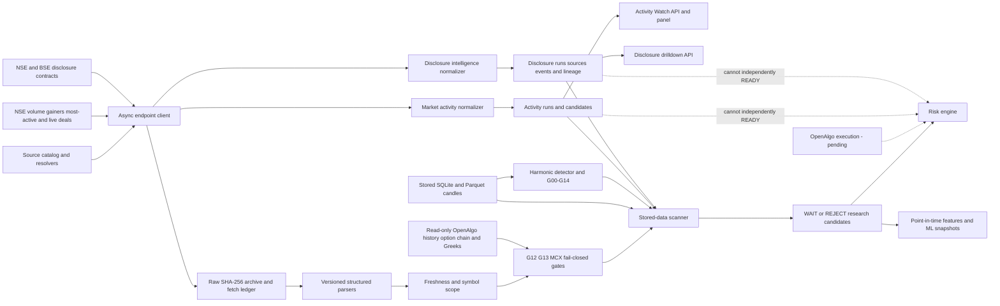

Implemented modules include source monitoring, raw archive, parser dispatch,
freshness policy, gate readiness, scanner scheduling, candle/Parquet storage,
harmonic validation, market-activity normalization, disclosure-intelligence
normalization, feature engineering, backtest validation, deterministic risk and
option mathematics. The frontend is a display/control client; backend state
remains authoritative.

CFTC analytics follows this controlled path:

```text
official fut_disagg_txt_YEAR.zip
  -> ZIP path/type/size validation
  -> immutable raw hash archive
  -> Producer/Merchant, Swap, Managed Money, Other and Non-reportable rows
  -> contract-code/date normalization
  -> point-in-time rolling features ending at each report date
  -> OFFICIAL_DELAYED_CONTEXT panel
```

Legacy Commercial/Non-Commercial files are rejected by this parser because they cannot be relabelled as disaggregated Managed Money. The external `kustex/CFTC-COT-Report` repository is an MIT-licensed analytics reference only; TrendForge does not import its Dash application, downloader, email handling or dependencies.

The scheduler is intentionally disabled by default and uses a single-process overlap lock. A production live deployment still needs a verified market calendar, durable multi-process job ownership, live feed rate limits and abandoned-job recovery testing.

The read-only OpenAlgo boundary is implemented and remains non-executable. The future execution contract must include an expiring signal ID, source/data cutoff, side, instrument, quantity cap, entry condition, stop, target, maximum slippage, idempotency key and fail-closed broker revalidation. OpenAlgo must reject stale prices, changed margin, changed positions, market closure, duplicate intent and any safety lock.

## 25. Verified Nonfunctional Evidence

```text
clean dependency environment: no broken declared requirements
backend: 291 tests passing in the latest full baseline; rerun required after every integration milestone
frontend: 115 acceptance checks passing in the latest recorded baseline
database: integrity ok, WAL, application foreign keys, busy timeout
API: localhost CORS, request ID, structured request log
responsive UI: zero measured horizontal overflow at desktop and mobile widths
browser console: no warning or error
```

The architecture is ready for the final live-data and OpenAlgo milestones, not for executable trading today.

## 26. Pre-Open, Derivatives And Beta Extension - 2026-07-14

This section supersedes older pre-open/OpenAlgo wording in the historical
appendix. It extends the existing scanner and does not replace its source,
G00-G14, risk, emotional-safety, ML-lineage or no-fake-READY rules.

### Pre-Open Lifecycle

```text
official pre-open snapshots
  -> PREOPEN_WATCH
  -> OPEN_CONFIRMATION_WAIT
  -> READY / WAIT / REJECT
```

`PREOPEN_WATCH` is never executable. A candidate remains
`OPEN_CONFIRMATION_WAIT` until fresh post-open price, volume, VWAP, spread and
market/sector confirmation arrive. The state becomes READY only if every hard
source, tradability, risk and safety gate passes; otherwise it remains WAIT or
becomes REJECT with saved reasons.

Exchange-calendar schedule in `Asia/Kolkata`:

| Time | Action |
| --- | --- |
| 08:58 | Warm official NSE session and verify trading day |
| 09:00:30 | Archive opening pre-open snapshot |
| 09:04:30 | Archive imbalance/IEP development snapshot |
| 09:07:00 | Archive stabilization snapshot |
| 09:08:30 | Archive final auction snapshot when available |
| 09:14:30 | Freeze pre-open features and create watch candidates |
| First 5m/15m after 09:15 | Require post-open confirmation before promotion |

Missing snapshots are not interpolated or replaced with the latest value. Each
snapshot stores source timestamp, retrieval timestamp, raw artifact/hash and
source status.

Normalized pre-open fields:

```text
category, symbol, series, purpose
source_timestamp, retrieved_at, snapshot_sequence
indicative_equilibrium_price, previous_close
final_price, final_quantity, total_turnover
total_buy_quantity, total_sell_quantity
ato_buy_quantity, ato_sell_quantity
market_cap, raw_snapshot_id, content_hash
```

Derived features are deterministic and versioned: gap percent, matched
notional and percentile, buy/sell imbalance, ATO imbalance, match ratio, IEP
path/stability, auction completeness, market/sector breadth and known-event
adjustment. Division-by-zero, missing fields and late source timestamps yield
UNKNOWN, never zero-confidence evidence.

### Symbol-Level Derivatives Flow

```text
OpenAlgo option chain + batch Greeks
  -> immutable raw/archive rows
  -> contract and expiry validation
  -> PCR / Max Pain / walls / IV-skew / GEX_PROXY
official futures + MWPL + ban + basis + rollover
  -> G13 reliability and direction context
RollingOLS beta + correlation + residual volatility
  -> risk reduction and portfolio correlation cap
all evidence
  -> symbol/timeframe scanner -> WAIT / REJECT / READY
```

Every derivative feature carries symbol, contract, expiry, exchange, observed
time, available time, source cutoff, source authority, freshness, calculation
version and raw lineage. Batch Greeks must be chunked to the verified OpenAlgo
limit of 50 contracts and partial failures are stored per contract. PCR, Max
Pain, beta and GEX_PROXY cannot independently create a trade candidate.

### Rollout Order

1. Persist official pre-open snapshots and normalized fields.
2. Add deterministic auction features and lifecycle state transitions.
3. Wire verified OpenAlgo option-chain, option-Greeks and batch-Greeks data.
4. Build point-in-time PCR, Max Pain, walls, IV-skew and GEX_PROXY analytics.
5. Add `RollingOLS` beta and correlation with quality gates.
6. Join symbol-level derivatives evidence to existing G12/G13/risk gates.
7. Add OpenAlgo API-key OI/GEX wrappers only after their server contracts exist.
8. Run fixture, live-shadow, point-in-time, load and failure tests before any
   READY promotion; execution remains a separately authorized milestone.

## 27. Successful 12-Route Source Merge - 2026-07-17

The latest screener-source merge reuses the existing source catalog and raw
archive path instead of adding standalone downloader files.

Live-verified routes now available to the research screener:

```text
nsdl_fpi_daily_reportdetail
bse_sast
cftc_legacy_futures_only
cftc_disagg_futures_only
cftc_tff_futures_only
nse_shareholding_pattern
nse_live_equity_derivatives_index_opt
nse_live_equity_derivatives_index_fut
nse_live_equity_derivatives_banknifty_opt
nse_live_equity_derivatives_banknifty_fut
nse_most_active_volume
nse_volume_gainers
```

The intraday snapshot can now expose NSDL daily FPI table availability, Nifty
and Bank Nifty option/future market context, volume-gainer and most-active
activity, BSE SAST context, CFTC delayed regime rows, and symbol-level NSE
shareholding evidence. RELIANCE live verification produced `promoter_holding_pct
= 50.48`, `public_holding_pct = 49.52`, and `shareholding_date = 30-JUN-2026`.

CFTC SODA routes are bounded to latest-first 500 rows to preserve the raw
response size guard. They remain `UNVERIFIED_RESEARCH` delayed regime context
and cannot unlock READY alone.

Current workbook counts after rebuild:

```text
MASTER_CURRENT 370
LINKED_SOURCES 105
NOT_LINKED_SOURCES 231
SUPPRESSED_NOT_LINKED_DUPES 18
ALL_LINKS_FROM_REPORTS 354
linked/not-linked overlap 0
```

Mandatory failures include market holiday, incomplete auction, missing final
snapshot, stale post-open quote, duplicate snapshot, source revision, option
expiry mismatch, partial batch-Greeks failure, missing OI, zero OI, bad IV,
unsupported exchange, 50-contract overflow, corporate-action discontinuity,
insufficient beta history, low benchmark correlation, OpenAlgo timeout and
lookahead leakage. Each failure must produce a saved WAIT/REJECT/UNKNOWN state,
not a substituted estimate.

## 27. Market Activity And Disclosure Intelligence Integration - 2026-07-14

This section is the current architecture and graph authority for the latest
source work. It supersedes the older build graphs in the historical appendix;
those embedded graphs remain unchanged only as audit evidence.

### Runtime Modules

```text
backend/trendforge_api/institutional_sources.py
  AsyncEndpointClient
  NSE session seeding, host rate limiting, retries and bounded response size
  immutable source archive and institutional_endpoint_fetches ledger

backend/trendforge_api/market_activity.py
  volume-gainer, most-active-volume, most-active-value and live-deal normalizer
  research-only activity score and WATCH/WAIT states
  market_activity_runs and market_activity_candidates persistence

backend/trendforge_api/disclosure_intelligence.py
  source-specific corporate, ownership, pledge, SAST and deal normalization
  event-level SHA-256 deduplication and immutable run lineage
  structured, valid-empty, stale, schema-mismatch and fetch-failed states

backend/trendforge_api/main.py
  fetch orchestration and read-only API exposure
```

### Detailed Data Graph

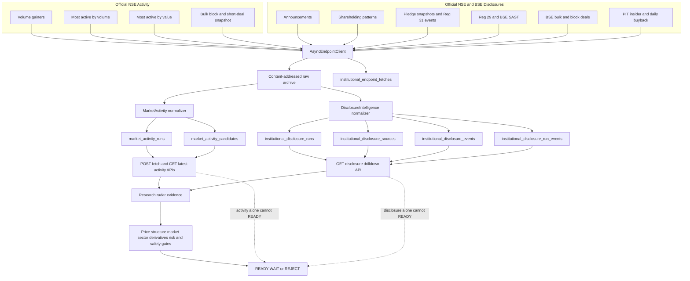

### Active API Contracts

```text
POST /api/market-activity/fetch
GET  /api/market-activity/latest?limit=50

POST /api/institutional/corporate-sources/fetch
POST /api/institutional/extended-market-sources/fetch
POST /api/institutional/macro-event-sources/fetch
GET  /api/institutional/disclosures/latest?symbol=RELIANCE&limit=100
GET  /api/institutional/macro-event-context/latest
```

The batch disclosure fetch routes keep their existing response contracts. After
raw archiving they also create a disclosure normalization run. The latest route
is read-only and may filter NSE-symbol records; BSE-only rows remain addressable
by their stored scrip code until the shared symbol/ISIN mapper is applied.

### Current Storage And Evidence Truth

```text
Market Activity Watch sources: 4
  volume gainers: 25 rows
  most active by volume: 20 rows
  most active by value: 20 rows
  live large deals: 289 rows

Disclosure contracts normalized: 13
Disclosure events in verified backfill: 3,567
Rejected disclosure rows after schema correction: 0

Macro/event context batch: 20 sources
  connected/archived research context: 13
  fail-closed: 7
  latest state: WAIT_PARTIAL_SOURCE

Canonical source inventory: 233 rows
Connected fresh structured: 45
Not currently fresh structured: 188
```

The former 29-row assistance batch is now reconciled as 13 fresh structured,
one connected valid-empty, three duplicate/covered, two metadata-only and ten
schema-pending rows. The 20-source macro/event batch is research-only and adds
raw/schema-pending or fail-closed context without changing READY authority. The
canonical row-level authority remains:

```text
D:\TrendForge\data\reports\CURRENT_211_LINK_USABILITY_2026-07-14.csv
```

The filename is retained for compatibility even though the canonical file now
contains 233 rows.

### Fail-Closed Rules

- Activity scores mean evidence strength, not probability of winning.
- A valid empty response is visible and stored; it is not a fetch failure.
- Stale source artifacts remain visible but cannot confirm current conditions.
- Schema mismatch or wrong content blocks the affected evidence path.
- Quarterly shareholding and pledge snapshots are swing context, not intraday flow.
- Participant or disclosure data cannot be relabelled as stock-level live institutional buying.
- Test fixtures must never write synthetic runs into the production research database.
- Neither activity nor disclosure evidence independently unlocks executable output.

## Full Historical Verbatim Appendix

The following source documents are embedded verbatim so no historical requirement, example, reasoning note or audit statement is lost. These appendices are historical evidence; the active sections above control implementation when statements conflict.

<!-- HISTORICAL_SOURCE_BEGIN path=backup_reference_20260705_162956/backup_dashboard_experience_plan.md sha256=4b09216e2dddc99568bf3e55b06b00c53d42a8e12723f0e3de577cf1f90f0844 lines=1640 -->
# TrendForge Dashboard Experience Plan

This file defines what the user sees after TrendForge is built.

It does not replace `SCREENER_RULES.md`. It is the visual/user-experience layer on top of the existing causal engine, runtime gates, risk rules, data schema, options/GEX logic, trap checks, and no-auto-order rule.

## 1. Product Direction

Best first build:

```text
Local web dashboard + Python/FastAPI backend + SQLite database + browser UI
```

Why:

- It supports live scanning, alerts, source health, options data, journaling, and dashboard views.
- It keeps credentials and trading data local.
- It is more visual than a terminal script.
- It avoids the extra security and deployment burden of a cloud SaaS app.
- It preserves the v1 safety boundary: read-only plus alerts, no auto-ordering.

## 2. Daily Experience

TrendForge should walk the user through the whole market day.

```text
7:00 PM - 10:00 PM   Evening Prep
6:00 AM - 9:00 AM    Morning Brief
9:00 AM - 9:15 AM    Pre-Open Scanner
9:15 AM onward       Live Radar
On click             Stock Deep Dive
Before trade         Position Size Calculator
After entry          Trade Monitor
After market         Journal And Learning
```

The user should not need to remember the full checklist. The dashboard should show what matters at the correct time.

## 3. Screen 1: Evening Prep

Purpose:

- prepare tomorrow's market bias
- find event risk
- capture bulk/block deals and sponsor clues
- run the swing scan
- produce tomorrow's watchlist

What it shows:

```text
EVENING PREP

US MARKETS:
S&P 500 +0.8% | Nasdaq +1.2% | Dow +0.5% | US VIX low

INTERMARKET:
Brent crude -1.2% | Gold +0.3% | USD/INR stable | DXY -0.2%

FII/DII:
Today: FII +2,340 Cr | DII +1,120 Cr
5-day: FII +8,900 Cr | DII +4,200 Cr
20-day: FII +22,000 Cr | DII -3,100 Cr
Verdict: bullish because both recent FII and DII flow support risk

EVENTS TOMORROW:
TCS results after market
RBI minutes at 11:30 AM
F&O ban: IDFCFIRSTB, MANAPPURAM
Ex-dividend: HDFCBANK

BULK/BLOCK:
TATAMOTORS: named institution bought at premium
ADANIPORTS: promoter pledge increase, caution

SYSTEM VERDICT:
Market bias: bullish for tomorrow
Focus: IT and Banking
Caution: RBI minutes can cause intraday volatility
```

What the user does:

- read the verdict
- note event blocks
- note F&O ban and ex-dividend names
- know the likely focus sectors before sleeping

## 4. Screen 2: Morning Brief

Purpose:

- confirm or invalidate the evening bias
- decide the strategy for the day
- prepare sector focus

What it shows:

```text
MORNING BRIEF

GIFT Nifty: +0.65%
Expected Nifty open: gap up around 150-170 points

ASIA:
Nikkei green | Hang Seng green | Shanghai weak

US FUTURES:
S&P futures green, confirming overnight strength

NIFTY OPTIONS:
PCR: 1.15 bullish
Max Pain: 24,500
Call Wall: 25,000 CE
Put Wall: 24,500 PE
OI Trend: put OI added at support
FII Futures L/S: 0.72 bullish

REGIME:
Strong uptrend
Nifty > 20 DMA > 50 DMA > 200 DMA
India VIX normal
Breadth healthy

STRATEGY:
Trade long breakouts.
Avoid casual shorts.
Nifty range: support 24,500 / resistance 25,000

SECTOR PLAN:
IT: BUY because Nasdaq strong and rupee supportive
Banking: BUY because FII flow supports it
Auto: WAIT because mixed signals
Metals: WEAK because China weak
OMC/Oil: BUY because crude falling supports margins
```

What the user does:

- confirm the daily bias
- know where to look
- wait for pre-open instead of chasing early assumptions

## 5. Screen 3: Pre-Open Scanner

Purpose:

- find early gaps
- separate real gaps from empty gaps
- build a watchlist, not immediate trades

Important rule:

```text
Pre-open output is WATCH only.
No stock becomes READY before post-open confirmation.
```

What it shows:

```text
PRE-OPEN SCANNER 9:08 AM

GAP UP STOCKS:
INFY       1842 | +2.3% | Catalyst: Nasdaq rally | VALID WATCH
HCLTECH    1678 | +1.8% | Catalyst: Nasdaq rally | VALID WATCH
ICICIBANK  1245 | +1.1% | Catalyst: FII banking flow | WATCH
BPCL        348 | +1.5% | Catalyst: crude down | VALID WATCH
ADANIENT   3120 | +3.1% | Catalyst: none | EMPTY GAP, AVOID

GAP DOWN STOCKS:
TATASTEEL   152 | -1.8% | Catalyst: China weak | SHORT WATCH
JSWSTEEL    865 | -1.5% | Catalyst: China weak | SHORT WATCH

WARNINGS:
ADANIENT: gap without strong catalyst, high gap-fill risk
TCS: result today, no swing entry
HDFCBANK: ex-dividend, gap may be mechanical, do not short blindly
```

What the user does:

- choose 3 to 5 names to watch
- wait for opening range and VWAP confirmation
- avoid empty gaps and event traps

## 6. Screen 4: Live Radar

Purpose:

- show real-time qualified candidates
- mark each one as READY, WAIT, REJECT, or NO_TRADE
- keep attention on the top few setups

What it shows:

```text
LIVE RADAR 9:32 AM

Nifty 50: +0.58%
Bank Nifty: +0.71%
Breadth: 2:1 positive
India VIX: 13.2

SECTOR HEATMAP:
IT strongest
Banking strong
Oil & Gas strong
Metals weakest

READY:
INFY LONG - Gap&Go + ORB
Score: 23/28 causal + 14/16 execution
Gap +2.3% | RVOL-TOD 3.2x | 15-min high broken
VWAP hold | IT sector #1 | OI long build-up
Entry 1849 | Stop 1835 | Target 1870 / 1890

WAIT:
ICICIBANK LONG WATCH
Score: 18/28 causal + 10/16 execution
Issue: waiting for VWAP reclaim

WARN:
TATASTEEL SHORT
Score good, but short is against bullish market.
Reduced size or skip.

REJECT:
ADANIENT
Gap without catalyst, empty-gap risk.
```

What the user gets:

- a ranked and focused radar
- no guessing about entry/stop/target
- warning when the setup is not aligned
- visible WAIT status for stocks still forming

## 7. Screen 5: Stock Deep Dive

Purpose:

- explain the full chain of reasoning
- make each result verifiable
- show the weakness, not only the strength

What it shows:

```text
INFY FULL ANALYSIS

State: READY LONG
Setup: Gap&Go + ORB
Score: 23/28 causal | 14/16 execution
Percentile: Top 2%

LAYER CHECK:
Layer 0 Global: PASS - Nasdaq green, GIFT Nifty up
Layer 1 Regime: PASS - strong uptrend, VIX normal
Layer 2 Sector: PASS - IT strongest sector
Layer 3 Tradable: PASS - turnover high, spread low, not banned
Layer 4 Setup: PASS - gap and opening range breakout
Layer 5 Confirmation: PASS - RVOL-TOD, VWAP, OI confirm
Layer 6 Risk: PASS - R:R acceptable, slippage ok
Layer 7 Execution: waiting for user

4-LAYER CAUSAL SCORE:
CAUSE: IT/Nasdaq catalyst and sector driver
SPONSOR: delivery high, FII sector flow, MF support
STRUCTURE: above key averages, near highs
FLOW: RVOL-TOD 3.2x, VWAP hold, long OI build-up

INSTITUTIONAL ACTIVITY:
FII net buyer in IT
MF holdings increased last month
Delivery percent above average
No negative promoter event

FORCED COUNTERPARTY:
Potential underweight funds chasing IT strength.
No confirmed short squeeze.

TRAP CHECK:
No upper wick
Closed above level
Holds above VWAP
Not into major supply
Index aligned

OPTIONS:
PCR mild bullish
Put OI support below
Call OI resistance near target
IV Rank low, directional option buying not expensive

DATA CONFIDENCE:
Price: GREEN
NSE delivery: GREEN
Options: GREEN
AMFI: AMBER due monthly lag
```

## 8. Screen 6: Position Size Calculator

Purpose:

- convert trade idea into exact risk
- stop oversized trades
- check margin/slippage/exposure

What it shows:

```text
POSITION SIZE - INFY

Account size: 10,00,000
Risk per trade: 0.5% = 5,000

Entry: 1849
Stop: 1835
Risk per share: 14

Position size: 357 shares
Position value: 6,60,093
Margin estimate: 1,32,019 at 5x intraday

Target 1: 1870 = 1.5R
Target 2: 1890 = 2.9R
Max loss: 4,998

Checks:
Risk < 1% account: PASS
Slippage < 20% stop distance: PASS
No same-sector overexposure: PASS
Margin/cash available: PASS
```

## 9. Screen 7: Trade Monitor

Purpose:

- manage manually entered trades
- suggest exits and stop movement
- keep live context visible

What it shows:

```text
ACTIVE TRADE - INFY LONG

Entry: 1849
Current: 1862
P&L: +0.93R
Stop: 1835
Target 1: 1870
Target 2: 1890

Live alerts:
10:02 - approaching target 1
10:15 - volume declining, momentum may stall
10:22 - VWAP rising, trend intact
10:31 - target 1 hit, book 50%, trail rest

Suggested action:
Move stop to breakeven after T1.

Live context:
Nifty bullish
IT still leading
Breadth healthy
VIX stable

Warnings:
Lunch hour approaching
TCS result after market may affect IT
```

The system can suggest stop movement, but the user still places or edits orders manually.

## 10. Screen 8: Journal And Learning

Purpose:

- review performance
- check whether system logic worked
- calibrate future weights after enough samples

What it shows:

```text
TRADING JOURNAL

Today:
Trades: 2
Wins: 1
Losses: 1
Net: +0.62R

Trade 1: INFY LONG
Result: WIN
Reason it worked: catalyst + sector + volume aligned
Lesson: could have held runner longer

Trade 2: TATASTEEL SHORT
Result: LOSS
Reason it failed: shorted against bullish market
Lesson: reduced-size warning should probably have been skip

System accuracy:
Market bias correct
Sector call correct
Gap direction correct
Higher-scored trade won

Running stats:
Win rate
Average R
Expectancy
Best setup
Worst setup
Best sector
Worst sector
```

## 11. Swing Mode

Swing mode runs mostly after market hours.

Example:

```text
SWING SCREENER

PERSISTENT SYSTEMS - VCP forming
Score: 15/16 execution plus causal score
Setup: 4-week VCP, Bollinger squeeze near 6-month low
Trend: above 20/50/200 DMA
Relative strength: up while Nifty flat
Volume: drying up in base
Delivery: 52%
MF activity: 3 funds added
Event risk: earnings not due for 3 weeks
Promoter: no pledge

Buy above: 5280
Stop: 5050
Target: 5740
Expected hold: 2-4 weeks
Status: WAIT, set alert at breakout level
```

## 12. Extra Panels

These should be added because they improve decision quality:

- Why Rejected: shows rejected stocks and exact failing gate.
- WAIT Board: tracks stocks close to trigger.
- Data Confidence: GREEN/AMBER/RED per data source and per stock.
- Forced Counterparty: shows whether there is squeeze/rebalance/underweight fuel.
- Gamma/GEX Panel: shows squeeze, pinning, gamma flip, and expiry risk.
- Breadth Danger Alarm: blocks breakouts when index is narrow.
- Threshold Profile: Strict, Normal, Exploratory. Never silent auto-loosen.
- Replay Mode: replay prior day decisions candle by candle.
- Watchlist Memory: tracks sponsor evidence building over days/weeks.
- Stale Evidence Badge: old evidence cannot create high confidence.

## 13. Final Output Contract

Every stock response must include:

```text
State: READY / WAIT / REJECT / NO_TRADE
Direction: LONG / SHORT / WATCH
Setup: Gap&Go / ORB / VCP / Pullback / PEAD / Relative Strength
Causal Score: x/28
Execution Score: x/16
Percentile Rank
Reason
Evidence with source/date
Entry trigger
Stop
Targets
Position size
Trap warning
Exit plan
Data confidence
```

Minimum actionable example:

```text
READY LONG: INFY
Reason: IT sector strongest, clean gap with catalyst, RVOL-TOD 3.2x, VWAP hold, delivery strong.
Entry: 1849 after 15-minute high break
Stop: 1835
Targets: 1870 / 1890
Size: 357 shares for 0.5% account risk
Trap Check: passed
Data Confidence: GREEN
```

## 14. What The System Does Not Do

TrendForge does:

- show what to look at and when
- rank stocks by quality
- explain the evidence
- calculate position sizes
- warn about traps
- monitor open trades
- journal outcomes

TrendForge does not:

- place orders automatically in v1
- guarantee any trade will win
- replace user judgment
- predict black swans
- work if risk rules are ignored
- silently relax thresholds to force trades

## 15. Assessment Merge: Final Screen Upgrade

This section updates the visual plan with the latest assessment. It does not remove the earlier 8-screen flow. It promotes several rules into visible dashboard states so the user can see what the system is thinking before, during, and after a trade.

## 16. Screen 0: System Health + Regime Override

Screen 0 is always visible as the top bar.

```text
SYSTEM HEALTH: GREEN
NSE: fresh 2m ago | Options chain: fresh 1m ago | Delivery: yesterday T+1
Database: OK | Last scan: 09:43:12

REGIME: TRADEABLE BULLISH
NO_TRADE Override: OFF
Liquidity Window: VALID MOMENTUM WINDOW
Expiry Mode: OFF
Breadth: healthy
```

If conditions are hostile:

```text
REGIME OVERRIDE: RED
TODAY: NO_TRADE ENVIRONMENT
Reason: VIX spike, breadth 1:3 negative, RBI event in 2 hours, pre-open direction unstable.
Action: no fresh trades. Reassess at 10:30 AM.
```

Visible checks:

- data freshness
- stale source warnings
- market regime
- crisis/scenario warning
- NO_TRADE state
- expiry mode
- liquidity window
- breadth danger alarm

## 17. Updated Live Radar Card

Every Live Radar card must show the two-stage score clearly.

```text
INFY
State: READY LONG

Stage 1 Pre-Market: ELIGIBLE 23/28
CAUSE: IT/Nasdaq catalyst
SPONSOR: delivery 48 percent yesterday, FII sector support
STRUCTURE: above 20/50/200, near high
FLOW: RVOL-TOD and OI improving

Stage 2 Live: CONFIRMED 14/16
Trigger: 15-minute high broken
Liquidity Window: VALID
Sector RRG: Leading
Cross-Market Driver: Nasdaq positive, USD/INR supportive
Forced Counterparty: short-covering fuel possible above resistance
Data Confidence: GREEN
```

Rules:

- Stage 1 decides if the stock deserves attention.
- Stage 2 decides if the live entry is good now.
- A stock does not become READY until both stage logic and hard gates pass.
- A stock with no live trigger stays WAIT even if Stage 1 is strong.

## 18. Why Rejected And WAIT Board

The user must see both failed and almost-ready stocks.

```text
WHY REJECTED
ABC: REJECT_OPERATOR_RISK
Reason: price up 14 percent in 3 days, no verified catalyst, delivery below 15 percent.

XYZ: REJECT_STALE_DATA
Reason: options chain older than 15 minutes; live FLOW cannot be trusted.

WAIT BOARD
RELIANCE: WAIT_LOW_LIQUIDITY
Reason: trigger fired at 11:47 AM lunch trap with RVOL-TOD only 1.2x.
Next check: 1:00 PM

HDFCBANK: WAIT_EVENT_RISK
Reason: RBI policy in 2 hours.
Next check: after event volatility settles.
```

## 19. Liquidity Window Display

The dashboard must show what time window the market is in.

```text
LIQUIDITY WINDOW
Current time: 11:45 AM
State: LUNCH TRAP
Rule: suppress new entries unless RVOL-TOD > 3.0x or verified catalyst exists.
```

Window behavior:

- 9:15 to 9:30: observe, build ORB.
- 9:30 to 10:00: first valid execution window.
- 10:00 to 11:30: best normal momentum window.
- 11:30 to 1:00: lunch trap.
- 1:00 to 2:30: trend resumption window.
- 2:30 to 3:15: closing push and squaring.
- 3:15 to 3:30: closing mechanics.

## 20. Gap Fade Watch

The Pre-Open and Live Radar screens must separate continuation gaps from empty-gap fade setups.

```text
GAP FADE WATCH
ADANIENT: +3.1 percent gap
Catalyst: none verified
Setup: if price fails below pre-open low in first 15 minutes -> SHORT for gap fill
Target: previous close
Invalidation: reclaim opening range high with RVOL-TOD > 2.0x
```

The screen must show:

- gap size
- catalyst status
- previous close
- pre-open high/low
- first 15-minute behavior
- continuation trigger
- fade trigger
- invalidation
- historical journal result once enough data exists

## 21. Expiry Mode

Expiry logic must use the actual NSE contract calendar and contract master. Do not hardcode old weekday assumptions.

Current planning assumption:

- NIFTY weekly/monthly options expiry is Tuesday under current NSE specifications.
- If NSE changes this later, the app must show the active expiry date from the contract data.

```text
EXPIRY MODE: ON
Active expiry: Tuesday
Days to expiry: 0
Max pain: 24,300
Call wall: 24,500
Put wall: 24,200
Gamma flip: 24,280
GEX regime: negative, moves can accelerate
Warning: avoid fresh entries after 3:00 PM unless planned.
```

Expiry screen must show:

- active expiry date
- days to expiry
- max pain
- OI walls
- IV rank
- expected move
- gamma flip
- GEX regime
- pin risk
- squeeze risk
- IV crush risk
- settlement-time warning

## 22. Options Deep Dive

For F&O stocks, the user can open an Options Deep Dive from the stock card.

```text
OPTIONS DEEP DIVE: INFY
IV Rank: 42
Expected Move: +/- 2.1 percent
PCR: 1.18
Call Wall: 1900
Put Wall: 1800
Gamma Flip: 1845
GEX: mildly negative
Best Liquidity: ATM and one strike ITM
Theta Risk: moderate
IV Crush Risk: low, no result event this week
```

Required controls and outputs:

- IV rank and IV percentile where available
- option chain OI walls
- change in OI
- volume concentration
- expected move
- GEX/gamma flip
- Greeks: delta, gamma, theta, vega
- estimated-versus-source-provided Greek badge
- strike selector
- event straddle pricing
- pin/squeeze warning

## 23. Sector RRG And Rotation Lifecycle

Sector screen must show rotation, not only today's heatmap.

```text
SECTOR RRG STATUS
IT: Leading -> long setups allowed
Banking: Improving -> early accumulation watch
Metals: Lagging -> avoid longs or short watch
FMCG: Weakening -> reduce long aggression

Cycle: MID BULL
Likely next leadership: Metals/smallcaps only if breadth expands
Risk: if breadth narrows, shift to defensive mode.
```

States:

- Leading
- Improving
- Weakening
- Lagging

The stock card must inherit sector state so the user knows whether the setup has sector wind behind it.

## 24. Cross-Market Driver Row

Each relevant stock card must show the outside driver.

```text
TATASTEEL
Cross-Market Driver: LME copper -2 percent, China PMI missed
Impact: driver is against the long setup
Radar Action: downgrade to WAIT unless stock-specific sponsor evidence is strong.
```

Driver examples:

- IT: Nasdaq, USD/INR, DXY
- metals: LME metals, China data
- oil-sensitive stocks: crude
- banking/NBFC: RBI, yields, liquidity, FII index flow
- exporters/importers: currency

## 25. Portfolio Correlation Warning

Position sizing screen must show same-bet risk.

```text
CORRELATION WARNING
Open positions:
INFY Long
HCLTECH Long
TCS Long candidate

Theme: all IT
Portfolio correlation: 0.85+
Effective risk: 3x single-trade risk
Action: block new TCS or reduce size.
```

Small-account default:

```text
Account: INR 1,00,000
Risk: 0.5 percent = INR 500
Entry: INR 445
Stop: INR 432
Risk/share: INR 13
Size: 38 shares
Position value: INR 16,910
Max loss: INR 494
Note: keep only 2 to 3 open positions unless risk settings change.
```

## 26. Operator Activity Display

Operator risk must be shown as a hard block.

```text
REJECT_OPERATOR_RISK
Reason: price up 14 percent in 3 days, no news, delivery below 15 percent, low float.
Action: do not trade. Breakout score ignored.
```

Flags:

- low-delivery pump
- penny-stock RVOL spike
- SME liquidity mirage
- repeated circuit pattern
- ASM/GSM or surveillance
- low float plus no sponsor

## 27. Funnel View

Live Radar must show how the universe becomes a shortlist.

```text
FUNNEL
Universe: 1800
Tradable after hard filters: 400
Regime/sector aligned: 120
Causal pass: 18
Live confirmed: 5
READY: 2
WAIT: 3
REJECT: 115
```

Funnel can explain filter pressure, but it must never silently relax actionable thresholds.

## 28. Two-Week Event Calendar

The app needs a forward calendar.

```text
EVENT CALENDAR
RBI policy: in 4 days
TCS results: in 2 days
NIFTY expiry: in 3 days
MSCI rebalance: in 12 days
```

The calendar must affect:

- readiness state
- size
- option IV warning
- swing hold decision
- NO_TRADE environment

## 29. Swing Manager

Swing Manager handles multi-day positions.

```text
SWING MANAGER
PERSISTENT SYSTEMS
Original thesis: VCP breakout with sponsor support
Current thesis: intact
Daily score: 22/28
Sector RRG: Leading
Trailing stop: 5050 -> 5140
Event risk: earnings in 12 days
Action: HOLD
```

It must show:

- original thesis
- daily rescore
- trailing stop history
- sector/RRG change
- event risk
- P&L in R
- thesis intact/broken

## 30. Journal, Replay, And Accuracy

Journal must prove whether the system is improving decisions.

```text
SYSTEM ACCURACY
System said BULLISH: correct 73 percent of last 30 days
System said AVOID: saved loss 81 percent of the time
Score above 20 trades: 64 percent win rate
Score below 15 trades: 28 percent win rate
```

Required views:

- equity curve
- daily P&L
- win rate by setup
- expectancy by score bucket
- replay mode
- NO_TRADE day review
- WAIT that later triggered
- REJECT that avoided loss

These percentages are examples until calculated from real journal data.

## 31. Settings Screen

Settings lets the user change runtime assumptions without editing code.

Settings fields:

- account capital
- risk per trade
- maximum open positions
- sector cap
- correlation cap
- API keys
- Telegram token
- data refresh interval
- strict/normal/exploratory profile
- intraday/swing default mode
- alerts on/off

## 32. Final Screen List

```text
0   System Health + Regime Override Bar     Always visible
1   Evening Prep                            7 PM to 10 PM
2   Morning Brief                           6 AM to 9 AM
3   Pre-Open Scanner                        9:00 to 9:15 AM
4   Live Radar + Shortlist                  9:15 AM onward
5   Stock Deep Dive                         Anytime
5b  Options Deep Dive                       Anytime for F&O stocks
6   Position Sizing                         Before trade
7   Trade Monitor                           After intraday entry
7b  Swing Manager                           After swing entry
8   Journal + Learning + Equity Curve       After market
9   Event Calendar                          Anytime
10  Settings                                Anytime
```

Embedded panels:

- Why Rejected tab
- WAIT Board
- Funnel View
- Replay Mode
- Data Confidence badge
- Breadth Danger Alarm
- Forced Counterparty card
- Cross-Market Driver row

## 33. Trader Safety And Emotional Emergency Layer

This is a mandatory user-protection layer in the dashboard.

The dashboard must not only show opportunities. It must also stop the user from trading when the market, account, data, or behavior is unsafe.

## 34. Safety Top-Bar States

Safety state appears inside Screen 0.

Normal:

```text
TRADER SAFETY: GREEN
Daily P&L: +0.3R
Loss streak: 0
Trades taken: 1/3
Cooldown: OFF
Panic Lock: OFF
```

Blocked:

```text
TRADER SAFETY: RED
State: LOCKED_NO_TRADE
Reason: daily loss limit hit
Action: no new trades for today
Next allowed action: review journal after market close
```

## 35. Panic Mode Screen

The dashboard must include a visible panic button.

```text
PANIC MODE ACTIVE
New trades: LOCKED
Existing positions: risk management only
Cooldown: 30 minutes
Required before unlock: recovery checklist
```

Panic Mode must:

- block new trades immediately
- keep open positions visible
- show stop, risk, exit, and reduce-size actions
- journal the lock event
- require cooldown before unlock

## 36. Daily Loss Circuit Breaker

The dashboard must stop trading after configured damage limits.

```text
DAILY LOSS LIMIT HIT
Loss: -1.5R
State: LOCKED_NO_TRADE
Reason: protect capital and prevent recovery trading
```

Default screen rules:

- warning at -1.0R
- lock at -1.5R
- lock after 2 consecutive full-stop losses
- lock after configured account percent loss
- show reset time for next session

## 37. Revenge Trading Detector

The app must detect behavior patterns that usually come from emotion.

```text
WAIT_EMOTIONAL_RISK
Reason: new trade attempted 4 minutes after a full-stop loss and size increased by 2x.
Action: blocked for 20-minute cooldown.
```

Flags:

- entering quickly after a loss
- increasing size after a loss
- switching direction repeatedly
- trading during NO_TRADE
- chasing after missing the trigger
- widening stop
- cancelling stop
- taking too many trades in one day

## 38. Pre-Trade Emotional Checklist

Before sizing, when risk is elevated, show:

```text
PRE-TRADE SAFETY CHECK
Am I chasing?
Am I trying to recover a loss?
Did I miss the original entry?
Is this trade inside today's plan?
Is the stock READY, not WAIT or REJECT?
Can I accept the stop-loss without changing it?
```

If unsafe answers appear, the trade state becomes:

```text
WAIT_EMOTIONAL_RISK
```

## 39. Confidence Versus Evidence Panel

This panel helps prevent overconfidence.

```text
CONFIDENCE VS EVIDENCE
User confidence: HIGH
System evidence: LOW
State: WAIT
Reason: emotion is stronger than data. Entry is blocked until evidence improves.
```

Rules:

- user confidence never increases score
- low evidence overrides high confidence
- this panel appears when the user tries to force WAIT or REJECT stocks

## 40. Market Trauma Modes

The dashboard must show abnormal-condition modes.

```text
MARKET TRAUMA MODE: FLASH_CRASH
Reason: index fell 2 percent in 8 minutes, spreads widened, breadth collapsed.
Action: no new entries. Existing trades: reduce risk only.
```

Modes:

- FLASH_CRASH_MODE
- DATA_OUTAGE_MODE
- BROKER_OUTAGE_MODE
- VIX_SHOCK_MODE
- NEWS_PANIC_MODE
- GAP_TRAP_PANIC_MODE
- LIMIT_CIRCUIT_MODE

## 41. Recovery Checklist

Before unlock:

```text
RECOVERY CHECKLIST
I know why trading was locked.
I accept today's P&L.
I will not increase size to recover loss.
I will only take a new trade if TrendForge marks it READY.
I accept the next stop-loss before entering.
```

Unlock does not erase the journal record.

## 42. Safety Journal

Every safety event must be stored.

Fields:

- timestamp
- safety state
- trigger
- realized P&L
- unrealized risk
- attempted trade
- open positions
- cooldown duration
- user override attempt
- next allowed action

The Journal must show whether safety rules saved losses.

## 43. Emergency Support Boundary

TrendForge is not a medical or crisis-support service.

If the user indicates extreme distress, inability to stop, self-harm thoughts, or unsafe behavior, the dashboard must show:

```text
STOP_TRADING_NOW
State: LOCKED_NO_TRADE
Action: step away from the screen and contact trusted support or local emergency help.
```

The app must not try to provide therapy. It must stop trading activity.

## 44. Updated Screen List With Safety

```text
0   System Health + Regime + Trader Safety Bar     Always visible
1   Evening Prep                                   7 PM to 10 PM
2   Morning Brief                                  6 AM to 9 AM
3   Pre-Open Scanner                               9:00 to 9:15 AM
4   Live Radar + Shortlist                         9:15 AM onward
5   Stock Deep Dive                                Anytime
5b  Options Deep Dive                              Anytime for F&O stocks
6   Position Sizing + Safety Check                 Before trade
7   Trade Monitor                                  After intraday entry
7b  Swing Manager                                  After swing entry
8   Journal + Learning + Equity Curve + Safety     After market
9   Event Calendar                                 Anytime
10  Settings                                       Anytime
11  Safety Lock / Recovery                         Only when triggered
```

New embedded panels:

- Trader Safety badge
- Panic Mode button
- Daily Loss Circuit Breaker
- Revenge Trading Detector
- Confidence vs Evidence
- Market Trauma Mode
- Recovery Checklist

## 45. Open-Source Tools To Evaluate

These tools can support implementation after license and API verification:

| Area | Candidate | Use |
| --- | --- | --- |
| Fast backtesting | vectorbt | many-rule backtests |
| Event replay | Backtrader | candle-by-candle replay |
| Indicators | TA-Lib, ta, pandas-ta-classic | technical indicators |
| Options Greeks | py_vollib, mibian | IV and Greeks |
| Portfolio risk | Riskfolio-Lib, skfolio | risk contribution and correlation |
| Analytics | QuantStats | equity curve and drawdown reports |
| Calendars | exchange_calendars | market sessions and holidays |
| Local analytics | DuckDB | fast local scans |
| Fast dataframes | Polars | high-speed data transforms |
| Charts | TradingView Lightweight Charts, Apache ECharts, uPlot | financial charts |
| Tables | AG Grid Community | scanner grid |
| NSE adapters | nselib, jugaad-data, NseIndiaApi, nsepython | data adapters behind fallback wrappers |

Rules:

- open-source tools support the build but do not replace TrendForge rules
- unofficial NSE adapters must have fallbacks and freshness checks
- calculated Greeks must be labeled ESTIMATED
- backtests must be point-in-time and avoid lookahead bias

## 46. Command Bar And 10-Layer Confluence Card

This section makes the Smart Money + OI + Volume + Basis + Price-Acceptance engine visible in the dashboard.

The dashboard must not hide these confirmations behind one score. The user must see which parts align and which parts conflict.

## 47. Persistent Screen 0 Command Bar

The Command Bar is always visible on every screen.

Normal example:

```text
COMMAND BAR
System: GREEN | Regime: TRADEABLE BULLISH | India VIX: Normal
Breadth: 1.8:1 Positive | Expiry Mode: OFF | MWPL Watch: 2 stocks
Liquidity Window: ACTIVE | Trader Safety: GREEN | NO_TRADE Override: OFF
```

Warning example:

```text
COMMAND BAR
System: AMBER | Regime: CHOPPY | India VIX: Elevated
Breadth: Weak | Expiry Mode: ON | MWPL Watch: ORANGE
Liquidity Window: LUNCH TRAP | Trader Safety: COOLDOWN_ACTIVE
NO_TRADE Override: PARTIAL
```

Command Bar fields:

- system health
- market regime
- India VIX state
- breadth state
- expiry mode
- MWPL watch
- liquidity time window
- trader safety
- NO_TRADE override
- data confidence

Rules:

- Stock cards inherit Command Bar warnings.
- If Command Bar says NO_TRADE or LOCKED_NO_TRADE, stock cards cannot show executable READY.
- If Expiry Mode is ON, every OI signal must show expiry adjustment.
- If MWPL Watch is ORANGE/RED, OI reliability must be downgraded.

## 48. Updated Screen List With Confluence

```text
0   Command Bar: System + Regime + Trader Safety + MWPL       Always visible
1   Evening Prep                                              7 PM to 10 PM
2   Morning Brief                                             6 AM to 9 AM
3   Pre-Open Scanner                                          9:00 to 9:15 AM
4   Live Radar + Confluence Shortlist                         9:15 AM onward
5   Stock Deep Dive + 10-Layer Intelligence Card              Anytime
5b  Options Deep Dive                                         Anytime for F&O stocks
6   Position Sizing + Safety Check                            Before trade
7   Trade Monitor                                             After intraday entry
7b  Swing Manager                                             After swing entry
8   Journal + Learning + Equity Curve + Safety                After market
9   Event Calendar                                            Anytime
10  Settings                                                  Anytime
11  Safety Lock / Recovery                                    Only when triggered
```

## 49. Live Radar Confluence Row

Live Radar must show a compact confluence row for every important stock.

```text
COFORGE | PRIORITY_RADAR
Smart Money: STRONG | OI: LONG_BUILD_UP | MWPL: SAFE
Volume: INSTITUTIONAL | Basis: PREMIUM RISING
IV: DIRECTIONAL CALL BUYING | Anchors: ACCEPTED
FOMO: NO | Safety: GREEN
Next: buy only above trigger with defined stop
```

Warning examples:

```text
RELIANCE | WAIT_OI_UNRELIABLE
Reason: MWPL 92 percent. OI signal distorted near F&O ban.
```

```text
TATASTEEL | WAIT_BASIS_CONFLICT
Reason: price and OI rising, but futures basis is negative and falling.
```

```text
INFY | WAIT_FOMO
Reason: current price is 1.3 ATR above ideal entry. Entry window missed.
```

## 50. OI Quadrant Display

Every F&O stock card must show the OI quadrant.

`	ext
OI QUADRANT
Price: +2.1 percent
Futures OI: +9.4 percent
Observed code: OI_RISE_PRICE_RISE
Interpretation: price and open interest rose over the aligned contract interval.
`

Observable codes:

- OI_RISE_PRICE_RISE
- OI_RISE_PRICE_FALL
- OI_FALL_PRICE_RISE
- OI_FALL_PRICE_FALL

UI rules:

- Display the observable code, interval, expiry identity, price change and OI change.
- Do not present long/short buildup, covering, participant identity or intent as observed fact.
- Equality, missing prior OI or contract mismatch produces NEUTRAL/UNKNOWN, not direction.

## 51. MWPL And F&O Ban Display

MWPL is shown before OI interpretation.

```text
MWPL CHECK
Usage: 54 percent
State: SAFE
OI Reliability: normal
```

Warning:

```text
MWPL CHECK
Usage: 92 percent
State: ORANGE
OI Reliability: unreliable
Action: WAIT_OI_UNRELIABLE
```

Thresholds:

- below 80 percent: SAFE
- 80 to 90 percent: YELLOW
- 90 to 95 percent: ORANGE
- above 95 percent or ban list: RED/F&O BAN

## 52. Futures Basis Display

Futures basis must be visible for F&O stocks.

```text
FUTURES BASIS
Spot: INR 7,862
Near Future: INR 7,891
Basis: +INR 29
Basis Trend: rising from +INR 18 yesterday
Read: futures traders are paying rising premium.
```

Conflict:

```text
BASIS CONFLICT
Price up + OI up, but basis is negative and falling.
Action: WAIT_BASIS_CONFLICT
```

## 53. Rollover And Expiry Display

During expiry week, OI must show rollover context.

```text
EXPIRY / ROLLOVER
Current expiry OI: falling
Next expiry OI: rising
Rollover: position carried forward
Read: OI fall is expiry mechanics, not long unwinding.
```

If no next-expiry build:

```text
ROLLOVER WARNING
Current expiry OI falling
Next expiry OI flat
Read: positions are closing, not rolling.
```

## 54. IV And Options Flow Display

Options screen and stock card must classify options flow type.

```text
IV CONFLUENCE
IV Rank: 24 percent
IV Direction: rising mildly
Call OI: rising
Call Volume: elevated
Type: DIRECTIONAL CALL BUYING
IV Crush Risk: low
```

Other labels:

- PUT_BUYING_PRESSURE
- WRITING_PINNING
- EVENT_FEAR_STRADDLE
- POST_EVENT_IV_CRUSH
- NO_CLEAN_OPTIONS_SIGNAL

## 55. Price Acceptance And Anchor Panel

The Stock Deep Dive card must show deal anchors and event AVWAP.

```text
PRICE ACCEPTANCE
FII Bulk Deal Anchor: INR 7,840
Current Price: INR 7,862
State: ACCEPTED

CEO Buy Anchor: INR 7,810
Current Price: INR 7,862
State: ACCEPTED

AVWAP from CEO buy date: INR 7,838
AVWAP from bulk deal date: INR 7,851
Price: above both
Read: smart-money cost zones are holding.
```

Failure:

```text
ANCHOR BREAK
Current price fell below FII deal price with rising sell volume.
Action: WAIT or REJECT depending on structure and supply.
```

## 56. Smart Money Quality Panel

The panel must grade smart-money signals before adding conviction.

```text
SMART MONEY QUALITY
CEO open-market buy: STRONG
FII bulk deal at premium: STRONG
MF monthly add: MEDIUM, delayed
ESOP exercise: NEUTRAL
Promoter pledge: DANGER if rising
```

Rules:

- ESOP is not scored as open-market conviction.
- Inter-se transfer is neutral.
- Token buy is low.
- Promoter/PE sale at discount is hard caution.
- Pledge release is positive.
- Pledge addition is danger.

## 57. Volume Quality Panel

Volume panel must show quality, not only volume.

```text
VOLUME QUALITY
RVOL-TOD: 2.8x
Trade Count: 4,820
Average Trade Size: INR 3.8L
Volume Location: 62 percent above VWAP
Candle Close: upper 75 percent
Delivery: 51 percent yesterday T+1
Read: institutional-quality participation.
```

Warnings:

- high volume but tiny average trade size = retail churn
- high volume at candle high with weak close = distribution risk
- high volume below VWAP with no reclaim = bearish pressure

## 58. SLB Borrow Proxy Panel

When NSE SLB data is available, show short-pressure proxy.

```text
SLB BORROW PROXY
Borrow Rate: high and rising
Borrow Quantity: increasing
Read: short demand is elevated; squeeze possible if price breaks resistance.
```

If unavailable:

```text
SLB Borrow Proxy: unavailable
System will not estimate stock-wise short interest.
```

## 59. Participant-Wise OI Scope Label

The UI must make this distinction:

```text
Participant OI: index/regime signal only
Stock-level FII evidence: bulk deals, official SHP FII% when present, third-party hold-change screens (INFO), delivery/RVOL proxy
```

Never show participant-wise OI as proof that FIIs bought a specific stock.

## 60. Supply Overhang Panel

Large seller events must be tracked.

```text
SUPPLY OVERHANG
Seller: co-founder / PE / promoter
Sold: 5 percent stake
Remaining Holding: 15 percent
State: SUPPLY_OVERHANG_HIGH
Read: rallies may face selling until supply is absorbed.
```

Clearance:

```text
SUPPLY ABSORBED
Price held above sale anchor for 20 sessions with strong volume.
State: supply risk reduced.
```

## 61. FOMO Lock Display

Every READY candidate must pass the FOMO distance check.

```text
FOMO CHECK
Ideal Entry: INR 7,849
Current: INR 7,862
ATR: INR 185
Distance past entry: 7 percent of ATR
State: NOT_FOMO
```

If late:

```text
WAIT_FOMO
Reason: price is 1.4 ATR above ideal entry.
Action: wait for VWAP retest, pullback, or next setup.
```

## 62. Final Confluence Matrix Panel

Every full card ends with a matrix result.

```text
CONFLUENCE MATRIX RESULT
Smart Money: STRONG
OI Quadrant: LONG_BUILD_UP
Volume Quality: INSTITUTIONAL
Futures Basis: PREMIUM RISING
IV Flow: DIRECTIONAL CALL BUYING
Price Acceptance: ABOVE DEAL ANCHOR AND AVWAP
MWPL: SAFE
Expiry Distortion: NONE
Emotional Safety: GREEN

OUTPUT STATE: PRIORITY_RADAR - READY
Next Action: execute only at trigger with predefined stop.
```

If conflicted:

```text
OUTPUT STATE: WAIT_BASIS_CONFLICT
Reason: smart money and OI are bullish, but futures basis is negative and price is below AVWAP.
```

## 63. Full Stock Intelligence Card Example

```text
COFORGE - STOCK INTELLIGENCE
Status: PRIORITY_RADAR - READY

Layer 3 Safety:
F&O: YES | MWPL: 54 percent SAFE | F&O Ban: NO | ASM/GSM: NO | Operator Flag: NONE

Layer 4 Smart Money:
CEO open-market buy: STRONG
FII bulk deal at premium: STRONG
HDFC AMC block: STRONG
MF monthly add: MEDIUM, delayed
Pledge: none

Layer 5A OI:
Price up + OI up = LONG_BUILD_UP
MWPL safe, OI reliable

Layer 5B Basis:
Spot 7,862 | Future 7,891 | Basis +29 and rising

Layer 5C Volume:
RVOL-TOD 2.8x | Avg trade size INR 3.8L | 62 percent volume above VWAP

Layer 5D IV:
IV rank 24 percent | IV rising with call buying | IV crush risk low

Layer 7A Price Acceptance:
FII deal anchor 7,840 accepted
CEO anchor 7,810 accepted
AVWAP from both anchors below current price
FOMO: no
Supply overhang: none

Layer 8 Risk:
Entry 7,862 | Stop 7,780 | Target 8,120 | Size by 0.5 percent account risk

Layer 9 Safety:
Daily P&L safe | no recent loss | no cooldown | Safety GREEN

Final:
PRIORITY_RADAR - READY
Reason: smart money, OI, volume, basis, IV, anchors, risk, and safety align.
```
<!-- HISTORICAL_SOURCE_END path=backup_reference_20260705_162956/backup_dashboard_experience_plan.md sha256=4b09216e2dddc99568bf3e55b06b00c53d42a8e12723f0e3de577cf1f90f0844 -->

<!-- HISTORICAL_SOURCE_BEGIN path=TREND_FORGE_DASHBOARD_PLAN.md sha256=11bcdb8940a17770e257b11354a18f5fc4657f99014a9da9ace234f2af51cd45 lines=2476 -->
# TrendForge Dashboard Plan

This is the consolidated visual and daily-experience plan for TrendForge.

Merged from: DASHBOARD_EXPERIENCE_PLAN.md.

The detailed source file was archived as a BACKUP_REFERENCE file in $backupDir.

---

# TrendForge Dashboard Experience Plan

This file defines what the user sees after TrendForge is built.

It does not replace `SCREENER_RULES.md`. It is the visual/user-experience layer on top of the existing causal engine, runtime gates, risk rules, data schema, options/GEX logic, trap checks, and no-auto-order rule.

## 1. Product Direction

Best first build:

```text
Local web dashboard + Python/FastAPI backend + SQLite database + browser UI
```

Why:

- It supports live scanning, alerts, source health, options data, journaling, and dashboard views.
- It keeps credentials and trading data local.
- It is more visual than a terminal script.
- It avoids the extra security and deployment burden of a cloud SaaS app.
- It preserves the v1 safety boundary: read-only plus alerts, no auto-ordering.

## 2. Daily Experience

TrendForge should walk the user through the whole market day.

```text
7:00 PM - 10:00 PM   Evening Prep
6:00 AM - 9:00 AM    Morning Brief
9:00 AM - 9:15 AM    Pre-Open Scanner
9:15 AM onward       Live Radar
On click             Stock Deep Dive
Before trade         Position Size Calculator
After entry          Trade Monitor
After market         Journal And Learning
```

The user should not need to remember the full checklist. The dashboard should show what matters at the correct time.

## 3. Screen 1: Evening Prep

Purpose:

- prepare tomorrow's market bias
- find event risk
- capture bulk/block deals and sponsor clues
- run the swing scan
- produce tomorrow's watchlist

What it shows:

```text
EVENING PREP

US MARKETS:
S&P 500 +0.8% | Nasdaq +1.2% | Dow +0.5% | US VIX low

INTERMARKET:
Brent crude -1.2% | Gold +0.3% | USD/INR stable | DXY -0.2%

FII/DII:
Today: FII +2,340 Cr | DII +1,120 Cr
5-day: FII +8,900 Cr | DII +4,200 Cr
20-day: FII +22,000 Cr | DII -3,100 Cr
Verdict: bullish because both recent FII and DII flow support risk

EVENTS TOMORROW:
TCS results after market
RBI minutes at 11:30 AM
F&O ban: IDFCFIRSTB, MANAPPURAM
Ex-dividend: HDFCBANK

BULK/BLOCK:
TATAMOTORS: named institution bought at premium
ADANIPORTS: promoter pledge increase, caution

SYSTEM VERDICT:
Market bias: bullish for tomorrow
Focus: IT and Banking
Caution: RBI minutes can cause intraday volatility
```

What the user does:

- read the verdict
- note event blocks
- note F&O ban and ex-dividend names
- know the likely focus sectors before sleeping

## 4. Screen 2: Morning Brief

Purpose:

- confirm or invalidate the evening bias
- decide the strategy for the day
- prepare sector focus

What it shows:

```text
MORNING BRIEF

GIFT Nifty: +0.65%
Expected Nifty open: gap up around 150-170 points

ASIA:
Nikkei green | Hang Seng green | Shanghai weak

US FUTURES:
S&P futures green, confirming overnight strength

NIFTY OPTIONS:
PCR: 1.15 bullish
Max Pain: 24,500
Call Wall: 25,000 CE
Put Wall: 24,500 PE
OI Trend: put OI added at support
FII Futures L/S: 0.72 bullish

REGIME:
Strong uptrend
Nifty > 20 DMA > 50 DMA > 200 DMA
India VIX normal
Breadth healthy

STRATEGY:
Trade long breakouts.
Avoid casual shorts.
Nifty range: support 24,500 / resistance 25,000

SECTOR PLAN:
IT: BUY because Nasdaq strong and rupee supportive
Banking: BUY because FII flow supports it
Auto: WAIT because mixed signals
Metals: WEAK because China weak
OMC/Oil: BUY because crude falling supports margins
```

What the user does:

- confirm the daily bias
- know where to look
- wait for pre-open instead of chasing early assumptions

## 5. Screen 3: Pre-Open Scanner

Purpose:

- find early gaps
- separate real gaps from empty gaps
- build a watchlist, not immediate trades

Important rule:

```text
Pre-open output is WATCH only.
No stock becomes READY before post-open confirmation.
```

What it shows:

```text
PRE-OPEN SCANNER 9:08 AM

GAP UP STOCKS:
INFY       1842 | +2.3% | Catalyst: Nasdaq rally | VALID WATCH
HCLTECH    1678 | +1.8% | Catalyst: Nasdaq rally | VALID WATCH
ICICIBANK  1245 | +1.1% | Catalyst: FII banking flow | WATCH
BPCL        348 | +1.5% | Catalyst: crude down | VALID WATCH
ADANIENT   3120 | +3.1% | Catalyst: none | EMPTY GAP, AVOID

GAP DOWN STOCKS:
TATASTEEL   152 | -1.8% | Catalyst: China weak | SHORT WATCH
JSWSTEEL    865 | -1.5% | Catalyst: China weak | SHORT WATCH

WARNINGS:
ADANIENT: gap without strong catalyst, high gap-fill risk
TCS: result today, no swing entry
HDFCBANK: ex-dividend, gap may be mechanical, do not short blindly
```

What the user does:

- choose 3 to 5 names to watch
- wait for opening range and VWAP confirmation
- avoid empty gaps and event traps

## 6. Screen 4: Live Radar

Purpose:

- show real-time qualified candidates
- mark each one as READY, WAIT, REJECT, or NO_TRADE
- keep attention on the top few setups

What it shows:

```text
LIVE RADAR 9:32 AM

Nifty 50: +0.58%
Bank Nifty: +0.71%
Breadth: 2:1 positive
India VIX: 13.2

SECTOR HEATMAP:
IT strongest
Banking strong
Oil & Gas strong
Metals weakest

READY:
INFY LONG - Gap&Go + ORB
Score: 23/28 causal + 14/16 execution
Gap +2.3% | RVOL-TOD 3.2x | 15-min high broken
VWAP hold | IT sector #1 | OI long build-up
Entry 1849 | Stop 1835 | Target 1870 / 1890

WAIT:
ICICIBANK LONG WATCH
Score: 18/28 causal + 10/16 execution
Issue: waiting for VWAP reclaim

WARN:
TATASTEEL SHORT
Score good, but short is against bullish market.
Reduced size or skip.

REJECT:
ADANIENT
Gap without catalyst, empty-gap risk.
```

What the user gets:

- a ranked and focused radar
- no guessing about entry/stop/target
- warning when the setup is not aligned
- visible WAIT status for stocks still forming

## 7. Screen 5: Stock Deep Dive

Purpose:

- explain the full chain of reasoning
- make each result verifiable
- show the weakness, not only the strength

What it shows:

```text
INFY FULL ANALYSIS

State: READY LONG
Setup: Gap&Go + ORB
Score: 23/28 causal | 14/16 execution
Percentile: Top 2%

LAYER CHECK:
Layer 0 Global: PASS - Nasdaq green, GIFT Nifty up
Layer 1 Regime: PASS - strong uptrend, VIX normal
Layer 2 Sector: PASS - IT strongest sector
Layer 3 Tradable: PASS - turnover high, spread low, not banned
Layer 4 Setup: PASS - gap and opening range breakout
Layer 5 Confirmation: PASS - RVOL-TOD, VWAP, OI confirm
Layer 6 Risk: PASS - R:R acceptable, slippage ok
Layer 7 Execution: waiting for user

4-LAYER CAUSAL SCORE:
CAUSE: IT/Nasdaq catalyst and sector driver
SPONSOR: delivery high, FII sector flow, MF support
STRUCTURE: above key averages, near highs
FLOW: RVOL-TOD 3.2x, VWAP hold, long OI build-up

INSTITUTIONAL ACTIVITY:
FII net buyer in IT
MF holdings increased last month
Delivery percent above average
No negative promoter event

FORCED COUNTERPARTY:
Potential underweight funds chasing IT strength.
No confirmed short squeeze.

TRAP CHECK:
No upper wick
Closed above level
Holds above VWAP
Not into major supply
Index aligned

OPTIONS:
PCR mild bullish
Put OI support below
Call OI resistance near target
IV Rank low, directional option buying not expensive

DATA CONFIDENCE:
Price: GREEN
NSE delivery: GREEN
Options: GREEN
AMFI: AMBER due monthly lag
```

## 8. Screen 6: Position Size Calculator

Purpose:

- convert trade idea into exact risk
- stop oversized trades
- check margin/slippage/exposure

What it shows:

```text
POSITION SIZE - INFY

Account size: 10,00,000
Risk per trade: 0.5% = 5,000

Entry: 1849
Stop: 1835
Risk per share: 14

Position size: 357 shares
Position value: 6,60,093
Margin estimate: 1,32,019 at 5x intraday

Target 1: 1870 = 1.5R
Target 2: 1890 = 2.9R
Max loss: 4,998

Checks:
Risk < 1% account: PASS
Slippage < 20% stop distance: PASS
No same-sector overexposure: PASS
Margin/cash available: PASS
```

## 9. Screen 7: Trade Monitor

Purpose:

- manage manually entered trades
- suggest exits and stop movement
- keep live context visible

What it shows:

```text
ACTIVE TRADE - INFY LONG

Entry: 1849
Current: 1862
P&L: +0.93R
Stop: 1835
Target 1: 1870
Target 2: 1890

Live alerts:
10:02 - approaching target 1
10:15 - volume declining, momentum may stall
10:22 - VWAP rising, trend intact
10:31 - target 1 hit, book 50%, trail rest

Suggested action:
Move stop to breakeven after T1.

Live context:
Nifty bullish
IT still leading
Breadth healthy
VIX stable

Warnings:
Lunch hour approaching
TCS result after market may affect IT
```

The system can suggest stop movement, but the user still places or edits orders manually.

## 10. Screen 8: Journal And Learning

Purpose:

- review performance
- check whether system logic worked
- calibrate future weights after enough samples

What it shows:

```text
TRADING JOURNAL

Today:
Trades: 2
Wins: 1
Losses: 1
Net: +0.62R

Trade 1: INFY LONG
Result: WIN
Reason it worked: catalyst + sector + volume aligned
Lesson: could have held runner longer

Trade 2: TATASTEEL SHORT
Result: LOSS
Reason it failed: shorted against bullish market
Lesson: reduced-size warning should probably have been skip

System accuracy:
Market bias correct
Sector call correct
Gap direction correct
Higher-scored trade won

Running stats:
Win rate
Average R
Expectancy
Best setup
Worst setup
Best sector
Worst sector
```

## 11. Swing Mode

Swing mode runs mostly after market hours.

Example:

```text
SWING SCREENER

PERSISTENT SYSTEMS - VCP forming
Score: 15/16 execution plus causal score
Setup: 4-week VCP, Bollinger squeeze near 6-month low
Trend: above 20/50/200 DMA
Relative strength: up while Nifty flat
Volume: drying up in base
Delivery: 52%
MF activity: 3 funds added
Event risk: earnings not due for 3 weeks
Promoter: no pledge

Buy above: 5280
Stop: 5050
Target: 5740
Expected hold: 2-4 weeks
Status: WAIT, set alert at breakout level
```

## 12. Extra Panels

These should be added because they improve decision quality:

- Why Rejected: shows rejected stocks and exact failing gate.
- WAIT Board: tracks stocks close to trigger.
- Data Confidence: GREEN/AMBER/RED per data source and per stock.
- Forced Counterparty: shows whether there is squeeze/rebalance/underweight fuel.
- Gamma/GEX Panel: shows squeeze, pinning, gamma flip, and expiry risk.
- Breadth Danger Alarm: blocks breakouts when index is narrow.
- Threshold Profile: Strict, Normal, Exploratory. Never silent auto-loosen.
- Replay Mode: replay prior day decisions candle by candle.
- Watchlist Memory: tracks sponsor evidence building over days/weeks.
- Stale Evidence Badge: old evidence cannot create high confidence.

## 13. Final Output Contract

Every stock response must include:

```text
State: READY / WAIT / REJECT / NO_TRADE
Direction: LONG / SHORT / WATCH
Setup: Gap&Go / ORB / VCP / Pullback / PEAD / Relative Strength
Causal Score: x/28
Execution Score: x/16
Percentile Rank
Reason
Evidence with source/date
Entry trigger
Stop
Targets
Position size
Trap warning
Exit plan
Data confidence
```

Minimum actionable example:

```text
READY LONG: INFY
Reason: IT sector strongest, clean gap with catalyst, RVOL-TOD 3.2x, VWAP hold, delivery strong.
Entry: 1849 after 15-minute high break
Stop: 1835
Targets: 1870 / 1890
Size: 357 shares for 0.5% account risk
Trap Check: passed
Data Confidence: GREEN
```

## 14. What The System Does Not Do

TrendForge does:

- show what to look at and when
- rank stocks by quality
- explain the evidence
- calculate position sizes
- warn about traps
- monitor open trades
- journal outcomes

TrendForge does not:

- place orders automatically in v1
- guarantee any trade will win
- replace user judgment
- predict black swans
- work if risk rules are ignored
- silently relax thresholds to force trades

## 15. Assessment Merge: Final Screen Upgrade

This section updates the visual plan with the latest assessment. It does not remove the earlier 8-screen flow. It promotes several rules into visible dashboard states so the user can see what the system is thinking before, during, and after a trade.

## 16. Screen 0: System Health + Regime Override

Screen 0 is always visible as the top bar.

```text
SYSTEM HEALTH: GREEN
NSE: fresh 2m ago | Options chain: fresh 1m ago | Delivery: yesterday T+1
Database: OK | Last scan: 09:43:12

REGIME: TRADEABLE BULLISH
NO_TRADE Override: OFF
Liquidity Window: VALID MOMENTUM WINDOW
Expiry Mode: OFF
Breadth: healthy
```

If conditions are hostile:

```text
REGIME OVERRIDE: RED
TODAY: NO_TRADE ENVIRONMENT
Reason: VIX spike, breadth 1:3 negative, RBI event in 2 hours, pre-open direction unstable.
Action: no fresh trades. Reassess at 10:30 AM.
```

Visible checks:

- data freshness
- stale source warnings
- market regime
- crisis/scenario warning
- NO_TRADE state
- expiry mode
- liquidity window
- breadth danger alarm

## 17. Updated Live Radar Card

Every Live Radar card must show the two-stage score clearly.

```text
INFY
State: READY LONG

Stage 1 Pre-Market: ELIGIBLE 23/28
CAUSE: IT/Nasdaq catalyst
SPONSOR: delivery 48 percent yesterday, FII sector support
STRUCTURE: above 20/50/200, near high
FLOW: RVOL-TOD and OI improving

Stage 2 Live: CONFIRMED 14/16
Trigger: 15-minute high broken
Liquidity Window: VALID
Sector RRG: Leading
Cross-Market Driver: Nasdaq positive, USD/INR supportive
Forced Counterparty: short-covering fuel possible above resistance
Data Confidence: GREEN
```

Rules:

- Stage 1 decides if the stock deserves attention.
- Stage 2 decides if the live entry is good now.
- A stock does not become READY until both stage logic and hard gates pass.
- A stock with no live trigger stays WAIT even if Stage 1 is strong.

## 18. Why Rejected And WAIT Board

The user must see both failed and almost-ready stocks.

```text
WHY REJECTED
ABC: REJECT_OPERATOR_RISK
Reason: price up 14 percent in 3 days, no verified catalyst, delivery below 15 percent.

XYZ: REJECT_STALE_DATA
Reason: options chain older than 15 minutes; live FLOW cannot be trusted.

WAIT BOARD
RELIANCE: WAIT_LOW_LIQUIDITY
Reason: trigger fired at 11:47 AM lunch trap with RVOL-TOD only 1.2x.
Next check: 1:00 PM

HDFCBANK: WAIT_EVENT_RISK
Reason: RBI policy in 2 hours.
Next check: after event volatility settles.
```

## 19. Liquidity Window Display

The dashboard must show what time window the market is in.

```text
LIQUIDITY WINDOW
Current time: 11:45 AM
State: LUNCH TRAP
Rule: suppress new entries unless RVOL-TOD > 3.0x or verified catalyst exists.
```

Window behavior:

- 9:15 to 9:30: observe, build ORB.
- 9:30 to 10:00: first valid execution window.
- 10:00 to 11:30: best normal momentum window.
- 11:30 to 1:00: lunch trap.
- 1:00 to 2:30: trend resumption window.
- 2:30 to 3:15: closing push and squaring.
- 3:15 to 3:30: closing mechanics.

## 20. Gap Fade Watch

The Pre-Open and Live Radar screens must separate continuation gaps from empty-gap fade setups.

```text
GAP FADE WATCH
ADANIENT: +3.1 percent gap
Catalyst: none verified
Setup: if price fails below pre-open low in first 15 minutes -> SHORT for gap fill
Target: previous close
Invalidation: reclaim opening range high with RVOL-TOD > 2.0x
```

The screen must show:

- gap size
- catalyst status
- previous close
- pre-open high/low
- first 15-minute behavior
- continuation trigger
- fade trigger
- invalidation
- historical journal result once enough data exists

## 21. Expiry Mode

Expiry logic must use the actual NSE contract calendar and contract master. Do not hardcode old weekday assumptions.

Current planning assumption:

- NIFTY weekly/monthly options expiry is Tuesday under current NSE specifications.
- If NSE changes this later, the app must show the active expiry date from the contract data.

```text
EXPIRY MODE: ON
Active expiry: Tuesday
Days to expiry: 0
Max pain: 24,300
Call wall: 24,500
Put wall: 24,200
Gamma flip: 24,280
GEX regime: negative, moves can accelerate
Warning: avoid fresh entries after 3:00 PM unless planned.
```

Expiry screen must show:

- active expiry date
- days to expiry
- max pain
- OI walls
- IV rank
- expected move
- gamma flip
- GEX regime
- pin risk
- squeeze risk
- IV crush risk
- settlement-time warning

## 22. Options Deep Dive

For F&O stocks, the user can open an Options Deep Dive from the stock card.

```text
OPTIONS DEEP DIVE: INFY
IV Rank: 42
Expected Move: +/- 2.1 percent
PCR: 1.18
Call Wall: 1900
Put Wall: 1800
Gamma Flip: 1845
GEX: mildly negative
Best Liquidity: ATM and one strike ITM
Theta Risk: moderate
IV Crush Risk: low, no result event this week
```

Required controls and outputs:

- IV rank and IV percentile where available
- option chain OI walls
- change in OI
- volume concentration
- expected move
- GEX/gamma flip
- Greeks: delta, gamma, theta, vega
- estimated-versus-source-provided Greek badge
- strike selector
- event straddle pricing
- pin/squeeze warning

## 23. Sector RRG And Rotation Lifecycle

Sector screen must show rotation, not only today's heatmap.

```text
SECTOR RRG STATUS
IT: Leading -> long setups allowed
Banking: Improving -> early accumulation watch
Metals: Lagging -> avoid longs or short watch
FMCG: Weakening -> reduce long aggression

Cycle: MID BULL
Likely next leadership: Metals/smallcaps only if breadth expands
Risk: if breadth narrows, shift to defensive mode.
```

States:

- Leading
- Improving
- Weakening
- Lagging

The stock card must inherit sector state so the user knows whether the setup has sector wind behind it.

## 24. Cross-Market Driver Row

Each relevant stock card must show the outside driver.

```text
TATASTEEL
Cross-Market Driver: LME copper -2 percent, China PMI missed
Impact: driver is against the long setup
Radar Action: downgrade to WAIT unless stock-specific sponsor evidence is strong.
```

Driver examples:

- IT: Nasdaq, USD/INR, DXY
- metals: LME metals, China data
- oil-sensitive stocks: crude
- banking/NBFC: RBI, yields, liquidity, FII index flow
- exporters/importers: currency

## 25. Portfolio Correlation Warning

Position sizing screen must show same-bet risk.

```text
CORRELATION WARNING
Open positions:
INFY Long
HCLTECH Long
TCS Long candidate

Theme: all IT
Portfolio correlation: 0.85+
Effective risk: 3x single-trade risk
Action: block new TCS or reduce size.
```

Small-account default:

```text
Account: INR 1,00,000
Risk: 0.5 percent = INR 500
Entry: INR 445
Stop: INR 432
Risk/share: INR 13
Size: 38 shares
Position value: INR 16,910
Max loss: INR 494
Note: keep only 2 to 3 open positions unless risk settings change.
```

## 26. Operator Activity Display

Operator risk must be shown as a hard block.

```text
REJECT_OPERATOR_RISK
Reason: price up 14 percent in 3 days, no news, delivery below 15 percent, low float.
Action: do not trade. Breakout score ignored.
```

Flags:

- low-delivery pump
- penny-stock RVOL spike
- SME liquidity mirage
- repeated circuit pattern
- ASM/GSM or surveillance
- low float plus no sponsor

## 27. Funnel View

Live Radar must show how the universe becomes a shortlist.

```text
FUNNEL
Universe: 1800
Tradable after hard filters: 400
Regime/sector aligned: 120
Causal pass: 18
Live confirmed: 5
READY: 2
WAIT: 3
REJECT: 115
```

Funnel can explain filter pressure, but it must never silently relax actionable thresholds.

## 28. Two-Week Event Calendar

The app needs a forward calendar.

```text
EVENT CALENDAR
RBI policy: in 4 days
TCS results: in 2 days
NIFTY expiry: in 3 days
MSCI rebalance: in 12 days
```

The calendar must affect:

- readiness state
- size
- option IV warning
- swing hold decision
- NO_TRADE environment

## 29. Swing Manager

Swing Manager handles multi-day positions.

```text
SWING MANAGER
PERSISTENT SYSTEMS
Original thesis: VCP breakout with sponsor support
Current thesis: intact
Daily score: 22/28
Sector RRG: Leading
Trailing stop: 5050 -> 5140
Event risk: earnings in 12 days
Action: HOLD
```

It must show:

- original thesis
- daily rescore
- trailing stop history
- sector/RRG change
- event risk
- P&L in R
- thesis intact/broken

## 30. Journal, Replay, And Accuracy

Journal must prove whether the system is improving decisions.

```text
SYSTEM ACCURACY
System said BULLISH: correct 73 percent of last 30 days
System said AVOID: saved loss 81 percent of the time
Score above 20 trades: 64 percent win rate
Score below 15 trades: 28 percent win rate
```

Required views:

- equity curve
- daily P&L
- win rate by setup
- expectancy by score bucket
- replay mode
- NO_TRADE day review
- WAIT that later triggered
- REJECT that avoided loss

These percentages are examples until calculated from real journal data.

## 31. Settings Screen

Settings lets the user change runtime assumptions without editing code.

Settings fields:

- account capital
- risk per trade
- maximum open positions
- sector cap
- correlation cap
- API keys
- Telegram token
- data refresh interval
- strict/normal/exploratory profile
- intraday/swing default mode
- alerts on/off

## 32. Final Screen List

```text
0   System Health + Regime Override Bar     Always visible
1   Evening Prep                            7 PM to 10 PM
2   Morning Brief                           6 AM to 9 AM
3   Pre-Open Scanner                        9:00 to 9:15 AM
4   Live Radar + Shortlist                  9:15 AM onward
5   Stock Deep Dive                         Anytime
5b  Options Deep Dive                       Anytime for F&O stocks
6   Position Sizing                         Before trade
7   Trade Monitor                           After intraday entry
7b  Swing Manager                           After swing entry
8   Journal + Learning + Equity Curve       After market
9   Event Calendar                          Anytime
10  Settings                                Anytime
```

Embedded panels:

- Why Rejected tab
- WAIT Board
- Funnel View
- Replay Mode
- Data Confidence badge
- Breadth Danger Alarm
- Forced Counterparty card
- Cross-Market Driver row

## 33. Trader Safety And Emotional Emergency Layer

This is a mandatory user-protection layer in the dashboard.

The dashboard must not only show opportunities. It must also stop the user from trading when the market, account, data, or behavior is unsafe.

## 34. Safety Top-Bar States

Safety state appears inside Screen 0.

Normal:

```text
TRADER SAFETY: GREEN
Daily P&L: +0.3R
Loss streak: 0
Trades taken: 1/3
Cooldown: OFF
Panic Lock: OFF
```

Blocked:

```text
TRADER SAFETY: RED
State: LOCKED_NO_TRADE
Reason: daily loss limit hit
Action: no new trades for today
Next allowed action: review journal after market close
```

## 35. Panic Mode Screen

The dashboard must include a visible panic button.

```text
PANIC MODE ACTIVE
New trades: LOCKED
Existing positions: risk management only
Cooldown: 30 minutes
Required before unlock: recovery checklist
```

Panic Mode must:

- block new trades immediately
- keep open positions visible
- show stop, risk, exit, and reduce-size actions
- journal the lock event
- require cooldown before unlock

## 36. Daily Loss Circuit Breaker

The dashboard must stop trading after configured damage limits.

```text
DAILY LOSS LIMIT HIT
Loss: -1.5R
State: LOCKED_NO_TRADE
Reason: protect capital and prevent recovery trading
```

Default screen rules:

- warning at -1.0R
- lock at -1.5R
- lock after 2 consecutive full-stop losses
- lock after configured account percent loss
- show reset time for next session

## 37. Revenge Trading Detector

The app must detect behavior patterns that usually come from emotion.

```text
WAIT_EMOTIONAL_RISK
Reason: new trade attempted 4 minutes after a full-stop loss and size increased by 2x.
Action: blocked for 20-minute cooldown.
```

Flags:

- entering quickly after a loss
- increasing size after a loss
- switching direction repeatedly
- trading during NO_TRADE
- chasing after missing the trigger
- widening stop
- cancelling stop
- taking too many trades in one day

## 38. Pre-Trade Emotional Checklist

Before sizing, when risk is elevated, show:

```text
PRE-TRADE SAFETY CHECK
Am I chasing?
Am I trying to recover a loss?
Did I miss the original entry?
Is this trade inside today's plan?
Is the stock READY, not WAIT or REJECT?
Can I accept the stop-loss without changing it?
```

If unsafe answers appear, the trade state becomes:

```text
WAIT_EMOTIONAL_RISK
```

## 39. Confidence Versus Evidence Panel

This panel helps prevent overconfidence.

```text
CONFIDENCE VS EVIDENCE
User confidence: HIGH
System evidence: LOW
State: WAIT
Reason: emotion is stronger than data. Entry is blocked until evidence improves.
```

Rules:

- user confidence never increases score
- low evidence overrides high confidence
- this panel appears when the user tries to force WAIT or REJECT stocks

## 40. Market Trauma Modes

The dashboard must show abnormal-condition modes.

```text
MARKET TRAUMA MODE: FLASH_CRASH
Reason: index fell 2 percent in 8 minutes, spreads widened, breadth collapsed.
Action: no new entries. Existing trades: reduce risk only.
```

Modes:

- FLASH_CRASH_MODE
- DATA_OUTAGE_MODE
- BROKER_OUTAGE_MODE
- VIX_SHOCK_MODE
- NEWS_PANIC_MODE
- GAP_TRAP_PANIC_MODE
- LIMIT_CIRCUIT_MODE

## 41. Recovery Checklist

Before unlock:

```text
RECOVERY CHECKLIST
I know why trading was locked.
I accept today's P&L.
I will not increase size to recover loss.
I will only take a new trade if TrendForge marks it READY.
I accept the next stop-loss before entering.
```

Unlock does not erase the journal record.

## 42. Safety Journal

Every safety event must be stored.

Fields:

- timestamp
- safety state
- trigger
- realized P&L
- unrealized risk
- attempted trade
- open positions
- cooldown duration
- user override attempt
- next allowed action

The Journal must show whether safety rules saved losses.

## 43. Emergency Support Boundary

TrendForge is not a medical or crisis-support service.

If the user indicates extreme distress, inability to stop, self-harm thoughts, or unsafe behavior, the dashboard must show:

```text
STOP_TRADING_NOW
State: LOCKED_NO_TRADE
Action: step away from the screen and contact trusted support or local emergency help.
```

The app must not try to provide therapy. It must stop trading activity.

## 44. Updated Screen List With Safety

```text
0   System Health + Regime + Trader Safety Bar     Always visible
1   Evening Prep                                   7 PM to 10 PM
2   Morning Brief                                  6 AM to 9 AM
3   Pre-Open Scanner                               9:00 to 9:15 AM
4   Live Radar + Shortlist                         9:15 AM onward
5   Stock Deep Dive                                Anytime
5b  Options Deep Dive                              Anytime for F&O stocks
6   Position Sizing + Safety Check                 Before trade
7   Trade Monitor                                  After intraday entry
7b  Swing Manager                                  After swing entry
8   Journal + Learning + Equity Curve + Safety     After market
9   Event Calendar                                 Anytime
10  Settings                                       Anytime
11  Safety Lock / Recovery                         Only when triggered
```

New embedded panels:

- Trader Safety badge
- Panic Mode button
- Daily Loss Circuit Breaker
- Revenge Trading Detector
- Confidence vs Evidence
- Market Trauma Mode
- Recovery Checklist

## 45. Open-Source Tools To Evaluate

These tools can support implementation after license and API verification:

| Area | Candidate | Use |
| --- | --- | --- |
| Fast backtesting | vectorbt | many-rule backtests |
| Event replay | Backtrader | candle-by-candle replay |
| Indicators | TA-Lib, ta, pandas-ta-classic | technical indicators |
| Options Greeks | py_vollib, mibian | IV and Greeks |
| Portfolio risk | Riskfolio-Lib, skfolio | risk contribution and correlation |
| Analytics | QuantStats | equity curve and drawdown reports |
| Calendars | exchange_calendars | market sessions and holidays |
| Local analytics | DuckDB | fast local scans |
| Fast dataframes | Polars | high-speed data transforms |
| Charts | TradingView Lightweight Charts, Apache ECharts, uPlot | financial charts |
| Tables | AG Grid Community | scanner grid |
| NSE adapters | nselib, jugaad-data, NseIndiaApi, nsepython | data adapters behind fallback wrappers |

Rules:

- open-source tools support the build but do not replace TrendForge rules
- unofficial NSE adapters must have fallbacks and freshness checks
- calculated Greeks must be labeled ESTIMATED
- backtests must be point-in-time and avoid lookahead bias

## 46. Command Bar And 10-Layer Confluence Card

This section makes the Smart Money + OI + Volume + Basis + Price-Acceptance engine visible in the dashboard.

The dashboard must not hide these confirmations behind one score. The user must see which parts align and which parts conflict.

## 47. Persistent Screen 0 Command Bar

The Command Bar is always visible on every screen.

Normal example:

```text
COMMAND BAR
System: GREEN | Regime: TRADEABLE BULLISH | India VIX: Normal
Breadth: 1.8:1 Positive | Expiry Mode: OFF | MWPL Watch: 2 stocks
Liquidity Window: ACTIVE | Trader Safety: GREEN | NO_TRADE Override: OFF
```

Warning example:

```text
COMMAND BAR
System: AMBER | Regime: CHOPPY | India VIX: Elevated
Breadth: Weak | Expiry Mode: ON | MWPL Watch: ORANGE
Liquidity Window: LUNCH TRAP | Trader Safety: COOLDOWN_ACTIVE
NO_TRADE Override: PARTIAL
```

Command Bar fields:

- system health
- market regime
- India VIX state
- breadth state
- expiry mode
- MWPL watch
- liquidity time window
- trader safety
- NO_TRADE override
- data confidence

Rules:

- Stock cards inherit Command Bar warnings.
- If Command Bar says NO_TRADE or LOCKED_NO_TRADE, stock cards cannot show executable READY.
- If Expiry Mode is ON, every OI signal must show expiry adjustment.
- If MWPL Watch is ORANGE/RED, OI reliability must be downgraded.

## 48. Updated Screen List With Confluence

```text
0   Command Bar: System + Regime + Trader Safety + MWPL       Always visible
1   Evening Prep                                              7 PM to 10 PM
2   Morning Brief                                             6 AM to 9 AM
3   Pre-Open Scanner                                          9:00 to 9:15 AM
4   Live Radar + Confluence Shortlist                         9:15 AM onward
5   Stock Deep Dive + 10-Layer Intelligence Card              Anytime
5b  Options Deep Dive                                         Anytime for F&O stocks
6   Position Sizing + Safety Check                            Before trade
7   Trade Monitor                                             After intraday entry
7b  Swing Manager                                             After swing entry
8   Journal + Learning + Equity Curve + Safety                After market
9   Event Calendar                                            Anytime
10  Settings                                                  Anytime
11  Safety Lock / Recovery                                    Only when triggered
```

## 49. Live Radar Confluence Row

Live Radar must show a compact confluence row for every important stock.

```text
COFORGE | PRIORITY_RADAR
Smart Money: STRONG | OI: LONG_BUILD_UP | MWPL: SAFE
Volume: INSTITUTIONAL | Basis: PREMIUM RISING
IV: DIRECTIONAL CALL BUYING | Anchors: ACCEPTED
FOMO: NO | Safety: GREEN
Next: buy only above trigger with defined stop
```

Warning examples:

```text
RELIANCE | WAIT_OI_UNRELIABLE
Reason: MWPL 92 percent. OI signal distorted near F&O ban.
```

```text
TATASTEEL | WAIT_BASIS_CONFLICT
Reason: price and OI rising, but futures basis is negative and falling.
```

```text
INFY | WAIT_FOMO
Reason: current price is 1.3 ATR above ideal entry. Entry window missed.
```

## 50. OI Quadrant Display

Every F&O stock card must show the OI quadrant.

`	ext
OI QUADRANT
Price: +2.1 percent
Futures OI: +9.4 percent
Observed code: OI_RISE_PRICE_RISE
Interpretation: price and open interest rose over the aligned contract interval.
`

Observable codes:

- OI_RISE_PRICE_RISE
- OI_RISE_PRICE_FALL
- OI_FALL_PRICE_RISE
- OI_FALL_PRICE_FALL

UI rules:

- Display the observable code, interval, expiry identity, price change and OI change.
- Do not present long/short buildup, covering, participant identity or intent as observed fact.
- Equality, missing prior OI or contract mismatch produces NEUTRAL/UNKNOWN, not direction.

## 51. MWPL And F&O Ban Display

MWPL is shown before OI interpretation.

```text
MWPL CHECK
Usage: 54 percent
State: SAFE
OI Reliability: normal
```

Warning:

```text
MWPL CHECK
Usage: 92 percent
State: ORANGE
OI Reliability: unreliable
Action: WAIT_OI_UNRELIABLE
```

Thresholds:

- below 80 percent: SAFE
- 80 to 90 percent: YELLOW
- 90 to 95 percent: ORANGE
- above 95 percent or ban list: RED/F&O BAN

## 52. Futures Basis Display

Futures basis must be visible for F&O stocks.

```text
FUTURES BASIS
Spot: INR 7,862
Near Future: INR 7,891
Basis: +INR 29
Basis Trend: rising from +INR 18 yesterday
Read: futures traders are paying rising premium.
```

Conflict:

```text
BASIS CONFLICT
Price up + OI up, but basis is negative and falling.
Action: WAIT_BASIS_CONFLICT
```

## 53. Rollover And Expiry Display

During expiry week, OI must show rollover context.

```text
EXPIRY / ROLLOVER
Current expiry OI: falling
Next expiry OI: rising
Rollover: position carried forward
Read: OI fall is expiry mechanics, not long unwinding.
```

If no next-expiry build:

```text
ROLLOVER WARNING
Current expiry OI falling
Next expiry OI flat
Read: positions are closing, not rolling.
```

## 54. IV And Options Flow Display

Options screen and stock card must classify options flow type.

```text
IV CONFLUENCE
IV Rank: 24 percent
IV Direction: rising mildly
Call OI: rising
Call Volume: elevated
Type: DIRECTIONAL CALL BUYING
IV Crush Risk: low
```

Other labels:

- PUT_BUYING_PRESSURE
- WRITING_PINNING
- EVENT_FEAR_STRADDLE
- POST_EVENT_IV_CRUSH
- NO_CLEAN_OPTIONS_SIGNAL

## 55. Price Acceptance And Anchor Panel

The Stock Deep Dive card must show deal anchors and event AVWAP.

```text
PRICE ACCEPTANCE
FII Bulk Deal Anchor: INR 7,840
Current Price: INR 7,862
State: ACCEPTED

CEO Buy Anchor: INR 7,810
Current Price: INR 7,862
State: ACCEPTED

AVWAP from CEO buy date: INR 7,838
AVWAP from bulk deal date: INR 7,851
Price: above both
Read: smart-money cost zones are holding.
```

Failure:

```text
ANCHOR BREAK
Current price fell below FII deal price with rising sell volume.
Action: WAIT or REJECT depending on structure and supply.
```

## 56. Smart Money Quality Panel

The panel must grade smart-money signals before adding conviction.

```text
SMART MONEY QUALITY
CEO open-market buy: STRONG
FII bulk deal at premium: STRONG
MF monthly add: MEDIUM, delayed
ESOP exercise: NEUTRAL
Promoter pledge: DANGER if rising
```

Rules:

- ESOP is not scored as open-market conviction.
- Inter-se transfer is neutral.
- Token buy is low.
- Promoter/PE sale at discount is hard caution.
- Pledge release is positive.
- Pledge addition is danger.

## 57. Volume Quality Panel

Volume panel must show quality, not only volume.

```text
VOLUME QUALITY
RVOL-TOD: 2.8x
Trade Count: 4,820
Average Trade Size: INR 3.8L
Volume Location: 62 percent above VWAP
Candle Close: upper 75 percent
Delivery: 51 percent yesterday T+1
Read: institutional-quality participation.
```

Warnings:

- high volume but tiny average trade size = retail churn
- high volume at candle high with weak close = distribution risk
- high volume below VWAP with no reclaim = bearish pressure

## 58. SLB Borrow Proxy Panel

When NSE SLB data is available, show short-pressure proxy.

```text
SLB BORROW PROXY
Borrow Rate: high and rising
Borrow Quantity: increasing
Read: short demand is elevated; squeeze possible if price breaks resistance.
```

If unavailable:

```text
SLB Borrow Proxy: unavailable
System will not estimate stock-wise short interest.
```

## 59. Participant-Wise OI Scope Label

The UI must make this distinction:

```text
Participant OI: index/regime signal only
Stock-level FII evidence: bulk deals, official SHP FII% when present, third-party hold-change screens (INFO), delivery/RVOL proxy
```

Never show participant-wise OI as proof that FIIs bought a specific stock.

## 60. Supply Overhang Panel

Large seller events must be tracked.

```text
SUPPLY OVERHANG
Seller: co-founder / PE / promoter
Sold: 5 percent stake
Remaining Holding: 15 percent
State: SUPPLY_OVERHANG_HIGH
Read: rallies may face selling until supply is absorbed.
```

Clearance:

```text
SUPPLY ABSORBED
Price held above sale anchor for 20 sessions with strong volume.
State: supply risk reduced.
```

## 61. FOMO Lock Display

Every READY candidate must pass the FOMO distance check.

```text
FOMO CHECK
Ideal Entry: INR 7,849
Current: INR 7,862
ATR: INR 185
Distance past entry: 7 percent of ATR
State: NOT_FOMO
```

If late:

```text
WAIT_FOMO
Reason: price is 1.4 ATR above ideal entry.
Action: wait for VWAP retest, pullback, or next setup.
```

## 62. Final Confluence Matrix Panel

Every full card ends with a matrix result.

```text
CONFLUENCE MATRIX RESULT
Smart Money: STRONG
OI Quadrant: LONG_BUILD_UP
Volume Quality: INSTITUTIONAL
Futures Basis: PREMIUM RISING
IV Flow: DIRECTIONAL CALL BUYING
Price Acceptance: ABOVE DEAL ANCHOR AND AVWAP
MWPL: SAFE
Expiry Distortion: NONE
Emotional Safety: GREEN

OUTPUT STATE: PRIORITY_RADAR - READY
Next Action: execute only at trigger with predefined stop.
```

If conflicted:

```text
OUTPUT STATE: WAIT_BASIS_CONFLICT
Reason: smart money and OI are bullish, but futures basis is negative and price is below AVWAP.
```

## 63. Full Stock Intelligence Card Example

```text
COFORGE - STOCK INTELLIGENCE
Status: PRIORITY_RADAR - READY

Layer 3 Safety:
F&O: YES | MWPL: 54 percent SAFE | F&O Ban: NO | ASM/GSM: NO | Operator Flag: NONE

Layer 4 Smart Money:
CEO open-market buy: STRONG
FII bulk deal at premium: STRONG
HDFC AMC block: STRONG
MF monthly add: MEDIUM, delayed
Pledge: none

Layer 5A OI:
Price up + OI up = LONG_BUILD_UP
MWPL safe, OI reliable

Layer 5B Basis:
Spot 7,862 | Future 7,891 | Basis +29 and rising

Layer 5C Volume:
RVOL-TOD 2.8x | Avg trade size INR 3.8L | 62 percent volume above VWAP

Layer 5D IV:
IV rank 24 percent | IV rising with call buying | IV crush risk low

Layer 7A Price Acceptance:
FII deal anchor 7,840 accepted
CEO anchor 7,810 accepted
AVWAP from both anchors below current price
FOMO: no
Supply overhang: none

Layer 8 Risk:
Entry 7,862 | Stop 7,780 | Target 8,120 | Size by 0.5 percent account risk

Layer 9 Safety:
Daily P&L safe | no recent loss | no cooldown | Safety GREEN

Final:
PRIORITY_RADAR - READY
Reason: smart money, OI, volume, basis, IV, anchors, risk, and safety align.
```

## 64. MCX Scanner Panel

TrendForge should include a separate MCX panel beside the stock screener.

Detailed MCX plan:

```text
TREND_FORGE_MCX_SCANNER_PLAN.md
```

The MCX panel must not reuse stock labels blindly. It must show commodity-specific context.

### 64.1 MCX Command Bar

```text
MCX COMMAND BAR
System: GREEN
Session: EVENING ACTIVE
COMEX Gold: bullish
USD/INR: stable
DXY: falling
US Real Yield: falling
COT: Managed Money longs increasing
Commodity In Play: Gold Mini
Event: no EIA today
Safety: GREEN
```

### 64.2 MCX Radar Row

```text
MCX GOLD MINI | PRIORITY_RADAR
COMEX: bullish | USD/INR: stable | Real Yield: falling
COT: MM longs increasing | COT Percentile: not crowded
MCX OI: LONG_BUILD_UP | COMEX OI: confirming
MCX-COMEX Premium: rising | Volume: above VWAP
FOMO: no | Safety: green
Next: trade only above trigger with defined stop
```

### 64.3 MCX Warning Rows

```text
WAIT_CURRENCY_CONFLICT
Reason: COMEX Gold is bullish but INR is strengthening sharply, muting MCX upside.
```

```text
WAIT_EVENT_RISK
Reason: EIA crude report soon. No unplanned crude trade before event.
```

```text
WAIT_FOMO
Reason: COMEX already moved more than 1x ATR from ideal entry.
```

### 64.4 MCX Screens

Add these dashboard screens or tabs:

- MCX Command Bar.
- MCX Commodity Radar.
- MCX Gold/Silver Deep Dive.
- MCX Crude Event Panel.
- MCX Base Metals Panel.
- MCX Contract/Lot Size Risk Calculator.
- MCX Event Calendar: COT, EIA, OPEC, FOMC, NFP, inventory reports.
- MCX Data Source Health: CFTC, MCX, WGC, FRED, EIA, USD/INR, benchmark feeds.

### 64.5 MCX Source Links

The MCX panel must store and show source health for the links listed in `TREND_FORGE_MCX_SCANNER_PLAN.md`, including:

- CFTC COT.
- World Gold Council gold open interest.
- MCX Bhav Copy.
- MCX Option Chain.
- NiftyTrader MCX OI pages.
- FRED real yield.
- EIA petroleum data.
- LBMA prices.
- World Gold Council ETF flows.

If a source is delayed or unofficial, the UI must label it clearly.

## 65. Official Institutional Source Stack Panel

TrendForge must include a stock-market source panel that makes the institutional evidence visible before any radar result is trusted.

This panel exists because aggregate FII/DII numbers alone cannot answer:

- which mutual fund scheme bought or sold a stock.
- whether the flow is cash-market, derivatives, lending/borrowing, buyback, or takeover related.
- whether the evidence is official ground truth or only a secondary website summary.
- whether the source is stale, delayed, blocked, or not parsed yet.

### 65.1 Source Trust Labels

Every source row must carry one of these labels:

```text
OFFICIAL_GROUND_TRUTH
Official regulator/exchange/industry body data. Use for scoring.

OFFICIAL_ALERT
Official data, but event-driven or delayed. Use with timestamp and context.

AGGREGATE_CONTEXT
Official market-level flow, useful for regime but not proof of stock-level buying.

SECONDARY_DISCOVERY
Useful for search, watchlist discovery, or cross-checking. Must be confirmed from official source.

SECONDARY_ONLY
Show as informational only. Do not score until confirmed.
```

### 65.2 Source Health Bar

Show this on the stock dashboard and the source administration screen:

```text
INSTITUTIONAL SOURCE HEALTH
AMFI Holdings: GREEN | latest month parsed | stock-level DII attribution available
NSE/BSE Filings: GREEN | PIT/SAST/pledge/SHP event scanner active
Bulk/Block Deals: GREEN | NSE+BSE parsed today
FII/DII Cash Flow: GREEN | aggregate context updated
Participant OI: GREEN | index/regime only, not stock proof
SLB Borrow: AMBER | report delayed, squeeze proxy stale
Buyback/Open Offer: GREEN | event anchors available
RBI FPI Limits: AMBER | sector cap context weekly/manual
Secondary Sources: INFO | discovery only, official confirmation required
```

Required fields for every source:

| Field | Purpose |
| --- | --- |
| source_name | human-readable source name |
| source_url | exact saved URL |
| source_owner | SEBI, NSE, BSE, AMFI, RBI, MCA, MSEI, aggregator |
| trust_label | official/aggregate/secondary classification |
| data_type | holdings, filings, OI, SLB, buyback, open offer, flow |
| update_frequency | live, daily, monthly, quarterly, event-driven |
| expected_lag | intraday, T+1, 10 working days, quarterly |
| parser_type | CSV, XLSX, PDF, HTML table, browser adapter, manual fallback |
| last_successful_read | timestamp of last successful extraction |
| latest_data_date | actual date covered by the source |
| record_count | number of rows parsed |
| read_state | GREEN, AMBER, RED, MANUAL |
| decision_use | scoring, gating, context, discovery only |

### 65.3 AMFI DII Stock-Level Attribution Panel

AMFI is mandatory because it is the official stock-level mutual fund ownership source.

Dashboard output:

```text
AMFI MUTUAL FUND ATTRIBUTION
Stock: COFORGE
Latest AMFI Month: June 2026
Source Lag: monthly, within 10 working days after month-end

Net MF Change:
ICICI Prudential: +8.2L shares
HDFC MF: +4.1L shares
SBI MF: -1.7L shares
Axis MF: +5.9L shares

Breadth:
Schemes Added: 18
Schemes Reduced: 5
New Scheme Entries: 3
Complete Exits: 1

State: DII_ACCUMULATION_CONFIRMED
Use: swing confirmation, not intraday trigger
```

Rules:

- AMFI monthly holdings can confirm DII accumulation or distribution.
- AMFI does not confirm today's intraday buying.
- Scheme-wise breadth matters more than one scheme buying.
- New scheme entry plus rising allocation is stronger than passive NAV drift.
- AMFI data must be aligned to ex-date corporate actions like split, bonus, rights, merger, or demerger before calculating share changes.

Saved AMFI links:

- [AMFI Monthly Portfolio Disclosure](https://www.amfiindia.com/online-center/portfolio-disclosure)
- [AMFI Scheme-wise Disclosure](https://www.amfiindia.com/otherdata/scheme-wise-disclosure)

### 65.4 Participant-Wise F&O Regime Panel

Participant-wise OI is mandatory, but it must be labelled correctly.

Dashboard output:

```text
PARTICIPANT F&O REGIME
Source: NSE participant-wise reports
FII Index Futures: long ratio improving
Pro Index Options: heavy call writing near resistance
Client Options: crowded long calls

State: INDEX_REGIME_BULLISH_WITH_CROWDING_RISK
Scope: market/index regime only
Not proof: FII bought this stock
```

Saved link:

- [NSE All Reports - Derivatives](https://www.nseindia.com/all-reports-derivatives)

### 65.5 SLB Borrow Proxy Panel

SLB is the closest official proxy for stock borrow pressure in India.

Dashboard output:

```text
SLB BORROW PRESSURE
Stock: ABC
Borrow quantity: rising
Borrow fee/rate: above normal
Available lend quantity: falling

State: SLB_SQUEEZE_PROXY
Read: short interest/borrow demand is elevated. A bullish price move can squeeze shorts.
```

Rules:

- High borrow demand is not automatically bullish.
- High borrow demand plus price reclaim plus OI short covering can create squeeze conditions.
- If SLB data is unavailable, show `SLB_UNAVAILABLE` and remove the squeeze score.

Saved link:

- [NSE SLB Trading](https://www.nseindia.com/static/products-services/slbs-trading)

### 65.6 Buyback, Tender Offer, Open Offer, And Corporate Action Panel

These events can create support, anchor prices, supply changes, dilution, or control-change re-rating.

Dashboard output:

```text
CORPORATE ACTION / OFFER INTELLIGENCE
Buyback: ACTIVE
Mode: open-market buyback
Execution: daily buyback filings available
Anchor: average buyback execution price

Open Offer: none
Preferential Issue: none
Rights/Split/Bonus: none

State: BUYBACK_SUPPORT_ACTIVE
Use: anchor support plus float reduction context
```

Rules:

- Buyback tender/open-market execution can support price, but do not treat it as open-ended demand after the buyback window ends.
- Open offer price becomes a hard event anchor.
- Preferential allotment, rights, bonus, split, merger, and demerger must adjust historical anchors and holdings.
- Corporate action adjustments must run before AMFI holding-delta calculations.

Saved links:

- [BSE Buyback Tender Offer](https://www.bseindia.com/markets/PublicIssues/FIS_BuybackTenderoffer.aspx)
- [BSE Takeover/Open Offer](https://www.bseindia.com/markets/publicissues/fis_takeover)
- [NSE Tender Offer Buyback](https://www.nseindia.com/static/products-services/tender-offer-buyback)
- [NSE Daily Buy Back](https://www.nseindia.com/companies-listing/corporate-filings-daily-buy-back)
- [NSE Corporate Actions](https://www.nseindia.com/companies-listing/corporate-filings-actions)

### 65.7 Cross-Exchange Flow Completion Panel

Aggregate FII/DII flow should not silently ignore MSEI.

```text
CROSS-EXCHANGE FII/DII FLOW
NSE: parsed
BSE: parsed
MSEI: parsed
Combined Flow: verified

State: AGGREGATE_FLOW_COMPLETE
Use: regime context, not stock-level proof
```

Saved link:

- [NSE FII/DII](https://www.nseindia.com/reports/fii-dii)
- [MSEI FII/DII Activities](https://www.msei.in/downloads/equity-reports/fii-dii-activities)

### 65.8 Lower-Priority But Important Institutional Context

These sources should not block MVP, but they must be saved because they help catch edge cases common traders miss.

```text
DEEP OWNERSHIP / LIMIT CONTEXT
MCA SBO/charges: ultimate ownership and pledge/charge context
RBI FPI limits: sector-wise foreign ownership cap/caution/ban context
EPFO/LIC/NPS: large domestic institution context where public data is delayed
```

Saved links:

- [MCA Master Data](https://www.mca.gov.in/content/mca/global/en/mca/master-data/MDS.html)
- [RBI FPI Monitoring](https://www.rbi.org.in/Scripts/BS_FiiUSer.aspx)

### 65.9 Stock Card Source Proof Section

Every radar stock must show source proof below the verdict.

Example:

```text
SOURCE PROOF
AMFI: June 2026 scheme-wise holdings parsed, DII accumulation confirmed
NSE/BSE Bulk: FII block deal found on 04 Jul 2026
NSE PIT/SAST: no promoter sale, no pledge increase
Participant OI: index regime supportive, not stock-specific proof
SLB: no elevated borrow pressure
Buyback/Open Offer: no active corporate support
Secondary: Trendlyne/StockEdge used only for discovery, official source confirmed
```

If only secondary sources exist:

```text
SECONDARY_ONLY_BLOCKED
Reason: aggregator shows institutional buying, but no official NSE/BSE/AMFI/SEBI source confirms it.
Action: keep on watchlist. Do not promote to READY.
```

### 65.10 Source-to-Signal Mapping

| Source | Signal Built | Radar Effect |
| --- | --- | --- |
| AMFI portfolio/scheme disclosure | DII stock-level accumulation/distribution | swing confirmation |
| NSE/BSE PIT | insider/promoter buy/sell quality | smart money score |
| NSE/BSE SAST | acquirer/promoter ownership changes | anchor/supply/re-rating |
| NSE/BSE pledge | pledge risk/release confidence | safety downgrade/upgrade |
| NSE/BSE SHP | quarterly ownership trend | sponsor trend |
| NSE/BSE bulk/block | deal anchor and named buyer/seller | smart money anchor |
| NSE FII/DII | aggregate cash-flow regime | market liquidity context |
| NSE all reports derivatives | participant OI regime | market regime context |
| NSE SLB | borrow pressure/squeeze proxy | squeeze or short-risk flag |
| BSE/NSE buyback/open offer | support/control-change anchor | event anchor |
| MSEI FII/DII | cross-exchange aggregate flow completion | regime completeness |
| RBI FPI monitoring | foreign ownership cap risk | constraint warning |
| MCA SBO/charges | hidden ownership/charge context | investigation flag |

## 66. Harmonic Pattern Screener Panel

TrendForge must include a harmonic screener panel for NSE stocks across:

- 30 minute
- 1 hour
- 4 hour custom NSE session
- 1 day
- 1 week

The harmonic panel must never show a simple BUY/SELL label from pattern presence alone.

Correct display:

```text
HARMONIC SCREENER
Universe: Nifty 500 + F&O
Data Mode: licensed/live or delayed/research
Timeframes: 30m | 1h | 4h_custom | 1D | 1W
Patterns: ABCD, Gartley, Bat, Butterfly, Crab, Shark, Cypher
Actionable Mode: confirmation required
```

### 66.1 Harmonic Radar Row

```text
TCS | 1D Bullish Bat | HARMONIC_PRZ_ACTIVE
PRZ: 3,820-3,870 | Current: 3,846 | Invalid: 3,790
MTF: 1W support aligned | 1H trigger not ready
Confirmation: volume pending, VWAP pending
Final: WAIT_NO_CONFIRMATION
```

### 66.2 Pattern Detail Card

```text
HARMONIC DETAIL
Symbol: TCS
Pattern: Bullish Bat
Timeframe: 1D
State: PRZ active

Pivots:
X: 3,620 on 2026-04-12
A: 4,140 on 2026-05-06
B: 3,820 on 2026-05-22
C: 4,020 on 2026-06-12
D: 3,846 current

Ratios:
XAB: valid
ABC: valid
BCD: valid
XAD: valid
Tolerance: normal 5 percent

PRZ:
Low: 3,820
High: 3,870
Invalidation: 3,790
Target 1: 3,980
Target 2: 4,120

Confirmation:
Volume: pending
VWAP: pending reclaim
Sector: neutral
Smart Money: AMFI accumulation
OI: not applicable

Final State: WAIT_NO_CONFIRMATION
Next Valid Action: alert above 3,875 with RVOL-TOD > 1.5
```

### 66.3 Multi-Timeframe View

```text
MULTI-TIMEFRAME HARMONIC MAP

1W: bullish structure near support
1D: bullish Bat PRZ active
4H_CUSTOM: bullish divergence forming
1H: no trigger
30M: early reversal candle

MTF State: HIGH_TIMEFRAME_SUPPORT, LOW_TIMEFRAME_TRIGGER_PENDING
```

Conflict example:

```text
WAIT_MTF_CONFLICT
30m bullish Crab appears, but 1D and 1W remain bearish with no support.
This is intraday counter-trend only.
```

### 66.4 4H Custom Candle Warning

The dashboard must show this label:

```text
4H_CUSTOM_NSE_SESSION
Bar 1: 09:15-13:15
Bar 2: 13:15-15:30 partial session bar
```

Never label NSE cash-market 4H as a normal global 4H candle.

### 66.5 Harmonic Data Health

```text
HARMONIC DATA HEALTH
Data Source: GlobalDataFeeds / NSE licensed feed / broker feed
30m: GREEN
1h: GREEN
4h_custom: GREEN with partial-bar warning
1D: GREEN
1W: GREEN
All-NSE Coverage: Nifty 500 + F&O active, full NSE research mode only
```

If data is weak:

```text
WAIT_DATA_WEAK
Reason: intraday feed is delayed or incomplete.
Action: harmonic pattern may be shown as research only, not actionable.
```

### 66.6 Final Output Rule

Harmonic pattern can upgrade a setup only if it aligns with the main TrendForge engine.

```text
Harmonic pattern alone = WATCH or WAIT
Harmonic + price confirmation = HARMONIC_CONFIRMED
Harmonic + TrendForge confluence = READY / PRIORITY_RADAR
Harmonic invalidated = REJECT_INVALIDATED
```

### 66.7 Hybrid Harmonic Screener Table Upgrade

The harmonic panel must become a real screener table, not only a single-symbol scan box.

Required columns:

| Column | Example | Purpose |
| --- | --- | --- |
| Symbol | TCS | click opens detail card |
| Pattern | Bullish Bat | pattern name plus direction |
| Timeframe | 1D | badge for 30m, 1h, 4H_CUSTOM, 1D, 1W |
| State | HARMONIC_PRZ_ACTIVE | color-coded named state |
| PRZ | 3820-3870 | potential reversal zone |
| Completion | 87 percent | progress toward D point |
| MTF | 1W PASS, 1D PASS, 4H NEUTRAL, 1H WAIT | multi-timeframe conflict/confirmation |
| Gate Ratio | 0.68 | deterministic gate pass ratio |
| Data | LIVE / DELAYED / STALE / UNOFFICIAL | source trust and freshness |
| Action | WAIT, alert above 3875 | human-readable next step |

Display rule:

```text
Do not show BUY or SELL.
Show state, evidence, missing confirmation, and next valid alert condition.
```

### 66.8 Hybrid Harmonic Detail Card Upgrade

The detail card must show enough information for audit and future ML training:

```text
SYMBOL / PATTERN / TIMEFRAME
State
Source trust
Staleness age

Pivots:
    X, A, B, C, D timestamp and price

Ratios:
    XAB actual vs required
    ABC actual vs required
    BCD actual vs required
    XAD actual vs required
    tolerance tier: strict / normal / exploratory

PRZ:
    low / high
    current price overlap percent
    invalidation
    target 1 / target 2

Gate Matrix:
    G00 data healthy
    G01 ratio strict
    G02 pivot quality
    G03 PRZ cluster
    G04 HTF aligned
    G05 same pattern MTF
    G06 no MTF conflict
    G07 PRZ rejection
    G08 volume surge
    G09 VWAP reclaim
    G10 momentum divergence
    G11 sector aligned
    G12 smart money
    G13 OI confirms
    G14 risk/reward

MTF Map:
    1W / 1D / 4H_CUSTOM / 1H / 30M status

Final:
    final state
    why not READY
    next valid alert condition
```

### 66.9 Harmonic Data Health Panel

The panel must show data health before results:

```text
HARMONIC DATA HEALTH
Primary intraday source: openchart / broker / licensed feed / unavailable
Fallback daily source: NSE bhavcopy / jugaad-data / yfinance
Trust level: OFFICIAL / OPEN_SOURCE_UNOFFICIAL / UNOFFICIAL_TEMP
Last 1-minute update age
Data completeness 7d
NSE calendar status
4H_CUSTOM boundary status
Symbols scanned
Symbols skipped by liquidity filter
Symbols skipped by stale data
```

If data health fails:

```text
Show WAIT_DATA_WEAK.
Keep rows visible for research if useful.
Block READY.
```

### 66.10 Harmonic Scheduler View

The user should see when the scanner last ran:

| Job | Display |
| --- | --- |
| nightly | last full scan after close |
| pre_open | watchlist prepared at 09:00 |
| intraday_15min | last live scan and next scan |
| 4h_boundary | last 13:15 / 15:30 custom bar recompute |
| weekly | last weekly scan |

Failure display:

```text
SOURCE_STALE
SCHEDULER_PAUSED_MARKET_CLOSED
NSE_HOLIDAY_NO_SCAN
RATE_LIMIT_BACKOFF
```

### 66.11 v2 Signal Lifecycle Columns

The harmonic dashboard should track pattern life after detection.

Add columns:

| Column | Example | Why |
| --- | --- | --- |
| Quality | 0.82 | weighted ranking score |
| Gate Ratio | 0.61 | deterministic confirmation progress |
| Lifecycle | COMPLETE / TRIGGERED / WIN_T1 / LOSS | tracks what happened after detection |
| Alert | waiting VWAP reclaim | tells user what condition matters next |
| P/L State | open / hit T1 / invalidated | future outcome labelling |

Lifecycle values:

```text
FORMING
COMPLETE
TRIGGERED
INVALIDATED
WIN_T1
WIN_T2
WIN_T3
LOSS
EXPIRED
```

Dashboard rule:

```text
Quality score ranks rows.
Gate ratio explains confirmation strength.
Final state controls action.
```

### 66.12 Harmonic Chart Overlay Requirement

When a row is selected, the chart panel should eventually display:

```text
OHLC candles
X-A-B-C-D pivot labels
connecting harmonic lines
PRZ shaded box
invalidation line
target 1 / target 2 / target 3 lines
VWAP / AVWAP line if available
volume panel with D-candle highlight
```

The chart must also show:

```text
source trust
freshness state
timeframe
4H_CUSTOM partial-bar warning when applicable
```

If chart data is missing:

```text
Show WAIT_DATA_WEAK.
Do not render an empty or misleading chart.
```

### 66.13 Alert Center

Add an alert center inside the single panel.

Alert types:

| Alert Type | Example |
| --- | --- |
| PRZ_ENTERED | TCS entered Bullish Bat PRZ |
| CONFIRMATION_PENDING | RVOL/VWAP still pending |
| CONFIRMED | harmonic confirmed, now check full TrendForge gates |
| INVALIDATED | price broke invalidation |
| TARGET_HIT | WIN_T1 / WIN_T2 / WIN_T3 |
| DATA_STALE | source stale, scan blocked |

Alert destinations:

```text
in-app first.
JSON/CSV export second.
Windows toast later.
Telegram/email only after user config and secrets handling are safe.
```

No alert may say BUY/SELL unless the final TrendForge state is already READY/SHORT_WATCH and all blocking gates are clear.

### 66.14 v2 Dashboard Build Preference

v2 mentions Dash/Plotly.

TrendForge decision:

```text
Current app remains FastAPI + local single-panel frontend.
Plotly/Dash can be used as charting/reference ideas, not as a forced rewrite.
```

Reason:

```text
The user already requested one easy panel.
The current panel is running at http://127.0.0.1:8001/.
Rewriting to Dash now would slow the core scanner work.
```

## 67. Research Vault Panel

TrendForge must include a front-end panel that stores screener snapshots for future research.

Purpose:

- preserve what the system knew at the time of a radar signal.
- let the user review why a stock was READY, WAIT, REJECT, HARMONIC_PRZ_ACTIVE, or MCX_PRIORITY.
- build a personal research memory before live automation is added.
- support future backtesting, review, and mistake analysis.
- automatically collect full radar snapshots for future ML training and false-screening analysis.

### 67.1 First Build Scope

The first implementation stores a snapshot, not full historical market data.

Manual saved research records must store:

- symbol.
- title.
- note.
- tags.
- created timestamp.
- full selected radar candidate card.
- command bar state.
- source-health snapshot.
- metrics, proof, risk, source rows, trade plan, and chart series shown on screen.

Automatic ML scan records must store every full unfiltered radar scan:

- scan run id.
- run hash.
- trigger.
- created timestamp.
- command bar snapshot.
- source-health snapshot.
- all candidate cards from the scan, not only the selected symbol.
- candidate type: stock, harmonic, MCX.
- state and status group.
- quality score.
- full payload JSON for every candidate.
- future outcome label fields for later false-positive/false-negative learning.

Rule:

```text
Manual Save Snapshot = human research note.
Automatic ML Capture = full machine-learning training memory.
```

### 67.2 UI Behavior

Single-panel UI:

```text
RESEARCH DATA VAULT
Note input
Tag input
Save Snapshot button
Saved records list
Click saved record -> reload symbol and note/tags
```

If backend is running:

```text
Save to SQLite research vault.
Every full `/api/radar` scan auto-saves all candidates to the ML snapshot tables.
```

If backend is unavailable:

```text
Save to browser localStorage only and warn user.
```

### 67.3 Future Expansion

Later versions should add:

- full OHLCV candle archives.
- source file archive: downloaded AMFI/NSE/BSE/SEBI/MCX files.
- harmonic pivot history.
- trade journal outcome.
- screenshots.
- watchlist grouping.
- export to CSV/JSON.
- search by tag, source, date, state, and mistake type.
- outcome labelling: true positive, false positive, false negative, late entry, FOMO, bad data, source stale.
- ML feature generation from saved candidate payloads.
<!-- HISTORICAL_SOURCE_END path=TREND_FORGE_DASHBOARD_PLAN.md sha256=11bcdb8940a17770e257b11354a18f5fc4657f99014a9da9ace234f2af51cd45 -->

<!-- HISTORICAL_SOURCE_BEGIN path=TREND_FORGE_BUILD_GRAPH_STATUS.md sha256=5e1af8412e72c0b3faeb84fd127ff9317460c81ecc7a29acf4e1ce26004c64b0 lines=1030 -->
# TrendForge Build Graph Status

Date: 2026-07-08

Purpose: quick handoff for another AI or developer to understand what is built, what is missing, and how the pieces connect without reading the full codebase.

## 1. Current Build State

```text
Planning docs: READY
Single-panel frontend: BUILT
FastAPI backend: BUILT
Mock radar API: BUILT
SQLite Research Vault: BUILT
Automatic ML full-scan capture: BUILT
Temporary OHLCV ingestion: BUILT with yfinance, marked UNOFFICIAL_TEMP
Official NSE/AMFI/CFTC/MCX structured parsers: BUILT as fail-closed snapshot parsers
Official source direct-download resolvers: BUILT as guarded candidate resolvers, not blindly trusted
Source authority/freshness registry: BUILT
Source freshness monitor: BUILT with source catalog, snapshot hash, raw snapshot path, history, and controlled scheduler
Source parser result layer: BUILT with metadata parsers, structured-parser states, raw archive linkage, and row-level domain tables
Gate readiness layer: BUILT for G12/G13/MCX context, blocks READY until structured parsers exist
Raw source archive: BUILT with hash, resolved URL, parser state, and local raw file path
Row-level parser tables: BUILT for MWPL, participant OI, large deals, AMFI holdings/deltas, CFTC COT, and MCX bhavcopy
SQLite candle storage: BUILT
Parquet candle storage: BUILT
Guarded harmonic detector: BUILT with pyharmonics attempt + deterministic internal validator
Advanced harmonic gates: BUILT, with separate gate-readiness endpoint explaining missing smart-money/OI/MWPL/basis dependencies
Periodic source freshness scheduler: BUILT, controlled/off by default
Periodic all-universe market scanner scheduler: BUILT fail-closed with manual/interval modes; real all-NSE live feed still pending
Frontend parser drilldown grid: BUILT
Source role / replacement map: BUILT
Normalized parser-output artifacts: BUILT
Source freshness status table: BUILT
Scanner gate-decision persistence: BUILT
Real ML training: NOT BUILT
Trading/order execution: NOT BUILT and intentionally blocked
```

## 2. System Graph

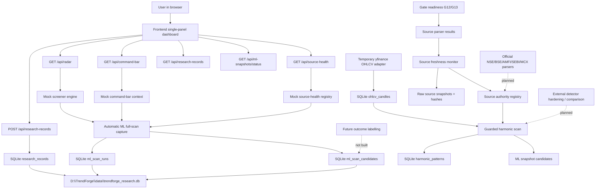

## 3. Frontend Graph

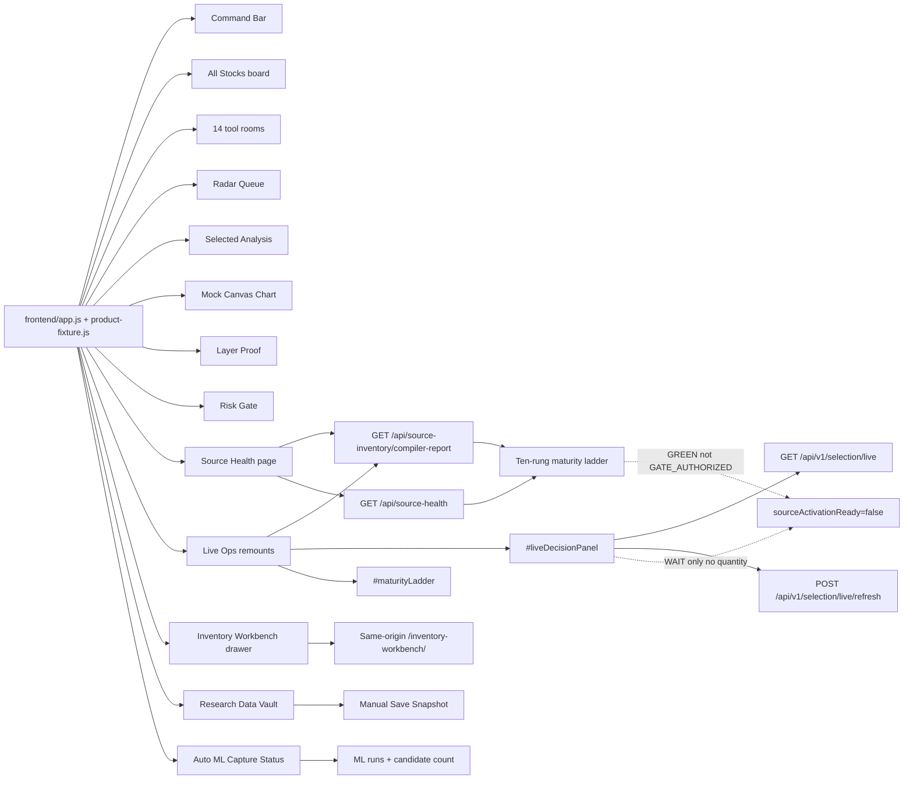

Frontend files:

```text
D:\TrendForge\frontend\index.html
D:\TrendForge\frontend\styles.css
D:\TrendForge\frontend\theme-final.css
D:\TrendForge\frontend\app.js
D:\TrendForge\frontend\product-fixture.js
D:\TrendForge\frontend\q5-contract.js
D:\TrendForge\frontend\inventory-workbench\
D:\TrendForge\frontend\README.md
D:\TrendForge\frontend\tests\acceptance-check.js
```

Frontend status:

```text
Exact FINAL_PRODUCT chrome on :8000: built
All Stocks table/cards: built
14 tool rooms + How validated stack: built
Live Ops wired APIs: built
Source Health compiler ladder: built
Live Ops compiler ladder: built
Live Ops liveDecisionPanel + Persist research run: built
Inventory Workbench same-origin drawer: built
sourceActivationReady=false chip: built
Journal qty fixed at 0: built
Frontend acceptance: 161/161
Live charting from real OHLCV: missing
Source activation / CONFIRMED path: missing
Full R1 voting claims: missing
```

## 4. Backend Graph

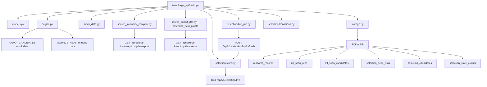

Backend files:

```text
D:\TrendForge\backend\trendforge_api\main.py
D:\TrendForge\backend\trendforge_api\models.py
D:\TrendForge\backend\trendforge_api\engine.py
D:\TrendForge\backend\trendforge_api\mock_data.py
D:\TrendForge\backend\trendforge_api\storage.py
D:\TrendForge\backend\trendforge_api\source_inventory_compiler.py
D:\TrendForge\backend\trendforge_api\source_cohort_r0b.py
D:\TrendForge\backend\trendforge_api\source_extended_field_proofs.py
D:\TrendForge\backend\trendforge_api\selection\
D:\TrendForge\backend\run_server.py
D:\TrendForge\backend\requirements.txt
D:\TrendForge\backend\tests\test_api.py
D:\TrendForge\backend\tests\test_r1_live_decision.py
D:\TrendForge\backend\tests\test_r0b_source_cohort.py
```

Backend status:

```text
FastAPI app: built
Typed Pydantic models: built
Mock radar candidates: built
R0-B cohort API + field proofs/waivers: built (provenCount=0)
R1 selection STO tables + live/refresh: built (WAIT only)
R2 activation: not started
Source-health mock registry: built
Research snapshot API: built
Automatic ML scan capture: built
SQLite persistence: built
Official source snapshot parsers: built for first critical slice
Direct source resolvers: built, fail-closed if official pages block/change
Authentication: missing
Scheduler/background jobs: built for source monitor and scanner; production queue not built
Export endpoints: missing
Outcome labelling endpoints: missing
```

## 5. API Map

```text
GET    /api/health
GET    /api/command-bar
GET    /api/radar
GET    /api/radar/{symbol}
GET    /api/source-health
GET    /api/harmonic-sources

GET    /api/research-records
POST   /api/research-records
GET    /api/research-records/{record_id}
DELETE /api/research-records/{record_id}

GET    /api/ml-snapshots/status
POST   /api/ml-snapshots/capture
GET    /api/ml-snapshots/runs
GET    /api/ml-snapshots/candidates
```

## 6. Storage Graph

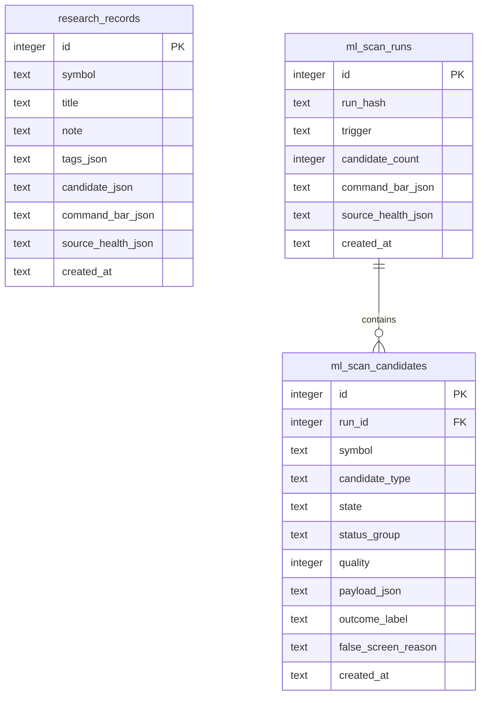

Database path:

```text
D:\TrendForge\data\trendforge_research.db
```

## 7. Automatic ML Capture Rule

```text
GET /api/radar with no filters:
    auto-saves full scan to ml_scan_runs + ml_scan_candidates.

GET /api/radar with mode/status/timeframe/search filters:
    returns filtered rows only.
    does NOT auto-save partial ML training records.

POST /api/ml-snapshots/capture:
    forces a full scan capture.
```

Reason:

```text
Future ML needs complete scan context.
Partial filtered snapshots can poison training data.
```

Current verified state:

```text
Auto ML runs: 1
Saved candidates: 5
Manual research records: 0
```

## 8. What The Current Data Is

Current data is mock/demo data, not live market data.

Included candidates:

```text
COFORGE: stock, PRIORITY_RADAR
TCS: harmonic, HARMONIC_PRZ_ACTIVE
RELIANCE: stock, WAIT_BASIS_CONFLICT
MCX GOLD MINI: mcx, PRIORITY_RADAR
HDFCBANK: stock, REJECT_SUPPLY
```

Current source-health data includes:

```text
AMFI Monthly Portfolio Disclosure
NSE FII/DII
NSE Participant OI
NSE SLB
NSE Paid Data marked RED / not_configured
```

Harmonic source registry:

```text
GET /api/harmonic-sources
```

This exposes the saved harmonic source list as machine-readable API data:

```text
open-source libraries: pyharmonics, HarmonicPatterns, stock-pattern
TradingView scanners: TRN Trading, Morning Starr, Trendoscope
commercial tools: Patterns Hunters, HarmonicPattern.com, HarmonicTrader, MotiveWave, ClickAlgo
India/NSE references: JustTicks, ChartAlert, Chartink, Investar
broad platforms: GoCharting, TrendSpider, MarketInOut
```

## 9. What Is Missing Before Real Screener Use

Hard missing items:

```text
1. Licensed/live NSE intraday OHLCV data feed.
2. NSE/BSE/AMFI/SEBI source parsers.
3. MCX data adapters.
4. Real harmonic pattern detector.
5. Real OI/MWPL/futures basis/IV adapters.
6. Background scanner scheduler.
7. Historical candle storage.
8. Outcome labelling for ML.
9. Feature engineering pipeline.
10. Backtest validation.
11. User settings/account risk config.
12. Authentication if exposed outside local machine.
13. Export/import tools.
14. Production logging and monitoring.
```

Important blocker:

```text
Without a legal intraday data feed, TrendForge cannot honestly scan all NSE stocks on 30m/1h/4h.
```

## 10. Temporary Free / Open-Source Alternatives

These can be used until broker or licensed feed integration is added.

Important rule:

```text
Temporary source != production truth.
Every temporary source must be tagged with trust_level, source_url, fetched_at, and limitation.
No temporary source can create final READY without source-health disclosure.
```

### 10.1 Alternative Stack By Missing Item

| Missing Item | Temporary / Free Alternative | Trust Level | Use Now | Limitation |
| --- | --- | --- | --- | --- |
| Licensed/live NSE intraday OHLCV | yfinance for `.NS` symbols, intervals like 30m/60m/1h/daily/weekly | UNOFFICIAL_TEMP | prototype candles and harmonic UI | intraday data limited; not official NSE; may fail/change |
| Licensed/live NSE intraday OHLCV | NSE paid feed page saved for later | OFFICIAL_TARGET | keep as final migration target | needs subscription |
| NSE/BSE/AMFI/SEBI source parsers | direct official pages/downloads: NSE reports, AMFI, SEBI, BSE | OFFICIAL_FREE | build parsers/adapters now | dynamic pages may need browser/download adapters |
| NSE data wrappers | nsepython | UNOFFICIAL_WRAPPER | quick NSE quote/option/report experiments | wrapper depends on NSE website behavior |
| NSE bhavcopy/historical EOD | jugaad-data | OPEN_SOURCE_WRAPPER | EOD and bhavcopy development | not enough for true live intraday |
| MCX data adapters | MCX Bhavcopy / historical data / option chain pages | OFFICIAL_FREE_EOD | MCX EOD/OI prototype | live depth/intraday still limited |
| Real harmonic pattern detector | pyharmonics | OPEN_SOURCE | first detector/reference | must validate on NSE OHLCV schema |
| Real harmonic pattern detector | HarmonicPatterns / stock-pattern | OPEN_SOURCE_REFERENCE | compare false positives | dependency/license review needed |
| OI/MWPL/futures basis | NSE All Reports - Derivatives, F&O bhavcopy, MWPL ban page | OFFICIAL_FREE | EOD/periodic derivative context | not full low-latency live feed |
| Options IV/Greeks | py_vollib / py-vollib-vectorized | OPEN_SOURCE_CALC | calculate IV/Greeks from option price inputs | still needs reliable option chain price/OI |
| Background scheduler | APScheduler | OPEN_SOURCE | periodic source fetch and scan jobs | needs job locking if multi-process later |
| Historical candle storage | SQLite now; DuckDB + Parquet later | OPEN_SOURCE | analytics-friendly local history | schema/versioning needed |
| Outcome labelling for ML | current ml_scan_candidates outcome fields | BUILT_BASE | add labels after reviewing scans | UI label workflow not built |
| Feature engineering | pandas, numpy, ta/pandas-ta, tsfresh optional | OPEN_SOURCE | derive features from stored scans/candles | needs clean historical data |
| Backtest validation | vectorbt or backtesting.py | OPEN_SOURCE | validate rules after candle history exists | beware survivorship/lookahead bias |
| User settings/account risk | SQLite settings table | LOCAL_FREE | store risk %, capital, symbols, timeframes | UI not built |
| Authentication | no auth for localhost; FastAPI auth later if exposed | LOCAL_ONLY | keep local-only now | do not expose publicly without auth |
| Export/import | CSV/JSON from SQLite; Parquet later | OPEN_SOURCE | export ML snapshots | endpoint not built yet |
| Logging/monitoring | Python logging/structlog + rotating files | OPEN_SOURCE | source failures and scan audit | dashboards/alerts not built |

### 10.2 Recommended Temporary Data Priority

```text
Tier 1 - Official free and safer:
    AMFI portfolio disclosure
    NSE/BSE/SEBI filings and reports
    NSE all-reports derivatives
    NSE MWPL/F&O ban page
    MCX bhavcopy/EOD reports

Tier 2 - Open-source wrappers over public pages:
    nsepython
    jugaad-data

Tier 3 - Unofficial temporary OHLCV:
    yfinance .NS symbols
    tvDatafeed / TradingView style access only for local research if user has access

Tier 4 - Calculators/engines:
    pyharmonics
    py_vollib
    APScheduler
    DuckDB/Parquet
    vectorbt/backtesting.py
```

### 10.3 Practical Temporary Build Plan

```text
Phase A:
    Add source_registry rows for official free + temporary sources.
    Add trust_level and limitation fields.

Phase B:
    DONE: yfinance OHLCV adapter for 30m/1h/4h/daily/weekly.
    DONE: temporary 4h uses yfinance/resampled source where available.
    DONE: exact NSE 4H_CUSTOM builder is available for stored intraday candles.
    DONE: all yfinance candles are marked UNOFFICIAL_TEMP.

Phase C:
    Add NSE/AMFI/BSE/SEBI official parsers where download/page access works.
    Store raw source snapshots.

Phase D:
    DONE: pyharmonics attempt path added.
    DONE: deterministic internal ABCD fallback added.
    DONE: pattern outputs save into harmonic_patterns and ML snapshots.

Phase E:
    Add APScheduler for periodic scans.
    Add source failure logging.

Phase F:
    Add export endpoint for ML dataset.
```

### 10.5 Real Harmonic Scan Slice Built

```text
Implemented files:
    backend/trendforge_api/ohlcv_adapter.py
        temporary yfinance OHLCV adapter.
        NSE symbols auto-map to .NS for yfinance.
        supports 5m, 15m, 30m, 1h, 4h, 4h_custom fetch base, 1d, 1w.
        4h is resampled from 1h candles.

    backend/trendforge_api/harmonic_detector.py
        pyharmonics scan is attempted when enough candles exist.
        internal ABCD fallback is deterministic for reliability/testing.
        volume and VWAP gates are calculated.
        smart-money and OI/MWPL/basis gates are marked WAIT_DATA_MISSING until real adapters exist.

    backend/trendforge_api/storage.py
        ohlcv_candles table added.
        harmonic_patterns table added.
        source_registry table added.
        harmonic_alerts table added.
        candle storage is idempotent by symbol/timeframe/source/timestamp.

    backend/trendforge_api/source_adapters.py
        yfinance adapter active.
        nsepython adapter active for EOD daily/weekly when source works.
        nselib adapter installed and verified for EOD daily data; RELIANCE 1d returned 255 candles.
        openchart adapter installed but guarded; RELIANCE returned no usable candles, so it remains fail-closed.

    backend/trendforge_api/parquet_store.py
        Parquet write/read/status functions added using pyarrow.

    backend/trendforge_api/nse_session.py
        exact NSE 4H_CUSTOM_NSE_SESSION builder added:
        09:15-13:15 full bar and 13:15-15:30 partial bar.

    backend/trendforge_api/harmonic_advanced.py
        multi-sensitivity ZigZag 5/8/13 and 3/5/8 added.
        pivot deduplication added.
        pivot quality score added.
        ratio validators added for Gartley, Bat, Butterfly, Crab, Deep Crab, Cypher, Shark, Five-0, ABCD, AB=CD.
        weighted hybrid quality score added.
        G00-G14 gate scorer added.
        lifecycle state added.
        alert generation added.
        benchmark and chart overlay payload functions added.
        liquidity pre-filter function added.

    backend/trendforge_api/main.py
        POST /api/ohlcv/fetch
        GET  /api/ohlcv/candles
        POST /api/harmonic/scan
        GET  /api/harmonic/patterns
        GET  /api/sources/registry
        POST /api/sources/smoke-test
        GET  /api/parquet/status
        POST /api/parquet/write
        GET  /api/parquet/candles
        POST /api/nse/4h-custom/build
        POST /api/harmonic/advanced/analyze
        GET  /api/harmonic/alerts
        POST /api/harmonic/benchmark
        GET  /api/harmonic/chart-overlay
        GET  /api/harmonic/liquidity-check

    frontend/index.html + frontend/app.js + frontend/styles.css
        Real Harmonic Scan panel added inside the single-screen dashboard.
        User can enter NSE symbol, select 30m/1h/4h/1d/1w, run scan, and see WAIT/REJECT output.
        Scan result is inserted into the harmonic radar view.
        ML snapshot counters refresh after saved scan output.
        Advanced Gates button added.
        Source registry and Parquet status boxes added.
        Advanced G00-G14 analysis summary added.

Safety rule:
    Harmonic shape alone cannot produce READY.
    Temporary yfinance candles cannot produce official READY.
    Missing smart-money or OI/MWPL/basis confirmation keeps output in WAIT.
```

### 10.6 Source Freshness Monitor Built

Purpose:

```text
Prevent stale, unchanged, broken, or dynamically-changing source pages from silently feeding the scanner.
This is the foundation for AMFI/NSE/BSE/SEBI/MCX/CFTC parsers.
```

Implemented files:

```text
backend/trendforge_api/source_monitor.py
    Source catalog for official/free and temporary sources.
    Fetch/check logic with HTTP status, Last-Modified, ETag, content length, SHA-256 hash.
    Raw source snapshot save path under data/raw_sources/<source_key>/<hash>.bin.
    NEW / UNCHANGED / CHANGED / BROKEN / SKIPPED state calculation.
    Dynamic-page false-change guard: if raw hash changes but Last-Modified and length are stable, state stays UNCHANGED.

backend/trendforge_api/source_scheduler.py
    Controlled periodic source monitor scheduler.
    Off by default.
    Can run fetch=false dry checks or fetch=true real source checks.

backend/trendforge_api/storage.py
    source_snapshots table added.
    latest/history helpers added.

backend/trendforge_api/main.py
    GET  /api/source-monitor/catalog
    POST /api/source-monitor/check
    GET  /api/source-monitor/history
    GET  /api/source-monitor/scheduler/status
    POST /api/source-monitor/scheduler/run-once
    POST /api/source-monitor/scheduler/start
    POST /api/source-monitor/scheduler/stop

frontend/index.html + frontend/app.js
    Freshness status cell added in the harmonic/source function panel.
```

Verified behavior:

```text
Source catalog live endpoint returns 23 sources.
CFTC real fetch returned HTTP 200, saved raw snapshot, hash, Last-Modified, and raw path.
Second CFTC dynamic-page check is now UNCHANGED when Last-Modified and content length are stable.
Scheduler start/status/stop verified live with fetch=false.
Backend tests: 21/21 PASS.
Frontend checks: 57/57 PASS.
```

### 10.7 Source Parser And Gate Readiness Built

Purpose:

```text
Convert raw source snapshots into explicit parser results.
Prevent the scanner from treating source reachability or metadata as actual trading confirmation.
Explain why G12 smart-money and G13 OI/MWPL/basis gates are blocked instead of leaving them as vague UNKNOWN.
```

Implemented files:

```text
backend/trendforge_api/source_parser.py
    Parses latest source snapshots into source_parse_results.
    CFTC COT page metadata parser extracts report/data links.
    Generic metadata parser stores source hash/date/raw path but marks structured parsing pending.
    WAIT_SOURCE_SNAPSHOT / WAIT_FETCH_REQUIRED / NO_PARSER / BROKEN states prevent false confirmation.

backend/trendforge_api/gate_readiness.py
    G12_SMART_MONEY dependencies: AMFI, NSE large deals, SEBI PIT/SAST, BSE buyback/open offer.
    G13_OI_CONFIRMS dependencies: NSE participant OI, MWPL, SLB, EOD validation.
    MCX_CONTEXT dependencies: MCX bhavcopy, CFTC COT, World Gold Council OI.
    Metadata-only parsing never passes READY.

backend/trendforge_api/storage.py
    source_parse_results table added.

backend/trendforge_api/main.py
    POST /api/source-parser/run
    GET  /api/source-parser/results
    GET  /api/gates/readiness

backend/trendforge_api/source_adapters.py
    nselib installed and schema-normalized for comma-formatted NSE price fields.
    openchart installed but remains fail-closed because RELIANCE returns no usable candles in this environment.
```

Verified behavior:

```text
nselib installed: version 2.5.1.
nselib smoke test: PASS, RELIANCE 1d returned 255 candles.
openchart installed: version 0.2.0.
openchart smoke test: FAIL CLOSED, RELIANCE returned no usable candles.
CFTC parser live: PARSED_METADATA_ONLY, 84 report/data links, data date from Last-Modified.
Gate readiness live: G12/G13/MCX all DO_NOT_PASS_READY until structured parser output exists.
Backend tests: 24/24 PASS.
Frontend checks: 57/57 PASS.
```

### 10.4 Temporary Source Warnings

```text
yfinance:
    good for prototype and UI validation.
    not official, not guaranteed, intraday history is limited.

nsepython/jugaad-data:
    useful wrappers, but depend on public website structure.
    if NSE changes endpoints or blocks automation, adapters can fail.

MCX/NSE official pages:
    better source authority, but may be EOD, delayed, dynamic, or download-form based.

py_vollib:
    calculates Greeks/IV only after reliable option price, strike, expiry, rate, and underlying are available.

backtesting/vectorbt:
    only useful after clean historical data and no-lookahead rules exist.
```

## 11. How To Run

```text
cd D:\TrendForge\backend
python -m uvicorn trendforge_api.main:app --host 127.0.0.1 --port 8001
```

Open:

```text
http://127.0.0.1:8001/
```

## 12. Test Commands

Backend:

```text
cd D:\TrendForge
$env:PYTHONPATH='D:\TrendForge\backend'
python -m unittest discover -s D:\TrendForge\backend\tests
```

Frontend:

```text
cd D:\TrendForge\frontend
npm test
node --check D:\TrendForge\frontend\app.js
```

Latest verified:

```text
Backend tests: 18/18 PASS
Backend compile: PASS
Frontend checks: 53/53 PASS
Frontend JS syntax: PASS
Browser page: loads at http://127.0.0.1:8001/
Console error after removing external icon CDN: none reported
```

Latest line-by-line audit:

```text
D:\TrendForge\TREND_FORGE_LINE_BY_LINE_AUDIT_2026-07-07.md
```

## 13. Next Build Steps

Recommended order:

```text
1. Add raw source archive for original downloaded files.
2. Keep nselib as verified EOD fallback; keep openchart fail-closed until a stable equity candle contract is proven.
3. Add real NSE holiday/calendar download instead of simple weekday/session check.
4. Add daily liquidity pre-filter using volume, traded value, price, market cap, ASM/GSM.
5. Add pivot_cache table and incremental invalidation.
6. Add MTF map endpoint for all core timeframes.
7. Add full scanner endpoints: full universe scan, symbol history, refresh, health.
8. Add APScheduler jobs with NSE calendar checks.
9. Implement AMFI/NSE/FII-DII/participant OI/MWPL/basis adapters.
10. Add outcome labelling UI and ML export.
11. Add real chart overlay drawing on frontend canvas.
```

## 13.1 Hybrid Harmonic Architecture Added To Plan

The attached free/no-broker harmonic architecture was compared against the current plan and merged additively.

Best parts added:

```text
source priority matrix with trust levels.
Parquet plus SQLite storage target.
raw 1-minute candles resampled into 30m/1h/4H_CUSTOM/1D/1W.
NSE market calendar and 4H boundary rules.
liquidity and data completeness pre-filter.
multi-sensitivity ZigZag pivot engine.
pivot quality score.
pivot and pattern deduplication.
full ratio validator table.
deterministic gate scoring G00-G14.
nine confirmation probes.
NSE-aware scheduler.
expanded harmonic API roadmap.
dashboard table/detail/data-health/scheduler panel requirements.
anti-pattern list.
```

Important correction saved:

```text
The attachment names MatrixSearch.
The installed pyharmonics package exposes HarmonicSearch.
Implementation must feature-detect pyharmonics APIs instead of hardcoding MatrixSearch.
```

## 13.2 Master Implementation Plan v2.0 Added To Plan

The v2 harmonic implementation plan was compared against the existing TrendForge hybrid plan and merged additively.

What v2 improved:

```text
pattern lifecycle: FORMING, COMPLETE, TRIGGERED, INVALIDATED, WIN_T1, WIN_T2, WIN_T3, LOSS, EXPIRED.
weighted hybrid quality score for ranking.
T1/T2/T3 and adaptive stop/invalidation requirements.
LIVE/CACHED/STALE/BROKEN freshness model.
NIFTY50/NIFTY200/NIFTY500+FNO/WATCHLIST universe modes.
stricter intraday liquidity defaults.
optional 5m/15m trigger timeframes.
alert engine roadmap.
scan performance targets.
future backend module boundaries.
phase verification table.
license policy.
```

What v2 did not override:

```text
v2's simple READY rule of 2 out of 3 gates is not enough for TrendForge.
TrendForge keeps deterministic G00-G14 gates plus smart-money/OI/MWPL/basis/risk/emotional safety.
Dash/Plotly is not replacing the current single-panel FastAPI frontend.
MatrixSearch is not hardcoded because current pyharmonics exposes HarmonicSearch.
```

## 14. Engineering Warnings

```text
Do not treat current mock radar data as live trading data.
Do not train ML until real source timestamps and outcome labels exist.
Do not use scraped intraday data as production truth.
Do not show READY from secondary-only evidence.
Do not add order execution before audit, auth, risk, and broker rules are implemented.
```

## 15. Hybrid Source Parser Completion Decision - 2026-07-08

Three external AI plans were compared against the existing TrendForge plan and merged into [TREND_FORGE_MASTER_PLAN.md](D:\TrendForge\TREND_FORGE_MASTER_PLAN.md), section 51.

Decision summary:

```text
Best base blueprint: Completion Plan - Fail-Closed, Research-Reliable.
Best NSE safety argument: MWPL/F&O ban must be the first NSE parser.
Best source policy: delayed/unofficial/reference sources are repurposed for WAIT/REJECT/research, not deleted.
No old requirement was removed.
```

Added to plan:

```text
internal data-date freshness, not just HTTP freshness.
shared structured parser contract.
PARSED_STRUCTURED / WAIT_EMPTY_PARSE / WAIT_STALE_DATA / WAIT_PARSE_ERROR states.
CFTC COT position-level parser requirement.
NSE MWPL/F&O ban parser requirement.
NSE participant OI parser with AGGREGATE_CONTEXT label.
NSE large/bulk/block deal parser for deal anchors.
AMFI monthly portfolio parser for swing sponsor evidence.
MCX bhavcopy parser for commodity EOD confirmation.
raw_source_archive table and retention policy.
scanner_runs and scanner_candidates tables for future ML.
fail-closed scanner scheduler rules.
failure-first tests for missing/stale/broken/empty/metadata-only/unofficial-only sources.
```

Important implementation warning:

```text
Do not copy the attached sample code directly.
It contains known issues: pd.compat.StringIO, bad date format "%d-%m-%m", overly simple MWPL thresholding, and unverified NSE archive URL/date assumptions.
Rewrite cleanly with fixtures and fail-closed tests.
```

Next exact build order:

```text
1. Add parsers/source_freshness.py and structured parser state contract.
2. Add CFTC COT structured parser to prove the contract.
3. Add NSE MWPL/F&O ban parser as first NSE safety parser.
4. Add participant OI, large deals, AMFI, and MCX bhavcopy parsers.
5. Tighten gate_readiness to require structured parse + fresh data_date + record_count > 0.
6. Add raw archive, scanner run/candidate persistence, and fail-closed scanner scheduler.
```

## 16. Structured Parser Build Slice - 2026-07-08

Built after reviewing the 10 delivered parser/integration/test attachments:

```text
backend/trendforge_api/parsers/__init__.py
backend/trendforge_api/parsers/common.py
backend/trendforge_api/parsers/source_freshness.py
backend/trendforge_api/parsers/nse_mwpl_parser.py
backend/trendforge_api/parsers/nse_participant_oi_parser.py
backend/trendforge_api/parsers/nse_large_deals_parser.py
backend/trendforge_api/parsers/amfi_portfolio_parser.py
backend/trendforge_api/parsers/cftc_cot_parser.py
backend/trendforge_api/parsers/mcx_bhavcopy_parser.py
```

Modified:

```text
backend/trendforge_api/models.py
backend/trendforge_api/source_parser.py
backend/trendforge_api/gate_readiness.py
backend/tests/test_api.py
```

What is now working:

```text
structured parser dispatch through POST /api/source-parser/run.
parser states now include PARSED_STRUCTURED, WAIT_EMPTY_PARSE, WAIT_STALE_DATA, WAIT_PARSE_ERROR.
NSE MWPL parser extracts symbol, MWPL %, total OI, SAFE/YELLOW/ORANGE/BANNED.
NSE participant OI parser extracts FII/DII/PRO/CLIENT aggregate regime context only.
NSE large deals parser extracts stock-level buyer/seller/price/value and deal anchors.
AMFI parser extracts holdings and labels them SWING_CONFIRMATION_ONLY.
CFTC parser parses position-level rows when a direct COT file snapshot exists; HTML page snapshots remain PARSED_METADATA_ONLY.
MCX bhavcopy parser extracts commodity EOD close/volume/OI/OI change.
gate_readiness now checks structured parser state, record_count, data_date freshness, and required source sets.
```

What was still missing after this structured-parser slice and is addressed in section 17:

```text
direct official-source downloader URLs for each report.
raw_source_archive table.
row-level tables such as mwpl_snapshots and cftc_cot_positions.
all-universe scanner scheduler.
frontend parser detail table.
```

Still not solved by section 17:

```text
broker/licensed live feed.
production all-NSE candle scanner using a licensed/live data feed.
real futures basis/IV/options chain adapters.
```

Verification:

```text
Python compile: PASS.
Backend tests: 28/28 PASS.
Frontend static checks: 57/57 PASS.
Live server: http://127.0.0.1:8001/api/health PASS.
Live gate readiness still fail-closes with DO_NOT_PASS_READY when current DB has missing/metadata-only sources.
```

## 17. Source Resolver, Raw Archive, Row Tables, Scanner Scheduler - 2026-07-08

Built after the user requested completion of the previously missing parser infrastructure.

### 17.1 Files Added Or Modified

```text
backend/trendforge_api/source_resolver.py
backend/trendforge_api/source_monitor.py
backend/trendforge_api/storage.py
backend/trendforge_api/scanner_scheduler.py
backend/trendforge_api/main.py
backend/tests/test_api.py
frontend/index.html
frontend/styles.css
frontend/app.js
frontend/tests/acceptance-check.js
```

### 17.2 What Is Now Built

```text
Direct official download resolver candidates per source:
- CFTC COT direct text files.
- NSE participant OI archive candidates.
- NSE MWPL/F&O ban candidates.
- NSE large/bulk/block deal candidates.
- AMFI monthly/scheme disclosure candidates.
- MCX bhavcopy candidates.

Raw source archive:
- raw_source_archive table.
- source key, resolved URL, content hash, state, local raw path, HTTP metadata, parser state after parse.
- archive updates when parser results are saved.

Row-level domain tables:
- mwpl_snapshots.
- participant_oi_daily.
- bulk_block_deals.
- amfi_scheme_holdings.
- amfi_stock_deltas.
- cftc_cot_positions.
- mcx_bhavcopy_daily.

Scanner scheduler:
- scanner_runs and scanner_candidates tables.
- manual run-once endpoint.
- interval start/stop/status endpoints.
- critical source checks before emitting candidates.
- blocks or downgrades candidates when source gates are not confirmable.

Frontend parser drilldown:
- source selector.
- latest parser state rows.
- domain row preview.
- raw archive preview.
- manual guarded scanner run button.
```

### 17.3 New API Endpoints

```text
GET  /api/source-resolver/candidates?sourceKey=cftc_cot
GET  /api/raw-source-archive?sourceKey=nse_mwpl_ban&limit=20
GET  /api/source-parser/domain-rows?sourceKey=nse_mwpl_ban&limit=20

GET  /api/scanner/scheduler/status
POST /api/scanner/run-once?universe=WATCHLIST_ONLY&fetch=false
POST /api/scanner/scheduler/start?intervalSeconds=900&universe=WATCHLIST_ONLY&fetch=false
POST /api/scanner/scheduler/stop
GET  /api/scanner/runs
GET  /api/scanner/candidates?runId=1&limit=200
```

### 17.4 Safety Behavior

```text
Resolvers do not make a source trusted by themselves.
Every fetched file must still be archived, parsed, date-checked, and gate-checked.
If official sites block, change schema, return only HTML, or return stale data, READY remains blocked.
Scanner run-once can save candidates for research/ML, but while G12/G13/MCX gates are not confirmable it downgrades output to WAIT_SOURCE_CONFIRMATION.
Current scanner candidate generation still uses the existing prototype candidate engine until real all-universe official/live data adapters are connected.
```

### 17.5 Verification

```text
Python compile: PASS.
Backend unittest: 30/30 PASS.
Frontend acceptance checks: 62/62 PASS.
JavaScript syntax check: PASS.
```

Live CFTC verification:

```text
Official CFTC f_disagg.txt fetched from https://www.cftc.gov/dea/newcot/f_disagg.txt.
raw_source_archive saved content hash and local raw file path.
CFTC parser returned PARSED_STRUCTURED with 11 commodity regime rows.
cftc_cot_positions row table populated for Gold, Micro Gold, Silver, Copper, and crude-related markets.
```

## 18. Source Contract And Gate Artifact Slice - 2026-07-08

Built after the safe-completion plan requested stricter source roles and auditable gate artifacts.

Added:

```text
backend/trendforge_api/source_contracts.py
source_parser_outputs table.
source_freshness_status table.
gate_decisions table.
source_replacement_map table.
GET /api/source-parser/outputs
GET /api/source-freshness-status
GET /api/gate-decisions
GET /api/source-replacement-map
Frontend parser drilldown rows for source role, normalized output status, and freshness.
```

Rules now represented in code/data:

```text
Reference-only sources cannot unlock READY.
Unofficial/prototype sources cannot unlock READY.
Metadata-only parser output cannot unlock READY.
Delayed official context cannot prove live flow.
Gate decisions are saved during scanner runs for future ML/debugging.
```

Verification:

```text
Python compile: PASS.
Backend unittest: 31/31 PASS.
Frontend acceptance checks: 65/65 PASS.
JavaScript syntax check: PASS.
```
<!-- HISTORICAL_SOURCE_END path=TREND_FORGE_BUILD_GRAPH_STATUS.md sha256=5e1af8412e72c0b3faeb84fd127ff9317460c81ecc7a29acf4e1ce26004c64b0 -->

## 2026-07-13 Inventory Audit Boundary

The source layer now separates discovery from evidence with an immutable
211-row audit ledger. A bounded audit may resolve and archive a cleaner CSV,
JSON or ZIP artifact from a saved landing URL, but it cannot unlock a gate.
Only the existing source-specific path may promote it:

```text
audit candidate -> raw archive -> schema parser -> source date -> freshness
-> scope check -> gate evidence
```

Generic HTML normalization stops at metadata, tables, embedded JSON and link
profiles. It never guesses financial meaning. FRED real-yield and broad-dollar
parsers are the first additional clean-data adapters built through this
boundary and remain delayed MCX context only.

## Config-Driven Institutional Research Layer - 2026-07-13

```text
config.yaml endpoint contract
  -> allowlisted async fetch + NSE cookie seed + host rate limit
  -> immutable SHA-256 raw archive
  -> RAW_ARCHIVED / NO_DATA_NOW / WRONG_CONTENT / BROKEN
  -> canonical source-specific parser owner
  -> schema + source date + scope + freshness
  -> point-in-time factors and hard filters
  -> directional model ensemble + separate anomaly veto
  -> portfolio/risk sizing
  -> read-only READY / WAIT / NO_TRADE classification
  -> SQLite report and walk-forward audit
```

Raw endpoint fetches are intentionally never scoreable. The public analysis
boundary does not trust readiness booleans supplied by clients. Future internal
resolvers must join parser outputs, trained model artifacts, configuration hash
and point-in-time cutoff before calling the trusted pure decision function.

Directional factors and safety gates remain distinct. Isolation Forest cannot
be blended as bullish probability; AMFI NAV cannot prove stock-level fund
buying; PCR is not assigned a universal bullish direction; and option max pain
must use aggregate writer payout rather than the minimum same-strike OI.

## 2026-07-15 Commodity Context And UDiFF Extension

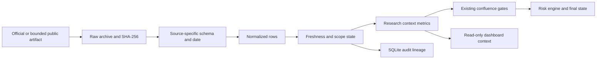

Implemented modules and contracts:

| Component | Responsibility |
|---|---|
| `commodity_context.py` | MCX option rows/metrics, SGE observations, Baker Hughes context and persistence |
| `supplemental_market_parser.py` | Legacy and current BSE UDiFF ZIP/direct-CSV schemas |
| `source_resolver.py` | Current direct BSE UDiFF artifact before legacy fallback |
| `storage.py` | Exact AMFI position-key month-over-month deltas |
| `GET /api/institutional/commodity-context/latest` | Latest read-only normalized commodity snapshot |
| `commodity_context_runs` | Point-in-time snapshot, source states and limitations |
| `mcx_option_chain_rows` | Strike/side OI, volume and quote lineage |
| `sge_benchmark_observations` | Dated benchmark-series lineage |

The MCX option endpoint is an unverified public contract. Its PCR, OI walls and
max pain are context, never probability. SGE is a benchmark trend until a
synchronized LBMA/FX/tax/unit pipeline exists. Rig count is delayed supply
context. The architecture therefore keeps `can_unlock_ready=false` for every
artifact in this subsystem.

## Professional Trade-Decision Mathematics Boundary (2026-07-30)

docs/PROFESSIONAL_TRADE_DECISION_MATHEMATICS.md is the research mathematics
detail reference mapped by File A section 25.22. It is not a second architecture
or build order. Current public states remain WATCH, WAIT, CONFIRMED and
REJECT; CONFIRMED is evidence-based and does not imply calibrated win
probability, expected value, quantity or execution.

The current deterministic production rank remains File A FUS-009. Hybrid
q_i remains evidence-claim quality. Discovery retains the M-Factor projection.
Final Merge and the Options Detail Plan retain option identity, eligibility,
parity, volatility-surface, max-pain and cash-Gamma ownership. Experimental
covariance fusion, probability/EV, finite-horizon first-passage estimation and
market-impact calibration require their mapped R16/R18 proof. Microprice and
OFI remain unavailable until verified timestamped order-book events exist.
For mapped R12/R16/R18 work, Professional Mathematics sections 17.5-17.7 own dividend-aware Theta, local delta-hedged realized-versus-implied variance attribution and the variance-risk-premium research definition. The variance-risk-premium contract is research-only: synchronize horizon, timestamp, annualization, session and corporate actions; prefer model-free implied variance; label `ATM_IV^2 * T` as a proxy; require PIT physical expected-realized-variance forecasts, costs and calibration; otherwise emit `VRP_UNKNOWN`. These outputs remain one correlated options-package context and cannot own direction, state, quantity or execution.

## 2026-08-10 Pack-2 context-source branch

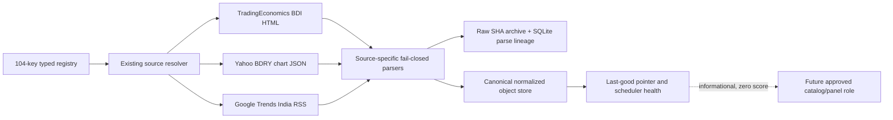

The collector discovers these sources from CSV/YAML contracts; the frontend
does not hard-code or fetch them. BDRY is a shipping-ETF proxy, never BDI.
Google RSS is aggregate current-topic context, never arbitrary keyword
history. BDI parser v1.1 also preserves the observed value, derived previous
value, absolute daily change and percentage change. A fetch/parse failure
cannot erase the last populated object.

## Dead-route quarantine (2026-08-11)

Verified dead/unusable URLs do not enter the acquisition graph. They remain in
`config/source_route_quarantine.yaml` as `NOT_IN_USE` audit hints with reasons
and replacement keys.

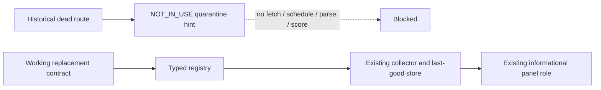

The quarantined set is Yahoo `^BADI`, `pytrends`, StockEdge's unverified API
idea, BSE `FIIDII/w`, and BSE `ParticipantWiseOI/w`. MCX remains an intermittent
active source and is protected by last-good retention.

## FII-related stock-name evidence slice (2026-08-11)

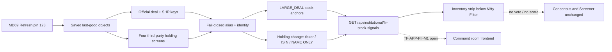

The FII API reads saved objects only. It does not fetch, write, mutate the
registry, or treat a client name as FII. Official SHP still requires an
explicit FII/FPI level. Third-party Tickertape/Dhan keep ticker/ISIN; Dhan
missing hold % stays null. Screener/Equitymaster use exact unique official
name mapping or stay visible as `NAME ONLY`. Market-level `nse_fii_dii` and
`bse_fii_dii` cannot emit stock names. The command-room app does not yet
render this strip.

## Static Product-Preview Architecture Boundary (2026-08-14)

`docs/TRENDFORGE_FINAL_PRODUCT.html` is the canonical fixture-backed visual
reference for the research-terminal workflow. It now demonstrates the
operations header, All Stocks table/card comparison, side-by-side directional
research cards, Stock Evidence tabs, combined Elliott/harmonic Structure Lab,
history/replay, locked model governance and a read-only Inventory Workbench
drawer.

| Surface | Authoritative implementation owner | Preview authority |
|---|---|---|
| All Stocks, decision cards and inspector navigation | File A R15 / Final Merge FMR-009 | Visual fixture only |
| Options/Gamma inspection | R12 contracts, then R15 presentation | Visual fixture only |
| Historical replay and objective path labels | R16 | Visual fixture only |
| Model/Paper Lab | R15 shell, R16 PIT labels, R18 governed challenger lifecycle | Locked visual fixture only |
| Elliott/harmonic presentation | Closed-bar structure contracts with one STRUCTURE-family cap | Fixture geometry; no extra confirmation vote |
| Inventory Workbench iframe | Hash-pinned same-origin snapshot at `frontend/inventory-workbench/` | No source, state, score or gate authority |

The runtime drawer now serves the allow-listed copy at `/inventory-workbench/`; `D:\trendforge_inventory_app` remains unchanged. The copied catalog is static while its existing live overlays call TrendForge APIs. The runtime frontend at `frontend/` remains the sole implementation target. The host shell controls presentation only: desktop opens the drawer at `top:2vh`, `95vw` by `96vh`; `<=760px` uses `100vw` by `100dvh`.
The static artifact must not become a second downloader, database, scorer or
state machine. Its hardcoded rows and geometry never satisfy data readiness,
gate authorization, point-in-time proof or production acceptance.

## Source Operations panel - 2026-08-15

The existing Inventory Workbench drawer now includes a read-only Source Operations
panel below the five KPI cards. It is an operational view of the source pipeline,
not a second collector or decision authority. The terminal passes
`/inventory-workbench/?embed=terminal`; the scoped embedded class changes only
layout inside the drawer.

The panel reads compiler contracts, monitored runtime keys, fetch attempts, parser
outputs and freshness status. It shows the six stages from compiler contracts to
facts usable for research and typed states `HEALTHY`, `VALID_EMPTY`,
`STALE_PARTIAL`, `BLOCKED`, `FAILED`, and `NOT_ATTEMPTED`. Valid-empty is not a
failure. Stale, malformed, metadata-only, blocked and unattempted evidence stay
visible and cannot vote. `sourceActivationReady` and `gateAuthorized` remain
separate; the panel cannot rank, authorize `CONFIRMED`, calculate quantity, or
execute orders.


## Hash-pin caveat - 2026-08-15

The source and bundled runtime files contain aligned feature markers but are separate revisions and are not byte-identical for this
change, but the existing snapshot manifest still contains the pre-Source-
Operations byte sizes and hashes. The existing `inventory-workbench.test.js`
also still expects the old drawer URL without `embed=terminal`. Its current
observed result is **FAIL: Size mismatch: index.html**. This means the runtime
panel observation is valid, but the manifest/test pin must be refreshed before
claiming a clean snapshot-integrity verdict. No source data, catalog sample, or
TrendForge state authority is affected by this metadata/test discrepancy.

## Saved-data post-commit bridge and Source Operations - 2026-08-15

Refresh and Scheduler now share a post-commit connection to the existing cash research path. The collector must first produce schema-valid parsed data and commit its manifest, hash and last-good pointer. The bridge then evaluates cash relevance and runs the existing A1-C1 sequence: A1 cash facts, A2 identity and gates, A3 WATCH discovery, A4 history, A5 index and corporate-action context, A6 shortlist F&O enrichment, C0 permissions, conditional B MWPL and C1 research rank.

The bridge is idempotent for the relevant content fingerprint. Unrelated source changes do not rerun cash rank. Downstream exceptions are isolated as FAILED_STAGE and do not undo a successful collector commit. C0 is reused until compiler or contract inputs change. No official MWPL percentage artifact means MWPL_MISSING.

The read-only Source Operations endpoint is /api/source-operations/snapshot. It exposes a source-flow track and a cash pipeline track for the embedded Inventory Workbench. This is observability and lineage, not a new source, scorer, resolver or activation path. HTTP 200, catalog presence, parser invocation and valid-empty context cannot authorize CONFIRMED. Quantity, broker and execution boundaries remain unchanged.


## Cadence-aware source dates, family dispatch and scheduler closure - 2026-08-16

### Observed evidence

The manual registry run `2026-08-16-manual-20260816-123159-0047999505c9` attempted all **123** source contracts. The result was re-audited from normalized object contents, not HTTP status or manifest row count:

| Result class | Sources | Meaning |
|---|---:|---|
| Usable parsed records | 107 | Normalized market, event, holdings, contract or macro rows were present. This is data readiness evidence only, not activation or confirmation authority. |
| Valid empty | 3 | Empty was explicit and remains different from fetch/parse failure; it supplies no candidate rows. |
| Stale last-good fallback | 3 | Prior rows were retained after current transport/parser failure; they are visible but non-current. |
| Status/schema envelope only | 10 | Collector returned a normalized status envelope rather than usable trading records; HTTP/collector success must not count these as usable data. |

The cadence registry currently contains 32 intraday, 28 daily EOD, 15 daily/change-detect, 12 event-driven, 11 slow event-driven, 11 weekly, 5 quarterly, 3 intraday-event, 2 commodity EOD, 2 fortnightly and 2 session-window contracts. Its cadence evidence is still predominantly `PROVISIONAL_UNVERIFIED_NEEDS_OFFICIAL_WEB_CHECK`; the audit therefore records provisional disposition rather than activation truth.

The cadence-aware audit identifies **8** late or suspect contracts and **4** usable sources that still lack temporal proof. It does not call every old date stale. Examples:

- `nse_bhavcopy_eod` and `nse_fo_bhavcopy` dated 2026-08-14 are current for the latest NSE session when run on Sunday 2026-08-16.
- CFTC reports dated 2026-08-11 and EIA weekly petroleum data dated 2026-08-07 are plausible current weekly publications, pending official cadence proof.
- Event-driven disclosure dates describe the latest event, not collector freshness by themselves.
- `nsdl_fpi_daily_reportdetail` dated 2024-08-23 and `cdsl_fpi_fortnightly` dated 2024-08-26 are suspect parameter/publication selections and cannot be called current.
- At the 2026-08-16 12:31 full-registry snapshot, `mcx_bhavcopy`, `bse_financial_results_xbrl` and `bse_shareholding_pattern` were stale last-good fallbacks. Later source-specific runs repaired both BSE sources with populated 2026-08-15 data; `mcx_bhavcopy` remains the unresolved stale source. The historical 123-source counts above are not silently recalculated without another complete run.

The validated pending workbook `data/reports/SOURCE_LINK_INVENTORY_MASTER.updated.xlsx` contains `CADENCE_SUMMARY` and `CADENCE_AUDIT` sheets with URL, cadence, observed/derived data date, actual parsed-row count, usability class, dispatch rule and required next action for every registry source. Replacing the canonical workbook is awaiting separate explicit approval.

### Correct target flow

`Manual Refresh or due scheduler -> 123 registry contracts -> transport/artifact classification -> parser/schema validation -> raw + normalized + manifest + last-good commit -> cadence evaluator -> changed-input family router -> family processor -> Source Operations projection`.

Cash/index dependencies may enter A1-C1 only when their required set is current for the latest expected NSE session. Other source families do not enter cash A1-C1. A source with a weekly, fortnightly, quarterly, event-driven or change-detect publication model is evaluated against that model, not a universal wall-clock date. Data readiness remains separate from gate authorization.


## Live Refresh, calendar-aware A1-C1 and scheduler ownership - 2026-08-16

The standard local API start path owns one guarded foreground MD69 scheduler (`main.py` lifespan; `MARKET_DATA_69_AUTOSTART=1` supplied by `backend/run_server.py` and `scripts/start_api_md69.ps1`). It checks the six IST checkpoints and EOD without introducing a second downloader. Manual Refresh uses the same `MarketDataScheduler.run_all()` route.

A collector commit reaches `CashPostCommitOrchestrator` only after `_dispatch_post_commit()` derives the latest expected NSE EOD through the official calendar. This prevents a weekend collection timestamp from rejecting Friday's still-current EOD data. Unknown calendar evidence blocks as `BLOCKED_INPUT`; malformed, stale or unstructured data remains outside the path. A1 cash facts, A2 identity/restrictions, A3 WATCH discovery, A4 bars, optional A5 context, optional A6 shortlist F&O, C0 permissions, conditional B MWPL and C1 research rank remain separate stages and appear only as read-only lineage in `/api/source-operations/snapshot`.

Observed live run on 2026-08-16 used EOD 2026-08-14 and completed A1/A2/A3/A4/A6/C1 with explicit A5/B skips. It did not activate sources, authorize `CONFIRMED`, calculate quantity, or enable execution.

## R3 live family-resolution boundary - 2026-08-16

The executable selection path is now collector -> A1/A2 -> R1 -> R2 -> R3. R3 reuses FUS-009 and stores `trendforge.resolution.v1`; `GET /api/v1/selection/resolution` returns only a resolution whose R1 bundle hash, R2 run hash and permission fingerprint match current persisted inputs. `FTR-040` is the sole active live directional feature binding and maps exact current closed NSE EOD cash facts to one `PARTICIPATION` claim per stock/correlation group for SWING/NSE_EQ. Its authority cap is `RESEARCH_DIRECTIONAL_WAIT_ONLY`. Missing STRUCTURE, source activation false, stale permissions, mixed snapshots or failed lineage force WAIT/503. R3 does not alter R2 order/state and contains no entry, target, stop, quantity, broker or execution fields.

## R4/R5 Live Structure & Confirmation Boundary - 2026-08-19

The extended selection pipeline joins saved cash facts (A1-A5), R1 evidence bundles, R2 BASELINE attention order, and R3 family claims into R4/R5 structure analysis (`trendforge.structure-batch.v1`). `r5_live.py` analyzes adjusted closed-bar EOD series and official index context to identify `CLOSED_BAR_BREAKOUT`, `NR7`/`NR4`, and `RVOL` structural setups.

A row achieves `CONFIRMED` only when all of the following gate invariants are satisfied:
1. `can_support_confirmed is True` and `state_ceiling == CONFIRMED`.
2. Index context matches the trading session (`PARSED_STRUCTURED`, matching `data_date`, non-null Nifty50 close).
3. Session history contains $\ge 20$ clean historical bars without unresolved corporate action adjustments (`WAIT_CA_UNRESOLVED`).
4. Directional bias is resolved (`BULLISH` or `BEARISH`).
5. At least one trigger setup is verified, producing zero blocking gate codes (`WAIT_*` or `REJECT_*`).

Rows without active setups safely default to `WAIT` with `WAIT_NO_TRIGGER_SETUP`. Incomplete or failing data strictly remains in `WAIT`. No trade execution or broker order placement exists at this boundary.


## Evidence radar architecture (3rd eye) - 2026-08-22

All live R1 source contracts become typed slots, never votes. Build prompt:
docs/fable/remaining_build/THIRD_EYE_EVIDENCE_RADAR_OPENCODE_PROMPT.md.

### Module map (backend/trendforge_api/selection/evidence_radar/)

| File | Owns |
|---|---|
| catalog.py | keyword classification of every R1 source_key: grain, J01-J14 jobs, evidence family, correlation group, authority, horizons, formula id. Unknown keys stay slots (UNKNOWN_FAMILY + NOT_NORMALIZED) |
| slots.py | Stage A coverage: one SlotStatus per key from R1 usability; shareholding keys forced NOT_NORMALIZED; skippedCount structurally 0 |
| calculate.py | Stage B typed facts with null-reasons: gap (CA-safe), delivery z recipe (20-session PIT, forbidden intraday, NEUTRAL not a vote), RS multi-window vs Nifty 50 benchmark closes, named deals (unnamed != FII), delayed AMFI, SHP promoter/public context (shpFiiDelta null), R5 setup tags, pre-open IEP gap recipe, MCX local close/OI change + DTE |
| fuse.py | FUS-009 per horizon: one representative per correlation group, versioned weights (STRUCTURE .25 / PARTICIPATION .20 / EVENT .15 / DELIVERY .10 / SPONSOR_DELAYED .10 / FUT_OI .10 / OPTIONS .05; context+veto = 0), intraday override zeroes DELIVERY+SPONSOR_DELAYED, within-family disagreement = CONFLICT, cross-family opposition handled by the weighted sum itself |
| explain.py | how/what/where/when + File A eight radar questions; empty strings are validation errors |
| boards.py | orchestrator: lineage-checked spine reads (R1/R2/R14 + hash-matched R5), Stage B universe (top-N WATCH + any name with a named official event + AMFI extras), four WAIT horizon boards x BUY/SELL, commodity local-MCX-only |
| coverage.py | nothing-skipped report for GET /evidence-radar/coverage |

### Data flow

`	ext
R1 bundle (123 jobs)
  -> catalog classify (1 slot per key)
  -> slots fill (PRESENT/VALID_EMPTY/STALE/BLOCKED/UNPROVEN/NOT_NORMALIZED/COMPANION_ONLY/...)
  -> Stage B deep-calc on top-N WATCH + named-event names (+ AMFI extras capped)
     facts per horizon legality (intraday: no delivery/delayed; position: no session gap/volume)
  -> fuse per family (representative per correlation group, contradiction penalty)
  -> explain (how/what/where/when + eight questions)
  -> boards BUY/SELL x INTRADAY/SWING/POSITION/COMMODITY, ceiling WAIT
`

Routes: GET /api/v1/selection/evidence-radar{,/coverage,/boards}?horizon=ALL|INTRADAY|SWING|POSITION|COMMODITY; POST 405.
Frontend: Live Ops #evidenceRadarPanel (tabs + coverage strip) in frontend/evidence-radar.js; legacy shortlist #top10ResearchPanel labelled "R6 shortlist (stickers)".
Tests: backend/tests/test_evidence_radar.py (C1-C19+); combined spine regression with r5/r6/top10/r14/r2b.
Debug entry points: run pytest command in THIRD_EYE prompt section 12; coverage endpoint shows per-key status and NOT_NORMALIZED list; every row carries whyUnknown codes naming the exact missing source.
Ceilings: WATCH/WAIT/REJECT only, 0 CONFIRMED, qty=0, sourceActivationReady=false.
## R16 normalized PIT and replay boundary - 2026-08-28

R16 now has one staged implementation in the existing TrendForge architecture:

accepted EOD facts -> R5 closed-bar structure -> shared S8Service with actual
S3 lineage -> one canonical complete S8 per profile/date -> immutable exact-cell
hypothesis -> later-bar path observation -> rolling-origin folds and holdout ->
exact-cell metrics -> append-only approval ledger -> read-only API ->
backend-authoritative lazy Validation/Paper Lab.

The implementation uses selection/r16_pit.py, r16_metrics.py, r16_store.py and
r16_service.py. The six normalized tables are owned by migration
0013_r16_pit_substrate in the existing SQLite database. CLI/EOD orchestration
owns writes and catch-up; GET routes cannot replay, approve or persist. A4
history loads are bounded by requested symbols and a date floor.

The live database is intentionally unchanged pending separate migration
approval, so current runtime truth is BUILDING / PIT_NOT_APPROVED /
WAIT_R16_SCHEMA_NOT_APPLIED. Code/test verification is not dataset approval.
PIT_APPROVED, if later earned by one exact NSE-cash-EOD-swing cell, still cannot
authorize CONFIRMED, probability, model promotion, broker access, orders or
executable quantity. Intraday, options and MCX remain outside R16 v1.


## R16 live normalized PIT checkpoint - 2026-08-29

The approval-gated R16 migration is now applied to the existing research
SQLite database after a verified online backup. Six normalized PIT tables plus
worker state are active. A complete 2026-08-28 S8 with real S2/S3 lineage
produced one revision-bound dataset, 2,034 hypotheses, 2,034 latest path
observations, six exact-cell metric records and six append-only approval rows.
Repeated replay appended zero rows and preserved the same revision hash.

Operational ownership is unchanged: EOD/CLI owns writes; GET APIs and frontend
are read-only. Query plans use the R16 dataset/latest-observation and exact-cell
indexes, A4 history loading remains requested-symbol/date bounded, and one
worker lease prevents duplicate concurrent writes. Incomplete historical S8
artifacts are rejected without mutation.

This is an active validation substrate, not an approved trading model. With one
eligible date the state remains `BUILDING / PIT_NOT_APPROVED /
DATASET_AND_REPLAY / INCONCLUSIVE`; folds and holdout are absent by design.
Probability, CONFIRMED, promotion, broker, order and executable-quantity
authority are all false. R16 v1 supports only NSE cash EOD swing research.


