<!-- CURRENT_STATE_HISTORY_BOUNDARY: requirement-1 -->
> **Current code/readiness summary (reviewed 2026-09-07): [CURRENT_STATE.md](CURRENT_STATE.md).**
> This file retains dated technical notes and historical observations below.
> Older phrases such as "current", "not implemented", "next" or "passed" describe
> their recorded checkpoint, not today's code, database, freshness or permissions.
> File A remains plan authority. Historical counts never grant runtime activation.

<!-- HISTORICAL_CHECKPOINTS_START: original content preserved below -->

# Architecture

## Unified tradability gate - 2026-09-03

    source last-good/raw archive
      -> selection/tradability.py (freshness + component policy)
      -> one TradabilityBatchV1 per S8 build
      -> S7 REJECT/WAIT override; PASS is non-voting
      -> S8 immutable hash + component lineage
      -> read-only API + hidden evidence inspector

The gate has distinct NSE intraday, NSE swing/event and MCX policies. It uses
T2T, ASM, GSM, ESM, price-band, periodic-auction, security-master,
market-status, F&O-ban, MWPL and MCX contracts. The ESM, price-band and auction
contracts now run through the existing 126-job collector. Refresh commits
schema-valid normalized last-good objects to `MarketDataStore`, and
`load_restriction_sources()` consumes those exact objects before the legacy
archive fallback. Registration or HTTP 200 is never substituted for parsed
data. Explicit auction `NIL` is valid empty; a band classification without
exact exchange limits remains WAIT for boundary evaluation.


## Strategy-source contract registry - 2026-09-02

    File A PRF-001..007 + Hybrid section 16.7
      -> selection/profile_source_contracts.py
      -> exact mandatory / confirmation / veto groups
      -> compiler registration projection
      -> GET /api/v1/selection/profile-source-contracts

This is dependency metadata only. Runtime freshness, parsed rows, lineage,
family resolution, safety gates and public state remain downstream owners.

## R18 model governance boundary - 2026-09-02

R18 is a downstream governance layer over R16. It does not enter source collection, R1-R8 selection, hard gates or broker code.

    R16 immutable PIT dataset/replay
      -> R18 offline walk-forward evaluator
      -> untouched holdout + costs + calibration
      -> human review only
      -> append-only integrity record
      -> optional champion after PIT approval
      -> drift demotion / deterministic rollback
      -> read-only Paper/ML projection

selection/r18_governance.py owns contracts and calculations. selection/r18_service.py proves the referenced dataset hash exists in R16 storage before evaluation/persistence. selection/r18_store.py owns explicit migration 0014 and four append-only tables. main.py exposes GET /api/research/ml/governance and review-only POST /api/research/ml/reviews. frontend/r18-model-governance.js owns the existing Paper/ML projection.

The live schema is not auto-created. Until migration approval and R16 PIT_APPROVED, runtime remains MODEL_NOT_APPROVED and probabilities, win rate, performance, automatic promotion, confirmation and execution stay unavailable.

## Current build boundary - 2026-09-01

The executable research spine is R1 -> R2 -> WAIT-only R3 -> R4/R14/R5 -> R6 -> S2-S8 -> R16. R14 is a required corporate-action authority join. R16 owns immutable PIT hypotheses, replay, path labels, metrics and read-only validation projections. Its code is present, but one complete S8 date leaves runtime PIT_NOT_APPROVED.

R17 is optional, read-only and non-authoritative. R17-G and R9 are postponed. R18 model governance is not implemented. It must begin MODEL_NOT_APPROVED, use only R16 versioned datasets, require human promotion, and permit demotion/rollback but never automatic promotion.

## R17 OpenAlgo read-only shadow boundary

`openalgo_client.py` owns the capability report, pinned provider contract and
eight strict read-only REST methods. `openalgo_identity.py` owns exact,
versioned NSE/NFO/MCX binding; `openalgo_replay.py` reuses the existing raw and
last-good store; `openalgo_stream.py` owns the dependency-free stream integrity
state machine. None exposes account, funds, holdings, positions, margin or
order methods.

`openalgo_shadow.py` is the single additive projection owner after R1-R16. Its
GET `/api/v1/integrations/openalgo/shadow` returns proof stage, REST quality and
age, non-executable research geometry/quantity, seven option-purpose views,
missing conditions and lineage. It copies the base public state and enforces
zero confirmations. One option chain may produce seven distinct calculations,
but every view keeps the same root/snapshot hash and the concentration
diagnostic reports zero independent confirmations.

Activation is proof-based:

```text
DISABLED -> CONTRACT_PINNED -> FIXTURE_VERIFIED
-> REST_SHADOW_OBSERVED -> STREAM_SHADOW_OBSERVED -> SHADOW_LIVE
```

Configuration alone stops at `FIXTURE_VERIFIED`; therefore the effective lane
remains `FREE_OFFICIAL`. Disabling the runtime stops the stream, permits no
network/storage activity and preserves the canonical base hash. The Live Ops
panel in `frontend/openalgo-shadow.js` renders the backend DTO and keeps formula,
root, snapshot and raw hashes in a collapsible inspector. The approved R17-G
attempt reached exact identity and populated intervals, then failed closed on an
expired/invalid Kite session before any quote, replay or stream evidence.

`openalgo_live_probe.py` is the only R17-G live-observation runner. It is an
operator-run, loopback-only CLI, not a service. It reads requested `symtoken` rows
through SQLite read-only mode, executes the bounded REST, shortlist, stream and
reconnect sequence, reuses `MarketDataStore` for replay and emits a redacted,
non-executable report. It cannot activate the lane. The 2026-09-01 approved
observation remains `FIXTURE_VERIFIED`: OpenAlgo advertised a valid `60m`
interval now accepted by TrendForge, but the first quote returned no data because
the Kite access token was invalid. The user subsequently deferred R17-G; it remains
`POSTPONED_BY_USER`, and R9 remains postponed without verified intraday bars.
The next active build is R18-A over the existing R16 PIT substrate, with a
mandatory `MODEL_NOT_APPROVED` runtime ceiling while R16 is `PIT_NOT_APPROVED`.
## S4/S5/S6 File A stages (WAIT ceiling)

The S4 structure pack (`selection/s4_structure_pack.py`) consumes the persisted
hash-matched R5/R14 lineage and projects closed-bar setup tags plus
next-trigger/invalidation labels without re-scanning bars. S5 enrichment
(`selection/s5_shortlist_enrichment.py`) consumes only the S4 claimed shortlist
and reuses R6 loaders and evidence-radar recipes for typed honest fields. S6
family resolution (`selection/s6_family_resolution.py`) consumes R3's canonical
resolver and the active versioned profile object; it does not own public state.

## S3 cheap full-universe discovery

`selection/s3_cheap_discovery.py` consumes the current A3 and R2 batches and
scans every R2 row without rebuilding eligibility or changing attention order.
It joins cheap, optional pre-open, activity, OI, event-index and EOD history
facts. Missing optional facts remain typed UNKNOWN reasons; lineage mismatch,
partial scans and corporate-action uncertainty fail closed to WAIT.

The module loads A4 history for the requested symbol set in one query and
caches the NIFTY benchmark once. It exposes read-only GET routes
`/api/v1/selection/cheap-discovery` and
`/api/v1/selection/cheap-discovery/watch`; POST is 405. The frontend renders the
compact WATCH queue in All Stocks and Live Ops. S3 cannot query delivery,
rerank R2, create a second volume vote, unlock source activation, emit trade
geometry, or produce CONFIRMED.

## MD69 refresh maintenance reference

For the current implemented manual/scheduled collector, use
[MD69_REFRESH_OPERATION_REFERENCE.md](fable/MD69_REFRESH_OPERATION_REFERENCE.md).
It is the operational code and change guide. It distinguishes proven behavior
from current source availability and must be updated with any MD69 source or
panel contract change.

## Registry-driven manual collection

`POST /api/market-data/refresh` starts a background `run_all` through the same
MD69 registry, SQLite lease, acquisition adapters, validators, normalizers,
content-addressed store and manifest writer used by scheduled collection.
`GET /api/market-data/refresh/status` exposes dynamic source and schedule
metadata. The endpoints are localhost-only. Panel projection reads committed
files; it never calculates from an uncommitted HTTP response.

Failed sources retain their prior saved object and timestamp. Saved records may
remain visible for research, but panel freshness state is computed separately
and cannot be promoted to `LIVE` by fallback data.

For the two BSE filing-index sources, HTTP 200 with bare `{}` is a session failure,
not valid empty data. The existing endpoint client retries through official page
and default-window warming, then uses a bounded stdlib browser-session fallback
only when `httpx` remains empty. Only a real `Table` payload enters the
existing parser, archive and store path.

This is the concise executable architecture map. Detailed requirements remain in `../TREND_FORGE_ARCHITECTURE.md`.

Updated: 2026-08-31

## Build Navigation

File A (`../docs/fable/new_merge_PLAN_2026-07-18.md`) controls remaining build
scope and sequence. `BUILD_STATUS.md` and `VALIDATION.md` record current proof.
After selecting a milestone, use
`fable/remaining_build/REMAINING_PROJECT_BUILD_FILES.md` only to locate the
relevant modules, tests and supporting documents. The file map is not an
architecture or build authority and cannot override this executable map or
File A.


## Interactive system map (companion)

Human-readable **node encyclopedia** for the interactive flow map is merged below
in section **System map node guide**. The live interactive page is:

- docs/interactive_system_data_flow_map.html
- Compact brain: docs/PROJECT_BRAIN.html

The former standalone `NODE_GUIDE_interactive_system_data_flow_map.md` was
merged here and removed; **this section is canonical**.


## Runtime

```text
Browser dashboard
    -> FastAPI typed endpoints
        -> scanner/gate/risk/harmonic services
            -> point-in-time features and evidence
                -> normalized source rows and candles
                    -> immutable raw artifacts and adapters
```

## Bundled Inventory Workbench Boundary

`frontend/inventory-workbench/` is an allow-listed, hash-pinned copy of the
unchanged `D:\trendforge_inventory_app` static runtime. FastAPI's existing
frontend mount serves it at `/inventory-workbench/`; the command-room drawer loads that same-origin route, so a separate port 5500/8080 server is not required. The host owns drawer geometry only: desktop uses `top:2vh`, `95vw` width and `96vh` height; the final `<=760px` override is `100vw` by `100dvh`.

The copied catalog is a static snapshot. Its existing live panels continue to
read TrendForge's `/api/panels/live`, `/api/market-data/refresh` and
`/api/institutional/fii-stock-signals` contracts. Inventory ranks, samples
and consensus remain read-only discovery glass: they cannot set TrendForge
public state, source activation, gate authorization, quantity or execution.
Hashes and the exclusion list are recorded in
`frontend/inventory-workbench/inventory-workbench.manifest.json`.
## Static Product-Preview Boundary

`docs/TRENDFORGE_FINAL_PRODUCT.html` is the canonical fixture-backed visual
target named by Final Merge `FMR-009` and `FMR-011`. It is not the runtime
frontend, a source client or an alternative decision engine.

| Preview surface | Runtime owner when implemented | Current status |
| --- | --- | --- |
| Operations header and activity strip | Runtime shell plus typed snapshot/health DTOs | Static fixture only |
# Architecture

## MD69 refresh maintenance reference

For the current implemented manual/scheduled collector, use
[MD69_REFRESH_OPERATION_REFERENCE.md](fable/MD69_REFRESH_OPERATION_REFERENCE.md).
It is the operational code and change guide. It distinguishes proven behavior
from current source availability and must be updated with any MD69 source or
panel contract change.

## Registry-driven manual collection

`POST /api/market-data/refresh` starts a background `run_all` through the same
MD69 registry, SQLite lease, acquisition adapters, validators, normalizers,
content-addressed store and manifest writer used by scheduled collection.
`GET /api/market-data/refresh/status` exposes dynamic source and schedule
metadata. The endpoints are localhost-only. Panel projection reads committed
files; it never calculates from an uncommitted HTTP response.

Failed sources retain their prior saved object and timestamp. Saved records may
remain visible for research, but panel freshness state is computed separately
and cannot be promoted to `LIVE` by fallback data.

For the two BSE filing-index sources, HTTP 200 with bare `{}` is a session failure,
not valid empty data. The existing endpoint client retries through official page
and default-window warming, then uses a bounded stdlib browser-session fallback
only when `httpx` remains empty. Only a real `Table` payload enters the
existing parser, archive and store path.

This is the concise executable architecture map. Detailed requirements remain in `../TREND_FORGE_ARCHITECTURE.md`.

Updated: 2026-08-19

## Build Navigation

File A (`../docs/fable/new_merge_PLAN_2026-07-18.md`) controls remaining build
scope and sequence. `BUILD_STATUS.md` and `VALIDATION.md` record current proof.
After selecting a milestone, use
`fable/remaining_build/REMAINING_PROJECT_BUILD_FILES.md` only to locate the
relevant modules, tests and supporting documents. The file map is not an
architecture or build authority and cannot override this executable map or
File A.


## Interactive system map (companion)

Human-readable **node encyclopedia** for the interactive flow map is merged below
in section **System map node guide**. The live interactive page is:

- docs/interactive_system_data_flow_map.html
- Compact brain: docs/PROJECT_BRAIN.html

The former standalone `NODE_GUIDE_interactive_system_data_flow_map.md` was
merged here and removed; **this section is canonical**.


## Runtime

```text
Browser dashboard
    -> FastAPI typed endpoints
        -> scanner/gate/risk/harmonic services
            -> point-in-time features and evidence
                -> normalized source rows and candles
                    -> immutable raw artifacts and adapters
```

## Bundled Inventory Workbench Boundary

`frontend/inventory-workbench/` is an allow-listed, hash-pinned copy of the
unchanged `D:\trendforge_inventory_app` static runtime. FastAPI's existing
frontend mount serves it at `/inventory-workbench/`; the command-room drawer loads that same-origin route, so a separate port 5500/8080 server is not required. The host owns drawer geometry only: desktop uses `top:2vh`, `95vw` width and `96vh` height; the final `<=760px` override is `100vw` by `100dvh`.

The copied catalog is a static snapshot. Its existing live panels continue to
read TrendForge's `/api/panels/live`, `/api/market-data/refresh` and
`/api/institutional/fii-stock-signals` contracts. Inventory ranks, samples
and consensus remain read-only discovery glass: they cannot set TrendForge
public state, source activation, gate authorization, quantity or execution.
Hashes and the exclusion list are recorded in
`frontend/inventory-workbench/inventory-workbench.manifest.json`.
## Static Product-Preview Boundary

`docs/TRENDFORGE_FINAL_PRODUCT.html` is the canonical fixture-backed visual
target named by Final Merge `FMR-009` and `FMR-011`. It is not the runtime
frontend, a source client or an alternative decision engine.

| Preview surface | Runtime owner when implemented | Current status |
| --- | --- | --- |
| Operations header and activity strip | Runtime shell plus typed snapshot/health DTOs | Static fixture only |
| All Stocks table/cards and stock inspection | R15 Scanner Lab over canonical selection DTOs | Static fixture only; **not** the Inventory Workbench; blocked on live R1/R2/R3 |
| Chart, Elliott and harmonic overlays | Existing candle/harmonic services plus future governed Elliott contract | Harmonic backend exists; combined preview is fixture-only |
| History and replay | R16 immutable PIT dataset and path resolver | Fixture visualization only |
| Options/Gamma inspector | R12 typed options-domain/timeline APIs | Preview shell only |
| Paper/Model Lab | R15 shell, R16 labels/PIT, R18 challenger governance | Locked fixture shell only |
| Inventory Workbench drawer | Hash-pinned `frontend/inventory-workbench/` served at `/inventory-workbench/` | Implemented read-only glass; **not** R1 live stock evidence and **not** R2 ranking |
| R1 live evidence DTO | Last-good + alias + source-specific cadence + why-not-confirmed bundle | **Implemented** at the research-only evidence boundary. It qualifies 123 source contracts and 2,463 stock rows, but does not activate a source or authorize a trade. It is not shown on the workbench. |
| R2 attention order | Order immutable R1/A1-C1 rows into WATCH/WAIT research attention; inventory A-score remains shadow-only | **Implemented** at the BASELINE attention boundary. It preserves stale/unknown data as WAIT and emits no CONFIRMED or trade geometry. Workbench Screener/Consensus is not this ranker |
| R3 family resolution | One selected support and one opposition claim per approved correlation group; missing family weight remains zero | **Implemented** at the WAIT-only resolution boundary. Only FTR-040 closed NSE EOD participation can create a live claim; intraday, MCX, options and events remain unavailable pending their own contracts. |
runtime evidence. Missing or stale values remain explicit and cannot authorize
`CONFIRMED`.

## Current Modules

| Boundary | Modules | Responsibility |
| --- | --- | --- |
| API | `main.py`, `models.py` | Local HTTP contracts and validation |
| Source acquisition | `source_monitor.py`, `source_resolver.py`, `source_scheduler.py` | Fetch state, hashes, archive and controlled jobs |
| Shared endpoint acquisition | `institutional_sources.py` | Async NSE/BSE endpoint client, NSE session seeding, bounded retries, typed status/attempt/error results, host rate limits and immutable endpoint-fetch ledger |
| Market activity | `market_activity.py` | Normalize volume gainers, most-active volume/value and live deal snapshots into research-only WATCH/WAIT evidence |
| Disclosure intelligence | `disclosure_intelligence.py` | Normalize corporate, ownership, pledge, SAST, PIT and deal events with event hashes and immutable run lineage |
| Official EOD context ingestion | `nse_eod_ingestion.py`, `market_context_ingestion.py`, `exchange_calendar.py` | Daily archive bootstrap, expected-session freshness, Nifty/VIX/breadth and sector context |
| Source governance | `source_inventory_compiler.py`, `source_key_map_review.py`, `source_overlap_resolutions.py`, `source_contracts.py`, `source_registry_contracts.py`, `source_monitor.py` | Immutable-workbook normalization, typed overlap resolution, reviewed living source-key and endpoint map, lineage-only hash identities, maturity/activation blockers, parser unlock rules and fail-closed coverage |
| Parsing | `source_parser.py`, `parsers/` | Fail-closed structured source normalization |
| Inventory gap feeds | `source_resolver.py`, `source_monitor.py`, `parsers/nse_inventory_gap_parser.py`, `tools/export_inventory_gap_bundle.py` | One-path acquisition and compact normalized export for T2T, derivative lots, board meetings, most-active F&O, IPO and PR market context; research-only and fail-closed |
| Storage | `storage.py`, `parquet_store.py` | SQLite research lineage and Parquet candles |
| Candles | `ohlcv_adapter.py`, `source_adapters.py`, `nse_session.py` | Adapters, canonical candles and NSE custom session bars |
| Corporate-action integrity | `corporate_actions.py`, `parsers/corporate_events_parser.py` | Official mirror/revision reconciliation, ingestion-time adjustment, lineage and scanner veto |
| Harmonics | `harmonic_detector.py`, `harmonic_advanced.py` | Pattern detection, validation, gates and lifecycle baseline |
| Harmonic lifecycle | `harmonic_lifecycle.py`, `harmonic_scan_lifecycle.py`, `lifecycle_fixtures.py` | Stable pattern identity, scheduled chronological transitions, conflict detection, alerts and deterministic lifecycle scenarios |
| Derivatives | `derivatives_engine.py` | Deterministic option pricing, IV and Greeks calculations |
| Decisions | `gate_readiness.py`, `scanner_scheduler.py`, `engine.py` | Source readiness, scans and radar materialization |
| Causal evaluation | `causal_engine.py` | Point-in-time CAUSE/SPONSOR/STRUCTURE/FLOW scoring, decay, independence penalties, percentile rank and Stage 1/2 state gating |
| Scanner evidence bridge | `scanner_causal.py`, `decision_fixtures.py` | Converts stored-candle structure/flow into guarded causal inputs and supplies explicit end-to-end named-state fixtures |
| Source-to-claim bridge | `evidence_builder.py` | Converts point-in-time deals, AMFI deltas, SEBI disclosures and corporate events into typed CAUSE/SPONSOR claims |
| Risk | `risk_engine.py` | Research risk geometry, zero executable quantity and hard safety-state precedence |
| Operational records | `records.py` | General alerts, acknowledgement, manual journal entries and outcome validation |
| Validation | `validation_engine.py`, `feature_engineering.py`, `cftc_analytics.py` | Point-in-time features, outcomes and delayed CFTC context |
| Feature governance | `feature_registry.py`, `indicator_engine.py`, `feature_engineering.py`, `institutional_features.py`, `selection/contracts.py` | Exact 40-feature registry, one engine identity per run, claim/run binding and fail-closed route, warm-up, runtime and parity validation |
| Q5 selection | selection/contracts.py, selection/fixtures.py, selection/resolver.py, selection/r2_fixtures.py, selection/structure.py, selection/r3_fixtures.py, selection/enrichment.py, selection/options_domain.py, selection/mcx_contracts.py, selection/r4_fixtures.py, selection/pit_path.py, selection/history_validation.py, selection/r6_fixtures.py, selection/r3_claim_adapter.py, selection/r3_live.py | Four-state DTOs, stable identities, PIT lineage, deterministic family/correlation resolution, native closed-bar EOD structure/RVOL claims, bounded shortlist enrichment, option-domain and MCX gates, proof-gated state history, PIT outcome/drift governance, hidden inspector contracts and bounded fixtures |
| Live R1/R2 selection | `selection/inventory_source_bundle.py`, `selection/attention_order.py`, `selection/cash_post_commit.py`; `GET /api/v1/selection/evidence`, `GET /api/v1/selection/attention` | R1 qualifies saved source data using `registry-cadence-v1`; R2 creates the immutable BASELINE attention order. Current runtime is WATCH/WAIT only, has no populated entry/target/stop/quantity fields, and does not expose a browser-side downloader. |
| Live R3 resolution | `selection/r3_claim_adapter.py`, `selection/r3_live.py`, `selection/resolver.py`, `selection/cash_post_commit.py`; `GET /api/v1/selection/resolution` | Exact A1/A2 lineage joined to immutable R1/R2; compiler-approved FTR-040 permits one NSE EOD PARTICIPATION claim per stock/correlation group. Hash mismatch, stale permission, missing structure or activation false remains WAIT; no geometry, quantity or execution. |
| Live R4 identity pin | `selection/r4_live.py`, `scanners/pk_compatibility.py`; `GET /api/v1/selection/identity-pin` | Pins R2 rows to A2 IDs and the PK0 inventory digest. Zero PK vote. Not A2, not A4, not `r4_fixtures.py`, not R5. WAIT only. |
| Live R2-B named activation ledger | `selection/r2b_live.py`; `GET /api/v1/selection/named-activation`; frontend `#r2bActivationPanel` | Names R0-B official sources. `LIVE_NAMED_ACTIVATION_WAIT_ONLY`. `sourceActivationReady` stays false. `maySupportConfirmed=false`. Not the CONFIRMED unlock. |
| Live R14 CA join | `selection/r14_live.py`, `corporate_actions.py` (reused), `selection/series_layers.py`; `GET /api/v1/selection/ca-join` | Official corporate-action / identity-continuity join of R2 rows through the R4 instrument pin. DAT-022 factors with `available_at <= decision_at` replay clock; future CA hidden; conflict / identity-break / unresolved → `WAIT_CA_*`. Hash-scoped to R1/R2/R4. `LIVE_CA_JOIN_WAIT_ONLY`; never bullish evidence, never CONFIRMED. Pipeline R4 → R14 → R5. |
| Live R5 structure | `selection/r5_live.py`, `selection/structure.py`, `selection/cash_a4_history.py`, `selection/index_a5_context.py`; `GET /api/v1/selection/structure` | Official closed NSE cash bars plus official index-close companion. IST session phases. Setup tags on WAIT rows. CA authority is the hash-matched R14 join (`r14RunId`/`r14RunHash`; mismatch → 503), not raw A4 vintages. `LIVE_WAIT_REJECT_ONLY`; live CONFIRMED forbidden until File A R2-B. R5 does not consume R4. |
| Hybrid S4/S5 paper A/B overlay | **New:** `backend/trendforge_api/selection/s4s5_compare.py`, `backend/tests/test_s4s5_compare.py`, `frontend/s4s5-compare.js`. **Wired:** `backend/trendforge_api/main.py` `GET /api/v1/selection/s4s5-compare`; `frontend/index.html` `#s4s5ComparePanel` | Research-only WITH/WITHOUT/BOTH of original compressed S4/S5 vs split. Not File A rank. Not calibrated. Not size. Not CONFIRMED. User picks after paper days. |
| Hybrid V2 paper overlay (not File A) | **New:** `backend/trendforge_api/hybrid_v2/` (spine_adapter, blocks B1–B5, stages S0–S9, as_lab, scorecard), `backend/tests/hybrid_v2/`, `frontend/hybrid-v2-overlay.js`. **Wired:** `GET /api/v1/hybrid-v2/overlay`, `GET /api/v1/hybrid-v2/overlay/{symbol}`; `#hybridV2Chain` in section#flow; `#hybridV2OverlayPanel` | Read-only research overlay over the R1/R2-A/R4/R14/R5 spine (hash-matched or 503). AS delivery is the only real block; B4 is a package, B5 labels only, S6 stays UNKNOWN_NEEDS_R12. Ceiling RESEARCH_PROXY_NOT_CALIBRATED; never CONFIRMED, never qty; never writes File A. |
| R5 claims publication + S6 feed widening | **New:** `selection/s6_claim_feed.py`; `r5_live.py` rows now carry minted `claims`/`facts` (schema v2, profile 1.1.0); `R3ResolutionV1.market_context` display block | `merged_feed` unions FTR-040 cash claims with real R5 structure claims (dedupe by claim_id); boundary validator rejects confirming claims; `market_context` is display-only (`canSupportConfirmed=false`, enforced). Callers opt in; ceilings unchanged; not CONFIRMED, not qty. |
| S8 persist-one-reconstructable-scan | **New:** `selection/s8_persist_run.py`; store helpers `get_selection_payload`, `list_latest_selection_payloads`; routes `GET /api/v1/selection/scans{,/latest,/{run_id},/{run_id}/candidates[,/{symbol}]}`; POST ×2 → 405 | ONE immutable blob per scan run: lineage S2–S7, weather block, completeness tuple, changeKinds vs prior run, STO-008 state events (WAIT sentinel for first baseline). Ceiling `LIVE_S8_RECONSTRUCTABLE_WAIT_ONLY`. Not CONFIRMED, not qty, not a second public-state owner. |
| S8 persist-one-reconstructable-scan | **New:** `selection/s8_persist_run.py`; store helpers `get_selection_payload`, `list_latest_selection_payloads`; routes `GET /api/v1/selection/scans{,/latest,/{run_id},/{run_id}/candidates[,/{symbol}]}`; POST ×2 → 405 | ONE immutable blob per scan run: lineage S2–S7, weather block, completeness tuple, changeKinds vs prior run, STO-008 state events (WAIT sentinel for first baseline). Ceiling `LIVE_S8_RECONSTRUCTABLE_WAIT_ONLY`. Not CONFIRMED, not qty, not a second public-state owner. |
| S9 PIT homework | **New:** `selection/s9_pit_homework.py`; route GET `/api/v1/selection/pit-homework{,/{symbol}}`; POST → 405 | STO-017 observations on free NSE EOD; validationStatus always PIT_NOT_APPROVED until R16/R18; no win-rate UI, no performance chart. |
| Offline scanner compatibility | scanners/pk_compatibility.py, scanners/pk_fixture_worker.py | Finite sanitized PK differential fixtures, zero-authority shadow observations, provenance/review artifacts and native-only promotion governance; no production route or runtime sidecar |
| S9 PIT gate + later bars | **New:** `selection/pit_gate.py`, `selection/s8_days.py`; routes `GET /api/v1/selection/{pit-gate,pit-homework}`; frontend `s9-pit-homework.js` Validation tab | Auto-approves guidance when >=20 horizon-complete rows with T-059/T-060 pass; PIT charts only, never a live signal. Ceiling `PIT_NOT_APPROVED` until minima pass. |
| R2-B CONFIRMED amendment + guidance OMS | **New:** `selection/guidance_oms.py`; amended `selection/r2b_live.py` (observed five-source flip) and `selection/s7_state_gates.py` (CONFIRMED under activation law); routes `guidance-oms/{symbol,preview,place}` + `settings/live-orders-arm` | Public CONFIRMED = PRF-003 EOD only when the five named NSE sources show observed current last-goods (all-or-nothing); paper ticket + OpenAlgo order preview (REDACTED key); live placement triple-gated (env TRENDFORGE_LIVE_ORDERS=1 + OPENALGO_RO lane + UI arm), default off -> 409 `LIVE_ORDERS_ARMED_OFF`. Intraday guidance flag only. |
| R8 native core scanners | **New:** `scanners/registry.py`, `scanners/native_core.py`; routes `scanners/{definitions,native-core,native-core/{symbol}}`, POST `/scanners/run` 405; S3 `nativeCoreMatches` rank-safe; frontend `native-core.js` `#nativeCorePanel` | Five STO-016-versioned definitions wrapping R5 FTR-006/007/017 claims; one representative per correlation group (FUS-009 first-wins); twins labelled correlated_possible; PK shadow isolated; confirmedCount pinned 0. Ceiling `LIVE_R8_GUIDANCE_CHIPS_ONLY`. |
| R10 pipe DSL (FUS-010) | **New:** `scanners/pipe_dsl.py`; routes `/api/v1/pipes/{definitions,{pipe_id}/run}`, POST 405; frontend `pipes.js` `#pipeLabPanel` | Named versioned recipes over native-core matches (UNION / INTERSECTION / FILTER_STATE / ENRICH_S7); first stage must be a scanner stage; invalid stage fails the run typed; pipes emit ZERO claims; deterministic symbol counts so twins cannot inflate. Ceiling `LIVE_R10_ZERO_CLAIM_COMPOSITION`. |
| R13 guidance-grade scanners (chips-only) | `scanners/native_extended.py`, `scanners/native_core.py`, R5/R14 adjusted-history reuse, S8 lineage attachment, existing native-core and Scanner Lab UI | Six formula-pinned scanners over bulk-loaded adjusted closed EOD bars. Zero claims/confirmation/state/rank mutation. Claimless guidance dedup uses `representative_guidance_chips`; full suppressed chips, metrics, parameters, adjustment and lineage remain inspectable. Daily S8 scans persist the native run hash and representative ids without schema migration. R9 remains skipped. |
| R11 MCX master readiness | **New:** `selection/r11_mcx_live.py`; routes `/api/v1/selection/mcx-master{,/{symbol}}` POST x2 405; swing gates `swing_delivery_gate` / `swing_rs_gate`; frontend `mcx-master.js` `#mcxMasterPanel` | MCX leaves WAIT only with official master last-good + current local bars; missing lot/tick/expiry seat WAIT (never invented); tender window vetoes READY; FBIL/CFTC/WGC context-only; PRF-005/006/007 boards stay empty (`mcx_profile_blocker`). Ceiling `LIVE_MCX_WAIT_WITHOUT_NAMED_ACTIVATION`. Cash S7 spine untouched. |

## Current R0 Source Compiler Boundary

`GET /api/source-inventory/compiler-report` compiles the immutable master
workbook into normalized endpoint identities, source contracts, dataset roots,
migration lineage, J01-J14 jobs and the ten-stage maturity ladder. Missing,
empty or malformed input is an explicit compiler failure. Raw workbook defects
remain visible while the normalized migration view can satisfy deterministic
H1A0 checks.

`source_overlap_resolutions.py` binds reviewed endpoint/contract sets to exact,
versioned alias, parent/child or distinct-shared-endpoint dispositions. Compound
prefixed rows bind each source key only to its own URL. Changed contract sets,
wildcards, duplicate entries, weak alias evidence or a changed workbook hash
fail closed. The 2026-08-15 pin is
`f1abcdce2b451b4ded9d9e9c8eb6bd63fae82853803f60bef60a1651dd52eb0b`. Observed
compiler counts are 409 workbook rows, 387 endpoints and 354 compiled
identities. There are 32 reviewed overlap groups: 20 parent/child, 7 aliases
and 5 distinct shared endpoints. H1A0 is 6/6 on that pin. The older
CROSS-002 129-key living map (118 named + 74 runtime, 2026-07-23) is
**not** rebuilt; the live union is 176 keys and remains a separate residual.

`GET /api/source-contracts/coverage` consumes that output. All 129 living keys
have maturity and activation review, but zero are gate-authorized and source
activation is false. HTTP success, parser presence or review cannot authorize
`CONFIRMED`.
                                                                                                           
`gate_readiness.py` consumes the same compiled activation context. A fresh
structured parse is data-ready but remains `WAIT_SOURCE_ACTIVATION` unless
global activation and that source contract's gate permission are both true.
Static replacement-map flags cannot authorize a gate. Official hard vetoes
remain effective even while positive confirmation is disabled.

The compatibility risk API is retained for research geometry only. It always
returns zero executable quantity under the current product boundary. Persisted
hard safety states still override the generic postponed state. This boundary
does not add order intent, broker access or execution.

## Q5-R1 Selection Contract Vertical

The additive Q5 selection boundary is available at
`GET /api/v1/selection/fixtures/q5-r1`. It does not replace the legacy causal
engine or dashboard yet.

```text
SourceContract
  -> SourceResult (structured, valid-empty or explicit failure)
  -> NormalizedFact + PIT lineage + stable identity
  -> EvidenceClaim (authority, family, correlation group, state ceiling)
  -> SelectionGateResult
  -> SelectionCandidate (WATCH | WAIT | CONFIRMED | REJECT schema)
  -> SelectionFixtureBatch
```

Q5-R1 fixture candidates are synthetic, non-executable and capped at WAIT.
They emit only WATCH, WAIT and REJECT while preserving CONFIRMED as a future
public state. Source-result proof requires parser/schema/date/hash lineage;
transport success alone is not structured evidence. `VALID_EMPTY` requires
contract-defined empty semantics and remains distinct from blocked or failed.

The candidate DTO carries evidence direction, eight primary-radar answers,
family support/opposition/missing sets, freshness, completeness, state ceiling
and gate reasons. It contains no trade direction, entry, stop, target, quantity,
order intent or win probability. Q5-R2 implements the resolver and Q5-R3 adds
the first bounded closed-bar EOD research confirmation path.

No database migration was performed; Q5-R1 uses deterministic in-memory
fixtures and an additive read-only API.

## R0 Feature Registry And Indicator Engine Boundary

`GET /api/v1/selection/feature-registry` and
`GET /api/v1/selection/feature-registry/lint` expose the read-only DAT-010 / DAT-011
contract. The registry contains exactly `FTR-001..FTR-039` with the 22 mandatory
fields. Every evidence claim and selection run carries the registered feature
and engine identity. Lint checks declared routes; a file, parser invocation or
HTTP 200 cannot mark a feature active.

The current deterministic engine is `trendforge.numpy-pandas` `1.0.0`, observed
with NumPy `2.4.3` and pandas `2.3.3`. Missing/mixed engines, package drift,
insufficient or invalid closed-bar history, and parity divergence are explicit
fail-closed states. This is an R0 contract ceiling, not live-source proof,
production activation or permission to unlock `CONFIRMED`.


## Q5-R2 Family Resolver

`GET /api/v1/selection/fixtures/q5-r2` exercises the additive resolver path:

```text
eligible PIT claims
  -> suppress non-voting/future/failed inputs with reasons
  -> strongest support + opposition per correlation group
  -> family support/opposition maxima
  -> profile-weighted support minus opposition
  -> completeness/source/family/hard-veto gates
  -> WATCH | WAIT | REJECT (Q5-R2 ceiling)
```

The resolver is deterministic under input reordering. Same-session activity,
same-bar structure, option-chain and other declared groups cannot add repeated
votes. Shadow, reference and experimental claims are excluded from rank.
Corroboration is exactly zero. Recoverable source/evidence failure becomes WAIT;
an explicit hard veto becomes REJECT and suppresses lower-priority WAIT gates.

No confirmation threshold is calibrated in Q5-R2. Q5-R3 adds the first eligible
closed-bar EOD research confirmation path. The resolver remains non-executable
and has no quantity, order or broker boundary.

## Q5-R3 Closed-Bar EOD Structure

GET /api/v1/selection/fixtures/q5-r3 exercises a bounded EOD research path:

~~~text
canonical adjusted EOD bars + official SourceResult
  -> instrument/session/timeframe/adjustment/PIT validation
  -> versioned prior-range closed-bar acceptance (STRUCTURE)
  -> independent completed-bar RVOL baseline (PARTICIPATION)
  -> optional NRx compression discovery claim (WATCH ceiling)
  -> family resolver + source/claim/data-mode authority gates
  -> WATCH | WAIT | CONFIRMED | REJECT
~~~

The reference range excludes the acceptance window. Unclosed or future bars,
duplicate sessions, unresolved adjustment identity, insufficient history and
unknown RVOL baselines map to WAIT. Deterministic invalidation maps to REJECT.
NRx compression cannot confirm alone. The only Q5-R3 confirmation mode is
EOD_RESEARCH, and the fixture response explicitly reports fixtureOnly=true,
productionAuthorized=false and executable=false.

No storage schema or production radar was changed. Q5-R6 owns dashboard
migration; Q5-R7 owns any separately validated intraday confirmation boundary.

## Q5-R4 Bounded Enrichment, Options And MCX Gates

`GET /api/v1/selection/fixtures/q5-r4` exercises three additive, in-memory
research contracts:

~~~text
WATCH/WAIT shortlist + versioned budget
  -> allowed expensive jobs + candidate/job caps
  -> deterministic queue assignments (priority is not evidence)

one-expiry option snapshot + SourceResult
  -> source/PIT/expiry/quote/identity/completeness checks
  -> static PCR-OI/walls/max-pain context or explicit WAIT/UNKNOWN

requested MCX contract + official source results + local master/price/OI
  -> source/contract/date/lot/tick/calendar/tender/delivery checks
  -> WATCH local context | WAIT unknown | REJECT expired/synthetic
~~~

Option rows must have one unique row per expiry/strike/side, complete CE/PE
strikes and a nonzero CE-OI denominator. Invalid chains emit no partial metrics.
Static PCR, walls and max pain remain one OPTIONS_CONTEXT family and cannot
confirm direction. Missing Greeks remain UNKNOWN and GEX_PROXY is postponed.

MCX master entries require exact contract identity, expiry, lot, tick, calendar
version and explicit DATED or NOT_APPLICABLE tender/delivery semantics. Global
or synthetic proxies cannot replace local contract observations. Even a fully
aligned fixture is WATCH-only with a WAIT state ceiling in Q5-R4.

No storage, production radar, source registry or live-source contract changed.
Q5-R5 owns finite PK compatibility; Q5-R6 owns inspector/state-history UI; and
Q5-R7 owns any separately validated intraday boundary.
## Q5-R5 Offline PK Compatibility Boundary

The `trendforge_api.scanners` package is a developer-only offline comparison
boundary. It is deliberately absent from FastAPI routing and the production
selection graph.

~~~text
sanitized JSON fixture + manifest + unverified fixture pin
  -> one fixed bounded local worker process
  -> zero-authority ShadowObservation
  -> native output comparison
  -> hashed differential artifact (MATCH or named discrepancy)
  -> explicit human review
  -> native-only promotion record or blocker reasons
~~~

The current worker validates only the fixture contract. It rejects a VERIFIED
upstream pin because no observed pinned PKScreener adapter exists. Fixture parity
therefore cannot be described as upstream parity. Manifest entries are
filename-only JSON artifacts; pickle, cache, Python, executables and path
traversal are rejected.

Every subprocess outcome is typed and distinct from a successful comparison:
input rejection, process failure, timeout and output rejection cannot become
empty or MATCH data. Each run has at most one invocation, bounded input/output,
a timeout and a termination assertion. `ShadowObservation` has zero voting
weight and cannot affect rank, candidate state or CONFIRMED.

There is no `/api/v1/shadow/pkscreener/*` route, runtime sidecar, source-registry
entry, database schema or frontend panel. A reviewed differential may only
produce a native-promotion candidate. Activation requires independently verified
upstream provenance, observed upstream output, native implementation hash,
acceptance-test IDs, feature contract, evidence family and correlation group;
the upstream runtime can never vote or become a dependency.
## Q5-R6 Inspector, History And PIT Governance

`GET /api/v1/selection/fixtures/q5-r6` exposes one additive, fixture-only
vertical used by the dashboard:

~~~text
proof-gated state request
  -> immutable material transition event
  -> reconstructable candidate history
  -> radar current state + eight concise answers
  -> hidden evidence/source/failure/history inspector

PIT candidate observation + versioned bars/universe/entry policy/costs
  -> descriptive path state + cutoff + MFE/MAE
  -> resolved entered-path sample only
  -> deterministic calibration/expectancy/drawdown/false-confirmed metrics
  -> walk-forward + holdout + cost-sensitivity gates
  -> PIT_APPROVED or named PIT_REJECTED blockers
  -> baseline-timed drift assessment with no auto-promotion
~~~

CONFIRMED requires a complete proof envelope covering a closed bar, independent
required families, hard gates, source health and point-in-time eligibility.
Recoverable failure resolves to WAIT; deterministic invalidation resolves to
REJECT. Radar, history and inspector state are cross-validated.

The primary Q5 surface contains no trade direction, entry, stop, target,
quantity, order intent, probability or performance result. The validation tab
is filtered while the response is fixture-only. Manual journal labels remain a
separate annotation boundary and cannot train, calibrate, rank or confirm.

This milestone adds no database migration. State events, outcomes and drift are
strict in-memory fixture contracts; durable operational persistence remains
future work behind separate migration approval. It does not change the source
registry, authoritative root architecture or broker boundary.
## Q5-R6 Repaired Contracts And Q5-R7 OpenAlgo Capability Boundary

The executable selection path now separates internal validation evidence from
public research DTOs:

~~~text
closed bar + official PIT facts + independent claims + passed gates
  -> ConfirmationContext
  -> derived ConfirmationProof
  -> immutable candidate-instance state event
  -> reconstructable WATCH | WAIT | CONFIRMED | REJECT history

immutable PIT bars + entry policy + cost profile
  -> derived outcome path
  -> versioned walk-forward and holdout artifacts
  -> PIT gate result
  -> lineage-bound drift artifact
  -> research-only validation status

public Q5-R6 fixture
  -> radar + eight primary decision questions
  -> hidden inspector + state history
  -> no internal outcome price paths
  -> no performance, probability, execution or production authority
~~~

`selection/pit_path.py` owns closed-bar path derivation. The repaired
`selection/history_validation.py` owns confirmation context/proof, immutable
candidate-instance transitions, cost-aware PIT outcomes, validation artifacts,
drift artifacts and inspector visibility. `selection/r6_fixtures.py` supplies
only deterministic fixture evidence. Durable storage is not implemented.

The frontend loads `q5-contract.js` before `app.js`. The pure contract maps
unknown states to WAIT, preserves WATCH as a distinct filter, validates the
required eight-answer payload and allows validation visibility only when the
payload is non-fixture, production-authorized and PIT-approved. Q5-R6 fixes its
inspector performance flag to false.

OpenAlgo remains a separate localhost, read-only data boundary. The client and
`GET /api/v1/integrations/openalgo/capability` expose capability state and
blockers without secrets. The only advertised routes are history, option chain,
option Greeks and batch option Greeks. Configuration is disabled by default;
remote hosts, account access, order/write routes and execution are outside the
contract. `ABSENT`, `DISABLED`, `FIXTURE_VERIFIED`, `SHADOW_LIVE` and `REJECTED`
are observability states, not trading permissions. Intraday CONFIRMED remains
false until separately approved live-shadow continuity and replay-integrity
tests pass.
## July 19 Endpoint Runtime Hardening

`EndpointFetchResult` now adds `statusCode`, `attempts` and `errorType` to the
existing fetch state and reason. The shared client retries bounded transient
statuses, honors bounded numeric `Retry-After`, and classifies HTML block pages
before JSON parsing. Valid-empty, wrong-content and transport failures remain
separate and non-scoring.

No database migration was performed. The existing endpoint-fetch ledger still
persists its prior columns. Durable structured diagnostic persistence remains
future work and requires the separate database-migration approval gate.

## July 17 Source Merge

The existing source path was extended without standalone downloader files:

```text
verified public endpoint
  -> AsyncEndpointClient
  -> immutable raw archive + endpoint-fetch ledger
  -> intraday_stock_details or macro_event_context
  -> research candidate / market context
  -> WAIT, REJECT or RESEARCH_ONLY
```

`nse_shareholding_pattern` now supplies dated promoter/public ownership fields
to a symbol candidate. NSE Nifty/Bank Nifty derivative variants supply only
market-wide option/future count, volume and OI context. `nse_most_active_volume`
and `nse_volume_gainers` are activity evidence. NSDL daily FPI remains
aggregate table availability, BSE SAST remains archived event context pending
normalization, and the three CFTC SODA routes remain delayed macro context.

No route in this merge is an order route or an independent READY unlock.

## Persistence

- SQLite is the transactional catalog for source snapshots, parser outputs, normalized rows, gates, scanner runs, candidates, settings and research records.
- Parquet stores larger candle series.
- Raw downloaded bytes are content-addressed and immutable by hash.
- `schema_migrations` records applied local schema versions.
- `candle_quality_records` stores deduplicated quality assessments per content hash.
- `candle_revisions` preserves old/new payloads when a source corrects historical data; the canonical row advances only with an audit record.
- `candle_adjustment_assessments` stores the point-in-time action set, affected series, PASS/reject state and reason. Late filings require explicit reconciliation through the revision ledger.
- `evidence_claims` stores hash-deduplicated causal claims with source-row lineage.
- `harmonic_lifecycle_events` stores immutable ordered pattern-state transitions; a conflicting revised sequence fails closed instead of overwriting history.
- `general_alerts` and `journal_entries` persist reasoned alerts and manually recorded outcomes without order execution.
- `safety_events` stores panic, cooldown, attempted override and recovery lineage; journal outcomes deterministically derive daily P&L and consecutive-loss state.
- `nse_instruments` and `nse_sector_membership` version symbol/ISIN/series identity and industry membership; `market_context_snapshots` and `sector_context_snapshots` preserve evaluated point-in-time regime gates.
- `nse_cash_eod` stores official EQ breadth/flow rows; `nse_index_eod` stores official Nifty, India VIX and sector-index history used to derive context snapshots.
- `bse_offer_documents` preserves every linked official XBRL artifact version and parser state; `corporate_offer_events` stores normalized current/historical terms without deleting revisions.
- `institutional_endpoint_fetches` records endpoint, retrieval, HTTP, content hash, archive path and parser state for every bounded institutional-source attempt.
- `market_activity_runs` and `market_activity_candidates` preserve each activity fetch and its research-only candidate evidence.
- `institutional_disclosure_runs`, `institutional_disclosure_sources`, `institutional_disclosure_events` and `institutional_disclosure_run_events` preserve normalized event rows, source state, deduplication and run-to-event lineage.

## Final Data Flow

```text
resolve -> archive -> parse -> quality/reconcile -> canonical rows
       -> point-in-time features -> evidence claims -> hard gates
       -> block scores -> ranking -> named state -> risk quantity
       -> persisted decision -> dashboard / future expiring bot intent
```

The future OpenAlgo boundary supplies licensed live data and may consume read-only, expiring intents after separate authorization. v1 does not place orders.

Official offer ingestion is deliberately two-stage: BSE list APIs discover documents, then a bounded XBRL worker archives and validates each linked detail. Index metadata never substitutes for structured terms. Normalized offer anchors enter CAUSE as context only and remain subordinate to mandatory structure, acceptance, risk and safety gates.

Safety is evaluated server-side before sizing and during scanner orchestration. The browser is a control surface, not the authority. Persisted panic/daily-loss/cooldown states override every score, while portfolio risk caps can only reduce quantity.

Market and sector context are upstream hard gates. The scanner revalidates source dates at run time, so an old PASS snapshot becomes STALE. Missing context yields `WAIT_DATA_WEAK`; market trauma yields `NO_TRADE`; hostile sector direction yields REJECT unless a verified catalyst reduces it only to a soft conflict.

## Causal API

`POST /api/causal/evaluate` accepts a complete ranking batch. Positive CAUSE and SPONSOR evidence must identify the root-cause type and sponsor actor. Every evidence item carries source, source date, observed time, trust level, contribution, explanation and shared raw-input keys. The response remains non-executable even when its named research state is `READY`.

## Current Activity And Disclosure Graph

```mermaid
flowchart LR
    subgraph SOURCES[Official public source contracts]
        ACTSRC[NSE volume gainers most-active and live deals]
        DISCSRC[NSE and BSE announcements ownership pledge SAST PIT and deals]
        INVWB[Inventory workbook 409 rows]
        R0B[R0-B six official cohort sources]
    end

    ACTSRC --> CLIENT[AsyncEndpointClient]
    DISCSRC --> CLIENT
    CLIENT --> RAW[Immutable content-addressed archive]
    CLIENT --> LEDGER[institutional_endpoint_fetches]
    INVWB --> COMP[Inventory compiler H1A0 6/6]
    R0B --> R0BPROOF[Field proofs + named waivers]
    R0BPROOF --> COHORT[GET /api/source-inventory/r0b-cohort]

    RAW --> ACTN[MarketActivity normalizer]
    RAW --> DISCN[DisclosureIntelligence normalizer]
    ACTN --> ACTDB[market_activity_runs and candidates]
    DISCN --> DISCDB[disclosure runs sources events and lineage]
    COMP --> REPORT[GET /api/source-inventory/compiler-report]
    COMP --> HEALTH[GET /api/source-health]

    ACTDB --> ACTAPI[Activity fetch and latest APIs]
    DISCDB --> DISCAPI[Disclosure fetch and drilldown APIs]
    ACTAPI --> RADAR[Research radar evidence]
    DISCAPI --> RADAR
    REPORT --> LIVEOPS[Live Ops maturity ladder]
    REPORT --> SHPAGE[Source Health ladder]
    HEALTH --> SHPAGE

    RADAR --> GATES[Freshness scope structure derivatives risk and safety gates]
    GATES --> RESULT[WATCH WAIT CONFIRMED or REJECT research state]
    RESULT --> STORE[ML snapshot audit notes and future expiring intent]

    SCANSYM[Latest scanner symbols] --> SELBUILD[selection live_run WAIT batch]
    SELBUILD --> SELPOST[POST /api/v1/selection/live/refresh]
    SELPOST --> SELDB[selection_scan_runs candidates state_events]
    SELDB --> SELGET[GET /api/v1/selection/live]
    SELGET --> LIVEDEC[Live Ops liveDecisionPanel]
    SELBUILD -. no stored run yet .-> SELGET

    ACTAPI -. cannot independently unlock CONFIRMED .-> RESULT
    DISCAPI -. cannot independently unlock CONFIRMED .-> RESULT
    LIVEOPS -. GREEN is not GATE_AUTHORIZED .-> RESULT
    SHPAGE -. sourceActivationReady stays false .-> RESULT
    COHORT -. provenCount=0 canVote=false .-> RESULT
    LIVEDEC -. WAIT only no quantity .-> RESULT
```



Current UI and compiler snapshot (2026-08-15):

```text
Host: http://127.0.0.1:8000/
Chrome: FINAL_PRODUCT rooms + Live Ops remounts
Source Health ladder: #sourceHealthLadder
Live Ops ladder: #maturityLadder
Live Ops decisions: #liveDecisionPanel (GET live + POST refresh persist)
Inventory drawer: /inventory-workbench/
H1A0: 6/6 on pin f1abcdce…
Overlap groups: 32
Workbook rows / endpoints / contracts: 409 / 387 / 354
R0-A: closed (compiler honesty)
R0-B: field-reviewed; provenCount=0; canVote=false; cohort API live
R0-C: remaining inventory quarantined
R1 STO-006/007/008: selection_scan_runs / candidates / state_events
R1 remaining: live evidence DTO / why-not-confirmed / alias bundle — not on workbench
Cash research A1–C1: staging → identity → discovery → history → context → FO enrich → C0 matrix → MWPL assess → attention rank
  APIs under /api/v1/selection/cash-* , fo-enrichment, cash-rank; use-matrix; mwpl/assess
  Ceiling: WATCH/WAIT/REJECT research only; can_unlock_confirmed=false
R2 remaining: attention order + inventory shadow queue — not painted on Source Operations
sourceActivationReady: false
gateAuthorized: 0
CROSS-002 living map: 129-key review kept; live union 176
Frontend acceptance: 161/161
R2-B named activation: not started
Workbench ≠ R1/R2 stock page
A1–C1 tests: 19 passed
```

Historical verified evidence baseline (2026-07-14):

```text
Market Activity Watch source contracts: 4
Disclosure contracts normalized: 13
Disclosure events in verified backfill: 3,567
Canonical URL inventory: 215
Connected fresh structured URLs: 41
Not currently usable URLs: 174
Backend test baseline: 291 passed
Frontend acceptance baseline: 115 checks
```

The canonical row-level source authority is
`../data/reports/CURRENT_211_LINK_USABILITY_2026-07-14.csv`. Its filename is
retained for compatibility even though it now contains 215 unique URLs.

---

## System map node guide (merged 2026-07-25)

> **Source:** former docs/NODE_GUIDE_interactive_system_data_flow_map.md  
> **Interactive UI:** docs/interactive_system_data_flow_map.html (tabs 5–7)  
> **Authority:** subordinate to AGENTS.md, File A, and the module table above.

# TrendForge Node Guide — Interactive System Data-Flow Map

**Audience:** New developers, product managers, AI assistants  
**Map file:** `docs/interactive_system_data_flow_map.html`  
**Nodes covered:** 28 (audit-corrected 2026-07-25)  
**Product:** Research scanner for Indian markets (NSE / BSE / MCX) — **not** a trading terminal  

---

## 1. Executive summary

TrendForge is a **localhost research command room** that pulls official and licensed market files, stores them with full lineage, runs a **scanner** (a manual or scheduled pass over a stock universe), and shows results as a **radar** of symbols with states like wait or reject. Hard **gates** (pass/fail checks), a **compiler** (governance over which data sources are mature enough to use), and a **safety engine** (personal risk locks) sit above the scoring engines so bad data and unsafe conditions cannot pretend to be “confirmed trades.” Nothing places broker orders; quantity is always zero; source activation is currently off (`sourceActivationReady=false`). Think of it as a careful detective room that files evidence and scores setups, not a brokerage keyboard.

---

## 2. Node catalog by kind

### 2.1 UI

### Frontend Panel (`ui`)
| Field | Detail |
|-------|--------|
| **What is it?** | The screen you open in the browser — the control room dashboard with lists, filters, and status lights. |
| **Kind** | ui |
| **Purpose** | Give a single human a place to watch research results, source health, calendar, and safety without running Python by hand. |
| **What it actually does** | 1. Loads HTML/CSS/JS. 2. Calls several HTTP APIs at once (`loadApiData`): radar list, command bar, safety status, market context, calendar, source health, and Live Ops surfaces. 3. Renders a priority queue of symbols and an inspector for the selected row. 4. Live Ops shows the maturity ladder and live decision panel (GET live / POST refresh). 5. Lets you filter by mode/timeframe and trigger actions (scan, panic lock, refresh sources, persist research run). 6. Does **not** open a live socket; it uses plain request/response. |
| **When does it run?** | When you open the page; again on manual refresh / button clicks. |
| **Who uses it?** | The single local researcher (you). Talks only to **FastAPI main** (`api`). |
| **Key files / APIs** | `frontend/index.html`, `frontend/app.js`, `frontend/q5-contract.js`, `GET /api/radar`, `GET /api/command-bar`, `GET /api/source-health`, `GET /api/v1/selection/live`, `POST /api/v1/selection/live/refresh` |
| **Why was it created?** | A full React/app-store UI is overkill for one user on localhost; a single-panel vanilla app keeps the product runnable and inspectable. |
| **Simple analogy** | Like an air-traffic control tower screen: it shows planes and weather lights, but does not fly the planes. |
| **Important note** | Display and requests only. It never decides readiness by itself and never places trades. |

---

### 2.2 Hub

### FastAPI main (`api`)
| Field | Detail |
|-------|--------|
| **What is it?** | The local web server that answers every dashboard request and runs backend code. |
| **Kind** | hub |
| **Purpose** | One front door so the browser, tools, and tests all speak the same HTTP language. |
| **What it actually does** | 1. Starts on `127.0.0.1:8000` (or Docker port 8000). 2. Serves the static frontend files. 3. Exposes routes for radar, scanner, sources, gates, safety, harmonic tools, selection fixtures, etc. 4. Validates many bodies with Pydantic models. 5. Logs each request with an ID (audit middleware). 6. Has CORS open for local use; **no multi-user login**. |
| **When does it run?** | Whenever you start `run_server.py` / uvicorn; stays up until you stop it. |
| **Who uses it?** | **Frontend Panel**, scripts, tests. It calls engines and storage inside the process. |
| **Key files / APIs** | `backend/trendforge_api/main.py`, `backend/run_server.py`, `GET /api/health` |
| **Why was it created?** | Typed, fast local API with automatic docs-friendly models beats ad-hoc scripts scattered across folders. |
| **Simple analogy** | Like a hotel front desk: every room service order goes through one desk. |
| **Important note** | Local research service. No broker auth, no order routes, no global rate-limit product layer. |

---

### 2.3 Governance

### Inventory Compiler (`compiler`)
| Field | Detail |
|-------|--------|
| **What is it?** | A rules engine that reads the master list of market data sources and says how mature each one is. |
| **Kind** | gov |
| **Purpose** | Stop the app from treating a random URL or half-built parser as “good enough to confirm” a setup. |
| **What it actually does** | 1. Loads an immutable inventory workbook. 2. Normalizes endpoints and source contracts. 3. Scores maturity ladder stages and overlap resolutions. 4. Sets global `sourceActivationReady` and per-source `gatePermission`. 5. Exposes a compiler report API. 6. Today activation is **false** and gate-authorized count is **0**. |
| **When does it run?** | On demand when gate readiness / source-health / compiler-report code runs (cached by workbook file signature). |
| **Who uses it?** | **Gate Readiness**, **Radar Engine** (maturity fields on source-health). Not called by the user directly. |
| **Key files / APIs** | `source_inventory_compiler.py`, `source_key_map_review.py`, `source_overlap_resolutions.py`, `source_cohort_r0b.py`, `source_extended_field_proofs.py`, `GET /api/source-inventory/compiler-report`, `GET /api/source-inventory/r0b-cohort` |
| **Why was it created?** | Spreadsheets of hundreds of endpoints drift; a compiler turns inventory into fail-closed, testable contracts (H1A0 acceptance checks). |
| **Simple analogy** | Like a building inspector who stamps which elevators are licensed for passengers — even if the elevator looks shiny. |
| **Important note** | Governance only. It does **not** fetch market prices and does **not** unlock product CONFIRMED by itself. H1A0 “6/6” means six acceptance checks passed, not “all data live.” Current pin `f1abcdce…` is 6/6 with 32 overlap dispositions. R0-B cohort is field-reviewed with named waivers (`provenCount=0`, `canVote=false`). The Source Health page and Live Ops show the ten-rung ladder as read-only counts. |

---

### 2.4 Engines

### Scanner Scheduler (`scanner`)
| Field | Detail |
|-------|--------|
| **What is it?** | The boss workflow that runs one full research scan of a stock universe from start to finish. |
| **Kind** | engine |
| **Purpose** | Orchestrate many small engines in the right order so a scan is repeatable and auditable. |
| **What it actually does** | 1. Optionally checks the exchange calendar (scheduled runs). 2. Monitors and parses critical sources. 3. Runs gate readiness + safety + market/sector context. 4. Opens a scanner run row in the database. 5. If critical sources are broken, **pauses** with zero candidates. 6. Loads candle series (≥40 bars). 7. For each symbol (one after another): corporate integrity → harmonic → lifecycle → features → evidence → causal candidate. 8. Runs causal scoring in a batch. 9. Merges hard overrides and saves candidates with `statusGroup` **wait** or **reject** only. 10. Marks the run complete. Uses a **background thread** for scheduled loops, not a cloud queue. |
| **When does it run?** | On `POST /api/scanner/run-once`, UI button, or scheduler interval (default 900 seconds) if started. |
| **Who uses it?** | Triggered via **api**. Calls almost every other engine. Output lands in **storage** then **engine_radar**. |
| **Key files / APIs** | `scanner_scheduler.py`, `POST /api/scanner/run-once`, `POST /api/scanner/scheduler/start` |
| **Why was it created?** | Scanning is multi-step and easy to do inconsistently by hand; one orchestrator keeps lineage and fail-closed rules together. |
| **Simple analogy** | Like a head chef running the kitchen line: many stations, one ticket, one plate. |
| **Important note** | Research scan only. Does not place orders. Hardcodes candidate `type` to harmonic for this path. Never emits executable READY. |

### Source Monitor (`monitor`)
| Field | Detail |
|-------|--------|
| **What is it?** | The fetcher that tries to download/check important official data files and records whether they worked. |
| **Kind** | engine |
| **Purpose** | Know if today’s critical market files are present, fresh, or broken before trusting any score. |
| **What it actually does** | 1. Takes the nine **CRITICAL_SOURCE_KEYS** (bhavcopy EOD, index close, F&O ban, large deals, participant OI, FII/DII, AMFI portfolio, CFTC COT, MCX bhavcopy). 2. Attempts checks/fetches with timeouts. 3. Saves snapshots (state, hash, path under `data/raw_sources/`). 4. Returns a monitor summary for the scanner. |
| **When does it run?** | Every scanner run (`check_sources`); also via source scheduler/smoke routes. |
| **Who uses it?** | **Scanner Scheduler**; results go to **storage** and then **parser**. |
| **Key files / APIs** | `source_monitor.py`, `source_resolver.py`, `institutional_sources.py`, `data/raw_sources/` |
| **Why was it created?** | Indian market data lives in many official endpoints; without a monitor, parsers guess in the dark. |
| **Simple analogy** | Like a mailroom that stamps each package “arrived / missing / damaged.” |
| **Important note** | A successful HTTP download is not proof the content is usable. ASM/GSM lists are **not** in this nine-key list (they are separate gate sources). |

### Source Parser (`parser`)
| Field | Detail |
|-------|--------|
| **What is it?** | The translator that turns raw downloaded files into clean structured rows the rest of the app can trust. |
| **Kind** | engine |
| **Purpose** | Fail closed: if the file is empty, wrong shape, or metadata-only, say so instead of inventing numbers. |
| **What it actually does** | 1. Reads latest snapshot for a source key. 2. Runs a dedicated parser module. 3. Emits states like `PARSED_STRUCTURED`, wait-for-schema, stale, empty, broken. 4. Stores parse outputs and domain rows. |
| **When does it run?** | During scanner (`parse_sources`) and when you manually run a parser from the UI/API. |
| **Who uses it?** | **Scanner**; **gates** later read parse results from **storage**. |
| **Key files / APIs** | `source_parser.py`, `parsers/*` |
| **Why was it created?** | Official files change formats; one fail-closed parser layer protects every score that depends on structured evidence. |
| **Simple analogy** | Like a lab tech who only accepts samples that pass the checklist. |
| **Important note** | HTTP 200 ≠ “parsed successfully.” Metadata-only parses cannot pass READY gates. |

### Gate Readiness (`gates`)
| Field | Detail |
|-------|--------|
| **What is it?** | A hard checklist that answers: “Are the required official sources good enough for this kind of confirmation?” |
| **Kind** | engine |
| **Purpose** | Block confirmation when surveillance lists, bans, institutional flows, or commodity context are missing, stale, or not activation-approved. |
| **What it actually does** | 1. For each gate family (G03 stock safety ASM/GSM, G01 institutional regime, G12 smart money, G13 OI/MWPL/ban, MCX context), loads latest snapshots/parses. 2. Applies freshness and structure rules. 3. **Then** applies compiler ceiling: if activation is off, even fresh data becomes `WAIT_SOURCE_ACTIVATION`. 4. Returns per-gate state and `tradeGateEffect` CAN_CONFIRM vs DO_NOT_PASS_READY. |
| **When does it run?** | Each scanner run; also `GET /api/gates/readiness`. |
| **Who uses it?** | **Scanner** (sets `blocked` for all symbols). **Compiler** feeds activation. UI can inspect via **api**. |
| **Key files / APIs** | `gate_readiness.py`, `GET /api/gates/readiness` |
| **Why was it created?** | Score engines must not outrun data truth; gates are the hard stop. |
| **Simple analogy** | Like airport security lanes: pretty boarding pass still fails if the system isn’t authorized. |
| **Important note** | With current activation=false, positive “PASS for confirm” is effectively disabled. This is intentional governance, not a random bug. |

### Safety Engine (`safety`)
| Field | Detail |
|-------|--------|
| **What is it?** | Your personal “stop trading / cool down” system based on journal losses and panic locks. |
| **Kind** | engine |
| **Purpose** | Protect the human from emotional overtrading even when market data looks fine. |
| **What it actually does** | 1. Reads journal PnL, consecutive losses, max trades/day, soft/hard loss %. 2. Checks active safety events (panic lock). 3. Returns a state among: GREEN, RISK_REDUCED, COOLDOWN_ACTIVE, WAIT_EMOTIONAL_RISK, LOCKED_NO_TRADE, STOP_TRADING_NOW, BROKER_DATA_TRAUMA. 4. Panic lock creates a locking event + critical alert. 5. Unlock requires all five recovery checklist items true. 6. Always sets `executable=False`. |
| **When does it run?** | Each scanner run; command bar; panic button / unlock form. |
| **Who uses it?** | **Scanner** (overrides candidate state); **ui** via **api** only. |
| **Key files / APIs** | `safety_engine.py`, `GET /api/safety/status`, `POST /api/safety/panic-lock`, `POST /api/safety/unlock` |
| **Why was it created?** | Research tools still need human-risk rails; this is behavioral safety, not market-data safety. |
| **Simple analogy** | Like a car that locks the ignition after too many hard stops, even if the road looks clear. |
| **Important note** | Not GREEN→YELLOW→ORANGE→RED traffic lights. Localhost has no multi-user admin — anyone who can hit the API can panic-lock. Still **never** executes trades. |

### Exchange Calendar (`calendar`)
| Field | Detail |
|-------|--------|
| **What is it?** | A calendar that knows whether NSE is open for a normal trading day. |
| **Kind** | engine |
| **Purpose** | Stop scheduled scanners from running on holidays/weekends as if it were a session. |
| **What it actually does** | 1. Evaluates trading day / session state. 2. Exposes `canRunScheduledScan` and human reason text. 3. Scanner scheduled trigger respects this; **manual** runs may still proceed for research. |
| **When does it run?** | Scanner start; command bar / `GET /api/calendar/status`. |
| **Who uses it?** | **Scanner**, **ui** status pill via **api**. |
| **Key files / APIs** | `exchange_calendar.py`, `GET /api/calendar/status` |
| **Why was it created?** | EOD and session logic break if “today” is a holiday. |
| **Simple analogy** | Like a shop “Open / Closed” sign for automatic deliveries. |
| **Important note** | Manual research is intentionally allowed when the schedule would skip. |

### Market Context (`context`)
| Field | Detail |
|-------|--------|
| **What is it?** | A market-mood and sector-mood snapshot (indices, VIX-style fields, sector RRG-style state). |
| **Kind** | engine |
| **Purpose** | Downrank or block symbols when the broad market or sector regime is hostile or data is stale. |
| **What it actually does** | 1. Rebuilds official market and sector context from ingested EOD inputs. 2. Saves snapshots. 3. Scanner measures outcomes: PASS / WAIT / HARD_FAIL / STALE. 4. HARD_FAIL on market can force NO_TRADE-style outcomes later. |
| **When does it run?** | Mid-scan **before** `create_scanner_run` finishes setup path (context rebuild then run row); also rebuild APIs. |
| **Who uses it?** | **Scanner** attaches MARKET_CONTEXT and SECTOR_CONTEXT gates per symbol. |
| **Key files / APIs** | `market_context.py`, `market_context_ingestion.py`, `nse_eod_ingestion.py` |
| **Why was it created?** | Single-stock patterns without regime context create false confidence. |
| **Simple analogy** | Like checking weather and wind before launching a small boat. |
| **Important note** | Research regime only; not a prediction product. |

### Corporate Actions (`corp`)
| Field | Detail |
|-------|--------|
| **What is it?** | A checker that makes sure price history is not lying because of splits, bonuses, or similar adjustments. |
| **Kind** | engine |
| **Purpose** | Harmonic geometry on unadjusted bars can be nonsense after corporate events. |
| **What it actually does** | 1. Loads corporate event observations for the symbol. 2. Reconciles actions as-of the last candle time. 3. Assesses adjustment integrity vs candles. 4. PASS continues to harmonic; FAIL builds a fail analysis with `REJECT_DATA_INTEGRITY`. |
| **When does it run?** | Per symbol inside each scanner run. |
| **Who uses it?** | **Scanner** before **Harmonic Advanced**. |
| **Key files / APIs** | `corporate_actions.py`, `parsers/corporate_events_parser.py` |
| **Why was it created?** | Pattern math needs honest series; “pretty chart” without adjustment integrity is unsafe research. |
| **Simple analogy** | Like verifying a map’s scale after a road was renamed and rebuilt. |
| **Important note** | Fail does not crash the run; it rejects that symbol’s structure path. |

### Harmonic Advanced (`harmonic`)
| Field | Detail |
|-------|--------|
| **What is it?** | A chart-pattern engine that looks for classic harmonic shapes (Gartley, Bat, Butterfly, Crab, etc.) on candle history. |
| **Kind** | engine |
| **Purpose** | Propose **structure** evidence: “this symbol’s price path matches a known geometric setup.” |
| **What it actually does** | 1. Takes OHLCV candles (Open/High/Low/Close/Volume bars). 2. Finds pivots and validates Fibonacci-style ratios from a ratio table. 3. Scores gates and hybrid quality. 4. Emits pattern name, levels, final harmonic state string. Patterns include Gartley, Bat, Butterfly, Crab, Deep Crab, Cypher, Shark, 5-0, ABCD, AB=CD. |
| **When does it run?** | Per symbol in scanner when integrity PASS; also dedicated harmonic API endpoints for interactive scans. |
| **Who uses it?** | **Scanner**; feeds **lifecycle**, **causal** (via scanner_causal). |
| **Key files / APIs** | `harmonic_advanced.py` |
| **Why was it created?** | Harmonics are a first-class research setup in TrendForge’s product design; custom validation beats opaque vendor scores. |
| **Simple analogy** | Like a geometry teacher checking whether a sketch is a valid triangle with the right side ratios. |
| **Important note** | Structure alone cannot become product CONFIRMED. Scanner still requires cause/sponsor/official gates. |

### Harmonic Lifecycle (`lifecycle`)
| Field | Detail |
|-------|--------|
| **What is it?** | The memory that tracks the **same** harmonic pattern over time so it doesn’t get a new random identity each scan. |
| **Kind** | engine |
| **Purpose** | Detect when a pattern is still forming, confirmed in harmonic terms, invalidated, or in conflict (e.g. data revised). |
| **What it actually does** | 1. Builds a stable `pattern_key` from symbol/timeframe/pattern/points. 2. Records transitions. 3. Returns tracking status (TRACKED, WAIT_*, CONFLICT_DATA_REVISION, etc.). 4. Weak lifecycle statuses can force the scanner to `WAIT_DATA_WEAK`. |
| **When does it run?** | Right after harmonic analysis per symbol in the scanner. |
| **Who uses it?** | **Scanner**; metrics appear on candidate payload. |
| **Key files / APIs** | `harmonic_lifecycle.py`, `harmonic_scan_lifecycle.py` |
| **Why was it created?** | Without identity, you cannot journal “this pattern died” vs “new pattern appeared.” |
| **Simple analogy** | Like giving each weather system a name so you can track the storm, not reinvent it hourly. |
| **Important note** | Lifecycle WAIT is research uncertainty — not a trade signal. |

### Feature Engineering (`features`)
| Field | Detail |
|-------|--------|
| **What is it?** | A calculator of point-in-time technical features from candles (e.g. relative volume style inputs). |
| **Kind** | engine |
| **Purpose** | Feed **flow/structure** numbers into causal scoring without peeking into the future. |
| **What it actually does** | 1. Checks indicator engine identity/version (runtime pin). 2. Validates warm-up (enough complete bars, ordered, same symbol/tf/source). 3. Computes feature dict with version + registry manifest fields. 4. Returns `state=OK` or error states like ENGINE_MISMATCH / insufficient warm-up. |
| **When does it run?** | Per symbol in scanner after harmonic. |
| **Who uses it?** | **Scanner** → **causal** (via scanner_causal). Registry also ties to **Q5** selection contracts. |
| **Key files / APIs** | `feature_engineering.py`, `feature_registry.py`, `indicator_engine.py` |
| **Why was it created?** | Features must be reproducible (PIT — point-in-time) and versioned so old scans stay explainable. |
| **Simple analogy** | Like measuring ingredients with a dated kitchen scale so recipes stay consistent. |
| **Important note** | Scanner pins a **manifest**; the full **39 FTR contracts** governance is strongest on the Q5/selection path, not every scanner field. |

### Evidence Builder (`evidence`)
| Field | Detail |
|-------|--------|
| **What is it?** | The collector of “why might money be moving?” stories from official filings and deals — not just chart shape. |
| **Kind** | engine |
| **Purpose** | Supply **CAUSE** (catalyst) and **SPONSOR** (who is buying/selling) evidence layers for causal scoring. |
| **What it actually does** | 1. For a symbol and as-of time, pulls structured deals, AMFI-related context, SEBI-style disclosures, corporate events. 2. Emits typed claims with trust levels and dates. 3. Persists claims. 4. Scanner_causal attaches them; missing layers get explicit “unavailable” placeholders with zero contribution. |
| **When does it run?** | Per symbol in scanner; also `GET /api/evidence/{symbol}`. |
| **Who uses it?** | **Scanner** → **causal**. |
| **Key files / APIs** | `evidence_builder.py`, `GET /api/evidence/{symbol}` |
| **Why was it created?** | Chart patterns without cause/sponsor produce hollow “confirmed” feelings the product forbids. |
| **Simple analogy** | Like attaching news clippings and ownership filings to a crime board, not just a photo of the street. |
| **Important note** | Unofficial evidence cannot unlock production READY alone. |

### Causal Engine (`causal`)
| Field | Detail |
|-------|--------|
| **What is it?** | The scoring brain that combines cause, sponsor, structure, and flow into a research decision state. |
| **Kind** | engine |
| **Purpose** | Turn messy multi-source evidence into an explicit final state and reasons you can audit. |
| **What it actually does** | 1. Scores four layers (CAUSE max 6, SPONSOR max 10, STRUCTURE max 6, FLOW max 6) with minimums (2/4/2/2). 2. Applies **independence penalties** when the same raw input is counted twice across layers. 3. Computes Stage 1 score (out of 28) and eligibility. 4. Stage 2 is an optional execution-score path (label CONFIRMED if score ≥ 12/16) — usually blocked/not-run on stored scanner path. 5. Merges gate outcomes and overrides. 6. Emits `final_state` such as READY, WAIT, WAIT_DATA_WEAK, REJECT, NO_TRADE, lock states. 7. Always `executable=False`. |
| **When does it run?** | Once per scan batch after all symbol candidates are prepared. |
| **Who uses it?** | **Scanner**; results stored on each candidate; radar shows reasons. |
| **Key files / APIs** | `causal_engine.py`, `scanner_causal.py` |
| **Why was it created?** | Need a deterministic, testable scorer instead of opaque “AI confidence %.” |
| **Simple analogy** | Like a debate judge scoring four categories and deducting points if both teams quote the same weak source. |
| **Important note** | **Three different “CONFIRMED” languages exist.** Causal Stage2 label `CONFIRMED` ≠ causal `READY` ≠ Q5 public `CONFIRMED`. Scanner radar groups stay **wait|reject**. Product CONFIRMED is not authorized while sources are not activated. |

### Radar Engine (`engine_radar`)
| Field | Detail |
|-------|--------|
| **What is it?** | The waiter that picks the latest scan results out of the database and serves them to the UI. |
| **Kind** | engine |
| **Purpose** | Materialize a clean radar list without forcing the UI to know SQL. |
| **What it actually does** | 1. Reads latest `scanner_runs` by `started_at` descending (not “only COMPLETE”). 2. Loads candidates, validates as `RadarCandidate`. 3. Filters by mode/status/timeframe/search. 4. If empty and `TRENDFORGE_DEMO_MODE` on, returns demo rows. 5. Also builds source-health rows with compiler maturity fields. 6. Builds command-bar fields with `system=RESEARCH_ONLY`. |
| **When does it run?** | On UI load and radar API calls. |
| **Who uses it?** | **Frontend** via **api**. |
| **Key files / APIs** | `engine.py`, `GET /api/radar`, `GET /api/source-health`, `GET /api/command-bar` |
| **Why was it created?** | Separate “decision run” storage from “display materialization” so the panel stays simple. |
| **Simple analogy** | Like a scoreboard that only shows the latest match report. |
| **Important note** | Demo data is explicit and env-gated — not production evidence. |

---

### 2.5 Stores

### OHLCV SQLite (`ohlcv`)
| Field | Detail |
|-------|--------|
| **What is it?** | The main database-backed history of price bars used by the scanner. |
| **Kind** | store |
| **Purpose** | Provide enough complete bars (≥40) for structure and features without re-downloading every run. |
| **What it actually does** | 1. Stores candle series by symbol/timeframe/source. 2. Scanner lists series and loads up to thousands of bars. 3. Adapters/ingestion paths write bars from external/official feeds. |
| **When does it run?** | Read every scan; write when ingest/adapters/API write candles. |
| **Who uses it?** | **Scanner**, **corp**, **harmonic**, **features**. |
| **Key files / APIs** | `storage.py` `list_ohlcv_*`, `ohlcv_adapter.py`, `source_adapters.py` |
| **Why was it created?** | Local reproducible research needs a primary candle store with lineage, not only vendor APIs at click time. |
| **Simple analogy** | Like a filing cabinet of past game tapes. |
| **Important note** | Primary scan path. **Parquet** is a separate optional mirror. |

### Parquet Store (`parquet`)
| Field | Detail |
|-------|--------|
| **What is it?** | Optional on-disk column files for analytics-style candle dumps. |
| **Kind** | store |
| **Purpose** | Efficient bulk history for analysis tools without making the scanner depend on it. |
| **What it actually does** | Writes/reads `data/parquet/{timeframe}/{source}/{SYMBOL}.parquet` via pyarrow/pandas. |
| **When does it run?** | Explicit write/read APIs or tooling — **not** the boss scan path. |
| **Who uses it?** | Analytics / optional APIs; **api** exposes status. |
| **Key files / APIs** | `parquet_store.py`, `data/parquet/`, `GET /api/parquet/status` |
| **Why was it created?** | Parquet is efficient for large history queries; SQLite stays operational lineage store. |
| **Simple analogy** | Like a warehouse archive while the office desk has the active files. |
| **Important note** | Not required for a scanner run to complete. |

### SQLite Storage (`storage`)
| Field | Detail |
|-------|--------|
| **What is it?** | The research database that remembers everything important about runs, gates, claims, and safety. |
| **Kind** | store |
| **Purpose** | Point-in-time lineage so you can answer “what did we know when we decided wait?” |
| **What it actually does** | Tables for scanner_runs (`run_hash` = first 16 hex chars of sha256 of universe:trigger:timestamp), scanner_candidates (full JSON payload), gate_decisions, evidence_claims, source snapshots, journal, alerts, safety_events, context snapshots, plus R1 STO-006/007/008 `selection_scan_runs` / `selection_candidates` / `selection_state_events` for durable WAIT research decision runs. Migrations live in `storage.py`. |
| **When does it run?** | Continuous on every write/read path. |
| **Who uses it?** | Nearly all engines; **engine_radar** reads; R1 selection store; **ui** indirectly. |
| **Key files / APIs** | `storage.py`, `selection/store.py`, `data/trendforge.db`, `records.py` |
| **Why was it created?** | One-user research needs simple ACID history without operating a separate database cluster. |
| **Simple analogy** | Like a ship’s logbook: every decision and weather note is written down. |
| **Important note** | Local state — not a multi-tenant production DB. Do not commit secrets into it. Selection tables store research WAIT only; never quantity or live CONFIRMED. |

---

### 2.6 Side systems

### Harmonic Detector (`detector`)
| Field | Detail |
|-------|--------|
| **What is it?** | A lower-level pivot/pattern helper, including optional external pyharmonics library. |
| **Kind** | side |
| **Purpose** | Support harmonic research without being the scanner’s main advanced analyzer. |
| **What it actually does** | Finds pivots; optional pyharmonics search only if env `TRENDFORGE_ENABLE_PYHARMONICS` is on (license caution). Advanced module owns scanner boss path. |
| **When does it run?** | When harmonic detector APIs/tools call it; optional under advanced. |
| **Who uses it?** | Harmonic tooling; weak link into advanced. |
| **Key files / APIs** | `harmonic_detector.py` |
| **Why was it created?** | Separate raw detection from full gate-scored advanced analysis. |
| **Simple analogy** | Like a junior scout spotting hills; the senior cartographer draws the full map. |
| **Important note** | Not the scan boss. License/env may disable vendor path. |

### Risk Engine (`risk`)
| Field | Detail |
|-------|--------|
| **What is it?** | A calculator that *looks like* position sizing but always returns zero size. |
| **Kind** | side |
| **Purpose** | Keep research geometry (entry/stop/target risk distance) without shipping executable quantity (File A postponed product sizing). |
| **What it actually does** | Accepts entry/stop/account inputs; always returns `quantity=0`, `lot_count=0`, `executable=False`, often `POSTPONED_NO_QUANTITY`. |
| **When does it run?** | On `POST /api/risk/position-size` if called. |
| **Who uses it?** | Optional UI/tools via **api** — **not** scanner boss. |
| **Key files / APIs** | `risk_engine.py`, `POST /api/risk/position-size` |
| **Why was it created?** | Preserve DTO shape for future work without allowing live size recommendations now. |
| **Simple analogy** | Like a measuring tape that refuses to cut fabric — measure only. |
| **Important note** | **Never** treat quantity as a trade size. Scores/sizes are forced non-executable. |

### Selection Fixtures and Live R1-R3 (`q5`)
| Field | Detail |
|-------|--------|
| **What is it?** | Two separate selection paths: Q5 fixtures remain test/demo contracts, while live saved-data selection now runs R1 evidence qualification, R2 attention ordering and R3 family resolution. |
| **Kind** | side |
| **Purpose** | Make saved-source evidence inspectable and non-duplicated without claiming a trade is confirmed. |
| **What it actually does** | 1. Q5 fixture routes continue to test the four-state contract. 2. R1 returns `trendforge.inventory-source-bundle.v1` with lineage, valid-empty/failure distinction and source-specific cadence. 3. R2 returns immutable `trendforge.inventory-discovery.v1` WATCH/WAIT attention order. 4. R3 returns hash-matched `trendforge.resolution.v1`, selecting or suppressing claims by correlation group. 5. FTR-040 closed NSE EOD participation is the only live directional contract. |
| **When does it run?** | R1/R2/R3 run after saved cash post-commit data; their GET APIs only read matching persisted artifacts. Q5 fixtures and the legacy live panel remain separate. |
| **Who uses it?** | Tests and future R15 presentation. Inventory Workbench, catalog samples and scanner `_run_once` do not become selection authority. |
| **Key files / APIs** | `selection/inventory_source_bundle.py`, `selection/attention_order.py`, `selection/r3_claim_adapter.py`, `selection/r3_live.py`, `selection/cash_post_commit.py`, `GET /api/v1/selection/evidence`, `GET /api/v1/selection/attention`, `GET /api/v1/selection/resolution` |
| **Why was it created?** | R1 checks the evidence, R2 creates the research reading order, and R3 prevents the same market fact from being counted more than once. |
| **Simple analogy** | A teacher checks each report card (R1), puts the reading pile in order (R2), then stops duplicate stamps from looking like three independent approvals (R3). |
| **Important note** | Source activation remains false. Live R3 is WAIT-only and never rewrites R2, emits CONFIRMED, adds entry/target/stop/quantity, or exposes broker execution. Intraday, MCX, options and events need their own reviewed contracts. |

### Derivatives Engine (`deriv`)
| Field | Detail |
|-------|--------|
| **What is it?** | A math utility for option price, implied volatility, and Greeks. |
| **Kind** | side |
| **Purpose** | Research option numbers without making options the scan boss. |
| **What it actually does** | Black-Scholes style calculations from inputs you POST. |
| **When does it run?** | On demand via derivatives API routes. |
| **Who uses it?** | Optional research UI/tools. |
| **Key files / APIs** | `derivatives_engine.py`, `POST /api/derivatives/*` |
| **Why was it created?** | Deterministic local calc beats opaque screenshots for research notes. |
| **Simple analogy** | Like a scientific calculator in the desk drawer. |
| **Important note** | Not used as the scanner’s final decision engine. |

### Institutional Stack (`inst`)
| Field | Detail |
|-------|--------|
| **What is it?** | A bundle of institutional research modules (features, models, reports, backtests). |
| **Kind** | side |
| **Purpose** | Deeper institutional analytics without owning the main scanner state machine. |
| **What it actually does** | Config/sources/models/reports APIs for institutional research workflows. |
| **When does it run?** | On demand via institutional routes. |
| **Who uses it?** | Research tooling; not `_run_once` boss. |
| **Key files / APIs** | `institutional_*.py`, `GET /api/institutional/*` |
| **Why was it created?** | Institutional context is large enough to need its own package boundary. |
| **Simple analogy** | Like a specialist research lab next door to the main ER. |
| **Important note** | Research only; cannot authorize product CONFIRMED alone. |

### TradeVision Export (`tradevision`)
| Field | Detail |
|-------|--------|
| **What is it?** | An exporter that packages the latest completed scan into a signed evidence JSON blob. |
| **Kind** | side |
| **Purpose** | Hand research evidence to another tool (TradeVision integration) without OMS coupling. |
| **What it actually does** | Finds latest COMPLETE run, packs candidates + source lineage + command bar context, hashes and HMAC-signs payload (schema `trendforge-tradevision-evidence.v1`). |
| **When does it run?** | When export API is called. |
| **Who uses it?** | Integration consumers via **api**. |
| **Key files / APIs** | `trade_vision_export.py`, `GET /api/integrations/trade-vision/evidence/latest` |
| **Why was it created?** | Evidence portability with integrity checks. |
| **Simple analogy** | Like sealing a certified copy of the case file for another court. |
| **Important note** | **Not** an order management system. Export ≠ execution. |

---

### 2.7 External

### External Markets (`ext`)
| Field | Detail |
|-------|--------|
| **What is it?** | The outside world of exchanges and official data publishers. |
| **Kind** | external |
| **Purpose** | Ultimate origin of market truth TrendForge tries to archive and parse. |
| **What it actually does** | Hosts endpoints for NSE, BSE, MCX, AMFI, NSDL, SEBI, CFTC, FRED, EIA, WGC, etc. TrendForge downloads into raw archives; registry documents meaning and authority. |
| **When does it run?** | Continuously outside TrendForge; TrendForge pulls on monitor/ingest jobs. |
| **Who uses it?** | **Source Monitor**, candle adapters, context ingestion. |
| **Key files / APIs** | `data/raw_sources/`, `TREND_FORGE_SOURCE_REGISTRY.md` |
| **Why was it created?** | (Not “created” by TrendForge — integrated.) Official preferred over unofficial wrappers. |
| **Simple analogy** | Like weather stations in the real world feeding your home display. |
| **Important note** | Unofficial sources must not independently unlock production READY / CONFIRMED. |

### OpenAlgo (`openalgo`)
| Field | Detail |
|-------|--------|
| **What is it?** | An optional local bridge to OpenAlgo for **read-only** market history and option data. |
| **Kind** | external |
| **Purpose** | Assess capability and optionally fetch history without enabling order placement. |
| **What it actually does** | Capability report; allowed read routes (history, option chain, greeks); **forbids** placeorder, account, funds, positions, etc. |
| **When does it run?** | When capability/history adapters are invoked. |
| **Who uses it?** | Optional OHLCV path; **api** capability endpoints. |
| **Key files / APIs** | `openalgo_client.py`, `assess_openalgo_capability` |
| **Why was it created?** | Future intraday source option under a hard non-execution boundary. |
| **Simple analogy** | Like a library card that cannot swipe a credit terminal. |
| **Important note** | No broker secrets in parsers/UI. No write/order path. |

---

## 3. How the blocks talk to each other

Top 10 data flows (plain English):

1. **External markets → Source Monitor → Source Parser → SQLite** — Download raw files, parse to structured rows, keep lineage.  
2. **Inventory Compiler → Gate Readiness → Scanner** — Compiler says activation is off; gates force wait; scanner marks all symbols “source gates blocked.”  
3. **Scanner → Safety Engine → Scanner** — Personal lock states can hard-override every candidate.  
4. **Scanner → Market Context → Scanner** — Regime/sector outcomes become per-symbol gates.  
5. **OHLCV SQLite → Corporate Actions → Harmonic Advanced → Lifecycle** — Price history must pass integrity, then pattern + identity tracking.  
6. **OHLCV + Evidence Builder + Features → Causal Engine** — Structure/flow/cause/sponsor scored together with independence penalties.  
7. **Causal Engine → SQLite Storage → Radar Engine → Frontend** — Save candidates; serve latest run; paint radar.  
8. **Frontend → FastAPI → Scanner** — User click or schedule starts a run through the hub.  
9. **Frontend → FastAPI → Safety** — Panic lock and unlock always go through the API (never UI→safety direct).  
10. **Side paths (Q5/R1 live selection, Risk, Derivatives, Institutional, TradeVision, OpenAlgo)** — Reachable via API for research, but they do **not** drive `_run_once` final_state. R1 may persist WAIT decision runs; it never authorizes quantity or activation.

---

## 4. Step-by-step walkthrough (user journey)

1. You start the backend (`python backend/run_server.py`) and open the **Frontend Panel**.  
2. The panel calls **FastAPI** for command bar (shows **RESEARCH_ONLY**), radar, safety, calendar, and source health.  
3. You click a scan action (or a scheduler wakes up). **Scanner Scheduler** becomes boss.  
4. If this is a **scheduled** run and the **Exchange Calendar** says the market is closed, the schedule stops; a **manual** research run may still continue.  
5. **Source Monitor** checks nine critical official keys; **Source Parser** turns good files into structured data (or records failure).  
6. **Gate Readiness**, powered by the **Inventory Compiler**, reports that sources are not activation-authorized — so confirmation is blocked even if files look fresh.  
7. **Safety Engine** reports whether you are GREEN or locked/cooldown.  
8. **Market Context** rebuilds market and sector mood.  
9. Scanner opens a **SQLite** run record (`run_hash` lineage). If critical sources are broken, the run **pauses** with no symbols.  
10. For each symbol with enough **OHLCV SQLite** bars: check **Corporate Actions**, run **Harmonic Advanced**, track **Lifecycle**, compute **Features**, build **Evidence**, assemble causal inputs.  
11. **Causal Engine** scores the batch and returns research states; hard gates override soft scores.  
12. Candidates are saved with radar group **wait** or **reject** only, always non-executable.  
13. **Radar Engine** reloads the latest run for the panel; you read reasons and proof chips.  
14. Optional: export via **TradeVision**, explore **Q5** fixtures, open Live Ops **live decision** (GET stored WAIT run / POST refresh to persist), compute **Derivatives**, or check **OpenAlgo** capability — none of these place trades or unlock CONFIRMED.

---

## 5. Glossary

| Term | Plain meaning |
|------|----------------|
| **NSE / BSE / MCX** | India’s stock exchanges (equity) and multi-commodity exchange. |
| **Scanner** | One research pass over a universe of symbols with a full pipeline and saved results. |
| **Gate** | A hard pass/fail check on required data or safety conditions. |
| **Compiler** | Governance program that grades source inventory maturity and activation readiness. |
| **sourceActivationReady** | Global flag from the compiler; currently false — blocks confirm-style gate passes. |
| **gatePermission** | Per-source compiler flag; currently none authorize gates. |
| **H1A0** | Hybrid inventory acceptance suite; “6/6” means six named checks passed (separate from 11 defect class codes). |
| **File A / File B** | File A = build order & product ceilings; File B = detailed formulas when pointed. Authority below AGENTS.md. |
| **OHLCV** | Open, High, Low, Close, Volume — a candle bar. |
| **PIT (point-in-time)** | Only use information known at the decision timestamp — no future leak. |
| **Harmonic** | Geometric chart pattern family (Gartley, Bat, etc.) based on price swing ratios. |
| **Causal** | Four-layer scoring (CAUSE / SPONSOR / STRUCTURE / FLOW) for research states. |
| **CAUSE** | Catalyst-type evidence (why price might move). |
| **SPONSOR** | Actor-type evidence (who is supporting the move). |
| **STRUCTURE** | Chart/setup quality (often harmonics). |
| **FLOW** | Participation/volume-style evidence. |
| **Independence penalty** | Score cut when two layers share the same raw input (no double counting). |
| **Stage1 / Stage2** | Causal eligibility score (Stage1) vs optional execution-score path (Stage2). |
| **READY (causal)** | Internal causal final_state meaning “eligible research ready” — still non-executable; scanner may still map UI group to wait. |
| **CONFIRMED (three meanings)** | (1) Q5 public state, (2) Stage2 score label, (3) product confirmation — **not interchangeable**. |
| **statusGroup** | Radar bucket: models allow ready\|wait\|reject; live scanner path writes **wait\|reject** only. |
| **WATCH / WAIT / REJECT** | Research attention states; WATCH is Q5/public language more than scanner statusGroup. |
| **ASM / GSM** | NSE surveillance measures (Additional / Graded Surveillance) that can hard-block a stock. |
| **F&O ban / MWPL** | Futures & options ban list / market-wide position limit risk. |
| **FII / DII** | Foreign / Domestic institutional investor cash flow context. |
| **AMFI** | Mutual fund association data (holdings context; delayed). |
| **CFTC COT** | US Commitment of Traders positioning (commodity context; delayed). |
| **RRG** | Relative Rotation Graph style sector regime labels in sector context. |
| **run_hash** | Short hash identifying a scanner run for lineage. |
| **PARSED_STRUCTURED** | Parser success state meaning real structured rows, not metadata fluff. |
| **Fail-closed** | When unsure, block or wait — never invent confirmation. |
| **executable=False** | Hard flag: system must not emit trade-executable intent. |
| **RESEARCH_ONLY** | Command-bar system mode: not a live trading terminal. |
| **OpenAlgo** | Optional local broker/data bridge; TrendForge uses **read-only** routes only. |
| **TradeVision** | External consumer of signed research evidence exports. |
| **Q5** | Selection-contract milestone family (fixtures R0–R7) with four public states. |
| **R0-A / R0-B / R0-C** | File A residual split: compiler honesty / first official cohort proofs / quarantined remainder. |
| **R1 live selection** | Partial: durable WAIT runs via STO tables + `selection/live` APIs; not full voting claims or CONFIRMED. |
| **FTR** | Feature registry contract IDs (39 registered features at R0 ceiling). |
| **Parquet** | Columnar file format for bulk analytics history. |
| **SQLite** | Single-file local database for operational research lineage. |

---

## 6. Coverage checklist

| # | id | label | Documented |
|---|----|-------|------------|
| 1 | ui | Frontend Panel | yes |
| 2 | api | FastAPI main | yes |
| 3 | scanner | Scanner Scheduler | yes |
| 4 | monitor | Source Monitor | yes |
| 5 | parser | Source Parser | yes |
| 6 | compiler | Inventory Compiler | yes |
| 7 | gates | Gate Readiness | yes |
| 8 | safety | Safety Engine | yes |
| 9 | calendar | Exchange Calendar | yes |
| 10 | context | Market Context | yes |
| 11 | ohlcv | OHLCV SQLite | yes |
| 12 | parquet | Parquet Store | yes |
| 13 | corp | Corporate Actions | yes |
| 14 | harmonic | Harmonic Advanced | yes |
| 15 | detector | Harmonic Detector | yes |
| 16 | lifecycle | Harmonic Lifecycle | yes |
| 17 | features | Feature Engineering | yes |
| 18 | evidence | Evidence Builder | yes |
| 19 | causal | Causal Engine | yes |
| 20 | storage | SQLite Storage (+ R1 selection STO) | yes |
| 21 | engine_radar | Radar Engine | yes |
| 22 | risk | Risk Engine | yes |
| 23 | q5 | Q5 / R1 Selection | yes |
| 24 | deriv | Derivatives Engine | yes |
| 25 | inst | Institutional Stack | yes |
| 26 | tradevision | TradeVision Export | yes |
| 27 | ext | External Markets | yes |
| 28 | openalgo | OpenAlgo | yes |

**28 / 28 nodes covered.**

## Guarded live-panel projection (2026-08-04)

`AsyncEndpointClient` → ten lightweight P0 adapters → `trendforge.livePanels.v1` → localhost `/api/panels/live` → cloned inventory overlay for Sector, Consensus and Screener. The catalog snapshot remains separate and immutable. Wrong-day, >300-second, future-dated, malformed, disabled, closed-session, or breaker-open inputs fail closed and cannot score or vote. See `docs/fable/LIVE_PANELS_PLAN_2026-08-04.md`.

---

*Generated for map `docs/interactive_system_data_flow_map.html` (audit-corrected). Related audit: `docs/VALIDATION.md` section “Interactive system data-flow map audit”.*

## Pack-2 registry extension (2026-08-10)

The registry-driven collector now compiles **104** typed contracts. The three
new context routes (`tradingeconomics_bdi`, `yahoo_bdry_shipping_proxy`, and
`google_trends_india_rss`) reuse `source_resolver.py` -> source-specific parser
-> raw archive / SQLite lineage -> canonical object store. They are independent
jobs with last-good retention and provisional schedules. They do not vote,
score, authorize readiness, or bypass the catalog approval boundary.

## Pack-3 rating-source extension (2026-08-10)

CRISIL uses the existing resolver plane for one bounded official JSON listing.
ICRA uses that plane with one shared HTTP session: landing GET, CSRF extraction,
then bounded table POST. Both flow through pure parsers, timestamped raw
archives, SQLite parse lineage, the registry scheduler, content-addressed
normalized objects, and last-good pointers. Company identity is preserved with
`symbol=null`; fuzzy ticker mapping is forbidden. Both are informational and
have zero scoring or Consensus voting authority.

CARE and Google News RSS use the same production spine. CARE performs a
page-contract GET followed by the page-owned JSON request. Google News executes
five fixed India-equity RSS queries in one shared session, archives one JSON
bundle containing the original XML, then applies a deterministic seven-day age
gate in the pure parser. The resulting 108-key registry stays provisional and
disabled for automatic activation. All four Pack-3 additions are zero-score;
catalog projection is a separate downstream read of stored normalized objects.

Pack 4 enhances the existing WASDE contract rather than adding a duplicate:
ESMIS release discovery supplies the authoritative release date and XML URL;
the parser reads attribute-held cell values; direct USDA month walk-back and
Cornell text are ordered fallbacks in the same resolver session. Every populated
cell keeps its XML path. The output remains monthly commodity context and has no
stock vote or score authority.

Angel One's public master is a new catalog-reference branch on the same
resolver/store spine. Full bytes remain hash-addressed in the raw archive;
normalization aggregates the approved NSE/BSE/NFO/BFO/MCX scope by
exchange/type/reference name, retaining schedule controls and only bounded token
examples. This keeps the current normalized object below 30 MB and the SPA at a
250-row sample. Broker authentication and order authority are absent.

Dhan follows the same large-master branch, but its canonical identity includes
exchange, segment and security ID because live evidence shows IDs repeat across
segments. Its compact schedules additionally retain bounded ISIN/security
samples and ASM/GSM/MTF controls. Only the configured NSE/BSE equity/index/
derivative and MCX scope enters normalized storage; the complete CSV remains in
the raw archive. Authenticated charts remain outside this contract.


## Source Operations overlay - 2026-08-15

The embedded Inventory Workbench has a read-only Source Operations panel below
its five KPI cards. It joins compiler report, runtime monitor catalog,
fetch-attempt, parser-output, and freshness contracts into the six-stage path
from compiler contracts to research-usable facts. It names source state,
reason, last proof/data date, research effect, and retry-policy disclosure.

The typed states are `HEALTHY`, `VALID_EMPTY`, `STALE_PARTIAL`, `BLOCKED`,
`FAILED`, and `NOT_ATTEMPTED`; `VALID_EMPTY` never means fetch failure. This is
observability and provenance, not a new collector, scorer, resolver, or state
engine. It cannot rank, activate sources, authorize `CONFIRMED`, calculate
quantity, or execute orders. `sourceActivationReady` and `gateAuthorized`
remain separate. The `embed=terminal` query only applies a scoped compact
layout in the existing drawer; the standalone page and hash-pinned boundary
remain unchanged.


## Hash-pin caveat - 2026-08-15

The source and bundled runtime files contain aligned feature markers but are separate revisions and are not byte-identical for this
change, but the existing snapshot manifest still contains the pre-Source-
Operations byte sizes and hashes. The existing `inventory-workbench.test.js`
also still expects the old drawer URL without `embed=terminal`. Its current
observed result is **FAIL: Size mismatch: index.html**. This means the runtime
panel observation is valid, but the manifest/test pin must be refreshed before
claiming a clean snapshot-integrity verdict. No source data, catalog sample, or
TrendForge state authority is affected by this metadata/test discrepancy.

## Saved-data post-commit connection - 2026-08-15

The market-data flow now has one post-commit handoff:

Refresh or Scheduler -> collector fetch and schema validation -> raw archive plus manifest and content-addressed last-good commit -> relevant fingerprint check -> existing A1 -> A2 -> A3 -> A4 -> A5 -> A6 -> C0 -> B -> C1 -> selection storage and Source Operations snapshot.

The handoff lives in backend/trendforge_api/selection/cash_post_commit.py. Scheduler integration is in market_data_scheduler.py. A collector failure or valid-empty result is not silently converted into research data. A research stage failure is recorded as FAILED_STAGE while the successful collector result and last-good pointer remain intact. The frontend reads one combined projection from /api/source-operations/snapshot.

The embedded workbench renders source health and cash pipeline status as two separate tracks. Both are operational evidence; neither changes source activation, public state ceilings, quantity scope or broker boundaries.


## Cadence-aware source dates, family dispatch and scheduler closure - 2026-08-16

### Observed evidence

The manual registry run `2026-08-16-manual-20260816-123159-0047999505c9` attempted all **123** source contracts. The result was re-audited from normalized object contents, not HTTP status or manifest row count:

| Result class | Sources | Meaning |
|---|---:|---|
| Usable parsed records | 107 | Normalized market, event, holdings, contract or macro rows were present. This is data readiness evidence only, not activation or confirmation authority. |
| Valid empty | 3 | Empty was explicit and remains different from fetch/parse failure; it supplies no candidate rows. |
| Stale last-good fallback | 3 | Prior rows were retained after current transport/parser failure; they are visible but non-current. |
| Status/schema envelope only | 10 | Collector returned a normalized status envelope rather than usable trading records; HTTP/collector success must not count these as usable data. |

The cadence registry currently contains 32 intraday, 28 daily EOD, 15 daily/change-detect, 12 event-driven, 11 slow event-driven, 11 weekly, 5 quarterly, 3 intraday-event, 2 commodity EOD, 2 fortnightly and 2 session-window contracts. Its cadence evidence is still predominantly `PROVISIONAL_UNVERIFIED_NEEDS_OFFICIAL_WEB_CHECK`; the audit therefore records provisional disposition rather than activation truth.

The cadence-aware audit identifies **8** late or suspect contracts and **4** usable sources that still lack temporal proof. It does not call every old date stale. Examples:

- `nse_bhavcopy_eod` and `nse_fo_bhavcopy` dated 2026-08-14 are current for the latest NSE session when run on Sunday 2026-08-16.
- CFTC reports dated 2026-08-11 and EIA weekly petroleum data dated 2026-08-07 are plausible current weekly publications, pending official cadence proof.
- Event-driven disclosure dates describe the latest event, not collector freshness by themselves.
- `nsdl_fpi_daily_reportdetail` dated 2024-08-23 and `cdsl_fpi_fortnightly` dated 2024-08-26 are suspect parameter/publication selections and cannot be called current.
- At the 2026-08-16 12:31 full-registry snapshot, `mcx_bhavcopy`, `bse_financial_results_xbrl` and `bse_shareholding_pattern` were stale last-good fallbacks. Later source-specific runs repaired both BSE sources with populated 2026-08-15 data; `mcx_bhavcopy` remains the unresolved stale source. The historical 123-source counts above are not silently recalculated without another complete run.

The validated pending workbook `data/reports/SOURCE_LINK_INVENTORY_MASTER.updated.xlsx` contains `CADENCE_SUMMARY` and `CADENCE_AUDIT` sheets with URL, cadence, observed/derived data date, actual parsed-row count, usability class, dispatch rule and required next action for every registry source. Replacing the canonical workbook is awaiting separate explicit approval.

### Correct target flow

`Manual Refresh or due scheduler -> 123 registry contracts -> transport/artifact classification -> parser/schema validation -> raw + normalized + manifest + last-good commit -> cadence evaluator -> changed-input family router -> family processor -> Source Operations projection`.

Cash/index dependencies may enter A1-C1 only when their required set is current for the latest expected NSE session. Other source families do not enter cash A1-C1. A source with a weekly, fortnightly, quarterly, event-driven or change-detect publication model is evaluated against that model, not a universal wall-clock date. Data readiness remains separate from gate authorization.


## Live Refresh and automatic post-commit path - 2026-08-16

`main.py` owns the guarded server-lifetime scheduler: when `MARKET_DATA_69_AUTOSTART=1`, FastAPI creates one 15-second foreground task and cancels it on shutdown. `run_server.py` and `scripts/start_api_md69.ps1` supply that local-start flag; a bare Uvicorn process must set it itself. The worker and `POST /api/market-data/refresh` share `MarketDataScheduler`, so there is no second downloader or browser-side ETL route.

After collector commit, `_dispatch_post_commit(at=...)` derives the latest expected NSE EOD from the official calendar. Only a proven date, a current structured cash artifact and a changed relevant fingerprint permit `selection/cash_post_commit.py` to run A1-C1. Calendar unknown is `BLOCKED_INPUT`; valid-empty is not failure but supplies no candidate facts; unrelated families do not enter cash A1-C1. The projected result is research-only state in `/api/source-operations/snapshot`, never a gate authorization or execution capability.

The current live Refresh demonstrated the path on EOD `2026-08-14`: 2,463 staged cash facts, 1,723 WATCH discovery rows, immutable bars, shortlist-only F&O enrichment and 2,463 C1 research rows. Missing index context and MWPL remained explicit skipped states. The state ceiling stayed `WATCH_WAIT_REJECT`.
## R16 PIT validation substrate - 2026-08-28

Current executable flow:

Refresh/EOD -> R5 persisted structure -> shared S8Service -> canonical complete
S8 run -> immutable R16 hypothesis -> later-bar observation -> exact-cell
metrics/folds -> append-only approval ledger -> read-only API -> lazy inspector.

| Module | Responsibility |
|---|---|
| selection/s8_service.py | One S8 owner for API and post-R5 orchestration; binds real S3 and upstream hashes |
| selection/r16_pit.py | Immutable hypothesis, label/outcome, availability and policy contracts |
| selection/r16_metrics.py | Exact-cell sufficiency floors, folds, holdout and metric aggregation |
| selection/r16_store.py | Six normalized R16 tables, migration 0013, indexes, leases and checkpoints |
| selection/r16_service.py | Build/catch-up/status orchestration and compatibility projections |
| selection/cash_a4_history.py | Bounded requested-symbol/date history query for replay |
| main.py | Read-only PIT routes; unsupported POST methods remain 405 |
| cli.py | Schema, catch-up, replay/status write ownership |
| frontend/r16-pit-validation.js | Backend-authoritative status/metrics UI and lazy observation loading |
| frontend/s9-pit-homework.js | Compatibility shim only; no fetching or approval authority |

The migration exists in code but is not applied to the live database. Runtime
therefore honestly returns BUILDING, PIT_NOT_APPROVED and
WAIT_R16_SCHEMA_NOT_APPLIED with zero R16 rows. DATA_READY, dataset approval,
public CONFIRMED, model promotion and execution remain separate. Initial R16
scope is NSE cash EOD swing only; intraday, options and MCX require separate
approved contracts.


## R16 post-migration runtime - 2026-08-29

The R16 architecture is now active in the existing SQLite database:

`complete canonical S8 -> immutable hypotheses -> later-bar observations ->
exact-cell metrics/folds -> append-only approval ledger -> read-only API ->
lazy validation inspector`.

Migration `0013_r16_pit_substrate` owns six normalized PIT tables and one worker
lease/checkpoint table. The CLI/replay worker is the only write owner. API GETs
are projections; unsupported POSTs return 405. Replay identity binds S8,
dataset/policy revision, horizon and observed path. Repeating an unchanged path
creates no new row. Incomplete S8 artifacts are rejected before same-date
conflict detection, while two complete conflicting artifacts still quarantine
the date.

The live substrate currently has one 2026-08-28 dataset and 2,034 hypotheses
and observations. Its state is `BUILDING / PIT_NOT_APPROVED`, because one date
cannot produce valid walk-forward folds or an untouched holdout. R16 v1 remains
NSE cash EOD swing only. Intraday, options and MCX are unsupported R16 cells.
No R16 field grants public CONFIRMED, probability, model promotion, broker
access, order placement or executable quantity.


