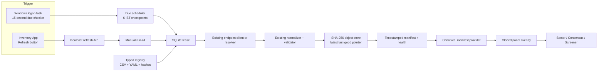

# MD69 Refresh, Registry and Panel Operation Reference

## Pack 6-7 option-data operation (2026-08-11)

- Official NSE index/equity option chains remain existing registry sources;
  Packs 6-7 do not add a parallel option downloader.
- Parser v1.1.0 recovers symbol/expiry from the request URL when contracts omit
  them, then quarantines any row whose identity is still incomplete.
- Max Pain is a deterministic OI-derived informational field. Missing Greeks,
  IV history and prediction values remain null/absent.
- Credentialed broker/analytics services are disabled until a separately
  approved data-only contract and secret configuration exist.
- Current collector registry is **126** typed contracts; catalog is **165**
  cards / **129** logical keys / **105** collapsed primaries. Six catalog-only
  names are aliases of those jobs, not extra downloads. Schedule authority
  remains provisional and `activation_ready=false`.

## Pack 5 operational additions (2026-08-11)

- `nse_market_status`: NSE session pool; official operational context; parser
  tolerates auxiliary index-only rows but requires at least one dated market
  session row.
- `nse_pit_symbol`: endpoint-client bounded `inventory_symbol_fanout`; missing
  symbols fail before HTTP; each raw response is archived; disclosed direction
  is informational and zero-score.
- `rupeevest_mf_flows`: one shared resolver session and three fixed public JSON
  routes plus identity map; previous-period retention; third-party monthly
  context.
- Multi-step `ok=false` now produces synthetic status 599, preventing an
  upstream HTTP 200/schema failure from being archived as successful NEW data.
- Successful endpoint transport notes are no longer copied into the normalized
  `error` field. Failed/stale reasons remain visible.

**Purpose:** This is the maintenance reference for adding, removing or changing
MD69 collection sources and the Inventory App refresh flow. It describes the
implemented code, not a proposed downloader.

**Current verified date:** 2026-09-03 (registry pin 126; latest complete historical `run_all` manifest remains `manual-20260816-160551`)  
**Safety boundary:** Research only. No broker, orders, quantity or trading path.  
**Authority:** `AGENTS.md`, File A, `docs/BUILD_STATUS.md`, and
`docs/VALIDATION.md` remain higher authority when they conflict with historical
notes.

## 1. What is actually running

| Item | Verified current state |
|---|---|
| Collector registry | **126** typed contracts in `config/source_refresh_registry_69.csv` (+ profiles YAML); filename kept for path compatibility; `EXPECTED_SOURCE_COUNT=126` |
| Catalog snapshot | **165** cards in `links_105.json` (inventory app and `frontend/inventory-workbench/`); **129** unique keys; **122** current display-collapse groups. `105` is a historical inventory baseline and legacy filename, not the current collapse count. Refresh does **not** iterate 165 cards. |
| Catalog-only aliases | Six names share a parent job: `nse_block_deal_live` ← `nse_block_deal`; `nse_pit_current` ← `nse_pit_symbol`; `nse_option_chain` ← `nse_option_chain_equity`; `nse_market_variations` ← gainers/loosers; `nse_live_equity_derivatives` ← six live-derivative contracts; `wgc_gold_etf_flows` ← `wgc_gold_etf_holdings`. Companion/provenance cards are not extra fetches. |
| Catalog samples | Last-good fill now covers **165/165** cards. **Refresh still does not rewrite catalog JSON** — run `fill_catalog_samples_from_collector.py` after a collect if a card sample must update. |
| Collector flags | Local API start (`run_server.py`, `scripts/start_api_md69.ps1`) defaults `MARKET_DATA_69_ENABLED=1` and `MARKET_DATA_69_PROVISIONAL_OVERRIDE=1`. Without both, `POST /api/market-data/refresh` returns 503. |
| Automatic trigger | Standard local API start sets `MARKET_DATA_69_AUTOSTART=1`; `main.py` FastAPI lifespan starts one guarded 15-second foreground scheduler. `scripts/start_md69_scheduler.ps1` remains an explicit standalone option; do not run both. Windows-logon restart persistence is not claimed. |
| Scheduled checkpoints | 09:00, 09:17, 10:30, 12:30, 13:30, 15:00 IST |
| Manual trigger | Local-only `POST /api/market-data/refresh` from the browser **Refresh** button (inventory app or bundled workbench) |
| Manual-run status | Local-only `GET /api/market-data/refresh/status` |
| Latest complete historical full-registry manifest | `data/market_data/2026-08-16/snapshots/manual-20260816-160551/manifest.json` — all **123 contracts that existed then** were attempted: 119 `SUCCESS_NEW`, 1 `STALE_LAST_GOOD`, 3 `VALID_EMPTY`, 0 failed. This is historical and does not prove a 126-job full run. The older `manual-20260816-123159` content audit remains historical evidence: 107 populated usable objects, 3 valid-empty, 3 stale and 10 status/schema envelopes. HTTP 200 is not usable. |
| 2026-09-03 restriction-source proof | Individual canonical runs populated `nse_esm` (290 rows, 2026-09-03) and `nse_price_bands` (3,517 rows, 2026-09-02); `nse_auction_securities` parsed the official `NIL` workbook as `VALID_EMPTY` (0 rows, 2026-07-09). A complete 126-job `run_all` has not been claimed. |
| Historical 69-run | 2026-08-06 14:40-14:42 IST: 69 attempted, 67 populated, 2 valid-empty, 0 failed; `manual-20260806-144047`. Kept as history only. |
| Source Operations | `GET /api/source-operations/snapshot` is the single workbench read model (source track + cash A1–C1 track). Last-good matching resolves the aliases above. Research-usable stays strict (HEALTHY + freshness + compiler). |
| Post-commit | After a schema-valid cash-relevant last-good, the collector may dispatch A1–C1. Unrelated sources skip it. This is not “every download ranked.” |

The number on the SPA bar **“Showing N feeds”** is **not** the registry size.
It is `displayList.length` after duplicate collapse on `links_105.json`
(`app.js` → `applyFiltersAndRender`). Full map: inventory
`ARCHITECTURE.md` §16.

The collector number is the compiler guard / hash-pinned release identity.
An intentional registry add/remove still requires the controlled update steps
in section 8. After a pin change, **restart the API process** before expecting
`run_all` / Refresh to attempt the new keys.

## 2. Implemented data flow



There is one collection plane. The SPA does not call NSE, BSE, Kite or any
market endpoint directly. The SPA receives only the committed panel snapshot.

## 3. Code ownership map

| Layer | File | Actual responsibility |
|---|---|---|
| Registry CSV | `D:\TrendForge\config\source_refresh_registry_69.csv` | One row per primary source: URL, cadence text, closed/holiday and valid-empty rule, fetch group and evidence status. |
| Registry integrity | `D:\TrendForge\config\source_refresh_registry_69.csv.sha256` | Records the approved CSV digest. |
| Typed source mapping | `D:\TrendForge\config\source_refresh_profiles.yaml` | Acquisition owner, endpoint/fan-out, normalized key, parameter provider, adapter/parser, validator and reuse mode for every CSV key. |
| Registry compiler | `D:\TrendForge\backend\trendforge_api\market_data_registry.py` | Validates key equality, component references, hashes, profiles and provisional activation constraints. |
| Fetch/normalize/store | `D:\TrendForge\backend\trendforge_api\market_data_service.py` | Uses the existing client/resolver with bounded concurrency, domain limits, circuit breaker, parser/adapter and storage calls. |
| Scheduler/manual all-run | `D:\TrendForge\backend\trendforge_api\market_data_scheduler.py` | Six checkpoints, lease, due run, `run_all`, manifest, health, last-good fallback and single-flight manual coordinator. |
| Canonical panel projection | `D:\TrendForge\backend\trendforge_api\market_data_alignment.py` | Reads a committed manifest/object only after manifest and content hashes verify. |
| Panel freshness logic | `D:\TrendForge\backend\trendforge_api\live_panels.py` | Defines P0 and research source roles, panel freshness states, max 300-second LIVE gate and overlay limits. |
| Local API | `D:\TrendForge\backend\trendforge_api\main.py` | Exposes the local refresh start/status endpoints and panel snapshot endpoint. |
| Operator CLI | `D:\TrendForge\backend\trendforge_api\cli.py` | Provides `run-all` without adding another collector. |
| Refresh UI | `D:\trendforge_inventory_app\` and `frontend/inventory-workbench/` (`index.html`, `live_panels.js`) | Exact `Refresh` button, schedule/status text, request polling, and panel reload after committed completion. |
| Existing screen engines | `sector_screener.js`, `consensus.js`, `screener.js` | Consume a cloned inventory overlay; no score formula is altered by refresh code. |

## 4. Manual Refresh contract

1. Browser starts `POST http://127.0.0.1:8000/api/market-data/refresh`.
2. API rejects non-local callers and rejects if MD69 is disabled.
3. `ManualRefreshCoordinator` accepts one run only. A second click while active
   returns the current run state; the browser button is disabled.
4. `MarketDataScheduler.run_all()` builds `contracts` from
   `tuple(self.registry.contracts)`, not from a frontend list. It bypasses only
   cadence/holiday suppression. Activation gate, concurrency, domain caps,
   circuit breaker, parser, validation and lease still apply.
5. Every attempted source produces an attempt record. Successful normalized
   objects update `market_data_latest`. Failed or valid-empty attempts do not
   overwrite that last-good object.
6. A timestamped manual manifest is written. It has one entry per current
   registry contract, including real source/data/fetch timestamps, row counts,
   hashes, error and last-good path where available.
7. The browser polls the status endpoint. When the run reports `COMPLETED`, it
   requests a new panel snapshot. It never calculates from the HTTP fetch
   response itself.

The button text remains exactly **Refresh**. While a run is active, it is
disabled and nearby status text says `Downloading N sources...`; it does not
change the button label to `Refreshing...`.

## 5. Scheduled collection contract

`SNAPSHOT_SLOTS` in `market_data_scheduler.py` defines these checkpoints:

```text
09:00  09:17  10:30  12:30  13:30  15:00 IST
```

`scripts/start_md69_scheduler.ps1` starts the existing CLI foreground loop.
It checks due work every 15 seconds, creates no duplicate downloader, and uses
the same SQLite lease as manual refresh. After 15:35 IST it also performs the
existing guarded EOD cycle. The schedule is still marked `PROVISIONAL`; it is
an engineering schedule, not verified official publication timing.

## 6. Last-good and panel-state rules

| Source outcome | Storage/manifest effect | Panel meaning |
|---|---|---|
| `SUCCESS_NEW` / `SUCCESS_UNCHANGED` | Stores or reuses normalized object; latest pointer remains current | Eligible only when date and age satisfy the panel freshness rule |
| `VALID_EMPTY` | Records a valid empty attempt; does not replace populated last-good object | No invented signal or score |
| `FAILED` / parser failure / bad data | Records failure and preserves last-good object | Saved object can remain research-visible with its original date/time |
| `STALE_LAST_GOOD` | Manifest points to last-good hash/object/date/fetched time | `RESEARCH_ONLY`; never turns a panel `LIVE` |
| Hash mismatch / future date / wrong-day source | Projection rejects it | Not shown as a usable panel input |

`LIVE` requires the panel's defined critical inputs and source age at or below
300 seconds. `MARKET_CLOSED` is a red state; it may still show saved research
data. `STALE`, `PARTIAL` and `WAIT` may display existing saved records, but
they are not live. A data timestamp is the original saved fetch time, never the
time the browser rebuilt its panel.

`TRENDFORGE_LIVE_PANELS_ENABLED=false` disables the legacy live-network fetch
path. It does not suppress the read-only canonical MD69 provider when the
collector is enabled and a hash-verified manifest exists. This keeps the kill
switch network-safe while allowing the last downloaded research records to
remain visible.

## 7. Panel membership is an explicit product decision

Adding a collector source does **not** automatically make it a Sector,
Consensus or Screener scoring input.

| Desired use | Required edit |
|---|---|
| Collect/archive only | Registry CSV + YAML profile + endpoint/resolver/parser support and tests. No panel list change. |
| Saved research evidence | Any successful normalized manifest source enters the bounded supporting overlay automatically. Add an explicit research role only when it must affect panel freshness diagnostics or needs more than the bounded supporting sample. |
| Fresh critical panel data | Add to P0 / `PANEL_CRITICAL_SOURCES` only with explicit product approval, freshness rules and panel tests. It can affect whether a panel is LIVE. |
| Screener information field | Add a B/C extractor and schema only. B/C remains zero-score unless the scoring contract is separately approved and golden-tested. |
| Consensus vote | Do not add automatically. Register only an approved independent board in `consensus.js` / plugin, prove non-duplication, and preserve golden outputs. |

This prevents bhavcopy, PR and most-active data from becoming duplicate votes
for the same market move.

## 7A. Verified catalog-to-panel linkage audit (2026-08-06, pin 99)

The current design is **hybrid**, not fully dynamic. The catalog loads source
rows from JSON; calculation panels use a **cloned** inventory plus
`inventoryOverlay`. Catalog cards never receive that overlay.

| Layer | Verified behavior | Current count |
|---|---|---:|
| Master Excel `LINKED_SOURCES` | Historical generate path for original strong feeds | was 112 rows / 110 URLs |
| `links_105.json` | Browser catalog; also extended by `merge_registry_into_catalog.py` | **165** rows |
| SPA “Showing N feeds” | `app.js` collapse by `primarySourceKey` (`active_source_keys` first token) | **105** primaries |
| MD69 collector | Iterates compiled backend registry, not the browser catalog | **123** contracts (pin) |
| Cross-Board Consensus v4 | Dynamic source lookup, static board definitions | 22 boards / 13 source keys |
| Screener v1.3 | Dynamic source lookup, static extractor registry | includes 30-pack extractors |
| Nifty filter | Reuses the Screener table and applies the Nifty universe gate | No separate downloader |
| Sector pulse | Dynamic `nse_all_indices` lookup, static tracked sector-name list | 1 source / 38 names |
| Live panel overlay | Successful normalized sources enter `inventoryOverlay`; applied only to panel clones | requires committed manifest for that key |

Collector keys and catalog keys are not contradictory: some catalog rows use
aliases such as `nse_block_deal|nse_block_deal_live`. A catalog alias is not a
new independent collector contract.

### What a catalog-only add does

Adding a row via Excel/`generate_json.py` **or** `merge_registry_into_catalog.py`
creates a visible card and drawer. If `records_sample` is empty, the card looks
“empty” compared with historical STRONG feeds. A matching successful
normalized collector source can enter the supporting **panel** overlay after
Refresh; it does **not** automatically rewrite catalog JSON. It also does not
create a Screener score term, Consensus vote, or Sector critical input.

### Required connection work for a new link

1. Add the endpoint/resolver, parameters, parser/normalizer and validator in
   `D:\TrendForge`.
2. Add the CSV/YAML registry contract and intentionally update hashes/counts
   (`EXPECTED_SOURCE_COUNT` and SHA pins).
3. Restart API; run Refresh; verify manifest entry for the new `sourceKey`.
4. Ensure a catalog card exists (`merge_registry_into_catalog.py` or full
   regenerate). See §8A for samples on the card.
5. Add a Screener extractor or informational B/C field; do not change scoring
   without a separate approved formula and golden test.
6. Add a Consensus plugin only when the signal is independent and its family
   cannot double-count an existing board.
7. Add the source to live critical/research groups only with an explicit
   freshness and holiday rule.
8. Add schema, normalized-record, duplicate-identity, stale-date and panel
   regression tests before activation.

## 8. Controlled source add/remove procedure

**SPA twin (count bar + Path A/B):**  
`D:\trendforge_inventory_app\ARCHITECTURE.md` §15 (full process), §16–§17.

**Planned expansion beyond pin 99 (40+ links, not yet registered):**  
[`ADD_40_SCREENER_LINKS_PLAN.md`](./ADD_40_SCREENER_LINKS_PLAN.md) — save intake
here first; implement one link at a time with this §8 checklist.

### Add a collection source (end-to-end)

#### Phase A — Collector (download + normalize)

1. Choose one lowercase `source_key`; no duplicate inventory alias / endpoint /
   normalized key.
2. Wire fetch in existing `AsyncEndpointClient` / `source_monitor` / resolver /
   `phase3_multi_step_fetch.py`. **No second downloader.**
3. Structured parser produces real records (HTTP 200 alone is not success).
   Register in `source_parser.py` STRUCTURED map.
4. CSV row in `source_refresh_registry_69.csv` (cadence, window, empty rule,
   evidence). Filename is legacy; count is `EXPECTED_SOURCE_COUNT`.
5. Matching YAML profile in `source_refresh_profiles.yaml`.
6. Update pins: CSV/YAML digests, `PINNED_*` hashes, `EXPECTED_SOURCE_COUNT` in
   `market_data_registry.py`.
7. Tests: registry compile, parser fixture, last-good / valid-empty, panel role
   if any.
8. **Restart** API (`MARKET_DATA_69_ENABLED=1`, provisional override as needed).
   One uvicorn only on `127.0.0.1:8000`.
9. If status is `LEASE_HELD`, clear SQLite table
   `market_data_scheduler_leases` (stuck owner from a dead process).
10. `POST /api/market-data/refresh` → wait `COMPLETED`.
11. Verify manifest entry + `market_data_latest.object_path` and
    `normalized_row_count > 0` (or honest valid-empty).

#### Phase B — Catalog UI (card + samples)

12. `cd D:\trendforge_inventory_app`
13. `python merge_registry_into_catalog.py`  
    Adds missing keys as cards (`REGISTRY_MERGED_AWAITING_SAMPLE` if no sample).
14. `python fill_catalog_samples_from_collector.py`  
    Fills empty samples from collector last-good (≤250 rows) → `STRONG` +
    `CONNECTED_FRESH_STRUCTURED`. Backup: `links_105.json.bak_fill_*`.
15. Hard-refresh SPA (`Ctrl+Shift+R` on `http://127.0.0.1:8080/`).
16. Confirm bar: dynamic primaries / inventory rows (not hardcoded 69).
17. Optional: screener extractor, consensus board, live research/P0 lists,
    `schemas.js` — **never automatic**.

#### Phase C — Ops copy-paste

```text
# API (after pin change). run_server.py now defaults both flags for local start.
cd D:\TrendForge\backend
set MARKET_DATA_69_ENABLED=1
set MARKET_DATA_69_PROVISIONAL_OVERRIDE=1
python D:\TrendForge\backend\run_server.py
# or: powershell -File D:\TrendForge\scripts\start_api_md69.ps1

# Collect
POST http://127.0.0.1:8000/api/market-data/refresh

# Catalog
cd D:\trendforge_inventory_app
python merge_registry_into_catalog.py
python fill_catalog_samples_from_collector.py
# Browser: Ctrl+Shift+R
```

### 8A. Catalog card sample fill (Path A) vs live overlay (Path B)

| Path | Feeds | How samples get there |
|------|--------|------------------------|
| **A Catalog cards** | Grid + drawer under “Showing N feeds” | `generate_json.py` (legacy) **or** `fill_catalog_samples_from_collector.py` after Refresh |
| **B Live panels** | Sector / Consensus / Screener only | `inventoryOverlay` from committed manifest — **does not rewrite** `links_105.json` |

```text
VERIFY + raw dumps → generate_json.py          (historical STRONG cards)
registry CSV → merge_registry_into_catalog.py  (card stub)
Refresh → objects + market_data_latest
         → fill_catalog_samples_from_collector.py  (card samples like old feeds)
```

| Script | Role |
|--------|------|
| `merge_registry_into_catalog.py` | Append missing registry keys as inventory rows |
| `fill_catalog_samples_from_collector.py` | Update empty `records_sample` from last-good only |
| `fix_empty_samples.py` | Legacy raw-dump surgical fill |
| `generate_json.py` | Full Excel/VERIFY rebuild |

**Refresh UI line** `Saved X · fallback Y · failed Z` = collector status
(`successfulCount` / `lastGoodCount` / `failedCount`), not the feed bar.

Code map:

| Step | Code |
|------|------|
| Collect | `market_data_scheduler.py` / `market_data_service.py` |
| Overlay build | `live_panels.py` → `inventoryOverlay` |
| Overlay apply | `live_panels.js` `buildPanelInventory` (clone) |
| Catalog paint | `app.js` + static `links_105.json` |

### Remove or retire a source

1. First decide whether to remove only its UI card, stop future collection, or
   remove its panel role. These are separate changes.
2. Preserve existing raw objects, manifests and health history; do not delete
   research evidence merely because a source is retired.
3. Remove/update the CSV row and YAML profile together, then deliberately
   refresh the hashes and expected count as in the add procedure.
4. Remove any endpoint/parser/adapter only after repository-wide reference
   search proves it is unused.
5. Remove P0/research/overlay/consensus/screener membership explicitly, and
   add a regression fixture proving the panel safely becomes `PARTIAL`, `STALE`
   or `WAIT` rather than using an old catalog sample.
6. Regenerate the inventory catalog only if the visible link is retired too.

## 9. Current limits and honest status

- The seven previously failed/partial source paths were repaired and a
  non-persisting seven-contract service canary returned structured rows for all
  seven. See `MD69_REMAINING_SOURCE_REPAIRS_2026-08-06.md`. This canary did not
  replace the last persisted all-69 manifest counts recorded below.

- The existing foreground scheduler was started and observed on 2026-08-06 at
  14:37 IST. It recorded earlier expired slots as `MISSED` and remains available
  for the later checkpoint. This proves the current process, not Windows-logon
  persistence; the named Windows scheduled task was still not found.
- The manual HTTP contract, dynamic registry selection, last-good preservation,
  panel overlay behavior and UI control have fixture and API tests.
- The saved-overlay entry-gate repair was browser-verified on 2026-08-06:
  Sector rendered 38/38 sectors, Consensus rendered 8 boards / 61 symbols,
  Nifty Filter rendered 3 BUY / 4 SELL names, and Screener rendered 200 rows.
- The latest observed manual all-69 refresh completed on 2026-08-06 at
  14:42 IST after starting it through the frontend Refresh button with approved
  collector flags. It produced 67 populated successes, two valid-empty
  results and zero failed attempts. Its manifest is
  `D:\TrendForge\data\market_data\2026-08-06\snapshots\manual-20260806-144047\manifest.json`.
  This is evidence for
  the collector, not evidence that every feed is usable for every panel.
- The local UI was reloaded and observed after that manifest committed. It
  rendered all three research panels from the saved overlay: a 38-sector
  Sector pulse, an eight-board / 60-symbol Consensus panel, 3 BUY / 3 SELL
  Nifty-filter names, and 200 visible Screener rows from 2,867 extracted
  symbols. No new browser console error was observed. The state was honestly
  `STALE` when checked because a required source age exceeded 300 seconds.
- Not every source has a current populated row. A panel uses only its declared
  overlay role; saved data cannot invent a missing board or score term.
- Green `LIVE` was not observed in the current after-market session. Its rule
  is covered by deterministic tests only.
- The full backend regression is not clean: the relevant broader run recorded
  149 passes and one unrelated Parquet endpoint 503 in this environment.

## 10. Required verification after a change

```powershell
cd D:\TrendForge\backend
$env:PYTHONDONTWRITEBYTECODE='1'
D:\TrendForge\.venv\Scripts\python.exe -m pytest `
  tests\test_market_data_registry.py `
  tests\test_market_data_scheduler.py `
  tests\test_market_data_alignment.py `
  tests\test_live_panels.py `
  tests\test_manual_refresh_api.py -q

cd D:\trendforge_inventory_app
node tests\manual_refresh.test.js
node tests\live_panels.test.js
node tests\screener_financial_golden.test.js
node tests\consensus_nifty500.test.js
```

Then inspect, without clicking Refresh unless an actual acquisition is intended:

```powershell
Invoke-RestMethod http://127.0.0.1:8000/api/market-data/refresh/status
Invoke-RestMethod 'http://127.0.0.1:8000/api/panels/live?refresh=false'
```

For a real manual collection, the operator uses the visible **Refresh** button
or the explicit CLI `python -m trendforge_api.cli run-all`. Verify manifest counts, populated
normalized rows, source dates and panel status before treating the result as
current research data.

## 2026-08-10 Pack-3 rating extension

The legacy-named registry now contains **106** dynamic contracts. New keys are
`crisil_ratings` and `icra_ratings`. The standard add-source flow remains:
descriptor -> existing resolver/fetcher -> pure parser -> CSV/YAML contract ->
atomic count/SHA pins -> invalid/empty/date/dedupe/last-good tests -> focused
live raw archive -> scheduler object persistence -> catalog merge/sample fill.
Rating sources never enter `consensus.js` or a score formula. Current observed
rows: CRISIL 100 and ICRA 20, both dated 2026-08-10.

CARE and Google News RSS complete the Pack-3 extension. Current registry count
is 108. CARE uses shared-session page discovery plus JSON; Google News uses a
fixed five-query shared-session bundle and a seven-day publication-age gate.
To add another bounded feed, add one descriptor, existing-plane resolver route,
pure parser, storage/freshness mapping, CSV row, YAML profile and atomic pins;
then run invalid/empty/date/dedupe/last-good tests, a populated live archive,
MarketDataService persistence, and catalog merge/sample validation. Never add a
parallel downloader or let an informational source become a vote by default.

The WASDE enhancement demonstrates an existing-key repair: update the same CSV
row and hash pin, preserve key identity/last-good lineage, order official
discovery and file routes before mirrors, and force-refresh only that catalog
card after the new normalized object is stored. `fill_catalog_samples_from_collector.py
--only-key <key> --force-existing` is intentionally key-scoped; force mode
without `--only-key` is rejected.

Large public masters must pass two size gates: archive the complete source for
provenance, then measure the normalized object before acceptance. Angel proved
why: per-contract JSON was 247 MB, while underlying/security aggregation is
28.7 MB and still accounts for every in-scope row. Supersede an oversized
latest pointer through the normal store; leave deletion to the existing
retention workflow.

Do not infer broker-master identity from one sample. Dhan required
`(exchange, segment, security_id)`; omitting segment silently dropped 10,104
records. New master adapters must count duplicates before and after candidate
identity selection and preserve the full raw file when product scope filters
rows from normalized output.

## 2026-08-11 official BSE/RBI extension and calculated-output flow

The legacy-named registry compiled **119** source contracts after the official
BSE/RBI add. Current compile is **123** after four third-party FII holding
screens (INFO collectors; last-good 105/300/32/25 on 2026-08-13; inventory
strip live; command-room UI still open as `TF-APP-FII-M1`; not consensus voters). Three official keys from this
section use the same acquisition, validation, archive, last-good and
scheduler plane as every other registry source:

| Key | Acquisition mode | Normalized scope | Empty/failure behavior |
|---|---|---|---|
| `bse_financial_results_xbrl` | bounded one-month BSE endpoint; default-window warm plus stdlib browser-session fallback only after bare `{}` | filing-index discovery | reject `{}`; accept only `Table`; preserve last-good on failure |
| `bse_shareholding_pattern` | bounded three-month BSE endpoint; default-window warm plus stdlib browser-session fallback only after bare `{}` | filing-index discovery | reject `{}`; accept only `Table`; preserve last-good on failure |
| `rbi_tbill_yield` | RBI index discovery then latest detail | 91/182/364-day auction yields | reject incomplete table; preserve last-good |

After a successful source phase, `DerivedMarketOutputService` reads only
committed last-good objects and content-addresses populated outputs. Calculated
keys never enter the source registry or source count:

```text
nse_nifty500_constituents -----------------> industry_peer_group_v1
nse_option_chain_equity -------------------+-> pcr_max_pain_history_v1
                                            +-> option_greeks_calculated_v1
rbi_tbill_yield ---------------------------+
bse_financial_results_xbrl + market rows --> fundamental_ratios_v1
                                               (currently no rows: facts absent)
```

Every calculated row is `derived=true`, `scoreEligible=false`,
`voteEligible=false`, and `canUnlockReady=false`. PCR/Max Pain history grows
only from genuinely observed future option snapshots. The BSE filing indexes
must not be interpreted as numeric facts; a later detail stage must archive the
iXBRL document hash and parse `contextRef`/dimensions before ratios can appear.

## Dead routes and replacements

Before adding a source, check `config/source_route_quarantine.yaml`. A matching
route is a `NOT_IN_USE` hint, not a registry candidate. Do not add it to the CSV,
profiles, resolver, scheduler, catalog, Consensus, or Screener. Use the listed
replacement key or prove a genuinely new populated route first. Current
quarantine: Yahoo `^BADI`, `pytrends`, StockEdge "API", BSE `FIIDII/w`, and BSE
`ParticipantWiseOI/w`. MCX is intermittent, not dead.

## BSE/MCX source recovery rule (2026-08-16)

The BSE filing indexes remain normal `ASYNC_ENDPOINT_CLIENT` registry jobs. When BSE answers with bare `{}` instead of its required `Table` array, the client discards the stale page seed, reloads the official corporate page, warms the official finance dropdown for financial results, and retries within the existing bound. It never treats `{}` as valid empty. Observed recovery saved 9,036 financial-result index rows and 5,530 shareholding index rows, both dated 2026-08-15.

MCX remains one `RESOLVER_MONITOR` job. Its transport tries the official bhavcopy route family with Chrome-compatible TLS, but the parser boundary is unchanged: success requires the real populated embedded bhavcopy array. A 403, redirect to `/sitefinity/status`, or HTML without market rows is failure and cannot replace last-good. On 2026-08-16 MCX served the status page, so the 145-row 2026-08-13 snapshot remained latest. Refresh/schedule will retry the same registry job when it is due; no proxy or fabricated MCX data is permitted.


## 2A. Verified local control path and post-commit behavior - 2026-08-16

**Purpose:** acquire and preserve source data once, then expose honest lineage. The inventory browser never downloads exchanges itself and cannot bypass TrendForge gates.

1. **Refresh button:** `POST /api/market-data/refresh` starts one `ManualRefreshCoordinator` job, which calls `MarketDataScheduler.run_all()` for the **126** hash-pinned contracts. It returns progress from `GET /api/market-data/refresh/status`.
2. **Automatic run:** normal `run_server.py` / `start_api_md69.ps1` startup sets `MARKET_DATA_69_AUTOSTART=1`. `main.py` starts one lifecycle-owned `start_foreground(poll_seconds=15)` task; it considers the six IST checkpoints and EOD, and is cancelled on shutdown. A bare Uvicorn command must supply the flags itself. Do not run the standalone scheduler simultaneously.
3. **Data boundary:** `MarketDataService` uses the persistent endpoint client or resolver, then strict source parser and `MarketDataStore`. Only schema-valid populated data can be current facts. `{}`, junk HTML, parser failure, stale fallback and valid-empty stay explicitly classified; last-good is retained on failure.
4. **Cash handoff:** `MarketDataScheduler._dispatch_post_commit(at)` uses `expected_research_session_date(at)` on the **Asia/Kolkata** clock, not UTC and not a naive local clock. Open/pre-open research the last trading day. After 15:35 IST on a trading day the research date is today, but last-good does not move until the dated official file parses as today. Holidays keep the last trading day and never relabel it as calendar today. `nse_index_close_eod` is fetched as an A5 companion (not a 124th 123-job voter). If the calendar cannot prove a date, last-good cash date is used; else `BLOCKED_INPUT`. Only changed current cash-relevant artifacts enter `CashPostCommitOrchestrator`; repeated fingerprints reuse/skip and unrelated contracts bypass this family.
5. **A1-C1 semantics:** A1 stages cash facts; A2 identity/restrictions; A3 creates WATCH discovery; A4 writes immutable bars; A5 applies optional index/corporate-action context; A6 enriches only the WATCH shortlist with F&O; C0 reuses compiler permission evidence; B is conditional official MWPL enrichment; C1 writes research ranks. A skipped optional stage cannot become a hidden affirmative vote.
6. **Read model:** `GET /api/source-operations/snapshot` is the only workbench connection. It renders source lineage and stage states. It does not change activation, evidence scores, public state, quantity or execution.

**Observed end-to-end run:** `2026-08-16-manual-20260816-160551-9e7a3429071a` completed 123 attempts (119 new, 1 last-good, 3 valid-empty, 0 failed). The cash track dispatched against NSE EOD **2026-08-14**: A1 2,463 rows, A2 2,463, A3 1,723 WATCH rows, A4 2,463 bars, A5 skipped, A6 completed, C0 reused, B skipped `MWPL_MISSING`, C1 2,463 research rows. `sourceActivationReady=false`, `canUnlockConfirmed=false`, `executable=false`, ceiling `WATCH_WAIT_REJECT`.
