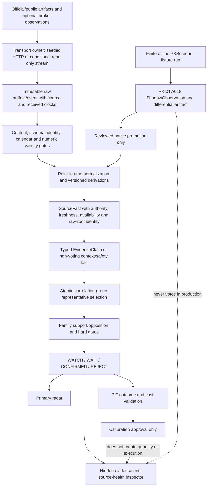

# TrendForge Authoritative Data-to-Decision and Screener Plan

**Date:** 2026-07-18  
**Status:** AUTHORITATIVE PLAN ONLY - implementation is not claimed  
**Markets:** NSE stocks and MCX contracts  
**Horizons:** Intraday and swing  
**Product boundary:** Single-user research selection and manual review. No broker order placement, account access, position management, autonomous trading, or probability-of-profit claim.

## Authority And Dual-File Usage Preamble (Mandatory)

**MANDATORY for humans and AI agents before implementing any milestone.**

| Document | Short name | Path | Authority |
|---|---|---|---|
| **This file** | **File A / MERGE** | `docs/fable/new_merge_PLAN_2026-07-18.md` | **Build-sequence authority**, stable IDs, acceptance ceilings, product scope, public states, reject/postpone ledger |
| **Hybrid plan** | **File B / HYBRID** | `docs/fable/TRENDFORGE_HYBRID_DATA_TO_DECISION_PLAN_2026-07-17.md` | **Detail library only**: inventory, source maps, formulas, strategy combinations, ops SM, tradability field lists |

### Hard rules

1. **Do not full-merge File B into File A.** Keep Hybrid intact so long-form domain text is not lost in a paste.
2. **Do not treat File B as a second build order.** Hybrid H1–H10 / H1A* labels are **detail map keys**, not the primary sprint sequence.
3. **Primary sequence is File A only:** §15 R0–R18 and §24.13 Q5-R0–Q5-R7. Q5-R0…R7 are already at research/fixture ceilings per `docs/BUILD_STATUS.md` (2026-07-20).
4. **Conflict rule:** File A wins on product scope, four public states (`WATCH` / `WAIT` / `CONFIRMED` / `REJECT`), no quantity/order/execution, PK non-authority, and evidence-strength ≠ probability. File B supplies detail for rows listed in **§25**.
5. **Before marking any R/Q5 milestone complete**, open every File B section listed for that milestone in §25, implement the **detail**, and keep File A **overrides**.
6. **Research-only default:** File B formulas for `final_qty`, INR 1L caps, paper/live OpenAlgo, and READY-as-executable remain **POSTPONE** unless a later approved File A amendment expands scope. In research mode their inputs may inform **risk warnings and no-action reasons**, never quantity, position intent, or order intent.
7. Completeness proof of dual-file use: `docs/fable/remaining_build/INDEPENDENT_AUDIT_hybrid_vs_new_merge_2026-07-20.md` and `docs/fable/remaining_build/INDEPENDENT_AUDIT_merge_plan_build_matrix_2026-07-20.md`.

### Gemini dual-file guide (adopted with corrections)

An external dual-file governance proposal (Gemini) was reconciled on 2026-07-20:

| Gemini claim | Project correction |
|---|---|
| File A milestones are H1–H10 | **Wrong for this repo.** File A sequence is R0–R18 / Q5-R*; H* live only as Hybrid detail keys |
| File A alone is domain-empty | **Overstated.** File A already has FTR contracts, families, S0–S9, PK, tests. File B adds inventory depth, named source wiring, ops SM, tradability field lists |
| Build H5 quantity now | **Rejected for current product.** Quantity/execution remain POSTPONE (File A §8, §12.3, REJ/PST) |
| File A may not store domain rules | **Too strict.** File A may keep stable IDs and short contracts; long recipes stay in File B via §25 pointers |
| CI must enforce bidirectional links | **Planned governance**, not claimed implemented. Prefer checklist + BUILD_STATUS until a hook exists |

**Adopted:** dual-file split, mandatory preambles, cross-reference matrices, GAP/CONFLICT registers, orphan-check method (manual until automated), and 50-test coverage map (mapped to existing T-IDs where possible).

### 0.5 Cross-Reference Authority (Two-Document System)

**Remaining-build pack (audits, CSV, AI guides):** `docs/fable/remaining_build/`  
**AI next-steps guide:** `docs/fable/remaining_build/README.md`  
**Remaining code/document location map (checklist only, not authority):** `docs/fable/remaining_build/REMAINING_PROJECT_BUILD_FILES.md`  
**Installed analysis:** `docs/fable/remaining_build/TWO_DOCUMENT_GOVERNANCE_SYSTEM_2026-07-20.md`  
**Combined AI governance guide (Kimi + GLM):** `docs/fable/remaining_build/TRENDFORGE_GOVERNANCE_SYSTEM_ai.md`  
**Traceability CSV (not a third plan):** `docs/fable/remaining_build/PLAN_REQUIREMENT_COVERAGE.csv`  
**CSV regenerator:** `docs/fable/remaining_build/build_coverage_csv.py`  
**Detail index:** §25 (CROSS/GAP/POST) + §25.15 (Gemini recheck) + §25.16 (TDG-GAP-001..026 + AMEND-A/B install)

This plan (**File A**) is the **build-sequence authority**.  
The Hybrid Plan (**File B**, `TRENDFORGE_HYBRID_DATA_TO_DECISION_PLAN_2026-07-17.md`) is the **domain detail library**.

| Authority question | Winner |
|---|---|
| When / in what order to build | **File A** (R0–R18, Q5-R*) |
| Acceptance ceilings and product scope | **File A** (four states, no qty/execution, REJ/PST) |
| Exact formulas, source key lists, inventory defects | **File B** when §25 / §0.5 table points there |
| Conflict on fail-closed / PIT / non-execution / non-probability | **Stricter rule wins** (usually File A + File B detail) |

#### When to consult File B (minimum map)

| This plan section | Consult File B for | File B section |
|---|---|---|
| 5.2 Source roles / contracts | Full field list (timezone, rate_budget, circuit_breaker, …) | §4 + §15.3 |
| 5.3 Dataset roots | Exact source contract keys (69 linked + 43 not-linked) | §16.6 |
| 5.4 Identity / claims | EvidenceClaim field list | §7 |
| 7 Feature contracts | Exact calculation formulas | §16.8 |
| 9.2 Strategy profiles | Mandatory sources per profile | §6 + §16.7 |
| 9 S2 Regime | Regime labels (context only; size multipliers POSTPONE) | §5 Stage 3 |
| 11 Evidence fusion | q_i formula, trust combinations, event match states | §16.9 + §15.4 + §19.8 |
| 12 Fail-closed / ops | 14-state breakage recovery | §16.12 |
| 13 UI | Extra radar/inspector field detail | §9 + §16.15 |
| 14 Storage/API | Storage rationale; OpenAlgo method surface | §8 + §16.13 |
| 15 R-steps | Priority activation backlog | §16.16 |
| 19 Calibration | Probability promotion thresholds (before any P(win) UI) | §15.5 |
| All | 4-lane reliability architecture | §15.2 |
| All | 10-state source maturity ladder | §16.3 |
| All | J01–J14 decision-job taxonomy | §19.2 |
| All | Dataset-root 11-field identity model plus File A business keys | §18.4 |

**Rule:** All new implementation IDs are minted in File A. File B keeps section numbers as reference targets (`HYBRID-§…`). Do not full-merge File B into File A.

## 0. Document Control and Audit Method

### 0.1 Inputs read completely

| Ref | Document | Lines | SHA-256 | Role |
|---|---|---:|---|---|
| `OLD` | `D:/TrendForge/delete/authoritative_plan_merge_2026-07-18/new_merge_PLAN_2026-07-18.pre_authoritative.md` | 691 | `9C48C40A1788BE4A589C164D5FE1133D6BFABBACB94C69A93DDD7198BBA8BF96` | Preserved previous planning authority |
| `AUDIT` | `D:/TrendForge/docs/fable/INDEPENDENT_AUDIT_new_merge_PLAN_2026-07-18.md` | 875 | `8355D2C129037505DD2D32773E5B643EDCE5BE7DB9F7B4EFA33256105895D6C7` | Independent proposed corrections |

Both documents were read as numbered text from first line to last line, including headings, tables, formulas, URLs, tests, appendices, postponed items, rejected proposals, and PKScreener material.

### 0.2 Three independent passes

The requested named model variants are not selectable in this environment. Three independent reasoning passes were used instead, without impersonating unavailable models:

1. **Pass A - Requirement extraction:** enumerate every section and idea, assign stable IDs, and map source lines.
2. **Pass B - Quant/data/risk challenge:** test authority, point-in-time correctness, correlated evidence, stale data, leakage, false confidence, and operational failure.
3. **Pass C - Implementation/UX/traceability:** require a module, storage, API, state, presentation, acceptance test, and coverage row for every accepted feature.

### 0.3 Authority rule

This document supersedes planning guidance in `OLD` after verified installation. `AUDIT` remains immutable review evidence. Source plans and archived copies are not deleted. Runtime behavior, remote endpoints, licenses, and production readiness still require observed tests.

### 0.4 Classification vocabulary

| Class | Meaning |
|---|---|
| `KEEP` | Correct and retained without material semantic change |
| `IMPROVE` | Retained with a stronger contract, wording, order, or test |
| `MERGE` | Multiple overlapping ideas become one canonical requirement |
| `ADD` | Missing requirement introduced by this reconciliation |
| `POSTPONE` | Valuable only after named prerequisites pass |
| `REJECT` | Excluded from active decision logic; reason remains recorded |

## 1. Executive Verdict

The previous plan has a strong fail-closed direction and broad capability coverage, but it is not yet a production roadmap. Its main risks are internal timing contradictions, incomplete feature contracts, possible double counting, an under-specified MCX identity/expiry layer, and an intraday path that can appear complete before a verified live bar source exists.

The defensible hybrid is:

1. Keep one four-state product model: `WATCH`, `WAIT`, `CONFIRMED`, `REJECT`.
2. Treat G00-G14 and future controls as reason codes, never parallel states.
3. Use a source-first, immutable, point-in-time data chain before calculating features.
4. Rank independent evidence families, not raw indicator or scanner counts.
5. Permit the first honest `CONFIRMED` only after the family resolver and a minimal closed-bar structure pack pass; initially this is an EOD swing path.
6. Cap intraday output at `WAIT` until a verified read-only intraday bar contract passes integrity tests.
7. Block MCX `CONFIRMED` until local contract master, price/OI artifact, expiry, lot, tick, and delivery/tender rules exist.
8. Adopt PKScreener's useful deterministic capability coverage, but keep its runtime, data fallbacks, AI labels, caches, updater, alerts, and backtest claims outside TrendForge authority.
9. Keep OpenAlgo disabled and read-only until separately validated. No order route belongs to this plan.
10. Do not call the system production-ready until the required behavior is observed through automated, fixture, integration, UI, and live-safe tests.

## 2. Fifteen Most Serious Weaknesses

| ID | Weakness | Evidence | Risk | Resolution |
|---|---|---|---|---|
| `W-001` | M2 wording can imply confirmation before structure exists at M5 | `OLD:263-281`; `AUDIT:60-64` | False early confirmation | R2 has `state_ceiling=WAIT`; first swing confirmation only at R5 |
| `W-002` | Intraday profiles require live OHLCV while OpenAlgo is late | `OLD:103-107,293-296`; `AUDIT:65-68` | Public/EOD data masquerades as live | Add `data_mode`; intraday max `WAIT` until broker read-only integrity passes |
| `W-003` | G00-G14 and four product states can be interpreted as two state machines | `OLD:44-55,330-338`; `AUDIT:69-72` | API/UI contradiction | G-codes become gate reasons only |
| `W-004` | MWPL/F&O ban is required but contract ownership is missing at baseline | `OLD:88,242`; `AUDIT:73-76` | Tradability gate silently absent | Freeze `nse_mwpl_ban` or successor in R0 |
| `W-005` | Candidate history tables overlap | `OLD:177-182`; `AUDIT:77-79` | Split lineage and conflicting transitions | Merge into `selection_state_events` |
| `W-006` | Four causal lenses and evidence families can both be scored | `OLD:57-72`; `AUDIT:80-83` | Double counting | Families are primary; lens is claim metadata |
| `W-007` | Completeness is visible but no hard minimum blocks confirmation | `OLD:99,265-266`; `AUDIT:84-87` | Partial universe shown as complete | Profile minimum completeness enforces `WAIT` ceiling |
| `W-008` | MCX profiles lack instrument identity and expiry/delivery contracts | `OLD:121-123,288-291`; `AUDIT:88-91` | Wrong contract, lot, roll, or tender risk | Add MCX master, calendar, expiry, lot/tick, local OI prerequisites |
| `W-009` | Many features lack one complete input-to-test contract | `OLD:125-138,423-501`; `AUDIT:92-96` | Ambiguous implementation and silent substitutes | Mandatory feature registry schema and lint |
| `W-010` | Indicator implementation is not pinned | `OLD:653-659`; `AUDIT:97-100` | TA-Lib/alternate output drift | One engine/version per run, explicit parity tolerance |
| `W-011` | Survivorship/delisting hygiene appears only near outcome validation | `OLD:641-644`; `AUDIT:101-104` | Look-ahead and inflated backtests | Introduce PIT universe fixtures at PK2/R4 |
| `W-012` | Scanner match counts may look like independent support | `OLD:575-593`; `AUDIT:105-108` | Correlated indicators inflate trust | Radar shows family supports; count is marked correlated-possible |
| `W-013` | Original milestones are not defined as runnable verticals | `OLD:251-301`; `AUDIT:81-84,190-210` | Long non-runnable integration period | Adopt R0-R18, each with observable output |
| `W-014` | A permanent HTTP sidecar is heavy for a single-user shadow tool | `OLD:503-517`; `AUDIT:88-91,713-720` | Operational complexity | Support either isolated sidecar or schema-equivalent CLI JSON drop |
| `W-015` | Scanner Lab/outcome UI can precede PIT approval | `OLD:571-597,636-644`; `AUDIT:92-95,803-810` | Marketing-like performance claims | Hide performance UI unless `PIT_APPROVED` |

## 3. Best Ideas Retained From Each Plan

### 3.1 Best from the previous authority

| Requirement ID | Idea | Source | Decision | Marginal value |
|---|---|---|---|---|
| `GOV-001` | Research-only, no execution/probability claim | `OLD:3-6,25-40` | KEEP | Prevents misuse and scope creep |
| `STA-001` | Four stable trader states | `OLD:44-55` | KEEP | Simple, explainable decision surface |
| `FUS-001` | Family caps and contradiction handling | `OLD:57-72,268-271` | IMPROVE | Prevents repeated indicators from multiplying confidence |
| `DAT-001` | Authority, freshness, parser version, raw lineage and timestamps | `OLD:74-82` | KEEP | Reproducible and auditable evidence |
| `SEL-001` | Cheap-to-expensive S0-S9 pipeline | `OLD:84-99` | IMPROVE | Controls cost and avoids expensive all-universe parsing |
| `PRF-001` | Separate NSE and MCX, intraday and swing profiles | `OLD:101-123` | KEEP | Avoids one-rule-fits-all screening |
| `UI-001` | Dense radar plus hidden evidence inspector | `OLD:140-169` | IMPROVE | Decision-first UX without hiding lineage |
| `OPN-001` | Disabled read-only OpenAlgo boundary | `OLD:201-211` | KEEP | Future live path without execution risk |
| `PK-001` | Wholesale deterministic scanner coverage under TrendForge controls | `OLD:396-421` | IMPROVE | Broad discovery without inheriting upstream trust |
| `PK-002` | Versioned scanner ID compatibility and pipe DSL | `OLD:452-501` | KEEP | Reproducible configurable screening |
| `PK-003` | Golden fixtures, native parity, PIT outcome rebuild | `OLD:599-667` | IMPROVE | Makes copied concepts testable and leakage-aware |

### 3.2 Best from the independent audit

| Requirement ID | Idea | Source | Decision | Marginal value |
|---|---|---|---|---|
| `STA-002` | Explicit early confirmation ceiling | `AUDIT:190-210,614-621` | ADD | Removes M2/M5 contradiction |
| `DAT-002` | `data_mode` and pre-live intraday ceiling | `AUDIT:623-630` | ADD | Honest live/EOD semantics |
| `GAT-001` | Gate codes are reasons, not states | `AUDIT:632-639` | MERGE | One API/UI mental model |
| `DAT-003` | Hard partial-scan minimum | `AUDIT:668-675` | ADD | Stops incomplete runs from confirming |
| `DAT-004` | Mandatory full feature contract | `AUDIT:136-146,677-684` | ADD | Turns ideas into implementable specifications |
| `DAT-005` | Pin the indicator engine | `AUDIT:686-693` | ADD | Controls numerical drift |
| `PK-004` | Build pipes/caps before the full catalog | `AUDIT:695-702` | IMPROVE | Avoids later remapping and score inflation |
| `PK-005` | Machine-enforced shadow non-authority | `AUDIT:704-711` | ADD | Shadow cannot accidentally confirm |
| `DAT-006` | Early survivorship fixtures | `AUDIT:722-729` | ADD | Prevents leakage from the start |
| `UI-002` | Family supports replace scanner-count evidence | `AUDIT:731-738` | ADD | Reduces false confidence |
| `MCX-001` | Contract master prerequisite | `AUDIT:740-747` | ADD | Prevents wrong-contract decisions |
| `R0..R18`, `T-001..070` | Runnable verticals and 40+ tests | `AUDIT:449-576,767-783` | ADD | Observable progress and stronger failure coverage |

## 4. Conflict Resolutions

| Conflict ID | Competing proposals | Resolution | Technical basis |
|---|---|---|---|
| `C-001` | M2 may confirm vs structure arrives at M5 | R2 cannot confirm; R5 enables first EOD swing confirmation | Closed-bar structure is a required independent family |
| `C-002` | Intraday product now vs live source later | Keep discovery now but cap at WAIT until `BROKER_READ_ONLY` integrity | Fresh EOD/public data is not live execution evidence |
| `C-003` | G00-G14 vs four states | G-codes are gate/reason codes under one state | Avoids contradictory contracts |
| `C-004` | Four causal lenses plus eight families | Family is the aggregation axis; lens is claim metadata | One scoring path prevents double count |
| `C-005` | Two history tables | One append-only `selection_state_events` stream | Single reconstructable history |
| `C-006` | Full PK catalog before pipe controls | PK3 core registry, then PK5 pipes/caps, then PK4 remainder | Correlation model must precede catalog expansion |
| `C-007` | Permanent sidecar vs single-user simplicity | Permit isolated service or CLI JSON drop with identical schema | Same trust boundary, lower operational cost |
| `C-008` | Options metrics as several votes | PCR, walls, max pain, IV/skew share one options family | Same chain/expiry root, highly correlated |
| `C-009` | Volume gainer, most-active, RVOL as several votes | One participation family with `CG_ACTIVITY_SESSION` | Same traded-activity root |
| `C-010` | NR, VCP and squeeze as independent | One `CG_COMPRESSION` contribution | Same volatility contraction thesis |
| `C-011` | Participant OI/FII/DII as stock sponsor proof | Regime context only | Aggregate actor scope does not identify a stock |
| `C-012` | AMFI/CFTC/EIA/WGC as live flow | Delayed sponsor/macro context only | Publication lag and coarse scope |
| `C-013` | GEX as dealer positioning | Postpone `GEX_PROXY`; never claim observed dealer book | Missing dealer inventory and validated Greeks |
| `C-014` | OpenAlgo as future execution bridge | Read-only market-data boundary only | User explicitly excluded execution |
| `C-015` | Upstream backtest/growth charts | Rebuild only from PIT-approved TrendForge facts | Avoid survivorship, revisions and unknown costs |

## 5. Consolidated Source-to-Decision Architecture

### 5.1 Canonical flow

```text
Source contract
  -> transport result (success, valid-empty, blocked, timeout, HTTP error)
  -> immutable raw archive + SHA-256
  -> content/type/size/schema validation
  -> versioned parser result
  -> identity, calendar and corporate-action normalization
  -> point-in-time normalized facts
  -> deterministic feature contracts
  -> typed claims
  -> correlation-group and evidence-family resolver
  -> gate results and state ceiling
  -> WATCH / WAIT / CONFIRMED / REJECT
  -> radar + inspector + append-only history
  -> later PIT outcomes and offline validation
```

### 5.2 Source roles

| Role | Allowed use | Can support `CONFIRMED`? |
|---|---|---|
| `OFFICIAL_GATE` | Required facts, safety and event truth | Yes, if structured, fresh, scoped and schema-valid |
| `OFFICIAL_DELAYED_CONTEXT` | Regime, sponsor or macro context with lag | Only for a profile explicitly allowing delayed context; never as live flow |
| `LICENSED_OR_BROKER_READ_ONLY` | Live candles/options after integrity validation | Yes for source-dependent profiles; never execution |
| `UNOFFICIAL_RESEARCH_FALLBACK` | Discovery or continuity when official free data is absent | No by itself |
| `SECONDARY_DISCOVERY` | Find candidate events/pages for official reconciliation | No |
| `REFERENCE_ONLY` | UX, formulas, docs, open-source concepts | No |
| `SHADOW_UPSTREAM` | Parity and behavior comparison | No; `can_support_confirmed=false` |
| `EXPERIMENTAL` | Offline research only | No; excluded from production rank |

### 5.3 Required dataset roots

| Dataset ID | Required contract | Primary use | Hard failure behavior |
|---|---|---|---|
| `SRC-NSE-UNIVERSE` | Symbol, ISIN, series, listing status, available_at | PIT eligible universe | Exclude unresolved symbol |
| `SRC-NSE-CALENDAR` | Session, holiday, special session | Bar/session validity | WAIT for session-dependent profiles |
| `SRC-NSE-EOD` | Adjusted/raw OHLCV and delivery linkage | Swing structure | WAIT when stale or CA unresolved |
| `SRC-NSE-INTRADAY` | Read-only bar/tick with sequence and close status | Intraday structure | Intraday ceiling WAIT until verified |
| `SRC-NSE-SURVEILLANCE` | ASM/GSM and effective dates | Safety veto/penalty | Unknown -> WAIT for required profile |
| `SRC-NSE-MWPL` | Ban status, utilization, contract date | F&O tradability | Ban -> REJECT; near ban -> WAIT/warning |
| `SRC-NSE-FO` | Contract, expiry, price, OI, volume | OI/basis/rollover | Family UNKNOWN/WAIT |
| `SRC-NSE-OPTIONS` | Expiry-scoped chain snapshots | Options context | UNKNOWN, never zero-filled |
| `SRC-NSE-EVENTS` | CA, announcements, results, PIT/SAST, deals, pledge | Event/sponsor/safety | Required event integrity -> WAIT |
| `SRC-SECTOR` | PIT constituents and index bars | Sector context/RS | Context missing; no stock substitution |
| `SRC-MCX-MASTER` | Instrument ID, symbol, commodity, contract, expiry, lot, tick, delivery/tender | MCX identity and safety | MCX ceiling WAIT |
| `SRC-MCX-LOCAL` | Contract-specific OHLCV/OI with date | MCX structure/OI | No local evidence if absent |
| `SRC-MCX-CALENDAR` | Sessions, circulars, expiry/tender changes | MCX tradability | WAIT or REJECT by rule |
| `SRC-GLOBAL-COMMODITY` | CFTC/EIA/WGC/LBMA/LME/SGE plus publication time | Delayed macro context | Context UNKNOWN; never local OI |
| `SRC-FX` | USD/INR with role/version | Commodity translation context | Context penalty/WAIT if required |

### 5.4 Normalized identity

Every fact must carry `instrument_id`, `symbol`, `isin` where applicable, exchange, contract/expiry where applicable, `data_date`, `published_at`, `available_at`, `retrieved_at`, source contract/version, parser version, raw hash, schema version, revision ID, and quality state.

Every bar must carry `bar_id`, timeframe, session ID, open/close timestamp, `is_closed`, adjustment version, and source mode. Every claim must carry `claim_id`, `feature_id/version`, evidence family, correlation group, direction, strength before caps, source fact IDs, state ceiling, and `can_support_confirmed`.

## 6. Mandatory Feature Contract

No accepted feature may enter production rank without this registry row:

```text
feature_id
feature_version
trader_problem
horizon
required_inputs
preferred_source_role
authority_and_freshness
deterministic_calculation
evidence_family
correlation_group
double_count_rule
failure_and_stale_behavior
state_ceiling
closed_bar_required
storage_and_versioning
backend_module
api_field_or_route
radar_or_inspector_presentation
acceptance_and_adversarial_tests
dependencies
difficulty
priority
```

A registry lint must fail the build if any required field is absent.

## 7. Accepted Feature Specifications

### 7.1 Context, safety and structure

| Feature ID | Trader problem / horizon | Inputs and preferred source | Exact logic | Family / correlation | Failure, storage and implementation | UI, test, dependency / difficulty / priority |
|---|---|---|---|---|---|---|
| `FTR-001` Pre-open auction quality | Avoid unstable gap chasing; intraday | Official NSE pre-open IEP, matched qty, buy/sell imbalance, timestamp; official live | `gap_pct=(IEP-prev_close)/prev_close*100`; stability is bounded IEP change over configured snapshots; imbalance normalized by total eligible quantity; no single snapshot confirms | MARKET_CONTEXT / `CG_PREOPEN` | Outside auction window or missing snapshots -> WATCH/WAIT, not reusable as live; store versioned snapshots; `preopen_features.py`, `/selection/context/preopen` | Radar context chip, inspector timeline; test stale/window/valid-empty; calendar dependency, medium, P1 |
| `FTR-002` Market breadth/regime | Avoid stock longs in hostile tape; both | Official indices, advances/declines, VIX when verified | Breadth ratio and dispersion over aligned timestamp; deterministic regime rules versioned by profile; VIX is context, not direction | MARKET_AND_SECTOR_CONTEXT / `CG_MARKET_REGIME` | Missing market context caps affected profile at WAIT; `market_context_snapshots`; `market_context.py` | Radar context; aligned-time and index-row tests; medium, P0 |
| `FTR-003` Sector leadership | Prefer stocks aligned with sector; both | PIT constituents, index bars, stock bars | Stock and sector returns over profile lookbacks; rank within PIT sector; sector claim and stock claim remain separate | MARKET_AND_SECTOR_CONTEXT / `CG_SECTOR_RS` | Missing/changed constituents -> UNKNOWN; store universe version; `relative_strength.py` | Radar sector chip, inspector ranking; survivorship test; medium, P1 |
| `FTR-004` Relative strength | Find persistent leaders/laggards; swing first | Adjusted closed bars, benchmark and sector | `RS_t=(stock_return_t-benchmark_return_t)` over versioned horizons; percentile only within PIT eligible universe | STRUCTURE plus context attribute / `CG_RELATIVE_STRENGTH` | Misaligned dates/CA unresolved -> INPUT_INCOMPLETE; feature snapshot; same module/API evidence | Inspector structure; alignment/CA/survivorship tests; medium, P1 |
| `FTR-005` Closed-bar trend acceptance | Prevent repaint; both | Closed adjusted OHLCV | Profile-defined close above/below level for configured bars; record level, close bar ID and invalidation; unclosed bar cannot confirm | STRUCTURE / `CG_PRICE_STRUCTURE` | Unclosed -> WAIT; bad bar -> INPUT_INCOMPLETE; `structure_claims`; `structure_engine.py` | Primary reason and level; repaint test; bars dependency, medium, P0 |
| `FTR-006` Breakout/breakdown | Detect tradable structural change; both | Closed bars, adjusted resistance/support, tick size | Close crosses versioned prior range level by configured tolerance and retains acceptance rule; volume is a separate participation family | STRUCTURE / `CG_PRICE_STRUCTURE` | Forming -> WATCH; test -> WAIT; accepted plus independent family -> eligible; native scanner registry | Radar structure reason; split/unclosed/false-break tests; medium, P0 |
| `FTR-007` NR4/NR7/NRx | Find compression before expansion; both | Adjusted closed bars | Current true range is lowest of previous N completed periods; N and range definition are versioned | STRUCTURE / `CG_COMPRESSION` | Insufficient history -> INPUT_INCOMPLETE; compression alone max WATCH; `compression.py` | Inspector compression; warmup/holiday tests; low, P1 |
| `FTR-008` VCP | Find orderly swing contraction; swing | Adjusted EOD bars and volume | Versioned sequence of decreasing swing ranges plus volume dry-up; exact pivot extraction and thresholds frozen in contract | STRUCTURE / `CG_COMPRESSION` | Ambiguous pivots -> no claim; max WATCH without acceptance; `compression.py` | Scanner Lab/inspector; parity and split tests; high, P2 |
| `FTR-009` TTM squeeze | Detect volatility compression; both | Closed bars | Bollinger band inside Keltner channel using one pinned indicator engine and versioned parameters | STRUCTURE / `CG_COMPRESSION` | Engine/warmup missing -> INPUT_INCOMPLETE; one vote with NR/VCP; `compression.py` | Inspector; engine parity test; medium, P2 |
| `FTR-010` ORB/VWAP velocity | Confirm intraday acceptance/participation | Verified intraday closed bars, session and VWAP inputs | ORB uses configured session opening range; velocity is close/VWAP displacement change over fixed interval; never partial bar | STRUCTURE with participation companion / `CG_INTRADAY_ACCEPTANCE` | No verified intraday mode -> WAIT ceiling; `intraday_structure.py` | Radar next trigger; session/repaint tests; live feed dependency, high, P2 |
| `FTR-011` Pattern/harmonic lifecycle | Track forming/testing/invalidated structures; both | Adjusted closed bars, pinned pivots and ratio tolerances | Deterministic pattern version; internal substate maps forming->WATCH, test->WAIT, accepted close plus independent family->eligible, invalidated->REJECT | STRUCTURE / `CG_PATTERN_STRUCTURE` | Pattern-only never confirms; pivot changes retain history; existing harmonic modules plus `pattern_lifecycle.py` | Inspector geometry/lifecycle; pivot/tolerance/repaint tests; high, P2 |
| `FTR-012` Trend overlays | Offer familiar context without vote inflation; both | Closed bars, pinned indicator engine | MA/Ichimoku/SuperTrend/PSAR rules versioned; each emits subclaim, resolver selects bounded representative | STRUCTURE / `CG_TREND_OVERLAYS` | Mixed engines forbidden; one capped contribution; PK native registry | Hidden technical inspector only; parity/warmup tests; medium, P2 |
| `FTR-013` Momentum oscillators | Detect momentum condition; both | Closed bars, pinned engine | RSI/MFI/CCI/MACD/Aroon formulas/parameters frozen; no opaque aggregate | STRUCTURE / `CG_MOMENTUM_OSCILLATORS` | Correlated stack one bounded contribution; INPUT_INCOMPLETE on warmup | Scanner Lab; parity/anti-count tests; medium, P2 |
| `FTR-014` Reversal condition | Find failed auction/breakout reclaim; both | Closed bars, level, context and invalidation | Requires excursion beyond level then closed reclaim/rejection within configured bars; gap or oscillator alone insufficient | STRUCTURE / `CG_REVERSAL` | Without reclaim/clear invalidation max WATCH/WAIT; `reversal.py` | Radar reason/trigger; false reclaim tests; high, P2 |
| `FTR-015` 10-day/52-week extremes | Find directional extremes; both | PIT adjusted bars | Closed high/low exceeds prior N completed periods; current bar excluded from lookback | STRUCTURE / `CG_PRICE_STRUCTURE` | Insufficient PIT history -> INPUT_INCOMPLETE; native registry | Scanner Lab; off-by-one/split tests; low, P2 |
| `FTR-016` ATR reference levels | Standardize volatility context; both | Closed adjusted bars | True range and ATR with pinned engine/period; reference invalidation only, no quantity or order sizing | STRUCTURE safety attribute / `CG_VOLATILITY` | Unknown ATR -> no fabricated stop; `volatility.py` | Inspector only; engine/warmup test; low, P1 |

### 7.2 Participation, derivatives and events

| Feature ID | Trader problem / horizon | Inputs and preferred source | Exact logic | Family / correlation | Failure, storage and implementation | UI, test, dependency / difficulty / priority |
|---|---|---|---|---|---|---|
| `FTR-017` RVOL/RVOL-TOD | Distinguish real participation from time-of-day noise; both | Verified volume bars and PIT baseline | `RVOL=volume/current comparable baseline`; TOD compares same completed interval across prior sessions; baseline version/coverage stored | PARTICIPATION / `CG_ACTIVITY_SESSION` | Thin baseline/partial bar -> UNKNOWN; `participation.py` | Radar participation reason; baseline/session tests; medium, P0 |
| `FTR-018` Volume gainers/most-active | Cheap candidate discovery; intraday | Official NSE activity endpoints | Normalize endpoint ranks/values; discovery only; join to RVOL family rather than extra votes | PARTICIPATION / `CG_ACTIVITY_SESSION` | Valid-empty distinct from blocked; raw snapshots and fetch contract | WATCH queue chip; valid-empty/block/schema tests; low, P0 |
| `FTR-019` Delivery quality | Distinguish delivery from churn; swing only | Official EOD delivery and volume | Delivery z-score against PIT rolling baseline; label T+1/finalization lag | PARTICIPATION / `CG_DELIVERY_EOD` | Intraday use forbidden; stale -> context absent; `delivery_features.py` | Swing inspector; delayed/intraday misuse tests; medium, P1 |
| `FTR-020` Price/OI quadrant | Classify futures participation; both F&O | Official/verified contract price and OI aligned to expiry | price up+OI up `LONG_BUILDUP`; price down+OI up `SHORT_BUILDUP`; price up+OI down `SHORT_COVERING`; price down+OI down `LONG_UNWINDING`; zero/equality -> NEUTRAL/UNKNOWN by contract | DERIVATIVES_OI / `CG_FUTURES_OI` | Missing prior OI or mismatched contract -> UNKNOWN; `derivatives_features.py` | Radar/inspector; expiry/alignment/equality tests; medium, P0 |
| `FTR-021` OI velocity | Detect acceleration, not duplicate conviction | Stable interval price/OI snapshots | First difference or percent change over fixed sampling interval; interval and denominator rules versioned | DERIVATIVES_OI / `CG_FUTURES_OI` | Sparse interval -> UNKNOWN; stored snapshots | Inspector timeline; irregular interval test; medium, P1 |
| `FTR-022` Futures basis/rollover | Detect carry and expiry transition; both F&O | Spot, near/next futures, expiry calendar and OI | `basis=futures-spot`; annualized carry only when days>0; `rollover=next_OI/(near_OI+next_OI)` in configured rollover window | DERIVATIVES_OI / `CG_FUTURES_OI` | Bad expiry/zero denominator -> UNKNOWN; not directional alone | Inspector; expiry/zero/contract tests; medium, P1 |
| `FTR-023` PCR timeline | Observe option positioning changes; shortlist only | Fresh expiry-scoped option snapshots | `PCR_OI=sum(PE_OI)/sum(CE_OI)`; store level and fixed-interval delta with spot; static value not directional | OPTIONS_CONTEXT / `CG_OPTION_CHAIN` | Missing CE denominator/fields -> null with reason; `option_snapshots.py` | Inspector chart; zero/null/stale tests; high, P1 |
| `FTR-024` OI walls/max pain | Show reference levels, not certainty | Same validated option chain | Walls are highest/clustered CE/PE OI by versioned concentration rule; max pain minimizes aggregate intrinsic payout across included strikes | OPTIONS_CONTEXT / `CG_OPTION_CHAIN` | Incomplete strikes/expiry -> UNKNOWN; no zero fill | Inspector levels; incomplete-chain and expiry tests; high, P1 |
| `FTR-025` IV/skew/Greeks | Explain volatility context | Source IV or price+spot+strike+expiry+rate+contract inputs | Prefer source IV; calculated values are `CALCULATED_PROXY` with model/version; skew compares comparable delta/strike buckets | OPTIONS_CONTEXT / `CG_OPTION_CHAIN` | Missing input -> UNKNOWN; never estimate silently | Hidden derivatives tab; model/input tests; high, P2 |
| `FTR-026` Official events/sponsor | Identify actor/catalyst and risk; swing/both where timely | Official CA, announcements, results, PIT/SAST, deals, pledge/shareholding | Normalize actor, event type/date, available_at and revision; dataset-root dedupe across NSE/BSE | EVENT_AND_SPONSOR / `CG_EVENT_ROOT` | Metadata-only/secondary -> discovery only; `event_claims.py` | Radar catalyst/warning, event tab; mirror/revision/late-publication tests; high, P0 |
| `FTR-027` Delayed sponsor context | Add slower accumulation evidence; swing | AMFI/holdings/FII-DII aggregate with explicit scope and lag | Period-over-period holdings/flow deltas only after PIT normalization; no stock inference from aggregates | SPONSOR_DELAYED_CONTEXT / `CG_DELAYED_SPONSOR` | Stale/missing -> no vote; cannot describe live buying | Inspector with lag; misuse/available_at tests; high, P2 |

### 7.3 MCX, PKScreener and outcome features

| Feature ID | Trader problem / horizon | Inputs and preferred source | Exact logic | Family / correlation | Failure, storage and implementation | UI, test, dependency / difficulty / priority |
|---|---|---|---|---|---|---|
| `FTR-028` MCX contract safety | Prevent wrong contract/expiry/tender use; both | Official MCX master, circulars, calendar, lot/tick, expiry and delivery/tender | Resolve canonical contract and days-to-expiry; profile veto windows are commodity/version specific | TRADABILITY_AND_SAFETY / `CG_MCX_CONTRACT` | Missing master/local contract -> MCX max WAIT; `mcx_contracts.py` | Radar expiry warning; lot/tick/roll/tender tests; high, P0 |
| `FTR-029` MCX local price/OI | Measure local structure and positioning | Verified local contract OHLCV/OI | Same closed-bar structure and OI quadrant, contract-specific with rollover continuity rules | STRUCTURE + DERIVATIVES_OI / respective groups | Global proxy cannot substitute; no local artifact -> UNKNOWN | MCX radar/inspector; proxy-substitution test; high, P1 |
| `FTR-030` Commodity macro context | Add causal context without live-flow claims; swing/context | CFTC, EIA, WGC, LBMA/LME/SGE, FX with available_at | Versioned standardized deltas/surprises by commodity profile; no direct stock/contract direction alone | MACRO_AND_COMMODITY_CONTEXT / `CG_COMMODITY_CONTEXT` | Delayed/stale visibly grey; context cannot create local OI | Inspector macro tab; lag/revision tests; high, P2 |
| `FTR-031` PK scanner registry | Broad deterministic discovery under one contract | Pinned upstream definitions plus TrendForge normalized bars | Every scanner ID maps to a native versioned feature/profile and correlation group; unknown ID quarantined | Depends on feature / `CG_PK_SOURCE_RULE` plus native group | Shadow cannot confirm; native requires parity and source contract | Scanner Lab; compatibility/parity tests; high, P1 |
| `FTR-032` Pipe DSL | Reproduce multi-stage screening without false votes | Versioned scanner profiles | Deterministic `INTERSECTION`, `UNION`, `SEQUENCE`, `ENRICH`; each stage records survivors/rejections; family caps apply after composition | Multiple families with declared caps | Invalid/missing stage fails run, never silently skips | Inspector pipe flow; order/dedupe tests; high, P1 |
| `FTR-033` What-changed lifecycle | Help trader focus on new evidence | Comparable prior run and state event stream | Diff state, family status, feature version, source freshness and gate reasons against comparable profile/universe | Presentation, not evidence | Missing comparable run -> `NO_BASELINE`; one append-only event stream | Primary radar and history; reconstruction test; medium, P0 |
| `FTR-034` PIT outcomes and drift | Measure usefulness without leakage | PIT candidates, later prices, costs, delistings, availability times | Horizon labels and walk-forward evaluation with declared slippage/cost; calibration only after approval | Offline validation only | No performance UI until `PIT_APPROVED`; `outcomes.py` | Hidden validation tab; leakage/survivorship/cost tests; high, P3 |


### 7.4 Deterministic calculation ownership

The feature table is the semantic contract. Implementation defaults are config-versioned, never silently inferred:

1. RSI, MFI, CCI, MACD, Aroon, ATR, Ichimoku, SuperTrend, PSAR, Bollinger and Keltner values come from the single R0-pinned engine and its recorded parameter set. TrendForge does not mix implementations within a run.
2. True range is `max(high-low, abs(high-prev_close), abs(low-prev_close))`. ATR smoothing and warm-up are pinned with the engine.
3. NR uses completed adjusted bars and compares the current true range with the preceding `N-1` completed ranges.
4. Breakout lookback excludes the candidate bar. The level is the configured maximum/minimum of completed adjusted bars; tolerance and acceptance-bar count are profile parameters.
5. RVOL-TOD compares accumulated volume through the same exchange-local elapsed interval with the median of valid comparable sessions; minimum history and outlier policy are version fields.
6. OI changes join the same canonical contract and expiry. Contract rolls are not ordinary OI changes.
7. Option totals include only schema-valid strikes for one expiry and snapshot. Chain completeness is stored and cannot be hidden.
8. Deal mirror identity uses date, instrument, side, quantity, price and normalized client hash. Disclosure identity uses regulation/type, event date, actor and changed holding/quantity.
9. VCP, reversal, harmonic and candlestick rules cannot be promoted from a name alone. PK0/PK2 must pin the exact upstream or native rule, parameters and fixtures before `NATIVE_APPROVED`.
10. An unpinned rule remains `REGISTERED_NOT_ACTIVE` and cannot emit a production claim.

## 8. Postponed and Rejected Feature Contracts

| Requirement ID | Class | Proposal | Reason and prerequisite |
|---|---|---|---|
| `PST-001` | POSTPONE | `GEX_PROXY` | Requires validated chain completeness, IV/Greeks, multiplier, expiry and model; never dealer positioning |
| `PST-002` | POSTPONE | Bid/ask buildup | Requires verified timestamped depth contract; otherwise feature would be permanently unknown or misleading |
| `PST-003` | POSTPONE | Fair-value/high-dividend screens | Requires official PIT financial/XBRL and corporate-action data |
| `PST-004` | POSTPONE | Vision/pattern similarity percentage | Marginal value unproven and easily mistaken for probability |
| `PST-005` | POSTPONE | LLM explanations | Deterministic templates first; later summary may only restate labelled facts |
| `PST-006` | POSTPONE | Full multi-terminal navigation | One radar plus inspector is the current usability target |
| `PST-007` | POSTPONE | Full-universe 15-second option polling | Rate, reliability and cost; shortlist snapshots first |
| `PST-008` | POSTPONE | Intraday RRG | Needs validated intraday benchmark/sector contract; EOD first |
| `REJ-001` | REJECT | Opaque M-score/confidence/accuracy/win rate | No calibrated target and obscures evidence lineage |
| `REJ-002` | REJECT | Proprietary product/code clone | License, provenance and product-integrity risk |
| `REJ-003` | REJECT | Secondary/unofficial source as primary proof | Insufficient authority; research fallback only |
| `REJ-004` | REJECT | Delivery as intraday proof | Final delivery is delayed/EOD |
| `REJ-005` | REJECT | Participant OI/FII-DII as stock FII proof | Scope mismatch |
| `REJ-006` | REJECT | Static PCR direction signal | Needs timeline, expiry, spot and context; still one context family |
| `REJ-007` | REJECT | GEX labelled dealer positioning | Dealer inventory is not observed |
| `REJ-008` | REJECT | PK AI/Lorentzian/Nifty prediction/potential-profit in rank | Opaque/experimental; shadow reference only cannot affect state/rank |
| `REJ-009` | REJECT | Imported upstream backtest/growth proof | Unknown PIT, delistings, revisions and costs |
| `REJ-010` | REJECT | Paper trading, Telegram, alerts with side effects | Outside research selection scope |
| `REJ-011` | REJECT | Broker execution, OMS, account/position/margin routes | Explicitly excluded from this plan |
| `REJ-012` | REJECT | Fake zeros or source substitution | Unknown/missing evidence must remain explicit |

## 9. Cheap-to-Expensive Screening Pipeline

| Stage | Requirement ID | Work | Output and state ceiling |
|---|---|---|---|
| S0 | `SEL-001` | Validate source role, transport, content, schema, raw hash, freshness, revision and valid-empty | Source-health manifest; failure-specific ceilings |
| S1 | `SEL-002` | Resolve PIT universe, identity, CA, calendar, liquidity, circuit, surveillance, ban/MWPL and MCX contract safety | Eligible universe plus exclusion reasons |
| S2 | `SEL-003` | Build market, breadth, VIX, sector and commodity context | Context priors, never stock confirmation alone |
| S3 | `SEL-004` | Cheap full-universe discovery: pre-open, activity, RVOL, OI spurts, compression, RS, announcements/deal indices, native core scanners | Bounded WATCH/WAIT shortlist; completeness metric; pre-R5 ceiling WAIT |
| S4 | `SEL-005` | Minimal closed-bar structure pack: breakout/acceptance, NR/compression, trend and optional pattern lane | Structure claims and next trigger |
| S5 | `SEL-006` | Shortlist enrichment: delivery, futures OI/basis, options timeline, filings, PIT/SAST/deals, pledge/shareholding, event/earnings and MCX context | Enriched typed claims; no all-universe expensive loop |
| S6 | `SEL-007` | Resolve claims by family and correlation group; apply authority, contradiction and independence rules | Family resolution and evidence strength |
| S7 | `SEL-008` | Apply profile required families, gates, ceilings, closed-bar and conflict rules | Four-state classification |
| S8 | `SEL-009` | Persist run, facts, claims, gates, family resolution, explanation, transition and completeness | Reconstructable history |
| S9 | `SEL-010` | Offline PIT labels, walk-forward evaluation, calibration/drift/demotion | Validation artifacts only, never live auto-trading |

### 9.1 Completeness rule

```python
if scan_run.completeness < profile.min_completeness:
    state_ceiling = "WAIT"
    gate_codes.add("WAIT_PARTIAL_SCAN")
```

Completeness is computed against the PIT eligible universe after explicit S1 exclusions. Timeouts and unattempted symbols are not eligible exclusions. The UI shows scanned, eligible, excluded, failed, and unattempted counts.


### 9.2 Strategy profile contracts

| Profile ID | Horizon/market | Required confirmation families | Confirmation rule | Mandatory veto/ceiling |
|---|---|---|---|---|
| `PRF-001` NSE intraday continuation | NSE intraday | Closed STRUCTURE + PARTICIPATION RVOL-TOD + MARKET/SECTOR context; DERIVATIVES_OI optional for F&O | Required families support on aligned closed bars; contradiction below threshold | Before verified read-only intraday bars max WAIT; stale bar, ban, poor liquidity, surveillance hard rule or partial scan blocks |
| `PRF-002` NSE intraday reversal | NSE intraday | Failed-auction/reclaim STRUCTURE + MARKET context + liquidity | Closed reclaim/rejection with explicit invalidation and one independent supporting family | Gap/oscillator/PCR alone max WATCH; same intraday source ceiling as PRF-001 |
| `PRF-003` NSE swing continuation | NSE swing | Adjusted STRUCTURE + stock/sector RS + PARTICIPATION or EVENT support | Closed EOD acceptance with one independent family and no event risk | CA unresolved, stale EOD, surveillance, event blackout or low completeness blocks |
| `PRF-004` NSE event/accumulation | NSE swing/event | Official EVENT_AND_SPONSOR actor claim + post-event STRUCTURE acceptance | Official event plus price acceptance after `available_at` and no safety veto | Aggregate FII/participant data cannot satisfy actor requirement; metadata-only max WAIT |
| `PRF-005` MCX precious metals | MCX both | MCX local STRUCTURE/OI + contract safety; FX/global gold context | Local closed contract evidence and valid expiry/lot/tick | Missing MCX master/local artifact max WAIT; CFTC/WGC cannot be intraday proof |
| `PRF-006` MCX energy | MCX both | MCX local STRUCTURE/OI + contract safety + delayed EIA/global/FX context for swing | Local confirmation first; EIA surprise uses `available_at` only | Publication lag and expiry/tender windows enforced |
| `PRF-007` MCX base/agriculture | MCX both | Commodity-specific local STRUCTURE/OI + master/calendar; inventory/weather context when contracted | Separate versioned rules per commodity group | Missing delivery/tender/weather/inventory semantics remains UNKNOWN or WAIT |

Each profile versions minimum completeness, source freshness, contradiction threshold, required family independence, event blackout, expiry window and allowed data modes.

## 10. State Machine

### 10.1 Product states

| State | Meaning | Minimum UX obligation |
|---|---|---|
| `WATCH` | Early discovery or forming condition; no specific confirmation is currently satisfied | Show discovery reason and missing evidence |
| `WAIT` | A named confirmation, source, closed bar, completeness threshold or risk condition is pending | Show exact gate code and next condition |
| `CONFIRMED` | Required independent families are current, structure is closed, completeness passes and no hard veto applies | Manual research priority only; never order/probability |
| `REJECT` | Hard veto, invalidation, unresolvable conflict or profile failure dominates | Persist deterministic rejection reason |

### 10.2 Transition rules

```text
WATCH -> WAIT       specific test/trigger becomes active
WATCH -> REJECT     hard veto or invalidation appears
WAIT -> CONFIRMED   all required independent families and gates pass on closed data
WAIT -> WATCH       setup retreats but remains discoverable
WAIT -> REJECT      invalidation/hard risk appears
CONFIRMED -> WAIT   required evidence becomes stale, revised, partial or contradicted
CONFIRMED -> REJECT hard veto or structural invalidation appears
REJECT -> WATCH     only a new comparable run after the veto expires may reopen it
```

No permanent confirmation is created from an unclosed candle. Every transition records prior/new state, comparable-run identity, changed claims, changed gates, responsible feature versions and source fact IDs.

### 10.3 Gate codes

G00-G14 remain preserved as versioned gate codes. The baseline dictionary must cover source missing/stale/blocked/schema-changed/metadata-only, identity unresolved, CA unresolved, calendar/session invalid, liquidity/circuit, surveillance, ban/MWPL, partial scan, unclosed bar, required family missing/conflicting, event/expiry risk, safety lock and profile invalidation. Gate codes appear in `reasons[]`; they are not API states.

### 10.4 Confirmation prerequisites

`CONFIRMED` requires all of the following:

1. Required source roles are structured, fresh and schema-valid.
2. Scan completeness meets the profile threshold.
3. Identity, session/calendar and corporate-action normalization pass.
4. Required tradability/safety gates pass.
5. Required structure claim is based on a closed bar.
6. At least one independent non-structure family required by the profile supports it.
7. Contradiction penalties do not breach the profile threshold.
8. Claims used for confirmation have `can_support_confirmed=true`.
9. Data mode supports the horizon.
10. No hard veto or global safety lock applies.

## 11. Evidence Fusion and Anti-Double-Counting

### 11.1 Canonical families

`TRADABILITY_AND_SAFETY`, `MARKET_AND_SECTOR_CONTEXT`, `STRUCTURE`, `PARTICIPATION`, `DERIVATIVES_OI`, `OPTIONS_CONTEXT`, `EVENT_AND_SPONSOR`, `MACRO_AND_COMMODITY_CONTEXT`, `SPONSOR_DELAYED_CONTEXT`, and `EXPERIMENTAL`.

CAUSE/SPONSOR/STRUCTURE/FLOW/CONTEXT/SAFETY are optional claim lenses only. They are never separately summed.

### 11.2 Resolver

For each family `f`:

```text
eligible_claims = fresh, authority-allowed, profile-valid claims in family f
representative = highest quality-adjusted claim per correlation group
family_base = max(representative strengths)
corroboration = epsilon * bounded support from additional independent groups
family_score = cap_f(family_base + corroboration) * contradiction_penalty_f
```

Overall `evidence_strength` is a versioned weighted aggregate of family scores after hard required-family zeros and state ceilings. It is a research rank only. It must never be labelled win rate, probability, confidence, expected return, or accuracy.

### 11.3 Mandatory correlation groups

| Correlation group | Members | Rule |
|---|---|---|
| `CG_ACTIVITY_SESSION` | RVOL, volume gainer, most-active, option activity derived from same session | One participation contribution |
| `CG_MOMENTUM_OSCILLATORS` | RSI, MFI, CCI, MACD, Aroon | One bounded structure contribution |
| `CG_TREND_OVERLAYS` | MA cross/support, Ichimoku, SuperTrend, PSAR | One bounded structure contribution |
| `CG_COMPRESSION` | NR4/7/x, VCP, TTM squeeze, consolidation | One compression contribution |
| `CG_OPTION_CHAIN` | PCR, walls, max pain, option volume, IV/skew/Greeks | One options-context family |
| `CG_FUTURES_OI` | OI level/change/velocity/quadrant/basis/rollover | One derivatives family with internal subclaims |
| `CG_EVENT_ROOT` | NSE/BSE mirrors and derived classifications of one disclosure/deal | One event, linked provenance |
| `CG_PRICE_STRUCTURE` | Breakout, new high, trend acceptance from same bars | One structure root unless profile proves distinct horizons |
| `CG_PK_SHADOW_NATIVE` | Shadow and native result for the same rule | Native may rank after approval; shadow never adds a vote |

## 12. Risk, Freshness and Fail-Closed Gates

**Hard rule:** Missing, stale, unofficial-only, metadata-only, malformed, partial or conflicting required evidence cannot produce `CONFIRMED`. It must yield an explicit `WATCH`, `WAIT` or `REJECT` outcome with gate reasons; no fallback may convert it to zero, healthy absence, or implied confirmation.

### 12.1 Gate order

1. Transport/content validity.
2. Schema/parser validity.
3. Authority and permitted-use validity.
4. `available_at` and freshness.
5. Identity, adjustment and revision validity.
6. Universe/session/calendar validity.
7. Liquidity, circuit, surveillance and F&O/MCX tradability.
8. Data-mode and completeness ceiling.
9. Closed-bar and profile-required family checks.
10. Contradiction and invalidation checks.

### 12.2 Fail-closed semantics

| Condition | Required behavior |
|---|---|
| HTTP 200 with HTML/login/block body | `BLOCKED_OR_WRONG_CONTENT`, not success |
| Successful empty authoritative response | `VALID_EMPTY` with source date and schema proof |
| Fetch/parse/schema failure | Explicit failure state; no empty substitution |
| Required stale source | Demote to WAIT; show last-good timestamp as stale |
| Unofficial-only or metadata-only | Discovery/WAIT maximum |
| Conflicting required official facts | WAIT until resolved; never average silently |
| Partial universe below threshold | WAIT ceiling |
| Unclosed bar | WAIT ceiling for confirmation-dependent setup |
| CA/identity unresolved | Price features INPUT_INCOMPLETE |
| Missing MCX local/master artifact | MCX WAIT ceiling |
| Missing option fields | `null` plus `null_reason`, never zero |

### 12.3 Research risk presentation

TrendForge may show deterministic invalidation level, ATR distance, event/expiry warning, liquidity/spread quality, and realizable-exit warning. It does not calculate order quantity, Kelly size, account risk, or execute a trade in this plan.

## 13. Primary Radar and Evidence Inspector

### 13.1 Primary radar

The default table must answer eight questions without opening a detail view:

1. What instrument/profile/timeframe is this?
2. What is its four-state classification?
3. Why did it enter now?
4. Which independent families support it?
5. What is the strongest contradiction or veto?
6. What proof is missing and what exact condition changes the state?
7. How complete/fresh is the run?
8. What changed since the comparable prior run?

Required columns: instrument, market, profile/timeframe, state, evidence-strength label, family supports, top reason, contradiction, missing proof/next trigger, context, freshness, completeness and what-changed.

Default ordering: CONFIRMED then WAIT by evidence strength and completeness. WATCH is a separate queue. REJECT remains saved/filterable. Scanner-match counts are secondary and labelled `correlated_possible`; they are never presented as independent confirmations.

### 13.2 Hidden inspector tabs

1. **Decision:** family resolution, gates, state ceiling, supports/opposes/missing and deterministic explanation.
2. **Structure:** closed-bar IDs, levels, trend, compression, patterns, RVOL, delivery and RS.
3. **Derivatives:** contract/expiry, OI quadrant/velocity/basis, PCR timeline, walls, max pain, IV/Greeks labels.
4. **Corporate/Sponsor:** CA, announcements, results, PIT/SAST, deals, pledge/shareholding, actor and lag.
5. **Scanner Lab:** matched/failed native and PK-compatible scanners, parameters, lookback, parity, correlation warnings and pipe stage flow.
6. **Sources:** source role, URL/key, raw hash, parser/schema version, timestamps, freshness, revision and valid-empty/failure state.
7. **History:** append-only state transitions and what-changed diffs.
8. **Failures:** excluded/unattempted symbols, transport/parser/schema failures and retry state.
9. **Validation:** PIT outcomes only when `validation_status=PIT_APPROVED`.

No order-entry controls, opaque M-score, win percentage, marketing accuracy, or unapproved performance chart appears in the selection UI.

## 14. Storage, API and Module Changes

### 14.1 Storage

| Table/artifact | Minimum contract |
|---|---|
| `source_fetch_runs` | source/version, request, transport/content/schema state, attempts, timestamps, raw hash/path |
| `normalized_facts` | fact ID, instrument, PIT timestamps, source/parser/schema/revision, business identity, payload |
| `instrument_master_versions` | PIT NSE/MCX identity, symbol/ISIN/contract, lot/tick, expiry/delivery, available_at |
| `b
ar_versions` | bar ID, source mode, session, close state, adjustment version, OHLCV/OI |
| `feature_registry` | complete mandatory feature contract and version |
| `feature_values` | run, instrument, feature version, inputs, value/status and fact lineage |
| `claims` | claim ID, family/lens/group, direction, strength, source facts, ceiling, can-confirm flag |
| `selection_scan_runs` | run/profile/as-of, universe version, data mode, source health, completeness counts |
| `selection_candidates` | current state, family resolution, evidence strength, gates, warnings, missing proof |
| `selection_state_events` | append-only prior/new state, diff, comparable run, gate/claim changes; replaces both old history tables |
| `option_chain_snapshots` | instrument/expiry/time, completeness, PCR inputs, strikes, source state/raw hash |
| `scanner_definitions` | native/upstream IDs, version, engine, parameters, family/group, parity/authority status |
| `scanner_runs` | definition/version, input manifest/hash, results, engine, completeness and warnings |
| `pipe_runs` | profile version, ordered stages, survivor/rejection counts and family caps |
| `selection_outcomes` | PIT-approved labels, horizon, costs, universe/delistings, leakage checks and model version |

All stateful tables are append-only or versioned. Parser/source corrections create new revisions and reprocessing markers, not destructive overwrite.

### 14.2 API

```text
POST /api/v1/selection/scans
GET  /api/v1/selection/scans/{run_id}
GET  /api/v1/selection/scans/{run_id}/candidates
GET  /api/v1/selection/candidates/{candidate_id}
GET  /api/v1/selection/candidates/{candidate_id}/evidence
GET  /api/v1/selection/candidates/{candidate_id}/changes
GET  /api/v1/selection/candidates/{candidate_id}/failures
GET  /api/v1/selection/context/latest
GET  /api/v1/options/timeline?instrument_id={id}&expiry={expiry}
GET  /api/v1/options/walls?instrument_id={id}&expiry={expiry}
GET  /api/v1/derivatives/context?instrument_id={id}
GET  /api/v1/structure/status?instrument_id={id}&timeframe={timeframe}
GET  /api/v1/scanners/definitions
POST /api/v1/scanners/run
POST /api/v1/scanners/pipes/run
GET  /api/v1/source-health
POST /api/v1/shadow/pkscreener/run
GET  /api/v1/shadow/pkscreener/scanners
```

Every selection DTO includes `state`, `gate_codes`, `data_mode`, `completeness`, `evidence_strength`, `evidence_strength_label="Evidence strength - not win probability"`, family supports/opposes/missing, source ages, state ceiling, next confirmation/invalidation and what-changed.

Legacy `/api/radar`, `/api/evidence` and context routes may remain adapters during migration. No route fabricates zero or omits a failure reason.

### 14.3 Modules

```text
backend/trendforge_api/selection/contracts.py
backend/trendforge_api/selection/pipeline.py
backend/trendforge_api/selection/profiles.py
backend/trendforge_api/selection/state_machine.py
backend/trendforge_api/selection/family_resolver.py
backend/trendforge_api/selection/gates.py
backend/trendforge_api/data/source_contracts.py
backend/trendforge_api/data/identity.py
backend/trendforge_api/data/corporate_actions.py
backend/trendforge_api/features/market_context.py
backend/trendforge_api/features/relative_strength.py
backend/trendforge_api/features/structure.py
backend/trendforge_api/features/compression.py
backend/trendforge_api/features/participation.py
backend/trendforge_api/features/derivatives.py
backend/trendforge_api/features/options.py
backend/trendforge_api/features/events.py
backend/trendforge_api/features/mcx_contracts.py
backend/trendforge_api/scanners/registry.py
backend/trendforge_api/scanners/pk_compatibility.py
backend/trendforge_api/scanners/pk_runner.py
backend/trendforge_api/scanners/pk_pipe_dsl.py
backend/trendforge_api/validation/outcomes.py
backend/trendforge_api/openalgo_client.py  # read-only, disabled default
```

Use existing project modules where they already own equivalent behavior; this map is a responsibility map, not permission to duplicate logic.

## 15. Corrected Implementation Sequence

Every step must leave the app runnable and return honest fixture/live-safe states.

| Step | Scope | Acceptance |
|---|---|---|
| R0 | Contract freeze: states/gate map, source/feature contracts, dataset-root dedupe, timestamps, MWPL owner, indicator engine, data-mode ceilings | Existing app boots; contract lint/tests pass; no behavior claim |
| R1 | Selection DTO and primary radar on fixtures | Four states and eight trader questions render; evidence label safe |
| R2 | S0-S3 cheap pipeline with official/verified EOD/activity | WATCH/WAIT/REJECT only; completeness and source health persist |
| R3 | Family resolver and anti-double-counting | Correlated fixtures remain capped; conflicts visible |
| R4 | PK0 pin, license, dependency and full ID inventory plus early PIT/delisting fixtures | Zero unknown IDs; no runtime trust |
| R5 | Minimal structure pack: adjusted closed-bar breakout + NR | First honest CONFIRMED allowed only for EOD swing fixture with independent context |
| R6 | Shortlist enrichment: surveillance, pledge, deals/events, delivery, FO OI/basis if valid | Expensive work bounded; duplicate events deterministic |
| R7 | PK1/PK2 isolated shadow or CLI JSON drop plus golden fixtures | Shadow failure isolated; cannot alter state |
| R8 | PK3 native core registry: breakout, compression, volume, NR, trend | Fixture parity documented; S3 may use native core |
| R9 | Lifecycle history and ORB/VWAP only when verified bars exist | Inspector transitions reconstruct; no repaint |
| R10 | PK5 pipe DSL and family caps | Deterministic stage counts/reasons; no vote inflation |
| R11 | Swing RS/delivery plus MCX master/profile gates | MCX remains WAIT without local artifact/master |
| R12 | Shortlist options timeline/walls | Fresh/unknown/stale semantics and lineage pass |
| R13 | PK4 remaining deterministic scanners in bounded family batches | Each family has contract/parity/anti-count tests |
| R14 | PK6 official CA/sponsor reconciliation | Discovery claims cannot confirm before official join |
| R15 | PK7 Scanner Lab UI | Full inspectability without radar column explosion |
| R16 | PK8 PIT validation before performance UI | Leakage/survivorship/cost tests pass; only PIT-approved charts visible |
| R17 | M8 OpenAlgo read-only shadow after user supplies integration | No order/account/position route reachable; stream integrity passes |
| R18 | M9/PK9 model governance and controlled upstream updates | Drift/demotion and compatibility promotion process observed |

No R-step may be marked complete because code exists or tests are green alone. Acceptance requires the stated API/UI/runtime behavior to be observed.

## 16. Failure and Acceptance Tests

### 16.1 Transport, content and schema

1. `T-001` HTTP 200 login/block HTML is not `STRUCTURED_OK`.
2. `T-002` 401, 403 and 429 with Retry-After remain distinct.
3. `T-003` Timeout differs from connection error and server 5xx.
4. `T-004` Truncated CSV/ZIP fails size/content/hash validation.
5. `T-005` Schema rename returns `SCHEMA_CHANGED`; last-good is visible as stale.
6. `T-006` Valid empty GSM/deal/PIT response differs from fetch failure.
7. `T-007` Empty body cannot mean zero holdings/ban list without contract.
8. `T-008` Wrong Content-Type with JSON-looking body follows declared validation policy.
9. `T-009` Block/CAPTCHA/maintenance signatures are classified and archived separately from data.
10. `T-010` Retry budget is bounded and honors source rate policy.

### 16.2 Time, identity and revisions

11. `T-011` Stale required family demotes CONFIRMED to WAIT.
12. `T-012` Unclosed bar cannot create permanent confirmation.
13. `T-013` Corporate-action unresolved makes price features INPUT_INCOMPLETE.
14. `T-014` Split/bonus revision recomputes affected runs and preserves old lineage.
15. `T-015` NSE/BSE mirror disclosure/deal produces one event ID with two source links.
16. `T-016` Symbol/ISIN rename preserves instrument continuity without look-ahead.
17. `T-017` Holiday/special session cannot create false TOD or pre-open features.
18. `T-018` Pre-open snapshot used after its window is rejected unless historical policy applies.
19. `T-019` Late publication uses `available_at`, not event period date, in backtest.
20. `T-020` Parser version change sets reprocess requirement and never overwrites silently.

### 16.3 Feature and correlation behavior

21. `T-021` Volume gainer, most-active and RVOL produce one participation contribution.
22. `T-022` RSI, MACD and SuperTrend do not become three independent supports.
23. `T-023` NR, VCP and squeeze share `CG_COMPRESSION`.
24. `T-024` PCR, walls, max pain, option volume and IV remain one options family.
25. `T-025` OI level, delta, velocity, quadrant and basis respect one derivatives cap.
26. `T-026` Static PCR cannot confirm direction alone.
27. `T-027` Missing option fields remain null with `null_reason`, not zero.
28. `T-028` Insufficient indicator warm-up returns INPUT_INCOMPLETE.
29. `T-029` Mixed indicator engines in one run fail the manifest check.
30. `T-030` Floating tolerance/parity divergence is recorded, not silently accepted.
31. `T-031` Breakout lookback excludes current bar and survives split fixture.
32. `T-032` Failed reclaim/reversal does not remain confirmed.
33. `T-033` Pattern-only evidence cannot confirm without an independent family.
34. `T-034` Delivery data cannot support an intraday confirmation.
35. `T-035` Sector RS is not counted as the stock's own structure vote.

### 16.4 Authority, state and safety

36. `T-036` Participant OI cannot be labelled stock-specific FII buying.
37. `T-037` AMFI cannot be labelled intraday buying.
38. `T-038` CFTC/EIA/WGC cannot confirm MCX intraday flow.
39. `T-039` SLB is labelled a borrow-pressure proxy, not exact short interest.
40. `T-040` Metadata-only or unofficial-only evidence cannot unlock CONFIRMED.
41. `T-041` Unofficial fallback never inherits official authority.
42. `T-042` Partial scan below profile threshold blocks CONFIRMED.
43. `T-043` F&O ban is a hard veto; near-MWPL is a separate warning/WAIT rule.
44. `T-044` Global safety lock cannot be bypassed by state mapping.
45. `T-045` Intraday profile before verified broker bars cannot CONFIRMED.
46. `T-046` MCX without local contract master/price-OI artifact cannot CONFIRMED.
47. `T-047` Conflicting required official facts yield WAIT, not an average.
48. `T-048` Evidence-strength UI cannot use win-rate/confidence wording.

### 16.5 PKScreener, pipes and shadow boundaries

49. `T-049` Shadow PK match alone cannot raise production rank or CONFIRMED.
50. `T-050` Shadow crash returns SHADOW_FAILED and leaves native scanner healthy.
51. `T-051` Upstream pickle/cache/network fallback cannot become current local truth.
52. `T-052` Unknown upstream scanner ID is quarantined.
53. `T-053` Parameter change creates a new scanner/profile version.
54. `T-054` Pipe intersection/sequence order is deterministic and records rejections.
55. `T-055` AI/Lorentzian/Nifty prediction/potential-profit cannot affect rank.
56. `T-056` CA/MF/FII PK scanner cannot confirm before official reconciliation.
57. `T-057` Native and shadow equivalent results are not counted twice.
58. `T-058` Upstream update cannot alter native history without compatibility approval.

### 16.6 Backtest, UI, API and OpenAlgo

59. `T-059` Current-constituent-only backtest fails survivorship fixture.
60. `T-060` Revised macro value unavailable at simulation time fails leakage test.
61. `T-061` Future feature or outcome beyond horizon fails training-row test.
62. `T-062` Costs, slippage and delisted outcomes are mandatory for approved performance.
63. `T-063` Performance charts remain hidden without `PIT_APPROVED`.
64. `T-064` Scanner count is labelled correlated-possible when one group supports it.
65. `T-065` One state-event stream reconstructs every candidate transition.
66. `T-066` API permits only four product states; gate codes appear in reasons.
67. `T-067` API unknown values serialize as null plus reason, not fabricated zero.
68. `T-068` Invalid broker OHLC, reversed timestamp, duplicate sequence or stale stream rejects the bar.
69. `T-069` OpenAlgo adapter has no callable order/account/position/margin route.
70. `T-070` After every R-step the app boots and selection endpoint returns honest fixture/live-safe states.

## 17. Master Requirement Disposition Ledger

### 17.1 Stable requirement ID dictionary

| ID | Requirement |
|---|---|
| `GOV-001` | Research selection and manual review only |
| `GOV-002` | No execution, OMS, account, position, margin or autonomous trading |
| `GOV-003` | Evidence strength is not probability, confidence, accuracy or expected return |
| `GOV-004` | Every state explains support, opposition, missing proof and next condition |
| `GOV-005` | No proposal is silently removed; disposition and provenance remain |
| `GOV-006` | No production-ready claim without observed acceptance behavior |
| `STA-001` | Four product states only |
| `STA-002` | Gate codes are reasons, not states |
| `STA-003` | Closed-data, completeness and data-mode ceilings govern confirmation |
| `STA-004` | Confirmation reverses on stale, revised, conflicting or invalidated evidence |
| `FUS-001` | Evidence families are the sole aggregation axis |
| `FUS-002` | Causal lens is claim metadata only |
| `FUS-003` | Correlation groups cap related features |
| `FUS-004` | Contradictions remain visible and deterministically penalize/demote |
| `FUS-005` | Shadow, proxy, delayed and experimental claims have authority ceilings |
| `FUS-006` | Scanner match count is not independent evidence |
| `DAT-001` | Typed source role and permitted decision use |
| `DAT-002` | Success-empty differs from fetch/parse/schema failure |
| `DAT-003` | Immutable raw artifact and content hash |
| `DAT-004` | Data, publication, availability and retrieval timestamps |
| `DAT-005` | Versioned source, parser, schema and revision lineage |
| `DAT-006` | PIT universe and instrument identity continuity |
| `DAT-007` | Corporate-action normalization before price features |
| `DAT-008` | Session/calendar identity and closed-bar status |
| `DAT-009` | Hard completeness counts and profile threshold |
| `DAT-010` | Mandatory feature contract and registry lint |
| `DAT-011` | One pinned indicator engine per run |
| `DAT-012` | Dataset-root business-key deduplication |
| `DAT-013` | Stable instrument, bar, fact, claim and scan-run IDs |
| `DAT-014` | Required-source failure creates an explicit state ceiling |
| `DAT-015` | MWPL/F&O ban source owner frozen at R0 |
| `DAT-016` | MCX instrument/expiry/lot/tick/delivery master required |
| `DAT-017` | Read-only broker data passes sequence/time/OHLC/stale integrity |
| `UI-001` | Primary radar answers eight trader questions |
| `UI-002` | Radar shows family supports, not scanner counts as proof |
| `UI-003` | Radar shows completeness, freshness and data mode |
| `UI-004` | Inspector exposes decision and gate resolution |
| `UI-005` | Inspector exposes structure, participation and derivatives |
| `UI-006` | Inspector exposes events, sources and immutable lineage |
| `UI-007` | Scanner Lab exposes parameters, parity, correlation and pipe flow |
| `UI-008` | Failure and state-history views remain inspectable |
| `UI-009` | Performance views require PIT approval |
| `STO-001` | Source fetch-run storage |
| `STO-002` | PIT normalized facts and identity versions |
| `STO-003` | Versioned bars and adjustments |
| `STO-004` | Feature registry and feature values |
| `STO-005` | Typed claims and family/correlation metadata |
| `STO-006` | Selection runs and completeness |
| `STO-007` | Current candidate projection |
| `STO-008` | One append-only state-event stream |
| `STO-009` | Option snapshots with completeness |
| `STO-010` | Scanner definitions and runs |
| `STO-011` | Pipe profiles and stage runs |
| `STO-012` | PIT outcomes and validation status |
| `STO-013` | Revision reprocessing without destructive overwrite |
| `STO-014` | Raw and normalized version/hash linkage |
| `API-001` | Create and inspect selection scans |
| `API-002` | List and inspect candidates |
| `API-003` | Inspect evidence, changes and failures |
| `API-004` | Inspect current context |
| `API-005` | Inspect options timeline and walls |
| `API-006` | Inspect derivatives and structure status |
| `API-007` | List and run scanner definitions |
| `API-008` | Run versioned scanner pipes |
| `API-009` | Inspect source health |
| `API-010` | Run isolated PK shadow and list compatibility |
| `API-011` | Four-state schema with gate reasons |
| `API-012` | Explicit null plus null reason |
| `API-013` | Evidence-strength safety label required |
| `API-014` | DTO includes data mode and completeness |
| `API-015` | DTO includes supports/opposes/missing and state ceiling |
| `API-016` | DTO includes next confirmation/invalidation |
| `API-017` | Legacy adapters cannot weaken semantics |
| `API-018` | No selection API exposes execution routes |
| `OPN-001` | OpenAlgo disabled by default |
| `OPN-002` | OpenAlgo market data read-only and shadow-first |
| `OPN-003` | OpenAlgo facts are broker-originated, not exchange authority |
| `OPN-004` | Negative tests make execution/account routes impossible |
| `PK-001` | Pin commit, license, dependencies, docs and scanner inventory |
| `PK-002` | Preserve complete useful deterministic capability coverage |
| `PK-003` | Isolated shadow cannot confirm |
| `PK-004` | CLI JSON drop may replace permanent service with same schema |
| `PK-005` | Golden fixtures include malformed, CA, holiday, rename and delisted cases |
| `PK-006` | Native registry consumes only TrendForge-normalized inputs |
| `PK-007` | Version scanner IDs/parameters and quarantine unknown IDs |
| `PK-008` | Record native/shadow parity and intentional differences |
| `PK-009` | Pipe DSL is deterministic and family-capped |
| `PK-010` | Upstream CA/MF/FII requires official reconciliation |
| `PK-011` | Upstream AI/prediction/potential-profit cannot affect rank/state |
| `PK-012` | Upstream caches, updater, alerts and broker routes stay outside core |
| `PK-013` | Scanner Lab exposes results without radar inflation |
| `PK-014` | Upstream backtests are not imported as proof |
| `PK-015` | Upgrades require compatibility diff and parity promotion |
| `TRC-001` | Both source documents read completely and hashed |
| `TRC-002` | Previous authority section coverage explicit |
| `TRC-003` | Audit section/amendment coverage explicit |
| `TRC-004` | Every accepted, postponed and rejected proposal has a stable ID |
| `TRC-005` | Unverified runtime/source/license claims remain marked for observation |

| IDs | Source lines | Class | Trading purpose / marginal value | Risk resolution | Destination |
|---|---|---|---|---|---|
| `GOV-001..006` | `OLD:1-40`; `AUDIT:23-58` | KEEP/IMPROVE | Research boundary, explanation and non-probability semantics | Add explicit production claim gate and three-pass traceability | Sec. 0-1, 18 |
| `STA-001..004` | `OLD:44-55`; `AUDIT:307-356,614-639` | MERGE/ADD | One comprehensible state model | G-codes reasons only; early/data ceilings | Sec. 10 |
| `FUS-001..006` | `OLD:57-72`; `AUDIT:264-305,659-665,758-765` | IMPROVE/MERGE | Independent evidence ranking | Families primary, lenses metadata, declared correlation groups | Sec. 11 |
| `DAT-001..017` | `OLD:74-82,171-199,538-557`; `AUDIT:109-146,212-263,395-446` | KEEP/IMPROVE/ADD | Point-in-time, reproducible facts | Add normalized IDs, feature contract, completeness and MCX/MWPL ownership | Sec. 5-6, 12, 14 |
| `SEL-001..010` | `OLD:84-99`; `AUDIT:212-263` | IMPROVE | Cost-aware complete selection | Hard completeness and state ceilings | Sec. 9 |
| `PRF-001..007` | `OLD:101-123`; `AUDIT:233-263` | KEEP/IMPROVE | Horizon/market-specific evidence | Intraday source ceiling; split MCX commodity profiles | Sec. 5, 7, 9-12 |
| `FTR-001..034` | `OLD:125-138,423-501`; `AUDIT:136-190` | KEEP/IMPROVE/MERGE/ADD | Deterministic discovery, context and enrichment | Full contracts, caps, null/failure semantics and prerequisites | Sec. 7 |
| `UI-001..009` | `OLD:140-169,571-597`; `AUDIT:359-393,731-738,803-828` | IMPROVE/ADD | Actionable explanation without overload | Family supports, failure tab, safe labels, PIT-only performance | Sec. 13 |
| `STO-001..014` | `OLD:171-182`; `AUDIT:395-423,650-657` | MERGE/ADD | Reconstructable lineage | One state event stream and versioned artifacts | Sec. 14.1 |
| `API-001..018` | `OLD:184-199,509-515`; `AUDIT:424-446` | IMPROVE/ADD | Stable inspection and run control | Explicit null/failure/state/label contracts | Sec. 14.2 |
| `OPN-001..004` | `OLD:201-211,293-296`; `AUDIT:623-630,812-819` | KEEP/IMPROVE | Future live data without execution | Disabled default, read-only, negative route tests | Sec. 5, 12, 15 |
| `PST-001..008` | `OLD:213-230,445-450`; `AUDIT:161-190,518-523,580-588` | POSTPONE | Preserve useful later ideas | Named prerequisites and no active rank | Sec. 8 |
| `REJ-001..012` | `OLD:213-231,447-450`; `AUDIT:161-190,580-588` | REJECT | Prevent false confidence/scope creep | Retain reasons and quarantine where useful | Sec. 8 |
| `PK-001..015` | `OLD:396-649`; `AUDIT:147-190,474-507,695-810` | KEEP/IMPROVE/MERGE/ADD | Broad inspectable open-source discovery | Pin, isolate, cap, reconcile, validate and control upgrades | Sec. 3, 7, 11, 13-15 |
| `R0..R18`, `T-001..070` | `OLD:233-328,599-667`; `AUDIT:449-576,767-837` | MERGE/ADD | Reliability and observed completion | Runnable verticals and 70 mapped tests | Sec. 15-16 |
| `TRC-001..005` | `OLD:349-394`; `AUDIT:592-875` | IMPROVE | Prove no silent omission | Full section coverage and preserved hashes | Sec. 0, 18-19 |

## 18. Requirement Coverage Matrix

### 18.1 Previous authority coverage

| OLD section / lines | Requirement IDs | Final section |
|---|---|---|
| 1 Purpose/manifest `1-23` | `GOV-001..006`, `TRC-001` | 0-1, 18-19 |
| 2 Governing decision `25-40` | `GOV-001..004` | 1, 13 |
| 3 State/families `42-72` | `STA-001..004`, `FUS-001..006` | 10-11 |
| 4 Source/time/quality `74-82` | `DAT-001..012` | 5, 12 |
| 5 S0-S9 pipeline `84-99` | `SEL-001..010` | 9 |
| 6 Profiles `101-123` | `PRF-001..007` | 5, 7, 9 |
| 7 Microstructure `125-138` | `FTR-007,010,020..025` | 7-8 |
| 8 UX `140-169` | `UI-001..009` | 13 |
| 9 Storage/API `171-199` | `STO-001..014`, `API-001..018` | 14 |
| 10 OpenAlgo `201-211` | `OPN-001..004` | 5, 12, 15 |
| 11 Reject/defer `213-231` | `PST-001..008`, `REJ-001..012` | 8 |
| 12 Tests `233-249` | `T-001..015` plus reconciled tests | 16 |
| 13 Milestones `251-301` | `R0..R18` | 15 |
| 14 Ownership `303-316` | `DAT/API/STO/UI/OPN` groups | 14 |
| 15 Readiness `318-328` | `GOV-006`, `T-063..070` | 19 |
| 16 Dispositions `330-338` | All disposition IDs | 8, 17 |
| 17 Conflicts `340-347` | `C-001..015` | 4 |
| 18-20 Traceability `349-383` | `TRC-001..030` | 18 |
| 21 Build recommendation `385-387` | `R0..R18` | 15 |
| 22 Fable record `389-394` | `TRC-031` | 0, 19 |
| 23 PK decision/evidence `396-421` | `PK-001..005` | 3, 7, 15 |
| 24 Catalog/pipes `423-501` | `FTR-006..016,031..032`, `PK-002,006..012` | 7-8, 11 |
| 25 Architecture/data `503-557` | `PK-003..005`, `DAT-013..017` | 5-6, 14 |
| 26 Output rules `559-569` | `FUS-001..006`, `PK-006..012` | 7, 11 |
| 27 PK UI `571-597` | `UI-004..009` | 13 |
| 28 PK milestones `599-649` | `PK-001..015`, `R4,R7,R8,R10,R13..R16,R18` | 15 |
| 29 PK tests `651-667` | `T-028..030,049..062` | 16 |
| 30 Recommendation/order `669-691` | `PK-001..015`, `R0..R18` | 15 |

### 18.2 Independent audit coverage

| AUDIT section / lines | Requirement IDs | Final section |
|---|---|---|
| 1-2 scope/verdict `1-58` | `GOV-001..006`, `W-001..015` | 0-2 |
| 3 weaknesses `60-107` | `W-001..015` | 2 |
| 4 missing contracts `109-135` | `DAT-003..017`, `MCX-001` | 5-6, 12, 14 |
| 5 feature contract `136-146` | `DAT-004` | 6-7 |
| 6 PK verdict `147-159` | `PK-001..005` | 3, 7, 15 |
| 7 dispositions `161-190` | `FTR`, `PST`, `REJ` groups | 7-8, 17 |
| 8 sequence `190-210` | `R0..R18` | 15 |
| 9 architecture `212-263` | `DAT`, `SEL`, `STA` groups | 5, 9-12 |
| 10 fusion `264-305` | `FUS-001..006` | 11 |
| 11 state machine `307-356` | `STA-001..004`, `GAT-001` | 10 |
| 12 UI `359-393` | `UI-001..009` | 13 |
| 13 storage/API `395-446` | `STO`, `API` groups | 14 |
| 14 revised order `449-523` | `R0..R18` | 15 |
| 15 tests `527-576` | `T-001..070` | 16 |
| 16 classification `580-588` | All disposition IDs | 17 |
| Confidence `592-606` | `TRC-032` | 19 |
| A-01..A-25 `610-837` | `STA/DAT/FUS/PK/UI/MCX/REL` groups | 5-17 |
| A-G summary `841-863` | `TRC-033..052` | 1-19 |
| Final statement `866-875` | `TRC-053` | 19 |

## 19. Completion, Confidence and Unresolved Questions

### 19.1 Observed document completion criteria

- Both input hashes and line counts were recorded.
- Every input section has a coverage row.
- Stable requirement IDs exist for every requirem
ent family and every accepted/postponed/rejected proposal.
- All accepted features have trader purpose, horizon, inputs/source, authority/freshness, deterministic logic, evidence family/correlation group, failure behavior, storage/module/API/UI, tests, dependencies, difficulty and priority.
- Seventy failure/acceptance tests are specified.
- No execution, quantity sizing, account access or autonomous trading was added.

### 19.2 Confidence

| Claim | Confidence | Limitation |
|---|---|---|
| Document reconciliation and source-line coverage | High | Verified against the two local files listed in section 0 |
| Fail-closed architecture and anti-double-count design | High | Design is coherent; code is not yet observed |
| Corrected R0-R18 order | Medium-high | Delivery effort must be estimated against current code before approval |
| PKScreener capability mapping | Medium | Pin, current license/release and exact semantics require PK0 live verification |
| NSE/MCX source availability | Requires live verification | A URL or prior result is not current usable-data proof |
| OpenAlgo read-only feasibility | Medium | User integration details and route-level negative tests are pending |
| Production readiness | Not claimed | Requires all applicable observed acceptance tests |

### 19.3 Unresolved decisions for R0, not blockers to this plan

1. Select and pin the one technical-indicator engine after comparing current dependencies and license/runtime constraints.
2. Name the active MWPL/F&O ban source contract or formally remap it to a verified successor.
3. Choose shadow operation mode: isolated HTTP sidecar or CLI JSON drop.
4. Define profile-specific freshness and completeness thresholds from observed source cadence.
5. Identify verified MCX master, local price/OI and circular artifacts before enabling MCX confirmation.
6. Define broker-read-only intraday integrity thresholds after OpenAlgo details are supplied.

### 19.4 Final authoritative statement

TrendForge should be built as a source-first, point-in-time, fail-closed research screener. It should select candidates through a cheap-to-expensive pipeline, confirm only with closed and independently resolved evidence, display uncertainty and missing proof directly, and preserve every raw fact, claim, gate and state transition. PKScreener contributes deterministic discovery breadth, not authority. OpenAlgo contributes a future read-only data path, not execution. No production-ready or probability claim is valid until the specified behavior is observed.

## 20. Pasted Independent Audit Reconciliation (Two Passes)

### 20.1 Scope, provenance and method

This addendum reconciles the independent audit first supplied at `C:\\Users\\sakth\\.codex\\attachments\\64913e0e-9c86-46b0-bffc-734d21c49c7a\\pasted-text.txt`. The later delivery at `C:\\Users\\sakth\\.codex\\attachments\\a8f31ec2-427b-4904-beda-c92afae4f75f\\pasted-text.txt` is byte-for-byte identical and is recorded as a provenance alias, not merged a second time.

| Input | Lines | SHA-256 at review | Role |
|---|---:|---|---|
| Previous authority | 1-930 | `70950B7B18198250CC930304EC5F754CEFA71D3953BFF9574F9BE8EF2C584CD6` | Current authoritative plan before this addendum |
| Pasted independent audit | 1-400 | `5B62ACD45FE2A42B80594F7280AE59EB914D70665FDB38E1D6BBB0DE1743762E` | Proposed amendments and adversarial review |
| Duplicate delivery alias `a8f31ec2-427b-4904-beda-c92afae4f75f` | 1-400 | `5B62ACD45FE2A42B80594F7280AE59EB914D70665FDB38E1D6BBB0DE1743762E` | Identical content; reviewed twice and intentionally not duplicated |

**Pass A - complete requirement reconciliation:** every heading, preservation item, gap, conflict, source contract, PKScreener recommendation, architecture statement, family model, state transition, UI/API/storage item, phase, test, disposition, assumption and seven append-ready amendments in lines 1-400 is classified in section 20.8.

**Pass B - local implementation challenge:** the following was observed before accepting runtime assertions:

- `backend/trendforge_api/causal_engine.py:330-397` accumulates raw contributions by causal layer and applies a penalty only when the same raw input key is shared. This is partial, not end-to-end, family/correlation enforcement.
- `backend/trendforge_api/intraday_stock_details.py:885-910` creates `detail_score` by stacking option volume, futures volume, OI-underlying turnover, most-active turnover, PCR, basis and OI change. It is a correlated discovery rank, not decision-safe evidence.
- `backend/trendforge_api/source_resolver.py:180-181,276-283` registers `nse_mwpl_ban` but fetches through `urllib.request.urlopen`.
- `backend/trendforge_api/institutional_sources.py:454-486,706-755` has a seeded async `httpx` client, immutable archive and fetch persistence.
- `config/config.yaml:114-130` marks MCX and FBIL routes `UNVERIFIED_RESEARCH`.

No observation above proves a live source, official schema, PK license, OpenAlgo compatibility or production readiness.

### 20.2 Executive verdict and fifteen-gap disposition

**Verdict:** preserve the source-first causal design. Before any discovery output is used as a decision signal, centralize NSE transport, resolve typed evidence at the atomic-family level, add tradability gates and preserve point-in-time lineage. URL connectivity, HTTP 200, parser execution and an uncalibrated score remain insufficient for `CONFIRMED`.

| Audit finding (lines 32-48) | ID / class | Resolution |
|---|---|---|
| MWPL/F&O-ban clean contract uncertain | `DAT-018` IMPROVE | Registered `fo_secban.csv` is only a candidate until dated artifact, schema, parser, freshness and gate tests pass. |
| Families not enforced in code | `FUS-007` ADD | Resolve atomic families and declared correlations before state/evidence strength. |
| State words do not match | `STA-005` ADD | Legacy strings map to four public states plus gate codes; no public `WAIT_DATA` or `WAIT_OI_UNRELIABLE`. |
| No option velocity | `FTR-036` IMPROVE | Extend existing PCR/walls contract with time-aligned same-expiry snapshots; retain one options family. |
| No tradability composite | `FTR-035` ADD | Evaluate T2T, restriction, ban, MWPL, band, halt and session facts before confirmation. |
| Split NSE transport | `DAT-020` ADD | Use seeded async transport with bounded re-seed/retry and direct-API fail closure. |
| Legacy activity score stacks evidence | `FUS-008` ADD | Discovery-only quarantine until typed claims pass the family resolver. |
| No right-censored MFE/MAE | `STO-015` IMPROVE | Extend PIT outcome store; validation only, no quantity/execution. |
| MCX master absent | `DAT-016/FTR-028` IMPROVE | MCX remains WAIT without observed master and local price/OI artifact. |
| FBIL parser absent | `MCX-002` ADD | FX is delayed context only after parser/freshness validation; cannot create local MCX direction. |
| PK runtime sidecar complex | `PK-016` IMPROVE | Finite offline differential harness, then native feature promotion; no runtime sidecar decision input. |
| Compression missing | KEEP `FTR-007..009` | Existing NR, VCP and squeeze contracts cover it. |
| Lifecycle/repaint missing | IMPROVE `STA-005/FTR-011` | Closed-bar lifecycle and existing gates remain mandatory. |
| Inventory serialization malformed | ADD `DAT-018` | Normalize URL/sentinel/key semantics before fetch or coverage count. |
| Sector RRG absent | ADD `FTR-037` | EOD swing context only; intraday remains `PST-008`. |

### 20.3 New accepted requirement contracts

| ID | Problem / horizon | Inputs, authority and deterministic logic | Family, failure, storage and implementation | UI, tests, dependency, difficulty, priority |
|---|---|---|---|---|
| `DAT-018` Inventory compiler normalization | Prevent false source coverage; both | Administrative source workbook/registry. Canonicalize one URL/key/status; repair compound URLs only with source-row record; move non-URL sentinels to status. | Ambiguous input is `INVENTORY_QUARANTINED`, never fetched. Version compiler report and source-row linkage; `data/source_contracts.py`, `source_inventory_compiler.py`. | Source-health inventory inspector; T-071/T-083; none; medium; P0. |
| `DAT-019` EvidenceClaim envelope | Prevent time/revision leakage; both | Normalized fact + raw artifact + parser revision. Require `event_time`, `published_at`, `received_at`, `available_at`, `revision_id`, `artifact_hash`, `independence_family`. Only `available_at` qualifies PIT use. | Missing required field creates a state ceiling. Extend typed claims, not a duplicate table; `data/source_contracts.py`, `selection/contracts.py`. | Lineage inspector; T-075; DAT-003..005; medium; P0. |
| `DAT-020` Unified seeded NSE transport | Prevent inconsistent cookies/retries/content handling; both | Official NSE source contract. Seed per TTL, host-rate-limit, retry one time after first 401/403, then classify failure. | HTML block, 429, timeout and second 403 remain distinct. Archive invalid response separately. Refactor `institutional_sources.AsyncEndpointClient`; retire NSE use of generic `source_resolver.fetch_url`. | Source health; T-078..080; existing async client; high; P0. |
| `STA-005` Lifecycle translation | Prevent repaint and confusing states; both | Closed bars, lifecycle claim and gates. `THINKING -> WATCHING -> ACCEPTED/INVALIDATED` maps to `WATCH -> WAIT -> CONFIRMED/REJECT`. | Data/OI wait labels are reasons under WAIT. Existing state stream gains lifecycle fields; `selection/state_machine.py`, `pattern_lifecycle.py`. | State/next-trigger radar; T-074/T-084; STA-001..004; medium; P0. |
| `FUS-007` Atomic family resolver | Prevent correlated metrics becoming multiple confirmations; both | Typed claims with family/correlation/raw-input ID. Select representative claim, cap correlation group, retain opposition, then apply reporting-parent cap if declared. | Missing metadata/conflicting required fact -> WAIT. Update `selection/family_resolver.py` and `causal_engine.py`. | Supports/opposes/missing; T-072; DAT-019; high; P0. |
| `FUS-008` Discovery score quarantine | Preserve discovery breadth without decision leakage; intraday | Existing `intraday_stock_details.py`. `detail_score` may sort a discovery queue only; it cannot affect state, gate, evidence strength, probability, quantity or intent. | Decision DTO with `detail_score` fails. Re-emit inputs as typed claims before decision use. | Discovery-only label/provenance; T-073/T-076; FUS-007; low; P0. |
| `FTR-035` TradabilityRestriction | Stop untradeable new entries; both | Official/PIT T2T, ESM/ASM/GSM, F&O ban, MWPL, band, halt, auction/session facts. Versioned component outcomes. | T2T rejects intraday; active F&O ban, halt or locked band rejects affected entry; near MWPL caps OI-dependent confirmation at WAIT; unknown required fact -> WAIT. Store `tradability_restrictions`; `selection/tradability.py`, gates route. | Warning plus component table; T-077/T-081; verified source contracts; high; P0. |
| `FTR-036` Options velocity | Explain option shifts without static-PCR direction claims; intraday shortlist | Approved live option snapshots, one expiry and complete schema. At configurable 15-minute default calculate PCR delta, wall migration, completeness and aligned price/OI quadrant. | One `OPTIONS_CONTEXT/CG_OPTION_CHAIN` family. Sparse/mixed expiry/incomplete/stale -> null reason and profile WAIT. Extend `option_chain_snapshots`, `features/options.py`. | PCR/wall inspector charts; T-082/T-085; live contract; high; P1. |
| `FTR-037` EOD sector RRG | Show swing sector rotation safely; swing | PIT sector constituents and adjusted EOD sector/index bars. Versioned RS ratio plus momentum classifies leading/weakening/lagging/improving. | Context only, separate from stock structure. Missing PIT/alignment/CA -> UNKNOWN; no intraday activation. `features/relative_strength.py`. | Sector chip/quadrant history; T-086; PIT universe; medium; P2. |
| `STO-015` MFE/MAE/right-censor outcomes | Evaluate later behavior without false win-rate claims; validation only | PIT candidate state, post-`available_at` adjusted bars, declared horizon, costs and delistings. Persist MFE/MAE, terminal status, cutoff and censor reason. | Incomplete horizon/delisting ambiguity is censored, never zero. Extend existing outcome store and `validation/outcomes.py`. | PIT-approved validation tab; T-087/T-059..063; high; P3. |
| `MCX-002` MCX master and FBIL validation | Prevent wrong contract and false gold-parity context; swing/context | Official master/circular/calendar plus FBIL USD/INR only after live parser validation. Resolve lot/tick/freeze/expiry/tender/delivery and `available_at`. | Existing config stays `UNVERIFIED_RESEARCH`. No global/COMEX proxy. Missing data -> WAIT where required; `features/mcx_contracts.py`, commodity context. | Contract/macro inspector; T-071/T-087; high; P0 master/P2 FX. |
| `PK-016` Native differential harness | Gain deterministic scanners without a second runtime decision engine; both | PK0-pinned upstream version/license and normalized fixtures. Run upstream offline only; compare native algorithm/version/parameters; promote after reviewed parity/difference. | No runtime sidecar alters rank/state. Failed pin/license/fixture => `REGISTERED_NOT_ACTIVE`. `scanners/pk_compatibility.py`. | Scanner Lab parity; T-030/T-049/T-057; PK0; high; P1. |
| `UI-010` Radar/inspector clarification | Explain change and uncertainty without probability framing; both | Resolved candidate DTO/claims only. Radar shows state, what changed, support, warning, missing proof and next trigger; strength label is fixed non-probability text. | Missing visual input stays null/reason. No `85/100 confidence` label. Inspector adds timeline/walls/lineage/conflicts/restrictions. | T-048/T-064/T-066; FTR-033/FTR-036; medium; P1. |

### 20.4 Conflicts, rejected items and false-confidence controls

| Proposal | Class | Resolution |
|---|---|---|
| Fifth public `WAIT_DATA` state or public `WAIT_OI_UNRELIABLE` state | REJECT | Exactly four public states under STA-001. Detailed failures are reason/gate codes under WAIT. |
| Closed breakout + RVOL + long buildup automatically confirms | IMPROVE | Close is necessary only. Data mode, freshness, completeness, tradability, independent evidence and conflict gates still apply. |
| Parent score must always equal maximum child score | IMPROVE | Resolve atomic groups first. Use declared correlation and optional parent cap; do not falsely merge distinct evidence simply because it is market-related. |
| 33 malformed cells / 2 compound URLs / 4 sentinels are current facts | POSTPONE | Recompute from the current workbook through DAT-018 before recording counts. |
| PKScreener MIT license already verified | POSTPONE | Verify current commit/license/dependencies in PK0. |
| Reject all direct NSE HTML parsing | REJECT | Official HTML/download artifacts may be parsed only under a declared source contract, raw archive, schema/freshness tests and fail closure. There is no browser fallback for a verified direct API. |
| Permanent PKScreener sidecar | REJECT | PK-016 allows only finite offline compatibility work. |
| Option velocity is strongest confirmation | REJECT | One capped context family, never independent proof or probability. |
| Quantity cap/position sizing | POSTPONE | Selection scope remains research/manual review. Negative contract: no selection score yields quantity or execution intent. |
| WAIT/REJECT cannot touch OpenAlgo data | IMPROVE | No state reaches execution. Read-only data collection may occur, but never receives trade intent. |
| OpenAlgo is legal or production ready | REJECT | No legal/entitlement/readiness claim. OPN-001..004 retain disabled read-only shadow and negative-route tests. |
| `detail_score` is an evidence rank | REJECT | Inspected score stacks related activity; quarantine it under FUS-008. |

### 20.5 Corrected pipeline, states and step order

The existing source-to-decision flow remains authoritative with these enforced stages:

1. Compile/validate inventory (DAT-018), then transport through one source owner (DAT-020).
2. Archive and normalize facts, then create only complete PIT claims (DAT-019).
3. Run cheap universe/session/context/participation/closed-structure discovery before costly event/options/contract enrichment.
4. Evaluate FTR-035 before confirmation, not after a score.
5. Resolve FUS-007 atomic families and FUS-008 discovery quarantine before rendering evidence strength.
6. Apply STA-005 lifecycle and existing freshness/completeness/data-mode/conflict ceilings.
7. Render resolved evidence only; evaluate STO-015 only after an outcome horizon.

R0 gains inventory semantic compilation, source-owner assignment and claim envelope. R3 adds family enforcement plus legacy quarantine. R5/R9 use lifecycle translation. R6 adds observed tradability contracts. R11 retains MCX master/local-data prerequisite. R12 extends the option snapshot schema. R16 extends PIT outcomes. R17 keeps OpenAlgo optional, disabled by default and read-only.

| Condition | Public state | Behavior |
|---|---|---|
| Forming pattern/compression | WATCH | Lifecycle `THINKING`; show trigger. |
| Testing/open bar/missing required data/stale data | WAIT | Lifecycle `WATCHING` where relevant; explicit gate reason. |
| Closed accepted structure plus all gates/freshness/completeness/tradability/independent evidence | CONFIRMED | Lifecycle `ACCEPTED`; demote on stale/revision/conflict/invalidation. |
| Invalidated pattern or hard integrity/tradability/profile veto | REJECT | Preserve lineage and do not invent an exit. |

T2T rejects intraday. Active official F&O ban, halt or locked band reject a new affected entry. Near MWPL is a profile warning and caps OI-dependent confirmation at WAIT. Unknown required restriction is WAIT. ASM/GSM/ESM severity stays source-specific. A valid empty response is allowed only when the source contract declares it valid.

### 20.6 Storage, API, module and UI consolidation

| Pasted proposal | Consolidated authority decision |
|---|---|
| `intraday_options_snapshots` | Extend existing `option_chain_snapshots`/STO-009 with timestamp, expiry, completeness, PCR delta, wall version and lineage. |
| `candidate_state_history` | Extend append-only `selection_state_events`/STO-008 with lifecycle and prior-state fields. |
| `tradability_restrictions` | Add one new derived point-in-time table with instrument/profile/component/status/times/source fact IDs/version/outcome. |
| `/api/v1/options/timeline?symbol=` | Preserve API-005: `GET /api/v1/options/timeline?instrument_id={id}&expiry={expiry}`. |
| `/api/v1/structure/nr_status` | Extend existing structure-status route with NR/VCP/squeeze values; do not duplicate a route. |
| Radar lifecycle/what-changed | Add to existing selection candidate DTO under API-015/016 and UI-010. |

Refactor NSE paths into `institutional_sources.AsyncEndpointClient`. Add `selection/tradability.py` under `selection/gates.py`. Extend claim contracts. Convert `intraday_stock_details.py` into a discovery adapter or source-claim producer. Extend existing options, relative-strength, MCX-contract and outcomes modules instead of creating parallel engines.

### 20.7 Additional failure and acceptance tests

71. `T-071` Registered MWPL URL without dated schema-valid artifact remains WAIT and cannot satisfy DAT-015.
72. `T-072` RVOL, volume-gainer, most-active and option-volume inputs cannot exceed declared correlation/family caps.
73. `T-073` Decision DTO containing legacy `detail_score` fails contract validation.
74. `T-074` Legacy internal waiting values serialize to public WAIT plus gate code; no fifth state is exposed.
75. `T-075` Claim missing a DAT-019 time/revision/hash/family field cannot enter resolution.
76. `T-076` Existing detail snapshot can populate discovery only; it cannot alter CONFIRMED/REJECT/evidence strength.
77. `T-077` T2T rejects intraday, active F&O ban rejects, near MWPL yields only profile WAIT/warning.
78. `T-078` First NSE 401/403 re-seeds/retries once; second failure classifies and fails closed.
79. `T-079` HTTP 200 direct-API block HTML never falls back to browser/UI parsing.
80. `T-080` Invalid restriction response cannot become an all-clear empty restriction list.
81. `T-081` Locked band/halt outcome does not record an unfillable theoretical exit.
82. `T-082` Option velocity requires same expiry, ordered timestamp and complete chain.
83. `T-083` Inventory compound URL/sentinel is quarantined with source row/repair reason before parser queue.
84. `T-084` Unclosed breakout is WATCH/WAIT; closed bar remains WAIT if any confirmation gate fails.
85. `T-085` Different expiries/partial chains cannot combine into one PCR/wall timeline.
86. `T-086` EOD RRG uses PIT constituents/adjusted aligned dates; intraday activation fails before PST-008 promotion.
87. `T-087` MFE/MAE rows are right-censored on incomplete horizon and hidden before PIT approval; no route attaches quantity/execution intent.

### 20.8 Complete pasted-audit coverage matrix

| Pasted lines | Disposition and destination |
|---|---|
| 1-13 scope/verdict | KEEP/MERGE; 20.1-20.2, GOV-001..006 |
| 17-28 preservation decisions | KEEP; sections 1, 5, 11-12 |
| 32-48 fifteen gaps | KEEP/IMPROVE/ADD; 20.2 and DAT-018..020, STA-005, FUS-007..008, FTR-035..037, STO-015, MCX-002, PK-016 |
| 52-57 contradictions | MERGE/REJECT; 20.4 |
| 61-72 missing contracts | ADD/IMPROVE; DAT-019, FTR-035, STA-005, DAT-015/016 |
| 75-94 PK verdict | IMPROVE/POSTPONE; PK-016, FTR-007..009, FTR-031, PK-001..015 |
| 97-125 architecture | MERGE; 20.5 plus sections 5, 9, 11-12 |
| 129-145 family model | IMPROVE; FUS-007/20.4 |
| 149-173 state machine | MERGE/REJECT; STA-005/20.5 |
| 177-198 UI | IMPROVE; UI-010, FTR-033/FTR-036, 20.6 |
| 201-211 storage/API | MERGE; 20.6 avoids duplicate stores/routes |
| 215-230 build order | IMPROVE; R0-R18 amendments in 20.5 |
| 234-277 forty tests | MERGE; T-001..070 plus T-071..087 |
| 281-301 disposition table | KEEP/IMPROVE/POSTPONE/REJECT; 20.4 and section 8 |
| 305-315 confidence/assumptions | REQUIRES OBSERVATION; 19.2/20.1/20.4 |
| 319-400 seven amendments | MERGE; DAT-018, PK-016, STA-005, FTR-035, FTR-036, DAT-020, FUS-007/008 |

### 20.9 Stable IDs, confidence and final rule

| ID | Requirement |
|---|---|
| `DAT-018` | Inventory semantic compiler |
| `DAT-019` | Complete point-in-time/revision/hash/family claim envelope |
| `DAT-020` | One seeded fail-closed NSE transport |
| `STA-005` | Lifecycle maps to four public states only |
| `FUS-007` | Atomic family/correlation resolution before rank/state |
| `FUS-008` | Legacy discovery score cannot enter a decision contract |
| `FTR-035` | Point-in-time tradability restriction contract |
| `FTR-036` | Same-expiry timestamped options velocity context |
| `FTR-037` | PIT-adjusted EOD sector rotation context |
| `STO-015` | MFE/MAE/right-censor outcome extension |
| `MCX-002` | MCX master and FBIL remain unverified until observed |
| `PK-016` | Finite offline native migration parity harness |
| `UI-010` | Resolved evidence, lineage and non-probability UI |

**Confidence:** high for plan reconciliation, four-state preservation, current detail-score quarantine and single transport owner. Medium for exact option cadence/family thresholds/RRG parameters. Requires observation for MWPL, MCX master, FBIL, PK license/version, OpenAlgo routes and all live sources. Production readiness is not claimed: it requires observed R0-R18 behavior and applicable T-001..087 acceptance results.

## 21. Consolidated Merge-Plan Adversarial Audit (Third Input, Two Passes)

### 21.1 Provenance, method and authority

This section reconciles the third independent audit supplied at `C:\Users\sakth\.codex\attachments\e43c3804-acd8-4999-b3d7-9839a4a39527\pasted-text.txt`. It is additive: sections 0-20 and their requirement IDs remain preserved unless this section explicitly improves a contract. No source, parser, runtime route, license or production behavior is treated as verified merely because the pasted audit described it.

| Input | Lines | Bytes | SHA-256 at review | Role |
|---|---:|---:|---|---|
| Authoritative plan before this section | 1-1109 | 98,977 | `8413CEA3652BFD73FF4E172E66B50A2B870B4362F1AF4F16DD0FAA9494C8F119` | Existing all-in-one authority |
| Third independent audit | 1-1056 | 81,789 | `3E411B746F160F0A54E10A25360C54377D795F6338262F8A4F915BE73784649D` | Untrusted proposals requiring reconciliation |

Two separate passes were completed:

1. **Pass 1 - requirement and provenance pass:** every heading, table, source row, formula, transition, UI suggestion, storage/API proposal, milestone, test, disposition, assumption and amendment in lines 1-1056 was mapped to existing or new stable IDs.
2. **Pass 2 - adversarial implementation pass:** proposals were challenged against point-in-time correctness, arithmetic, market semantics, anti-double-counting, current plan contracts and targeted repository evidence. Existing `source_registry_contracts.py`, `corporate_actions.py`, `validation_engine.py`, related tests and source configuration were inspected. This is evidence that some mechanisms exist, not proof that their live sources or end-to-end behavior are production-ready.

`TRC-054` records this complete third-input reconciliation. The current plan remains the only planning authority; the pasted audit remains review evidence.

### 21.2 Executive verdict

**Verdict: MERGE SELECTIVELY; DO NOT ADOPT VERBATIM.**

The audit adds useful precision around source-contract fields, denied state transitions, change diffs, scanner parameter identity and outcome observations. Its main diagnosis is directionally compatible with TrendForge. However, several claimed gaps already exist in sections 5, 7, 10, 11, 14 and 20 or in current code. Its proposed evidence weights are uncalibrated and arithmetically inconsistent, its family-wide correlation penalty suppresses legitimately different evidence, its corporate-action formulas are incomplete or wrong for backward-adjusted OHLCV, and its permanent PKScreener sidecar conflicts with `PK-016`.

The defensible result is:

1. Keep the source-first, four-state, fail-closed, point-in-time architecture.
2. Improve the active source registry contract without copying unverified source IDs, cadences, filenames or schemas as facts.
3. Add a conservative, profile-versioned research-rank formula with separate support and opposition. Do not use the audit's point weights as defaults.
4. Add denied-transition guards and explicit structure substates without creating a fifth product state.
5. Align the plan's corporate-action contract with the observed reconciled-factor implementation and preserve unresolved action classes as `WAIT_DETAILS`.
6. Make scanner pipes selection/composition only; a pipe emits no extra evidence vote.
7. Keep PKScreener in a finite offline differential harness. Do not restore a permanent runtime decision sidecar.
8. Keep OpenAlgo conditional, disabled by default and read-only. No execution or autonomous trading is added.
9. Keep all evidence-strength language explicitly separate from win probability, confidence, accuracy, return or quantity.

### 21.3 Fifteen most serious weaknesses found in the third audit

| ID | Audit weakness | Source lines | Risk | Resolution |
|---|---|---|---|---|
| `W3-001` | Calls source contracts missing although a registry contract and coverage endpoint exist | 26-30, 121-156, 564-607 | Duplicate architecture and false baseline | `DAT-021` improves the existing registry instead of creating a second registry |
| `W3-002` | Presents 20 source rows, frequencies, parser names and artifact patterns as if verified | 127-146, 574-595 | False authority/freshness | Treat rows as verification backlog; active status requires observed artifacts and schema tests |
| `W3-003` | Family points sum to 135, while the audit states 145 uncapped and 100 capped | 291-305, 619-650 | Untestable and misleading score | Reject those defaults; use normalized profile weights under `FUS-009` |
| `W3-004` | Correlates entire STRUCTURE and PARTICIPATION families merely because both use OHLCV | 311-320, 740-750 | Removes legitimately distinct price and volume evidence | Correlate atomic raw roots/groups, not whole families |
| `W3-005` | Subtracts overlap after family capping, which can double-penalize | 305-311, 724-750 | Score instability | Select one representative per group before family aggregation; report suppressed overlap diagnostically |
| `W3-006` | Universal family weights are not tied to profile, horizon or validation | 619-656 | False precision | Weights are profile-versioned, normalized and uncalibrated until PIT validation |
| `W3-007` | Split/bonus/dividend/rights formulas do not define ratio orientation or correct full OHLCV adjustment | 687-717 | False breakouts and return errors | `DAT-022` adopts reconciled cumulative factors and explicit action semantics |
| `W3-008` | Says a WIN label before horizon should be rejected | 910-941 | Correct target hits would be discarded | Outcomes may resolve before maximum horizon; only data-before-entry or unavailable-at leakage is rejected |
| `W3-009` | Restores a permanent PKScreener sidecar and parity endpoint | 157-215, 396-413, 485, 991-1030 | Second runtime authority and dependency drift | Keep `PK-016` finite offline differential harness |
| `W3-010` | Assigns a mixed pipe to the majority/highest family | 813-830 | Arbitrary family remapping and vote inflation | `FUS-010`: pipe contributes zero; native component claims retain their own families |
| `W3-011` | Hard-codes 2% spread, 10% ADV, 100 trades and three-session circuit rules | 959-990 | Invalid across prices, liquidity tiers and contracts | Thresholds are instrument/profile/version specific and require observed calibration |
| `W3-012` | Treats ASM/GSM and circuit events as blanket rejection | 327, 460-463, 669 | Overbroad exclusions and profile mismatch | Apply source-specific severity, effective time, instrument and profile policy |
| `W3-013` | Maps a failed confirmation to WATCH in some rows and REJECT in others | 328-330, 670-672 | Non-deterministic lifecycle | `STA-006` distinguishes trigger retreat from structural invalidation |
| `W3-014` | Treats every valid-empty response as a present empty family | 423-432 | Empty response may be invalid for that source/date | Valid-empty is allowed only by the source contract and may still leave a required family missing |
| `W3-015` | Proposes duplicate tables/routes already represented by existing stores and APIs | 364-386, 831-958 | Split lineage and migration burden | Extend existing source health, state events, options, scanner and outcome contracts |

### 21.4 Best ideas from both authorities

| Requirement | Best retained idea | Source | Decision | Marginal trading value |
|---|---|---|---|---|
| `GOV-001..006` | Research-only, non-probability, observed-readiness boundary | Existing sections 0-1, 19 | KEEP | Prevents a rank from becoming an unsupported trade promise |
| `DAT-001..020` | Immutable, point-in-time source/fact/claim lineage | Existing sections 5, 12, 20 | KEEP | Makes every displayed reason reproducible and revision-aware |
| `FUS-001..008` | Atomic family/correlation resolution and discovery-score quarantine | Existing sections 11, 20 | KEEP | Stops related activity metrics from multiplying conviction |
| `STA-001..005` | Four product states plus closed-bar lifecycle | Existing sections 10, 20 | KEEP | Gives the trader an explicit next condition and reversal path |
| `SEL-001..010` | Cheap-to-expensive full-universe then shortlist pipeline | Existing section 9 | KEEP | Controls latency and expensive parser use |
| `PK-016` | Finite offline native parity harness | Existing section 20 | KEEP | Gains deterministic scanner breadth without runtime authority leakage |
| `DAT-021` | Complete active-source contract row and registry lint | Audit 121-156, 564-607 | IMPROVE | Prevents URL presence from being mistaken for usable decision data |
| `FUS-009` | Explicit deterministic research-rank calculation | Audit 291-320, 608-753 | IMPROVE | Makes anti-double-counting measurable without probability framing |
| `STA-006` | Denied-transition matrix and structure substates | Audit 321-344, 657-686, 788-812 | IMPROVE | Prevents state skipping and repaint-driven confirmation |
| `UI-011` | Structured comparable-run change diff | Audit 345-363, 831-866 | IMPROVE | Shows exactly why a candidate moved without free-text ambiguity |
| `STO-016` | Scanner/profile semantic identity and parameter hash | Audit 870-898 | ADD | Preserves reproducibility when rules or thresholds change |
| `STO-017` | Outcome observation taxonomy with censoring and PIT fields | Audit 899-941 | IMPROVE | Supports later validation without converting manual labels into truth |

### 21.5 Conflicts and evidence-based resolutions

| Conflict | Decision | Technical resolution |
|---|---|---|
| Numeric points vs uncalibrated evidence | REJECT audit defaults; ADD formula contract | Use normalized per-profile weights that sum to 1; store support and opposition separately; label as research rank |
| Family-wide vs atomic correlation | KEEP existing atomic model | Raw-input/correlation group is primary; a family is a reporting/aggregation boundary |
| GEX adopt vs postpone | KEEP `PST-001` | No GEX active until validated chain, Greeks, multiplier and expiry inputs; output remains `GEX_PROXY` |
| Delivery in cheap intraday discovery | KEEP existing S3/S5 split | Delivery remains swing-only S5 enrichment with publication lag |
| Permanent PK sidecar vs finite harness | KEEP `PK-016`; REJECT sidecar | Offline fixture comparison only; native code is the sole promotable runtime implementation |
| Pipe as evidence vs pipe as composition | ADD `FUS-010` | Pipe filters/joins candidates but emits no additional claim or family score |
| Blanket surveillance/circuit rejection | IMPROVE | Source-effective severity and profile-specific fillability rules decide WAIT/REJECT |
| Fixed OpenAlgo surface vs conditional feature | KEEP conditional | App must boot without credentials; read-only adapter cannot expose orders/accounts/positions/margins |
| Manual outcome label vs measurable path | IMPROVE | Manual annotation is separate; automated PIT path observations are validation evidence |
| Audit CA formulas vs current reconciled factors | KEEP current semantics; improve plan | Use official terms, pre-ex reference, full OHLC adjustment and unresolved-action fail closure |


### 21.6 Consolidated source-to-decision architecture and accepted contracts

The canonical flow in section 5.1 remains unchanged. The following accepted contracts close real specification gaps without adding duplicate engines.

| ID | Trader problem and horizon | Inputs, preferred source, authority and freshness | Deterministic logic and evidence family | Failure, storage, module and API | Presentation, tests, dependencies, difficulty, priority |
|---|---|---|---|---|---|
| `DAT-021` Active source-contract completeness | Prevent an unverified source from entering any NSE/MCX decision; both | Existing source registry plus observed raw artifact. Required fields: source key, authority role, allowed jobs, can-unlock flag, transport owner, endpoint/artifact selector, exchange timezone/calendar, expected publication cadence, freshness rule, valid-empty rule, parser/schema/hash versions, raw pattern/hash, revision policy, fallback ceiling, last verification and evidence artifact. | Registry lint is deterministic. A contract may unlock a gate only when its authority, parser status, schema/freshness and live-verification state all permit it. Administrative governance, not an evidence family. | Incomplete/unverified -> `SOURCE_CONTRACT_INCOMPLETE` and WAIT ceiling where required. Extend `source_registry_contracts.py`, existing source coverage/health API and versioned registry artifact; do not create a second registry. | Sources inspector shows contract/verification state. Tests T-088/T-089/T-100; DAT-001..020; medium; P0. |
| `FUS-009` Evidence-strength v1 | Rank candidates without treating correlated indicators as independent or claiming probability; both | Eligible `EvidenceClaim` records after authority, PIT, freshness, completeness and profile gates. Feature contracts normalize signed claim magnitude to `[0,1]`; profile weights are versioned and sum to 1. | For group `g`, `support_g=max(eligible supporting claims)` and `oppose_g=max(eligible opposing claims)`. For family `f`, v1 uses `S_f=max(group supports)` and `O_f=max(group oppositions)`; no unvalidated corroboration bonus. `support_strength=100*sum(w_f*S_f)`, `opposition_strength=100*sum(w_f*O_f)`, `evidence_strength=clamp(support_strength-opposition_strength,0,100)`. Missing families remain zero and are not renormalized. Required-family absence and contradiction gates act separately. | Hard veto occurs before rank. Missing metadata cannot resolve. Persist profile/version/weights, selected claim IDs, suppressed group claims, support/opposition and rank. Extend `family_resolver.py`, `causal_engine.py` and candidate evidence API. | Radar label is `Evidence strength - not win probability`; inspector shows selected/suppressed/opposing claims. T-090..092; FUS-007/DAT-019; high; P0. |
| `STA-006` Transition and structure-substate guard | Prevent skipped proof, repaint and ambiguous recovery; both | Prior candidate state, current resolved gates/claims, comparable run and closed-bar status. | Allowed edges are in 21.8. Structure substates are `THINKING`, `TESTING`, `ACCEPTED`, `INVALIDATED`, `EXPIRED`; they inform but do not determine product state. `ACCEPTED` only removes the structure ceiling. | Forbidden edge -> transition validation failure. Expired/invalidated candidate instance stays REJECT; a later setup gets a new candidate instance linked by `reopened_from_candidate_id`. Extend `selection_state_events` and `state_machine.py`; existing changes endpoint. | Radar next condition and inspector history. T-093..095; STA-001..005; medium; P0. |
| `DAT-022` Corporate-action factor semantics | Prevent false technical breaks and PIT leakage; swing/history | Reconciled official CA observations, ratio terms, cash/offer price, effective date, parsed/available time and pre-ex reference close. | Split factor `denominator/numerator`; bonus factor `denominator/(numerator+denominator)`; dividend factor `(pre_ex_close-cash)/pre_ex_close`; rights TERP `(pre_ex_close*denominator+offer*numerator)/(denominator+numerator)`, factor `TERP/pre_ex_close`. Apply cumulative factors to pre-effective OHLC; divide volume by split/bonus factor. Merger/demerger requires explicit official factor and confirmed same-symbol continuity. | Conflict/missing terms -> `WAIT_DETAILS`; affected bars `UNADJUSTED`, features INPUT_INCOMPLETE. Preserve source observations, reconciliation state, factor version and adjusted bar lineage. Existing `corporate_actions.py`, storage and reconciliation API. | Corporate-action integrity inspector. T-096..099 plus T-013/T-014; official live source remains unverified; high; P0. |
| `FUS-010` Pipe non-voting composition | Prevent a multi-scanner pipe from manufacturing an extra confirmation; both | Versioned component scanner results and their native typed claims. | `INTERSECTION`, `UNION`, `SEQUENCE` and `ENRICH` determine candidate membership only. The pipe emits zero evidence claims. Component claims retain original family/group and pass through `FUS-009`; pipe match/count is descriptive. | Invalid stage fails the pipe run. No majority-family or highest-family reassignment. Extend `pk_pipe_dsl.py`, `pipe_runs` and scanner pipe API. | Scanner Lab shows stage survivors and native claims. T-103 plus T-054/T-072; PK-009/FUS-007; medium; P1. |
| `UI-011` Comparable-run change diff | Show what materially changed without free-text ambiguity; both | Current/prior candidates sharing profile version, universe version, strategy/scanner version, parameter hash, data mode and comparison policy. | Structured change types: `STATE`, `GATE`, `FAMILY`, `FEATURE`, `SOURCE`, `FRESHNESS`, `COMPLETENESS`, `VERSION`. Record prior/current values, affected IDs, trigger, comparable run and timestamp. Evidence kind is `OBSERVED`, `DERIVED`, `PROXY`, `SHADOW` or `UNKNOWN`; never `confidence_level`. | No comparable run -> `NO_BASELINE`. Sensitive headers/cookies never enter diffs/errors. Extend `selection_state_events`, FTR-033 and changes API. | Radar concise change; inspector full diff and redacted source errors. T-104/T-105; STO-008/FTR-033; medium; P1. |
| `STO-016` Scanner/profile version identity | Make historical scanner runs reproducible; both | Scanner ID, implementation version, sorted parameter JSON, indicator engine/version, source-contract versions, universe version and pipe definition. | Semantic version is release metadata; `parameter_hash=SHA256(canonical_json(parameters))`. Identical parameter hash alone does not imply same implementation, source or engine version; complete run identity includes all manifest versions. | Parameter/implementation change creates a new immutable definition/run. Migrations are explicit compatibility transforms, never history overwrite. Extend `scanner_definitions`, `scanner_runs`, `pipe_runs` and definitions API. | Scanner Lab version manifest. T-101/T-110 plus T-053/T-058; PK-007/015; medium; P1. |
| `STO-017` PIT outcome observation | Measure later path behavior without subjective or premature labels; validation only | Candidate available time, entry policy, adjusted future bars, target/stop/invalidation, maximum horizon, costs, slippage, delisting and PIT universe. | Path may resolve WIN/LOSS before maximum horizon; same-bar stop-first conservative rule remains. Unresolved horizon is right-censored with cutoff. `INVALIDATED_BEFORE_ENTRY`, `NO_ENTRY` and `DELISTED` are event statuses, not forced wins/losses. Manual notes are annotations, never calibration truth. | Future/unavailable data, revision leakage, missing costs or ambiguous delisting fails PIT approval. Extend STO-015/`validation_engine.py` and validation API; no live manual-label write route is required. | Hidden until `PIT_APPROVED`; T-102/T-109 plus T-059..063/T-087; high; P3. |

The audit's named source rows map to existing dataset roots rather than becoming assumed-live contracts: NSE cash/EOD -> `SRC-NSE-EOD`; FO -> `SRC-NSE-FO`; options -> `SRC-NSE-OPTIONS`; ASM/GSM/circuit/MWPL -> `SRC-NSE-SURVEILLANCE` plus `SRC-NSE-MWPL` and `FTR-035`; CA/PIT/deals/shareholding -> `SRC-NSE-EVENTS`; MCX master/local/calendar -> `SRC-MCX-*`; AMFI/CFTC/EIA/WGC/FX -> delayed context roots; OpenAlgo -> conditional `SRC-NSE-INTRADAY`. Each candidate row remains `REQUIRES_LIVE_VERIFICATION` until `DAT-021` passes. No fixed count of 20 sources is an acceptance criterion.

### 21.7 Cheap-to-expensive pipeline corrections

The S0-S9 pipeline in section 9 remains authoritative with these clarifications:

1. **S0:** lint `DAT-021`; a URL/HTTP 200/parser call does not establish usable data.
2. **S1:** apply `DAT-022`, identity/calendar and `FTR-035` before any rank. Unknown required restrictions produce WAIT, not all-clear.
3. **S2:** market/sector/macro context remains contextual; it cannot become stock- or contract-specific proof.
4. **S3:** exclude delivery. Cheap discovery includes only timely source contracts and remains capped by current R-step/data mode.
5. **S4:** structure substates start here; unclosed tests remain WAIT.
6. **S5:** delivery is swing-only and lag-labelled. Options, events and derivatives are shortlist enrichment.
7. **S6:** apply `FUS-009`; pipe membership under `FUS-010` adds no vote.
8. **S7:** apply `STA-006`, profile-required families and hard ceilings.
9. **S8:** persist full version identity and structured diffs.
10. **S9:** create only PIT outcome observations; no performance UI before approval.

### 21.8 WATCH/WAIT/CONFIRMED/REJECT state machine

| From -> To | Allowed condition | Denied/edge behavior |
|---|---|---|
| WATCH -> WAIT | A named test, missing source, unclosed bar or confirmation trigger becomes active | Direct WATCH -> CONFIRMED is forbidden |
| WATCH -> REJECT | Structural invalidation or profile-specific hard veto is observed | ASM/GSM/circuit names alone are not universal vetoes; effective severity/profile contract decides |
| WAIT -> CONFIRMED | All required independent families, freshness, completeness, closed-bar, tradability and conflict gates pass | Missing, stale, unofficial-only, malformed or conflicting required evidence forbids transition |
| WAIT -> WATCH | Trigger retreats without invalidation and discovery condition remains valid | Failed structure/expired candidate goes REJECT, not WATCH |
| WAIT -> REJECT | Structure invalidates, candidate expires or hard gate activates | Rejection reason and source/feature IDs persist |
| CONFIRMED -> WAIT | Required evidence becomes stale, revised, partial, conflicting or newly incomplete | No CONFIRMED -> WATCH shortcut |
| CONFIRMED -> REJECT | Structural invalidation or applicable hard veto appears | No inferred trade exit or fill is recorded |
| REJECT -> new WATCH instance | Veto expires and full S0/S1 re-evaluation finds a new discovery setup | Original rejected instance stays immutable; no REJECT -> WAIT/CONFIRMED shortcut |

Structure substate mapping is conservative: `THINKING` permits WATCH; `TESTING` requires WAIT; `ACCEPTED` only makes the candidate confirmation-eligible; `INVALIDATED` and `EXPIRED` reject that candidate instance. Product state is always resolved from all families and gates.

### 21.9 Evidence fusion and anti-double-counting rules

`FUS-009` supersedes the audit's 10/30/25/20/15/25/10 point proposal. Those values sum to 135, not the stated 145, and `min(100, ...)` would hide the error. They may be evaluated later only as a named research profile through walk-forward PIT validation; they are not defaults.

Mandatory rules:

1. Hard safety/tradability gates are boolean/typed gates, not `-infinity` numeric values.
2. Claim normalization belongs to each feature version; arbitrary raw points are forbidden.
3. Same-source does not automatically mean same evidence. Price structure and participation may share bars but require distinct declared raw roots and tests.
4. Same thesis does not become independent because it uses different indicators or websites.
5. Overlap suppression happens before family aggregation; no post-cap double subtraction.
6. Support and opposition remain separately inspectable even when the displayed rank is netted.
7. Missing required families are not renormalized away.
8. A pipe, shadow result, scanner count, aggregate FII/DII value, delayed macro source or static PCR cannot create an independent confirmation.


### 21.10 Risk, freshness and fail-closed amendments

1. Source freshness comes from observed publication cadence and profile needs, not pasted constants. Option-chain freshness for an intraday profile may need to be materially shorter than 15 minutes.
2. Valid-empty is source/date/schema specific. It proves a successful empty response only; it does not automatically satisfy a required evidence family.
3. Spread, ADV, trade-count, circuit persistence, MWPL and expiry thresholds are configuration versions by instrument/profile. The audit's 2%, 10%, 100-trade and three-session values are unvalidated examples only.
4. A locked band/halt may make immediate entry unfillable; the deterministic outcome is the profile's WAIT/REJECT gate, never a fabricated fill or exit.
5. ASM/GSM/ESM/T2T/F&O-ban behavior uses effective dates, stage/severity, instrument scope and strategy profile. Blanket rejection is forbidden unless the profile contract explicitly declares it.
6. MCX cannot substitute COMEX/global proxies for local contract price/OI, lot, tick, expiry, tender or delivery facts.
7. OpenAlgo remains absent/disabled when credentials are unavailable and cannot expose execution routes when enabled read-only.

### 21.11 Primary radar and hidden evidence inspector

The primary radar in section 13.1 remains compact. Add only:

- structured `what_changed` category and one-line prior/current value;
- evidence kind (`OBSERVED`, `DERIVED`, `PROXY`, `SHADOW`, `UNKNOWN`), never a confidence label;
- exact missing source/contract ID and freshness reason;
- versioned confirmation deadline or bar horizon where the profile defines one;
- structured invalidation predicate, which may be price, time, source or event based;
- completeness as a secondary ordering key after state.

The hidden inspector adds:

- selected and overlap-suppressed claims by correlation group;
- support and opposition values before net evidence strength;
- last structured/redacted parser failures and attempted approved fallbacks;
- comparable-run diff and version manifest;
- pipe stage rejection counts, with no pipe vote;
- offline PK native-differential artifact, not a live sidecar status;
- PIT outcome/censor details only after approval.

No cookies, tokens, raw sensitive headers, quantity recommendation, order controls, win probability or opaque confidence appears.

### 21.12 Storage, API and module consolidation

| Audit proposal | Final authority decision |
|---|---|
| New `source_contracts` table | Extend existing registry/config artifact and source coverage/health projection under `DAT-021`; add persistence only if runtime history needs it |
| New `parser_versions` table | Store parser/schema release identity in existing fetch/run manifests; optional registry artifact, not automatically a database table |
| New `correlation_groups` table | Versioned resolver/profile configuration plus run manifest; do not create mutable runtime truth |
| New `state_transitions` table | Extend `selection_state_events`; no duplicate history table |
| New `corporate_actions` table | Use current corporate-event/reconciliation/adjusted-bar lineage storage |
| New `outcome_labels` table | Extend `selection_outcomes`/STO-015 with STO-017 fields and censor status |
| Source contracts/health/schema endpoints | Extend API-009 and current coverage endpoint; schema may be part of one source detail projection |
| Candidate transitions/missing-proof endpoints | Use API-003/changes/evidence candidate routes; no duplicate route required |
| PK shadow parity endpoint | Offline/dev artifact only; not part of production selection runtime |
| Manual outcome POST endpoint | POSTPONE; manual annotation is separate and cannot be calibration truth |

Module ownership remains in section 14.3. Add no parallel engine: extend `source_registry_contracts.py`, `corporate_actions.py`, `selection/state_machine.py`, `selection/family_resolver.py`, `scanners/pk_pipe_dsl.py`, `validation_engine.py` and their existing stores/routes.

### 21.13 Corrected implementation sequence

R0-R18 remains authoritative. Apply these prerequisites:

| R-step | Amendment | Observable acceptance |
|---|---|---|
| R0 | Add DAT-021, DAT-022 and STO-016 contracts | Registry lint, CA factor fixtures and full run-identity manifest pass; no source is promoted from pasted claims |
| R1 | Add STA-006 and UI-011 DTO fields | Forbidden transitions fail; comparable-run diff renders with safe evidence-kind wording |
| R2 | Confirm delivery absent from S3 | Cheap discovery does not query or describe delayed delivery as intraday evidence |
| R3 | Implement FUS-009 baseline | Profile weights normalize; related claims suppress before aggregation; missing family is not renormalized |
| R4/R7 | Retain PK pin then finite offline fixtures/harness | No runtime sidecar can affect selection state/rank |
| R6 | Finish observed source-specific tradability contracts | No hard-coded universal circuit/liquidity thresholds enter production profiles |
| R10 | Apply FUS-010 | Pipe stage counts are deterministic and pipe contributes zero claims |
| R11/R12 | Verify MCX/options contracts | Unverified fixed cadence/source rows remain WAIT/UNKNOWN |
| R16 | Extend STO-017 | Early valid target resolution, censoring, costs, delistings and leakage tests pass |
| R17 | Conditional OpenAlgo startup | App boots without credentials; enabled adapter remains read-only and route-negative tests pass |

The audit's M0-M9/PK0-PK9 replacement sequence is not adopted because R0-R18 is already a runnable vertical plan. Its useful dependency corrections are incorporated above.

### 21.14 Additional failure and acceptance tests

Existing T-001..087 remain authoritative. Add:

88. `T-088` Source contract missing authority, allowed job, valid-empty rule, parser/schema version or verification artifact cannot unlock a gate.
89. `T-089` Registry acceptance is dynamic; a hard-coded count of 20 cannot pass while an active source is unclassified or unverified.
90. `T-090` Evidence profile weights must be non-negative, versioned and sum to 1 within tolerance; the audit's 135-point set cannot silently normalize.
91. `T-091` Missing required family remains zero and creates its gate; available-family weights are not renormalized upward.
92. `T-092` Claim without raw-root/correlation metadata cannot enter FUS-009; related support is selected before family aggregation.
93. `T-093` WATCH -> CONFIRMED, CONFIRMED -> WATCH, REJECT -> WAIT and REJECT -> CONFIRMED are rejected by state validation.
94. `T-094` WAIT trigger retreat with still-valid discovery returns WATCH; failed closed structure returns REJECT.
95. `T-095` Expired/rejected candidate is immutable; later discovery creates a linked new candidate instance.
96. `T-096` Split and bonus ratio orientation produces the reconciled backward-adjustment factor and inverse volume adjustment.
97. `T-097` Dividend adjustment uses a pre-ex reference factor across OHLC; close-only subtraction fails integrity.
98. `T-098` Rights adjustment uses TERP with ratio denominator/numerator and offer price; ambiguous terms return WAIT_DETAILS.
99. `T-099` Merger/demerger without explicit official factor and confirmed same-symbol continuity cannot adjust history.
100. `T-100` Pasted cadence, filename or schema claim without observed artifact remains REQUIRES_LIVE_VERIFICATION.
101. `T-101` Same parameter hash with different implementation/engine/source manifest is not treated as the same scanner run identity.
102. `T-102` Target reached on a valid PIT path before maximum horizon resolves WIN; only pre-entry/future-unavailable leakage is rejected.
103. `T-103` Four-component pipe changes candidate membership but contributes zero additional evidence claims.
104. `T-104` What-changed compares only matching profile, universe, strategy, scanner version, parameter hash and data mode; otherwise NO_BASELINE.
105. `T-105` Parser failure detail is redacted and cannot expose cookies, tokens or sensitive headers.
106. `T-106` Universal 2% spread/10% ADV/100-trade rules cannot activate without a named versioned profile and validation evidence.
107. `T-107` ASM/GSM/circuit event with unknown effective severity yields WAIT; it cannot blanket-reject every profile.
108. `T-108` Deployment without OpenAlgo credentials boots normally and exposes no enabled OpenAlgo data surface.
109. `T-109` Manual annotation cannot enter calibration/outcome statistics as automated PIT truth.
110. `T-110` Offline PK parity artifact cannot be invoked by the production candidate resolver and cannot change rank/state.


### 21.15 KEEP/IMPROVE/MERGE/ADD/POSTPONE/REJECT ledger

| Stable audit ID | Audit item | Source lines | Class | Final destination/reason |
|---|---|---|---|---|
| `AUD3-001` | Ten preservation decisions | 13-25 | KEEP | Existing GOV/DAT/FUS/STA/PK/OPN requirements |
| `AUD3-002` | Source contract registry schema | 26-30, 121-156, 564-607 | IMPROVE | DAT-021; fixed rows remain verification backlog |
| `AUD3-003` | Evidence formula request | 31-34, 291-320, 608-656 | IMPROVE | FUS-009 replaces arbitrary points and post-cap penalty |
| `AUD3-004` | Numeric cap values | 291-305, 619-650 | POSTPONE | Research configuration only after PIT validation; arithmetic error recorded |
| `AUD3-005` | Explicit transition matrix | 35-38, 321-344, 657-686 | IMPROVE | STA-006 denied-edge and new-instance rules |
| `AUD3-006` | Corporate-action contract | 39-42, 687-717 | IMPROVE | DAT-022 mirrors reconciled factor semantics; pasted formulas rejected |
| `AUD3-007` | MCX/options/RRG/ASM/MWPL/circuit source gaps | 43-70, 121-156 | MERGE | Existing DAT-015/016, FTR-023..030/035..037, MCX-002 plus DAT-021 verification |
| `AUD3-008` | Correlation groups/penalty | 71-78, 306-320, 718-753 | IMPROVE | Atomic group selection under FUS-009; family-wide grouping rejected |
| `AUD3-009` | What-changed diff | 79-82, 345-363, 831-866 | IMPROVE | UI-011/FTR-033; replace confidence label with evidence kind |
| `AUD3-010` | Scanner parameter versioning | 83-86, 870-898 | ADD | STO-016 full run manifest, not hash alone |
| `AUD3-011` | Outcome schema | 87-88, 899-941 | IMPROVE | STO-017; premature-WIN rejection and manual truth rejected |
| `AUD3-012` | Delivery contradiction | 96-100, 754-770 | KEEP correction | Existing S3 excludes and S5 contains swing-only delivery |
| `AUD3-013` | PKScreener shadow sidecar | 157-215, 363, 396-413, 485, 991-1030 | REJECT | PK-016 finite offline differential harness remains |
| `AUD3-014` | PK deterministic catalog/native migration | 157-215 | KEEP/IMPROVE | Existing FTR-007..016/031..032, PK-001..016 |
| `AUD3-015` | Pipe one-vote/majority family | 101-105, 813-830 | IMPROVE | FUS-010 makes pipe non-voting; arbitrary reassignment rejected |
| `AUD3-016` | Architecture diagrams | 216-290 | MERGE | Existing section 5 flow; delivery constrained to swing enrichment |
| `AUD3-017` | Radar/inspector additions | 345-363 | IMPROVE | UI-011 and section 21.11; sensitive/error/confidence wording corrected |
| `AUD3-018` | Duplicate storage/API proposals | 364-386 | MERGE | Extend existing artifacts/routes per section 21.12 |
| `AUD3-019` | Replacement build order | 387-420, 991-1030 | IMPROVE | Useful dependencies applied to R0-R18; replacement rejected |
| `AUD3-020` | Fifty failure tests | 421-476 | MERGE | Covered by T-001..110; blanket/incorrect expectations corrected |
| `AUD3-021` | Existing keep/postpone/reject items | 477-522 | KEEP/MERGE | Existing sections 8, 17 and 20 remain authority |
| `AUD3-022` | Confidence/assumptions | 523-551 | KEEP/IMPROVE | Live source/license/runtime claims remain explicitly unverified |
| `AUD3-023` | Amendments A1-A15 | 552-1052 | MERGE/IMPROVE/POSTPONE/REJECT | Dispositions above; no silent deletion |
| `AUD3-024` | Summary/end | 1034-1056 | KEEP as review evidence | Coverage recorded in 21.16 |

### 21.16 Complete coverage matrix and final authoritative amendment

| Third-audit lines | Content | Stable requirements / destination |
|---|---|---|
| 1-12 | Scope, verdict, review framing | TRC-054, 21.1-21.2 |
| 13-25 | Ten preservation decisions | GOV-001..006, DAT/FUS/STA/PK/OPN existing authority |
| 26-88 | Fifteen gaps | W3-001..015, DAT-021/022, FUS-009/010, STA-006, UI-011, STO-016/017 |
| 89-120 | Contradictions and duplicates | 21.3, 21.5, 21.15 |
| 121-156 | Source registry and normalized contracts | DAT-021, existing dataset roots, 21.6 |
| 157-215 | PKScreener verdict, feature list and sequence | PK-001..016, FUS-010, 21.5/21.13/21.15 |
| 216-290 | Architecture diagrams and explanation | Existing section 5 plus 21.6-21.7 |
| 291-320 | Family caps, formula and correlation registry | FUS-009, W3-003..006, 21.9 |
| 321-344 | State transitions/substates | STA-006, 21.8 |
| 345-363 | Radar and inspector improvements | UI-011, 21.11 |
| 364-386 | Storage and API proposals | STO-016/017, existing STO/API requirements, 21.12 |
| 387-420 | Phased build order | R0-R18 amendments, 21.13 |
| 421-476 | Fifty adversarial tests | T-001..110, 21.14 |
| 477-522 | Classification table | 21.15 plus existing sections 8/17/20 |
| 523-551 | Confidence and assumptions | 21.1-21.3, 21.10 and existing 19.2-19.3 |
| 552-607 | Amendment framework and A1 | DAT-021, 21.6/21.15 |
| 608-656 | A2 evidence calculation | FUS-009, 21.6/21.9 |
| 657-686 | A3 state matrix | STA-006, 21.8 |
| 687-717 | A4 CA adjustment | DAT-022, 21.6 |
| 718-753 | A5 penalty/groups | FUS-009, 21.9 |
| 754-787 | A6 delivery and A7 GEX | Existing SEL-004/006, FTR-019, PST-001 |
| 788-830 | A8 substates and A9 pipes | STA-006, FUS-010 |
| 831-898 | A10 diff and A11 versioning | UI-011, STO-016 |
| 899-958 | A12 outcomes and A13 OpenAlgo | STO-017, OPN-001..004 |
| 959-990 | A14 circuit/liquidity | FTR-035, 21.10; fixed thresholds postponed |
| 991-1030 | A15 build sequence | R0-R18 amendments, 21.13 |
| 1031-1056 | Summary and end | TRC-054, 21.15-21.16 |

**Final authority rule:** sections 0-21 together are the all-in-one TrendForge plan. When this section conflicts with the third pasted audit, this section governs. When this section extends an existing stable ID, the stricter fail-closed, point-in-time and non-probability interpretation governs. No implementation or production-readiness claim follows from this document update. Promotion requires observed R0-R18 behavior and applicable T-001..110 results.

## 22. Fable-Domain Line-by-Line Omission Recheck

### 22.1 Scope, provenance and method

This section is the corrective result of a further line-by-line review using the Fable finance and research domain controls. It does not create a second plan or a second finance-domain adapter. It extends the existing authority with atomic traceability, a domain workflow, a fraud/trap model and acceptance contracts that sections 20-21 referenced only in groups.

| Input | Lines reviewed | SHA-256 before this section | Use |
|---|---:|---|---|
| Authoritative plan | 1-1422 | 828C2D77EAA856BFFD174F0B68B8F73AF15F6253F45EA0C4D9E6B1C08F1EB38E | Existing authority preserved unchanged above |
| Third independent audit | 1-1056 | 3E411B746F160F0A54E10A25360C54377D795F6338262F8A4F915BE73784649D | Untrusted proposal checked at source-row, contract, test and amendment level |

TRC-055 records this recheck. The review used four passes:

1. **Source-row pass:** each of the 20 proposed source rows was assigned an explicit candidate ID and allowed use.
2. **Contract pass:** each of the nine proposed normalized datasets was converted into a typed contract requirement rather than a loose field list.
3. **Test pass:** each of the 50 proposed failure tests was mapped individually to an existing or new canonical test.
4. **Domain-fraud pass:** every plausible path to false confidence was challenged using finance/research fraud symptoms: stale facts presented as current, omitted costs, cherry-picked windows, projections presented as facts, unverified URLs presented as evidence and verification claims without an observed artifact.

No endpoint, cadence, parser, license, source availability or live output was verified in this document-only pass. Every source-specific claim below therefore remains a candidate until the active source contract passes DAT-021 and DAT-023 with an observed raw artifact.

### 22.2 Genuine omissions found after the previous merge

| ID | Previously compressed or missed detail | Why it matters | Resolution |
|---|---|---|---|
| W4-001 | The 20 proposed source rows were mapped to broad dataset roots but not preserved individually | A broad root cannot show which parser, authority, fallback or freshness contract is still missing | Add SRC3-001..020 candidate ledger in 22.4 |
| W4-002 | The nine normalized-data rows were not defined field by field | Parsers can appear successful while producing incompatible facts | Add DAT-024..032 in 22.5 |
| W4-003 | Block-page signatures, rate policy, parser deprecation, breaking-change and migration fields were not fully accepted into one contract | Source and parser drift can silently change scanner meaning | Add operational lifecycle contract DAT-023 |
| W4-004 | The 50 failure tests were merged as one range | Group coverage does not prove that each proposed failure has a canonical expected result | Add one-to-one crosswalk and T-111..124 |
| W4-005 | State transition persistence was described but its exact event schema was incomplete | The UI cannot reconstruct why a candidate changed state | Add STO-019 |
| W4-006 | Outcome labels still used subjective WIN/LOSS terms as the primary taxonomy | Calibration needs path observations, not user judgement | Add STO-018 path-outcome states |
| W4-007 | Source stale/error reasons were shown as examples, not a canonical non-sensitive taxonomy | The trader cannot distinguish source delay from parser failure or schema drift | Add UI-012 operational reason projection |
| W4-008 | Approved fallback attempts and authority ceilings lacked an exact rule | A secondary fallback could be mistaken for official confirmation | Add fallback controls under DAT-023 |
| W4-009 | Overlap suppression was visible but had no fixed diagnostic contract | A low rank could be inexplicable or a high rank could hide correlated claims | Add diagnostic-only suppression fields under FUS-009/UI-012 |
| W4-010 | Offline PK native-vs-upstream parity lacked an artifact schema | A parity statement could be asserted without reproducible inputs | Add PK-017 |
| W4-011 | No single adversarial domain trap combined multiple plausible false-confidence failures | Isolated tests can pass while their combination still produces CONFIRMED | Add TRAP-TF-001 and SMOKE-TF-001 |
| W4-012 | The canonical flow did not expose every fail-closed branch in one domain workflow | Implementation teams can place scoring before source/PIT gates | Add the binding flowchart in 22.3 |

### 22.3 Binding domain workflow and fraud controls

~~~mermaid
flowchart TD
    A["Registered source candidate"] --> B{"DAT-021 and DAT-023 active contract complete?"}
    B -- "No" --> W1["WAIT: SOURCE_CONTRACT_INCOMPLETE"]
    B -- "Yes" --> C["Seeded transport and immutable raw archive"]
    C --> D{"Transport and content valid?"}
    D -- "No" --> W2["WAIT: BLOCKED / FETCH_FAILED / PARSE_FAILED"]
    D -- "Yes" --> E["Versioned parser to DAT-024..032 contract"]
    E --> F{"Schema, completeness, valid-empty and source date valid?"}
    F -- "No" --> W3["WAIT: SCHEMA_DRIFT / PARTIAL / INVALID_EMPTY"]
    F -- "Yes" --> G["PIT clocks, identity, calendar and CA reconciliation"]
    G --> H{"Available at decision time and adjusted correctly?"}
    H -- "No" --> W4["WAIT: PIT_OR_ADJUSTMENT_INCOMPLETE"]
    H -- "Yes" --> I["Cheap discovery then bounded enrichment"]
    I --> J["Typed atomic EvidenceClaims"]
    J --> K{"Tradability, freshness, completeness and conflict gates"}
    K -- "Hard invalidation/veto" --> R["REJECT with immutable reason"]
    K -- "Missing/stale/conflicting" --> W5["WAIT with exact missing proof"]
    K -- "Pass" --> L["FUS-009 representative selection and family resolution"]
    L --> M["STA-006 state transition validation"]
    M --> N["Radar plus hidden evidence inspector"]
    N --> O["Append-only state/change history"]
    O --> P["Later PIT path observation under STO-018"]
~~~

The ordering is binding: scoring, family resolution and state assignment occur only after source, transport, schema, PIT, identity, adjustment and tradability gates.

| Domain fraud/trap | Symptom | Mandatory prevention |
|---|---|---|
| URL-as-evidence | A saved URL or HTTP 200 is counted as connected/usable | Require observed raw artifact, schema-valid parser output, source date, freshness and active contract |
| Empty-as-all-clear | Empty ASM/GSM/deal/options data is treated as absence of risk | VALID_EMPTY is source/date/schema specific and may still leave a required family missing |
| Delayed-as-live | AMFI/CFTC/EIA/WGC/delivery is described as current buying or flow | Preserve publication/availability time and restrict to delayed context |
| Correlated-confirmation | RSI, MACD, breakout, RVOL, OI metrics or options levels multiply conviction | Select representatives by declared raw root/group before family aggregation |
| Rank-as-probability | Evidence strength is shown as win probability, confidence or accuracy | Fixed non-probability wording and separate later calibration |
| Repaint-as-proof | Unclosed bar permanently confirms | Open bar is WAIT; only closed, profile-defined acceptance can remove the structure ceiling |
| Revised-history leakage | Corrected/backfilled data is used at an earlier simulation time | Use available_at and revision lineage in all PIT runs |
| Fillability omission | Circuit/locked band/stale quote is given a theoretical entry or exit | Tradability gate and conservative no-fill/no-observation outcome |
| Proxy-as-local-fact | COMEX/global/index/aggregate data is treated as local stock/MCX intent | Context family only; local contract/stock fact remains required |
| Manual-label truth | User note or imported backtest return enters calibration as objective outcome | Manual annotation is separate from automated PIT path observation |

### 22.4 Atomic source-candidate ledger from the third audit

The audit's suggested cadences, parser names and filenames are retained only as discovery notes. They are not active truth. The preferred source is the official publisher or a separately licensed feed; a fallback never inherits the preferred source's authority.

| Candidate ID | Proposed source/data | Trader job and horizon | Allowed evidence use | Activation proof required | Failure behavior |
|---|---|---|---|---|---|
| SRC3-001 | NSE cash-market EOD/bhavcopy | Adjusted OHLCV, liquidity, structure and swing participation; swing/EOD | Stock-specific structure/participation after adjustment | Official artifact, session date, DAT-024, CA/version lineage and freshness observed | Required profile WAIT; no substitute close/volume |
| SRC3-002 | NSE F&O EOD/bhavcopy | Contract price, volume, OI, basis and rollover context; both | DERIVATIVES_OI only | Official dated artifact, contract identity/expiry and DAT-025 pass | OI-dependent confirmation WAIT |
| SRC3-003 | NSE option-chain snapshot | PCR timeline, walls, max pain, IV and liquidity context; intraday shortlist | One OPTIONS_CONTEXT group, never direction alone | Complete same-expiry snapshot, exchange timestamp, DAT-026 and profile freshness pass | UNKNOWN/WAIT for option-dependent profile |
| SRC3-004 | NSE ASM/GSM surveillance | Effective surveillance restriction; both | Tradability gate, not positive evidence | Official effective stage/scope/date plus DAT-027 | Unknown severity WAIT; no blanket all-clear |
| SRC3-005 | NSE MWPL/F&O-ban | Ban and near-limit risk; F&O profiles | Ban gate and near-MWPL WAIT/warning, separately typed | Official dated limit/utilization/ban fact plus DAT-027 | OI-dependent profile WAIT; ban policy may REJECT affected entry |
| SRC3-006 | NSE price bands/circuit limits | Fillability and locked-band risk; both | Tradability gate only | Official instrument/date/band and current price alignment | Unknown/locked state follows profile WAIT/REJECT; no fabricated fill |
| SRC3-007 | NSE corporate actions | Prevent false price breaks and identity errors; swing/history | Adjustment prerequisite, not directional evidence | Official terms, effective/available times and DAT-028/DAT-022 reconciliation | Affected price features INPUT_INCOMPLETE/WAIT |
| SRC3-008 | NSE PIT/SAST disclosures | Promoter/insider/acquirer event context; swing | EVENT_AND_SPONSOR, one deduplicated event | Official filing, actor, transaction/effective/publication times and DAT-030 | Missing detail remains UNKNOWN; cannot infer buy/sell |
| SRC3-009 | NSE bulk/block/large deals | Named participation event context; both/swing | EVENT_AND_SPONSOR, deduplicated across mirrors | Official dated rows, named side/direction when present and DAT-030 | Empty may be valid only by contract; unnamed summary cannot prove sponsor intent |
| SRC3-010 | NSE shareholding pattern | Quarterly sponsor ownership change; swing | Delayed EVENT_AND_SPONSOR context | PIT quarter, issuer identity, publication time and comparable prior snapshot | Missing quarter/delta -> UNKNOWN; never intraday flow |
| SRC3-011 | MCX EOD/bhavcopy | Local commodity price, volume and OI; MCX swing | Local structure/participation/derivatives evidence | Official local contract artifact, DAT-031, master/calendar linkage | MCX profile WAIT; no COMEX substitution |
| SRC3-012 | MCX F&O/options data | Local MCX option/futures expiry, OI and liquidity; MCX both | Local derivatives/options family | Official contract schema, multiplier, expiry and timestamp pass | Derivative-dependent profile WAIT |
| SRC3-013 | AMFI portfolio/NAV data | Delayed mutual-fund sponsorship/context; swing | Delayed sponsor/context only | Official artifact, scheme/security mapping, publication lag and DAT-032 | STALE/UNKNOWN; never intraday buying |
| SRC3-014 | CFTC COT | Global commodity positioning regime; MCX swing/context | Macro/commodity context only | Official report date, publication time, contract mapping and DAT-032 | Missing/stale context removed; never local MCX confirmation |
| SRC3-015 | EIA inventory | Energy inventory shock/regime; MCX energy swing/context | Macro/commodity context only | Official release, revision and commodity mapping under DAT-032 | Missing/revised data is WAIT where profile requires context |
| SRC3-016 | WGC gold data | Slow gold demand/holdings context; MCX gold swing | Delayed macro/commodity context only | Official artifact, unit/currency/period/publication time and DAT-032 | Stale/metadata-only cannot confirm local contract |
| SRC3-017 | NSE SLB | Borrow pressure proxy; both/swing | Proxy participation/risk, explicitly not exact short interest | Official instrument/date/rate/quantity schema and history for normalization | UNKNOWN if incomplete; cannot independently confirm direction |
| SRC3-018 | Official USD/INR reference | Currency translation and macro context for commodities; swing/context | Macro context only | Official observed rate, fixing time, unit and DAT-032 | Missing rate removes conversion/context; no inferred rate |
| SRC3-019 | NSE sector indices/constituents | Sector breadth, relative strength and EOD RRG; both/swing | Market/sector context; not stock structure | PIT membership, adjusted aligned bars, source time and profile calculation version | Context UNKNOWN; cannot become stock-specific proof |
| SRC3-020 | OpenAlgo broker-originated ticks/candles | Later local live-data comparison; intraday | Conditional read-only SHADOW/PROXY, not exchange truth | User-enabled config, entitlement, timestamp/sequence/OHLC tests and no execution routes | App still boots; adapter absent/disabled or stream rejected |

No fixed source count is a readiness target. A candidate enters the active registry only when its own contract passes. This ledger preserves every proposed source without pretending it is connected.


### 22.5 Normalized dataset contracts that must precede scanner use

| ID / contract | Trader problem, horizon and required fields | Deterministic use and evidence family | Failure, storage/module/API, UI, tests and priority |
|---|---|---|---|
| DAT-024 price_ohlcv_v1 | Comparable stock bars for structure/liquidity; both. Require instrument_id, symbol, ISIN where applicable, exchange, interval, session date/time, O/H/L/C, volume, optional VWAP/trades/turnover, currency/unit, source fact ID, raw hash, parser/schema version, CA factor/version and all PIT clocks. | Validate low <= O/H/L/C <= high, monotonic unique bars, expected session grid and adjustment lineage. Feeds STRUCTURE/PARTICIPATION through distinct raw roots. | Gap/duplicate/impossible bar -> PARTIAL/SCHEMA_INVALID and dependent features null. Extend canonical bar store/adapter/API; radar uses no raw bar score. T-112/T-118 plus T-013/028/068; P0. |
| DAT-025 fo_ohlcv_oi_v1 | Correct contract OI/basis/rollover; both. Require contract/underlying IDs, instrument type, expiry, strike/option type when relevant, interval/session, OHLCV, OI, prior OI, source times, multiplier/unit and aligned spot fact ID for derived basis. | OI delta/quadrant/basis are versioned derivations; one DERIVATIVES_OI raw group per aligned contract series. | Missing expiry/identity/spot alignment -> INPUT_INCOMPLETE. Existing derivatives store/features/API and OI inspector; T-025/T-118; P0. |
| DAT-026 option_chain_snapshot_v1 | Time-aligned options context; intraday shortlist. Require underlying ID, exchange/source timestamp, expiry, strike, CE/PE, LTP, OI, OI change where supplied, volume, bid/ask, IV where supplied, lot/multiplier, completeness metrics and raw lineage. | PCR/walls/max-pain/IV/skew derive from one complete same-expiry snapshot. Greeks are derived only with versioned rate/time/multiplier inputs. | Empty/sparse/mixed-expiry/stale chain -> null reason/WAIT, never zeros. Existing options snapshots/timeline API and hidden options tab; T-024/027/082/085/118; P1. |
| DAT-027 tradability_status_v1 | Prevent unfillable or restricted candidates; both. Require instrument/profile, T2T/ESM/ASM/GSM stage, ban, MWPL value/limit, price band, halt/auction/session status, effective/available times and source fact IDs. | FTR-035 evaluates each component under a versioned profile; no positive score. | Unknown required component -> WAIT; applicable hard condition -> REJECT. tradability_restrictions, gates API/inspector; T-043/077/106/107/114/118; P0. |
| DAT-028 corporate_action_v1 | Correct history and continuity; swing/history. Require issuer/instrument ID, type, announced/ex/record/effective/available times, numerator/denominator, cash/offer terms, old/new identity, source observation and reconciliation state. | DAT-022 produces versioned factors only from unambiguous terms. | Conflict/unsupported merger/demerger -> WAIT_DETAILS; affected features blocked. Existing CA reconciliation/API/inspector; T-013/014/096..099/113/118; P0. |
| DAT-029 delivery_v1 | Separate settled participation from intraday churn; swing. Require instrument/session, traded quantity, deliverable quantity/percentage, publication/availability time and lineage. | Versioned rolling z-score may enrich swing PARTICIPATION after availability; excluded from intraday S3. | Missing/stale -> null; no intraday confirmation. Existing EOD store/features; T-034/118; P1. |
| DAT-030 sponsor_event_v1 | Normalize PIT/SAST/deals/shareholding without duplicate conviction; swing/both context. Require stable event ID, instrument/ISIN, event type, actor, side where explicit, quantity/value/percent before-after where supplied, event/published/available times, source URL/fact IDs and revision. | Deduplicate mirrors by business identity; one EVENT_AND_SPONSOR claim per economic event. | Missing side/actor remains null; never inferred. Existing events store/API/lineage tab; T-015/019/118; P1. |
| DAT-031 mcx_local_contract_v1 | Keep MCX evidence local and unit-correct; MCX both. Require commodity/contract IDs, instrument, expiry, tender/delivery dates, lot/tick/freeze, currency/unit, local OHLCV/OI and master/calendar/source lineage. | Local structure/participation/OI only after unit and contract checks; global facts remain context. | Missing master/local artifact -> MCX profile WAIT. MCX contract/features API/inspector; T-038/046/118; P0. |
| DAT-032 delayed_context_v1 | Use macro/institutional context without false recency; swing/context. Require indicator/security mapping, period, value, unit/currency, source authority, release/available/revision times, lag class and raw lineage. | AMFI/CFTC/EIA/WGC/FX context is profile-versioned and cannot become stock/local-contract proof. | Metadata-only, revised-unavailable or stale -> UNKNOWN/removed. Macro context store/API; T-037/038/060/116/118; P1/P2 by profile. |

### 22.6 Source and parser operational lifecycle contract

DAT-023 extends DAT-021 and the existing active source registry; it does not create a second registry.

For every active source, preserve:

- **Transport contract:** method, official artifact/endpoint selector, required non-secret header policy, seed/session owner, content types, maximum bytes, timeout, bounded retries, Retry-After handling, rate policy, block/CAPTCHA/login/maintenance signatures and archive policy.
- **Publication contract:** exchange/source timezone, calendar, expected publication window, valid-empty dates and shapes, profile-specific freshness, revision window and last observed publication evidence.
- **Parser contract:** parser ID/version, accepted input schema/hash, normalized output contract ID, required/null fields, fixture hashes, release date, deprecation date, breaking changes and explicit migration/reprocess rule.
- **Fallback contract:** allowed fallback source IDs, maximum authority role, allowed jobs, reason for use and attempted-result history. Fallback data retains its own authority and can never inherit official unlock power.
- **Health projection:** last attempt/success, transport/content/parser state, source data date, received/available time, record/reject counts, schema hash, raw hash and redacted error class.

Deterministic states added or clarified: SOURCE_CONTRACT_INCOMPLETE, PARSER_DEPRECATED, MIGRATION_REQUIRED, PARSE_FAILED, SCHEMA_DRIFT, PARTIAL, VALID_EMPTY, BLOCKED, FETCH_FAILED, STRUCTURED_STALE. A deprecated parser can read historical artifacts only when its manifest permits it; it cannot silently process a new schema.

Implementation extends source_registry_contracts.py, source_contracts.py, source run manifests and API-009/source detail. No cookies, tokens or secret headers are persisted. Acceptance: T-117, T-119, T-120, T-124. Difficulty high; priority P0.

### 22.7 Exact transition and outcome observation contracts

STO-019 candidate_transition_event_v1 is append-only and contains:

transition_event_id, candidate_id, candidate_instance_id, reopened_from_candidate_id, run_id, comparable_run_id, profile_id/version, strategy_id/version, scanner_manifest_id, from_state, to_state, from_substate, to_substate, trigger_code, gate_codes, affected_source_ids, affected_family_ids, affected_feature_ids, missing_proof_predicate, invalidation_predicate, event_time, available_at, recorded_at, engine_version, and the structured UI-011 diff.
Forbidden transitions fail validation and do not write partial history. Reopening creates a new candidate instance; it never mutates the rejected instance. Storage extends selection_state_events; API reuses candidate changes/history; UI shows the concise transition on radar and full event in History. Acceptance: T-065, T-093..095, T-104, T-115. Priority P0.

STO-018 path_outcome_observation_v1 improves STO-015/017. Primary machine outcomes are descriptive path states, not subjective labels:

| Outcome | Meaning |
|---|---|
| TARGET_FIRST | Versioned target was reached before stop after the eligible entry policy |
| STOP_FIRST | Versioned stop was reached before target |
| SAME_BAR_STOP_FIRST | Both appeared in one bar and conservative ordering assigns stop first |
| HORIZON_CENSORED | Maximum observation horizon ended without target/stop or data ended early |
| INVALIDATED_BEFORE_ENTRY | Setup invalidated before any eligible entry |
| NO_ENTRY | Entry policy never became fillable/eligible |
| DELISTED_OR_UNPRICED | Instrument became delisted/unpriced and terminal treatment is unresolved or policy-defined |
| DATA_INCOMPLETE | Required PIT bars, costs, adjustments or identity are insufficient for an approved observation |

Optional user annotations such as good trade, bad trade, WIN or LOSS are stored separately and cannot train/calibrate a model. A strategy-versioned breakeven band may be derived after all costs; there is no universal +/-0.5% rule. Acceptance: T-059..063, T-087, T-102, T-109, T-121. Priority P3.

### 22.8 Operational UX and offline parity evidence

UI-012 source_and_fusion_diagnostics adds no primary-radar clutter. The primary radar shows only state, one-line change, one support, one opposition/warning, exact missing proof, next confirmation/invalidation and a compact source-age/completeness chip.

The hidden inspector may show:

- canonical reason: SOURCE_DELAY, FETCH_FAILED, BLOCKED, PARSE_FAILED, SCHEMA_DRIFT, PARTIAL, REVISION_PENDING, CALENDAR_MISMATCH, CONTRACT_INCOMPLETE or UNKNOWN;
- exact source_id, source data/available/retrieved times, contract/parser/schema versions and approved fallback attempts;
- selected_claim_count, overlap_suppressed_count, overlap_suppressed_magnitude, selected/opposing claim IDs and group/family IDs. Suppression values are diagnostics only and cannot add evidence;
- pipe stage survivors/rejections with zero pipe vote;
- source errors as redacted classes/messages only;
- no confidence_level, probability, quantity or order action.

PK-017 offline_native_differential_artifact_v1 contains fixture_id, upstream repository/commit/license hash, isolated environment lock hash, native scanner ID/version/parameter hash, input raw/normalized hashes, upstream output hash, native output hash, field-level tolerances, discrepancy class (MATCH, INTENDED_DIFFERENCE, NATIVE_DEFECT, UPSTREAM_DEFECT, UNRESOLVED), reviewer decision, promotion status and timestamps. It is a development artifact only; production candidate resolution cannot call it. Acceptance: T-110, T-123, T-124. Priority P1.


### 22.9 One-to-one crosswalk of all 50 pasted failure tests
| Audit test | Pasted scenario | Canonical coverage and corrected expected result |
|---:|---|---|
| 1 | Session/cookie expiry | T-002/T-078: re-seed within budget; second failure BLOCKED |
| 2 | 403 Forbidden | T-002/T-078: distinct BLOCKED; no browser bypass |
| 3 | 429 Retry-After | T-002/T-010: honor policy and bounded retry |
| 4 | Timeout | T-003: FETCH_FAILED distinct from 5xx/connection error |
| 5 | Malformed JSON | T-111: PARSE_FAILED distinct from valid empty/schema change |
| 6 | Malformed CSV | T-004/T-005/T-111: fail content/schema parsing |
| 7 | Block HTML | T-001/T-009/T-079: BLOCKED, separately archived |
| 8 | Schema drift | T-005/T-119: SCHEMA_DRIFT and migration/reprocess required |
| 9 | Partial download | T-004/T-042: PARTIAL; required family cannot confirm |
| 10 | Valid empty | T-006/T-007: source-contract-specific, not fetch failure or automatic family satisfaction |
| 11 | Stale data | T-011/T-124: exact stale reason; CONFIRMED demotes to WAIT |
| 12 | Parser mismatch | T-020/T-119: no silent incompatible parse |
| 13 | Symbol/ISIN change | T-016: PIT identity continuity, no look-ahead |
| 14 | Split adjustment | T-013/T-096: unresolved factor blocks features |
| 15 | Bonus adjustment | T-013/T-096: ratio orientation and volume inverse tested |
| 16 | Dividend adjustment | T-097: full OHLC factor; close-only subtraction rejected |
| 17 | Duplicate events | T-015: one economic event, multiple source links |
| 18 | Missing intraday bar | T-112: interval-dependent continuous feature returns INPUT_INCOMPLETE |
| 19 | Shadow sidecar failure | T-050: native runtime unaffected; finite harness only |
| 20 | Upstream parity break | T-058/T-110/T-123: pin/demote, no silent promotion |
| 21 | RSI/MACD/CCI overlap | T-022/T-092: atomic group representative before family resolution |
| 22 | PCR/walls/max-pain overlap | T-024: one options family/group |
| 23 | Volume/activity overlap | T-021/T-072: one participation contribution |
| 24 | OI metric overlap | T-025: one derivatives group/cap |
| 25 | Ban vs near-MWPL | T-043/T-077: separate typed outcomes |
| 26 | NSE/BSE duplicate disclosure | T-015: deduplicate business event, preserve both lineage links |
| 27 | AMFI used intraday | T-037: delayed context only |
| 28 | Aggregate FII used as stock proof | T-036: reject stock-specific claim |
| 29 | Static PCR direction | T-026: cannot confirm alone |
| 30 | Delivery used intraday | T-034: forbidden |
| 31 | Unclosed breakout | T-012/T-084: WAIT, not CONFIRMED |
| 32 | Failed close | T-032/T-094: retreat may WATCH; invalidation REJECT |
| 33 | Stale options | T-011/T-085/T-124: option-dependent confirmation WAIT |
| 34 | CA becomes effective during WAIT | T-113: rerun identity/adjustment from S0/S1 before price features |
| 35 | ASM/GSM after confirmation | T-107/T-114: effective severity/profile determines WAIT/REJECT; no blanket rule |
| 36 | F&O ban after confirmation | T-043/T-077/T-114: affected profile gate applies and persists reason |
| 37 | Circuit/locked band during WAIT | T-081/T-106/T-114: profile fillability rule; no fabricated fill |
| 38 | REJECT recovery | T-095: create linked new WATCH candidate after complete rerun |
| 39 | What-changed persistence | T-065/T-104/T-115: append-only exact transition/diff |
| 40 | Missing proof at deadline | T-115: persist evaluated predicate and observed value; profile decides remain WAIT/expire/reject |
| 41 | Pre-open used after window | T-018: stale unless declared historical snapshot policy |
| 42 | MCX source failure | T-046: no NSE/COMEX substitution for local facts |
| 43 | Index context used as stock proof | T-035/T-116: context is not stock structure/confirmation |
| 44 | Revised data leakage | T-019/T-060: simulation uses available revision only |
| 45 | Survivorship bias | T-059/T-062: PIT universe/delisting treatment mandatory; no universal zero-price shortcut |
| 46 | Broker timestamp reversal | T-068: reject observation/bar |
| 47 | Broker duplicate sequence | T-068: reject duplicate and preserve stream health reason |
| 48 | Broker OHLC inconsistency | T-068: schema-invalid bar rejected |
| 49 | PK AI prediction | T-055: experimental reference only, no rank/state effect |
| 50 | Imported upstream backtest return | T-059..063: rebuild with TrendForge PIT data, costs, delistings and approval |

### 22.10 New tests required by the atomic recheck

111. T-111 Malformed JSON/CSV/Excel/HTML parse failure is PARSE_FAILED; it cannot become VALID_EMPTY, SCHEMA_DRIFT or zero records without the declared parser result.
112. T-112 A missing interval in a continuous-bar-dependent feature returns INPUT_INCOMPLETE; features explicitly tolerant of sparse events must declare that separately.
113. T-113 A corporate action announced/effective while a candidate is WATCH/WAIT invalidates affected derived claims and forces S0/S1 identity/adjustment re-evaluation before state recovery.
114. T-114 A newly effective ASM/GSM/ban/halt/band fact after CONFIRMED creates a transition event and applies the named profile rule; no global blanket state is inferred.
115. T-115 Missing proof stores predicate, deadline/horizon, observed value, source/feature IDs and evaluation result; free text alone fails the transition contract.
116. T-116 Index/sector/macro direction cannot satisfy a stock- or local-contract-specific required family.
117. T-117 An active source without rate policy, block signatures, publication/valid-empty contract, fallback ceiling or last observed verification fails DAT-023 lint.
118. T-118 Each parser output must validate against exactly one DAT-024..032 contract; extra metadata cannot compensate for a missing required field.
119. T-119 Deprecated parser/new schema combination returns MIGRATION_REQUIRED; historical artifacts remain immutable and reprocessing creates a new manifest.
120. T-120 Approved fallback retains its own authority/job ceiling and cannot unlock a gate reserved for the failed preferred source.
121. T-121 Path outcomes use TARGET_FIRST/STOP_FIRST/SAME_BAR_STOP_FIRST/HORIZON_CENSORED/...; optional manual WIN/LOSS text cannot enter calibration truth.
122. T-122 TRAP-TF-001 described in 22.12 cannot produce CONFIRMED or non-zero quantity despite multiple superficially bullish inputs.
123. T-123 PK parity claim without pinned commit/license/environment/input/output hashes, tolerance and reviewed discrepancy status cannot promote a native scanner.
124. T-124 UI source age/error reason must come from the canonical operational taxonomy and remain redacted; UNKNOWN cannot render as fresh/healthy.


### 22.11 Explicit disposition of amendments A1-A15

| Amendment | Final class | Exact authoritative destination |
|---|---|---|
| A1 Source registry | IMPROVE/MERGE | DAT-021, DAT-023, SRC3-001..020; proposed fixed rows remain verification backlog |
| A2 Evidence calculation | IMPROVE | FUS-009; reject arbitrary 135-point defaults and probability interpretation |
| A3 State matrix | IMPROVE/MERGE | STA-006, STO-019; denied edges and immutable candidate instances govern |
| A4 CA adjustment | IMPROVE | DAT-022/DAT-028; corrected factor orientation/full OHLC semantics govern |
| A5 Penalty/groups | IMPROVE | FUS-009; representative selection precedes aggregation; family-wide penalty rejected |
| A6 Delivery removal | KEEP correction | S3 excludes delivery; DAT-029 is swing-only S5 enrichment |
| A7 GEX status | KEEP POSTPONED | PST-001; any future output remains GEX_PROXY |
| A8 Structure substates | IMPROVE/MERGE | STA-006/STO-019; substate never replaces product state |
| A9 Pipe handling | IMPROVE | FUS-010; pipe emits zero claims, not one majority-family vote |
| A10 What-changed | IMPROVE/MERGE | UI-011/STO-019; comparable-run identity and structured diff required |
| A11 Scanner versioning | IMPROVE/MERGE | STO-016/DAT-023; parameter hash alone is not complete run identity |
| A12 Outcome labels | IMPROVE | STO-015/017/018; objective path observations replace subjective primary labels |
| A13 OpenAlgo conditional | KEEP | OPN-001..004; absent by default, read-only, no execution surface |
| A14 circuit/liquidity | IMPROVE | FTR-035/DAT-027; source/profile calibrated rules, no pasted universal thresholds |
| A15 build sequence | IMPROVE/MERGE | Existing R0-R18 remains authority; source/contract/identity/gate dependencies added at R0-R3 |

### 22.12 Domain trap and smoke acceptance

TRAP-TF-001 false_confirmation_bundle is a mandatory adversarial fixture:

- the saved NSE URL returns HTTP 200 with a structurally plausible HTML block page;
- the last-good option chain is outside the profile freshness window;
- RSI, MACD, breakout and RVOL are all positive but derive from the same incomplete bar series;
- the breakout bar is still open;
- AMFI and CFTC context are positive but delayed;
- a secondary fallback returns metadata only;
- OpenAlgo is disabled;
- the pasted source registry calls every source connected.

Expected result: source/content validation fails for the current NSE artifact; stale options and incomplete/open bars create explicit WAIT gates; delayed context remains context; correlated claims cannot multiply; fallback cannot inherit authority; public state is WAIT (or REJECT only if an independent hard invalidation is present); evidence display remains non-probabilistic; quantity/order intent is absent; all reasons and selected/suppressed claims are reproducible from immutable artifacts.
SMOKE-TF-001 compares two runs over the same fixture:

1. **Control:** a deliberately naive resolver that trusts HTTP 200, renormalizes missing families and counts each indicator may produce a false CONFIRMED. This output is marked an expected control failure and never enters the application.
2. **Governed:** the TrendForge flow in 22.3 must return WAIT with the exact gate/source/reason set and pass T-122.

The smoke fixture proves governance changes behavior; it does not prove trading profitability or production readiness.

### 22.13 Final recheck coverage and authority

| Rechecked source material | Atomic destination |
|---|---|
| Audit lines 1-120 | Existing sections 21.1-21.5 plus W4-001..012 |
| Audit lines 121-144 and 574-595 | SRC3-001..020, DAT-021/023 |
| Audit lines 145-156 | DAT-024..032 |
| Audit lines 157-215 | Existing PK-001..016/FUS-010 plus PK-017 artifact contract |
| Audit lines 216-290 | Binding workflow/flowchart in 22.3 |
| Audit lines 291-320 and 608-753 | Existing FUS-009; unsafe weights/penalty remain rejected |
| Audit lines 321-344 and 657-686 | STA-006/STO-019 |
| Audit lines 345-386 and 831-958 | UI-011/012, DAT-023, STO-016/018/019, PK-017 |
| Audit lines 387-420 and 991-1030 | Existing R0-R18 with section 21.13 and 22.11 prerequisites |
| Audit lines 421-476 | Individual 50-row crosswalk in 22.9 plus T-111..124 |
| Audit lines 477-551 | Existing classifications/uncertainty plus domain fraud table in 22.3 |
| Audit lines 552-1056 | Individual A1-A15 disposition in 22.11; no silent omission |

**Final authority amendment:** sections 0-22 together are the single authoritative plan. Section 22 improves atomic traceability but does not reverse the stricter decisions in section 21. Unverified source candidates remain inactive; normalized contracts do not prove parsers exist; tests listed here are requirements until observed; no score is probability; no delayed context is live flow; no OpenAlgo execution is allowed; and no production-readiness claim is made.


**End of authoritative plan.**


# 23. Fourth-Input Reconciliation: Stream, PIT and Validation Hardening (2026-07-19)

## 23.1 Provenance, authority and two-pass method

This section reconciles the existing authoritative plan with the fourth external roadmap supplied on 2026-07-19. It is additive. Sections 0-22 remain unchanged and authoritative. When this section conflicts with an earlier rule, the stricter source-authority, point-in-time, fail-closed, non-execution and non-probability rule wins.

| Input | Evidence read | Integrity evidence | Role |
|---|---|---|---|
| Current authoritative plan | `D:/TrendForge/docs/fable/new_merge_PLAN_2026-07-18.md`, lines 1-1732 before this append | SHA-256 `F3A245768C9E52702B36C04CD41DA0FD41B4FB369C0CBBF5D33166FB2315FB30` | Existing authority |
| Fourth external roadmap | `pasted-text.txt`, lines 1-346 | SHA-256 `8998638FD4752D16BF9EF453E8337098A5BD41F11DA2F409AFE6C3891CD28333` | Untrusted proposal |
| Current implementation evidence | `storage.py`, `corporate_actions.py`, `openalgo_client.py`, feature and derivatives engines | Read-only inspection; no live-source claim | Determines whether a claimed gap already exists |

Two independent passes were performed:

1. **Loop A - completeness:** every heading, numbered decision, gap, contract, architecture stage, family, state, UI field, storage proposal, build phase, test, assumption and amendment in roadmap lines 1-346 was assigned to a stable requirement range in section 23.15.
2. **Loop B - adversarial feasibility:** every proposal was checked against sections 0-22 and current implementation evidence for duplication, false omission, authority inversion, correlated evidence, point-in-time leakage, stale-data misuse, operational fragility and execution-scope expansion.

No endpoint, schema, entitlement, count or production-readiness assertion from the external roadmap is promoted as fact without observed evidence. Named source routes remain candidates under `DAT-021..023` until live content, schema, freshness and lineage pass.

## 23.2 Executive verdict

**Verdict: `MERGE_SELECTIVELY / CURRENT_AUTHORITY_STRONGER / NOT_PRODUCTION_READY`.**

The external roadmap adds real value in five areas: conditional stream lifecycle integrity, immutable raw-versus-adjusted bar lineage, explicit point-in-time universe membership, MCX contract-roll semantics and universal non-finite numeric containment. It also contributes useful failure scenarios for schema drift, zero-bid options, 0-DTE math, storage contention and mock-data contamination.

Its central diagnosis is nevertheless wrong: PKScreener is not missing from the current plan. Sections 20-22 already define `PK-001..017`, native promotion, an offline differential harness, non-voting pipes and explicit rejection of a permanent runtime sidecar. The roadmap also conflicts with authority by moving OpenAlgo into the early critical path, treating broker data as ground truth, adding public states, restoring position sizing and paper trading, mandating DuckDB/GraphQL and using fixed unvalidated thresholds.

Accepted ideas are specified as `DAT-033`, `OPN-005`, `STO-020..022`, `FTR-038..039`, `VAL-001`, `PK-018` and `UI-013`. None adds execution, account access, order quantity, autonomous trading or a win-probability claim.

## 23.3 Fifteen most serious weaknesses in the external roadmap

| ID | Source lines | Weakness | Trading/engineering risk | Resolution |
|---|---:|---|---|---|
| `Q4W-001` | 5-14, 50-54 | Claims PKScreener integration is missing | Would duplicate `PK-001..017` and restore a second runtime authority | Reject diagnosis; improve only through `PK-018` offline shadow import |
| `Q4W-002` | 8-13, 314-317 | Uses inconsistent 354/69/105 source counts without a dated compiler artifact | False coverage and readiness claims | Counts remain UNKNOWN until the current inventory compiler recomputes them |
| `Q4W-003` | 1-14, 329-346 | Describes the roadmap as production-grade without observed acceptance evidence | False operational confidence | Production readiness remains explicitly unclaimed |
| `Q4W-004` | 56-59, 112-140, 235 | Makes a permanent PKScreener subprocess/sidecar part of runtime | Resource leaks, upstream drift and competing decisions | Keep finite offline differential harness only; no production call path |
| `Q4W-005` | 59-61, 105-106, 141-169, 238 | Moves OpenAlgo early and calls broker L1/L2 ground truth | Broker data can be delayed, transformed or entitlement-limited; app becomes credential-dependent | Accept interface fixtures early; live read-only activation remains conditional R17 |
| `Q4W-006` | 23-25, 152-168, 244-250 | Reintroduces slippage-based quantity, risk caps, paper trading and limited live trading | Violates the research-selection scope and creates an execution path | Keep validation-only costs; postpone quantity; reject paper/live trading |
| `Q4W-007` | 78-82, 195-205, 298 | Adds `WAIT_DATA`, `WAIT_TRIGGER`, `NO_TRADE` and `READY` as public states | Fragments lifecycle and permits inconsistent transitions | Keep exactly WATCH/WAIT/CONFIRMED/REJECT; use reason codes and global lock |
| `Q4W-008` | 62-65, 170-194, 201-202 | Replaces atomic correlation resolution with one vote per broad family and family count | Suppresses distinct evidence while still allowing shared raw roots to inflate rank | Keep `FUS-009`; family count is diagnostic only |
| `Q4W-009` | 65, 132-133, 192, 294, 344 | Hard-codes VIX, spread, gamma and six-month thresholds | Unvalidated constants create regime and instrument bias | Thresholds require versioned profiles and PIT validation; no default promotion |
| `Q4W-010` | 71-73, 302 | Proposes headless refresh for NSE cookies | Browser automation becomes a brittle bypass-like fallback | Keep one seeded HTTP owner with bounded reseed/backoff; no headless fallback |
| `Q4W-011` | 41-43, 225-231 | Mandates PostgreSQL/Timescale/DuckDB/S3 and GraphQL without a measured need | Duplicate persistence/API paths and migration risk | Keep current stores and typed FastAPI REST; benchmark analytical alternatives later |
| `Q4W-012` | 106-111, 124-139, 219-221 | Maps PK output directly to `EvidenceClaim` and exposes raw PK JSON in trader UI | Untrusted upstream output could vote or inject unsafe content | Map only to `ShadowObservation`; keep raw artifacts in restricted Scanner Lab |
| `Q4W-013` | 66-70, 74-78 | Presents adjustment, PIT membership, MCX rollover and NaN handling as wholly absent | Duplicates current code and hides the narrower real gaps | Improve existing contracts: immutable versions, availability intervals and universal guards |
| `Q4W-014` | 253-285 | Calls the section 40 tests but enumerates only tests 21-40 | Incomplete acceptance evidence | This section defines 45 explicit tests `T-125..169` and maps all proposed tests |
| `Q4W-015` | 326-346 | Append-ready amendment silently reverses current authority | Permanent sidecar, early broker dependency and fixed spread unlock could bypass gates | Merge only accepted contracts; reject authority-reversing clauses |
## 23.4 Best ideas from each plan

### Current-plan ideas that remain authoritative

| Stable ID | Existing authority | Classification | Marginal value |
|---|---|---|---|
| `Q4-DEC-001` | Source-first immutable lineage and fail-closed `SourceFact -> EvidenceClaim` chain | KEEP | Prevents HTTP success or parser invocation from masquerading as usable evidence |
| `Q4-DEC-002` | Exactly four public states with typed reasons | KEEP | Gives traders one predictable lifecycle |
| `Q4-DEC-003` | `FUS-009` atomic raw-root and correlation-group resolution | KEEP | Stops correlated indicators from multiplying conviction |
| `Q4-DEC-004` | Evidence strength is not probability | KEEP | Prevents unsupported win-rate interpretation |
| `Q4-DEC-005` | Closed-bar and point-in-time confirmation | KEEP | Prevents repaint and look-ahead leakage |
| `Q4-DEC-006` | Delayed institutional/macro data is context only | KEEP | Prevents delayed reports being labelled live flow |
| `Q4-DEC-007` | `PK-016..017` finite offline parity and native promotion | KEEP | Gains scanner breadth without runtime authority leakage |
| `Q4-DEC-008` | OpenAlgo disabled, read-only and conditional | KEEP | Preserves future intraday data capability without account/order exposure |
| `Q4-DEC-009` | Validation with PIT data, costs, delistings and censoring | KEEP | Makes research claims measurable without contaminating live selection |
| `Q4-DEC-010` | Primary radar plus hidden evidence inspector | KEEP | Keeps the decision surface concise while preserving auditability |

### External-roadmap ideas accepted after correction

| Stable ID | Source lines | Classification | Corrected value |
|---|---:|---|---|
| `Q4I-001` | 59-61, 105-106 | ADD | Conditional stream heartbeat, sequence, gap, reconnect and resync integrity |
| `Q4I-002` | 66-68, 223-228 | IMPROVE | Immutable raw bars and versioned adjusted materializations |
| `Q4I-003` | 68-69, 225-228 | IMPROVE | Membership effective/availability intervals for true historical universes |
| `Q4I-004` | 69-70 | IMPROVE | MCX active-contract and research-only continuous-series rules |
| `Q4I-005` | 77-78, 279-280 | ADD | Universal NaN/infinity containment before ranking or state calculation |
| `Q4I-006` | 70-71, 266-281 | IMPROVE | Offline transaction-cost and slippage assumptions for validation only |
| `Q4I-007` | 74-76, 258-260, 269-270 | MERGE | Upstream PK schema drift, AI quarantine and finite-harness resource tests |
| `Q4I-008` | 80-82, 201-202 | IMPROVE | Explicitly denied transitions and reason-code semantics under the four states |
| `Q4I-009` | 208-221 | ADD | Hidden stream/source-health diagnostics without raw upstream UI leakage |
| `Q4I-010` | 275-281 | ADD | Zero-bid, 0-DTE, split, mock-data and storage-contention adversarial fixtures |

## 23.5 Conflicts and evidence-based resolutions

| Conflict | External proposal | Authoritative resolution | Why |
|---|---|---|---|
| PKScreener scope | Wholesale permanent sidecar | `PK-016..018`: finite offline upstream comparison, native implementation only | Runtime upstream output cannot become authority or availability dependency |
| OpenAlgo sequencing | Early L1/L2 ground truth before candidates | `OPN-005`: early interface fixtures; live read-only adapter remains conditional R17 | Broker data is broker-originated and optional; core EOD/swing path must boot without it |
| State count | WATCH, WAIT_DATA, WAIT_TRIGGER, NO_TRADE, CONFIRMED/READY | WATCH, WAIT, CONFIRMED, REJECT only | Data/trigger are WAIT reasons; `NO_TRADE` is a global lock; `READY` is not a synonym |
| Position sizing | Quantity derived from capital, spread and stop | No quantity in this plan; `VAL-001` models costs only in offline validation | Selection evidence is insufficient to determine an order |
| Correlation | One vote per broad family | One representative per atomic group, support/opposition by family under `FUS-009` | Family-only voting is too coarse and raw-root unaware |
| Corporate actions | Add adjustment layer as new | Improve current adjustment code with immutable raw and versioned adjusted lineage | Current code already adjusts and assesses integrity; overwrite/revision semantics are the real gap |
| Historical universe | Add PIT membership from scratch | Extend current `nse_sector_membership`/`as_of` query with availability and intervals | Existing snapshot-as-of behavior is useful but publication-time semantics need strengthening |
| MCX rollover | Reject any contract expiring today | Versioned commodity profile and explicit tender/expiry rules | A universal same-day veto is not evidence-based across contracts |
| Option math | Cap 0-DTE gamma | Mark invalid/undefined math UNKNOWN; never hide it with a cap | A cap fabricates a usable number from an invalid domain |
| Source transport | Headless cookie refresh | One seeded HTTP transport owner with bounded retry/reseed and explicit block state | Browser fallback adds complexity and can conceal a deliberate block |
| Persistence | Mandatory DuckDB/PostgreSQL/Timescale/S3 | Keep existing SQLite/Parquet/immutable archive; benchmark alternatives against workload | Technology choice must follow observed volume, concurrency and recovery needs |
| API | Add GraphQL | Extend typed FastAPI REST only | GraphQL duplicates the current contract without a demonstrated client need |
| UI | Raw PK JSON and confidence | Sanitized development artifact and evidence-strength label | Raw upstream payloads are not trader evidence; confidence/probability remains prohibited |
| Source counts | 354/69/105 | Recompute from the current master inventory with canonical URL and contract identity | Date-specific counts cannot be accepted from narrative text |

## 23.6 Consolidated source-to-decision architecture



Architecture invariants:

1. A transport observation is not a fact until content and structure pass.
2. A broker observation never upgrades exchange authority and cannot be required for EOD swing operation.
3. Stream gaps prevent bar closure and dependent confirmation until explicitly resynchronized.
4. Raw market observations are immutable. Adjusted bars, roll series and features are versioned derivations.
5. PK upstream output is a development `ShadowObservation`, not an `EvidenceClaim`.
6. No state or API contains order quantity, order intent, account state or autonomous execution.

## 23.7 Corrected cheap-to-expensive screening pipeline

The existing S0-S9 pipeline remains. The following controls refine it without creating a parallel scanner:

| Stage | Work | Cost | Fail-closed result |
|---|---|---:|---|
| `S-1` | Resolve profile, session calendar, data mode, point-in-time universe and instrument/contract identity | Very low | Missing identity/universe/calendar -> WAIT or REJECT when hard-ineligible |
| `S0` | Transport/content gate, including `DAT-033` stream integrity when enabled | Low | Block, schema error, heartbeat lapse or sequence gap -> dependent facts unavailable |
| `S1` | Universal numeric, OHLC, quote-domain and timestamp validation | Low | NaN/inf/impossible quote/open candle -> null claim with typed reason |
| `S2` | Liquidity, surveillance, MWPL, circuit, expiry/tender and event-risk hard filters | Low | Hard veto -> REJECT; missing required safety data -> WAIT |
| `S3` | Closed-bar structure, participation and pre-open context | Medium | Unclosed or adjustment-ambiguous bar cannot confirm |
| `S4` | Derivatives OI, basis, options context and MCX active-contract resolution | Medium | Missing identity/expiry/chain completeness -> family UNKNOWN and profile WAIT when required |
| `S5` | Event/sponsor, sector, regime and delayed macro context | Medium | Delayed data stays context and never becomes live-flow proof |
| `S6` | `FUS-009` representative selection, support/opposition and contradiction gates | Low | Correlated claims suppressed; unresolved required conflict -> WAIT |
| `S7` | Four-state transition and explanation generation | Low | Denied transition remains prior state with reason |
| `S8` | Hidden diagnostics, immutable lineage and source-health rendering | Low | Missing diagnostics does not silently upgrade a state |
| `S9` | PIT outcome/cost validation after the decision time | High/offline | No calibration or performance claim before PIT approval |

Expensive PDF/XBRL parsing, deep option computation and external development comparison run only after cheap eligibility gates or in offline scheduled work. They must not delay the base radar when their profile family is optional.
## 23.8 Four-state machine and denied transitions

Public states remain exactly:

- `WATCH`: candidate discovered; required confirmation has not been requested or completed.
- `WAIT`: candidate is relevant but blocked by missing, stale, conflicting, incomplete, open-bar or trigger evidence.
- `CONFIRMED`: all profile-required independent evidence and hard gates passed at a closed decision time.
- `REJECT`: an independent hard invalidation or eligibility veto is present.

`WAIT_DATA`, `WAIT_TRIGGER`, `WAIT_STREAM_GAP`, `WAIT_SOURCE_CONFLICT`, `WAIT_ADJUSTMENT`, `WAIT_CONTRACT_IDENTITY` and `WAIT_OPTION_DOMAIN` are reason codes under `WAIT`. `NO_TRADE` is a global safety lock that prevents execution surfaces; it is not a candidate state. `READY` is prohibited as a public alias for `CONFIRMED`.

| From | Requested transition | Required outcome |
|---|---|---|
| WATCH | CONFIRMED with an open candle | Deny; WAIT with `WAIT_BAR_CLOSE` |
| WATCH/WAIT | CONFIRMED with a stream sequence gap | Deny; WAIT with `WAIT_STREAM_GAP` |
| WAIT | CONFIRMED with only stale/delayed context | Deny; remain WAIT |
| WATCH/WAIT | CONFIRMED from PK upstream output | Deny; shadow output is non-voting |
| CONFIRMED | Remain confirmed after source correction invalidates a claim | Recompute and transition to WAIT or REJECT; persist both transitions |
| Any | Quantity/order intent | Contract violation; no such transition or DTO field exists |

## 23.9 Evidence fusion and anti-double-counting

`FUS-009` remains the only research-rank calculation. The external one-vote-per-family proposal is not adopted.

1. Every claim carries `raw_root_id`, `economic_event_id`, `correlation_group`, `family`, direction, authority, freshness and availability.
2. Mirror records for the same event resolve to one economic event before scoring.
3. Within an atomic group, only the strongest eligible supporting and opposing representatives survive.
4. Family support/opposition uses the surviving group representatives. Missing families remain zero and are not renormalized.
5. `independent_family_count` and `suppressed_claim_count` are diagnostic fields only; they cannot add points, unlock a state or replace required-family rules.
6. Price change, VWAP, breakout and trend derived from the same bars do not become independent confirmations merely because they have different names.
7. Futures OI, OI quadrant, basis and rollover remain internal subclaims of the derivatives raw root unless a profile proves separate roots.
8. Options OI, PCR, max pain and OI walls share the same option-chain root; each may explain context, but they do not cast four independent votes.
9. Delivery is settled participation for swing use; intraday traded volume is not delivery and cannot inherit its authority.
10. PIT, SAST, bulk/block and shareholding mirrors are deduplicated by economic event and actor/quantity/holding identity.
11. Delayed CFTC, AMFI, EIA, WGC and macro series remain context families and cannot confirm symbol-level live flow.
12. PK pipes remain non-voting under `FUS-010`; upstream PK alerts never enter production fusion.
## 23.10 Accepted feature contracts

### Functional contracts

| ID | Classification | Trader problem and horizon | Inputs, preferred source, authority and freshness | Deterministic logic | Family/double-counting | Failure/stale behavior |
|---|---|---|---|---|---|---|
| `DAT-033` Stream observation lifecycle | ADD | Prevent corrupted intraday bars after drops/reordering; intraday | Conditional user-enabled read-only broker stream; `session_id`, channel, instrument, sequence, event type, source/received time, payload hash and heartbeat. Broker-originated SHADOW/PROXY until validated; profile-versioned freshness | Sequence must be monotonic per stream; duplicate hash is idempotent; gap opens `GAP_PENDING`; reconnect requires snapshot/replay or a declared discontinuity; no bar closes across unresolved gap; clock skew is measured | Input-quality gate only; zero evidence weight | Heartbeat lapse, gap, reorder, malformed event or failed resync -> dependent intraday data unavailable and state ceiling WAIT |
| `OPN-005` Conditional read-only stream capability | IMPROVE | Allow future live context without making the app credential-dependent; intraday | Interface fixtures now; live route/entitlement details supplied later. OpenAlgo remains broker-originated, disabled and read-only | Capability state is `ABSENT`, `DISABLED`, `FIXTURE_VERIFIED`, `SHADOW_LIVE` or `REJECTED`; only `SHADOW_LIVE` can feed DAT-033 and never exposes order/account routes | Source capability, not evidence | Missing credentials/route -> app boots normally; any execution-capable surface -> adapter rejected |
| `STO-020` Raw/adjusted bar lineage | IMPROVE | Avoid silent history rewrites around splits/bonus/rights; both | Immutable raw OHLCV fact, reconciled corporate action, factor source/version, algorithm version and availability clocks; official action preferred | Adjusted materialization key is `(raw_fact_id, ca_factor_version, algorithm_version)`; revisions create a new materialization; raw values/hash never change | STRUCTURE/PARTICIPATION retain the raw root across materializations | Unresolved/conflicting factor -> adjustment UNKNOWN and dependent cross-action evidence WAIT |
| `STO-021` PIT universe membership intervals | IMPROVE | Prevent current constituents leaking into historical scans; both | Official dated constituent snapshots plus published/available time, instrument ID, index ID and registry version | Membership is eligible only when `effective_from <= decision_at < effective_to` and `available_at <= decision_at`; latest-current membership cannot backfill history | Eligibility/context gate, zero directional vote | Missing historical interval -> profile WAIT or candidate excluded with explicit reason; never substitute current list |
| `FTR-038` MCX roll-chain semantics | IMPROVE | Prevent wrong-contract and synthetic-series trades; MCX intraday/swing | Official/local contract master, expiry/tender/delivery calendar, local price/volume/OI and lot/tick. Contract-specific freshness | Select eligible active contract by a versioned local-liquidity rule with deterministic tie-break; roll event and near/next OI are explicit; adjusted continuous series is research-only and carries roll version | CONTRACT_SAFETY plus DERIVATIVES_OI; near/next roots resolve within the roll group | Missing master/calendar/local OI -> MCX max WAIT; synthetic continuous symbol can never be tradeable |
| `DAT-034` Universal numeric validity | ADD | Stop NaN/inf or impossible values contaminating rank/state; both | Every numeric normalized field at parser, feature and API boundary | Reject non-finite values with `NUMERIC_INVALID`; preserve raw value/hash; no blanket `dropna`, zero-fill or silent imputation; feature-specific missing policy only | Input-quality gate, zero evidence | Invalid required value -> claim null and required family WAIT; optional value remains UNKNOWN |
| `FTR-039` Option quote and math domain guards | IMPROVE | Avoid false PCR/IV/Greeks from broken/expired chains; both F&O | Dated chain with strike/expiry/type, bid/ask/LTP/OI/volume/IV, spot/forward, rate and source clocks | Require finite non-negative quotes/OI, ask >= bid when both exist, `T>0`, finite model inputs and declared strike completeness; invalid chain cannot compute PCR/max pain/Greeks. No gamma cap fabricates validity | OPTIONS_CONTEXT/DERIVATIVES_OI under one option-chain raw root | Zero/crossed quote, 0-DTE after expiry, stale or incomplete chain -> affected metrics UNKNOWN and profile WAIT when required |
| `VAL-001` Validation-only transaction cost model | IMPROVE | Prevent gross-return backtests from overstating usefulness; validation only | PIT entry/exit policy, brokerage/fees/taxes, observed or conservative spread/slippage assumptions, optional impact model, venue/instrument/horizon and version | `net_return = gross_return - explicit_costs - slippage - validated_impact`; each assumption is versioned and available at evaluation time; sensitivity bands required | Offline validation only; zero live evidence | Missing required cost profile -> run not PIT_APPROVED; never emits quantity or live order advice |
| `PK-018` Offline upstream shadow import | MERGE | Reuse deterministic upstream ideas without runtime dependency; development/both | Finite pinned PK run, `PK-017` artifact, input/output hashes, scanner/version/parameters and sanitized output | Parse upstream result into `ShadowObservation`; compare to native output; only reviewed native implementation can emit production claims | Shadow family, zero voting weight | Schema drift, timeout, resource growth, AI field or unpinned version -> dev run failed; production unaffected |
| `STO-022` Stream persistence and backpressure | ADD | Avoid silent loss during bursts/reconnects; intraday infrastructure | DAT-033 envelopes, bounded queue, append log/store, checkpoint and replay offset | Acknowledge only after durable append under selected policy; duplicate sequence idempotent; backpressure trips source-health WAIT before silent dropping | Input-quality infrastructure | Lock/contention/queue overflow -> explicit degraded state and replay requirement; no partial data treated as valid empty |
| `UI-013` Stream and lineage diagnostics | ADD | Let traders understand why intraday evidence is unavailable; intraday/hidden panel | DAT-033/STO-020..022 health facts only | Display last source/received time, sequence, gap count, reconnect/resync state, bar closure, raw/adjusted version and blocked dependent families | Diagnostic only; zero evidence | Missing diagnostics cannot upgrade state; sensitive raw payload/cookies never rendered |
### Implementation, storage, API and acceptance contracts

| ID | Storage/versioning | Backend module and API | Primary/hidden presentation | Acceptance/adversarial tests | Dependencies, difficulty, priority |
|---|---|---|---|---|---|
| `DAT-033` | Immutable stream envelope/session/gap records with schema version | Proposed `stream_integrity.py`; `/api/source-health/streams`; no order route | Hidden health only; primary WAIT reason | `T-125..133` | Provider route/entitlement; high; conditional P3/R17 |
| `OPN-005` | Capability audit with config hash and route-negative result | Extend `openalgo_client.py`; capability endpoint under source health | Hidden capability status | `T-131..133` | User-supplied integration; medium; interface P1, live P3 |
| `STO-020` | Raw fact immutable; adjusted materialization and factor versions | Extend `corporate_actions.py`, `storage.py`, `parquet_store.py`, existing candle-adjustment REST | Inspector lineage; primary adjustment WAIT | `T-134..137` | Storage migration approval; high; P0 |
| `STO-021` | Effective/available intervals and membership-version table/view | Extend `storage.py`, source registry; `/api/selection/universe?asOf=` | Inspector universe version; no directional chip | `T-138..140` | Official snapshots and migration; medium; P0 |
| `FTR-038` | Contract master, roll event and continuous-series version | Extend `mcx_contracts.py`, derivatives storage; `/api/selection/mcx-rolls` | Expiry/roll warning; detailed inspector | `T-141..145` | Verified MCX master/local data; high; P1 |
| `DAT-034` | Raw invalid value plus normalized null and reason code | Shared validators and DTO serializers | Primary WAIT reason; inspector raw lineage | `T-146..147` plus existing numeric tests | Low; P0 |
| `FTR-039` | Versioned option snapshot validity assessment | Extend `derivatives_engine.py`; option evidence endpoint | Option-domain warning; invalid metrics shown UNKNOWN | `T-148..151` | Verified chain; medium; P0 |
| `VAL-001` | Versioned cost profiles and PIT outcome references | Extend `validation_engine.py`; hidden validation REST only | Hidden validation tab; never radar quantity | `T-152..154` | PIT outcome store; medium; P3 |
| `PK-018` | `ShadowObservation` plus PK-017 differential artifact | Extend `scanners/pk_compatibility.py`; Scanner Lab only | No trader raw JSON; sanitized discrepancy view | `T-155..160` | Pinned license/version/fixtures; medium; P1 |
| `STO-022` | Append/checkpoint/replay metadata; backend selected by benchmark | Proposed `stream_store.py`; source-health API | Hidden queue/replay status | `T-164` | DAT-033; high; conditional P3 |
| `UI-013` | Read model from immutable health facts | Extend current FastAPI/frontend inspector | Primary concise WAIT; hidden diagnostics | `T-125`, `T-159`, `T-164` | DAT-033/STO-020..022; medium; conditional P3 |

## 23.11 Risk, freshness and fail-closed gates

1. `FetchResult(ok=True, rows=[])` remains a successful empty dataset only when the source contract permits empty and date/session evidence is valid. It is never equivalent to blocked, parse-failed or schema-invalid.
2. Missing, stale, unofficial-only, metadata-only, malformed, conflicting or gap-contaminated required evidence cannot produce CONFIRMED.
3. Freshness thresholds are versioned per source, session and profile. The external roadmap's fixed 0.5% spread, VIX 25, 30-second staleness and six-month quarantine are not defaults.
4. Broker observations are read-only shadow/proxy evidence until route, entitlement, timestamps, sequence, OHLC and source-comparison tests pass.
5. Hard tradability/safety vetoes run before evidence strength. They cannot be overridden by a risk score, UI action or API parameter.
6. Surveillance, MWPL/ban, circuit, expiry/tender, event blackout and corporate-action ambiguity are gates, not bullish/bearish votes.
7. Delayed AMFI/CFTC/EIA/WGC/NSDL data retains original publication and availability time and cannot be described as live institutional flow.
8. Unclosed candles, unresolved stream gaps and post-decision corrections cannot permanently confirm a setup.
9. `VAL-001` improves offline realism only. It does not create quantity, Kelly sizing, account exposure, stop order or broker intent.
10. Backtests require PIT universe, raw/adjusted version, costs, delistings, censored outcomes and no survivorship leakage before any calibration claim.

## 23.12 Primary radar and hidden evidence inspector

### Primary radar

Keep the surface compact and decision-oriented:

- symbol/contract and profile;
- WATCH/WAIT/CONFIRMED/REJECT;
- non-probabilistic evidence strength and support/opposition;
- next required trigger or hard veto;
- required-family health and independent-family diagnostic count;
- liquidity/surveillance/expiry/event warning;
- source freshness summary;
- one-line reason for suppressed confirmation.

Do not show quantity, execution readiness, broker order controls, raw PK JSON, unsupported win probability, opaque confidence, family score bars that imply independent votes, or delayed context as live flow.

### Hidden evidence inspector

Add these tabs/read models without changing decision authority:

1. `Selected and suppressed claims`: raw root, correlation group, support/opposition and suppression reason.
2. `Source lineage`: URL/source key, hash, parser/schema version, event/published/available/retrieved clocks and correction history.
3. `Stream health`: heartbeat, sequence, gaps, reconnect/resync, source/received skew and closed-bar status.
4. `Price lineage`: raw fact, corporate-action factor/version and adjusted materialization.
5. `Universe/contract`: PIT membership version, MCX active contract, expiry/tender and roll lineage.
6. `PK differential lab`: sanitized fixture/output hashes and discrepancy class; development-only.
7. `Validation`: PIT outcome, cost profile and censoring; hidden until PIT_APPROVED.

## 23.13 Storage, API and module changes

| Area | Required change | Explicit non-change |
|---|---|---|
| Stream observations | Add versioned session/envelope/gap/resync concepts and benchmark a durable append path | Do not mandate DuckDB, TimescaleDB or a websocket until route evidence exists |
| Candles | Preserve raw facts; create versioned adjusted materializations and lineage | Do not overwrite raw history on corporate-action revision |
| Universe | Extend snapshot-as-of membership with effective and availability intervals | Do not use current membership for historical tests |
| MCX | Persist contract master, roll event, active-contract decision and research continuous-series version | Do not expose a synthetic series as a tradeable contract |
| Numeric validity | Store normalized null plus typed rejection while retaining immutable raw payload | Do not zero-fill, cap infinity or blanket-drop rows |
| Validation costs | Add named/versioned cost profiles linked to PIT outcomes | Do not connect costs to live sizing or broker orders |
| PK development | Add `ShadowObservation` import linked to `PK-017` | Do not create a production sidecar or direct `EvidenceClaim` route |
| API | Extend existing typed FastAPI REST and source-health/inspector DTOs | Do not add GraphQL without a measured client requirement |

All schema migrations, dependency changes and deployment changes require a separately approved implementation milestone. This section defines contracts, not completed migrations.
## 23.14 Corrected implementation sequence and acceptance tests

### Sequence

| Order | Work | Acceptance gate |
|---:|---|---|
| `Q4-R0` | Freeze this reconciliation, IDs and negative scope contract | Sections 0-23 index clean; no prior bytes changed |
| `Q4-R1` | Implement `DAT-034` and `FTR-039` guards with offline fixtures | Non-finite/invalid option inputs cannot enter rank/state |
| `Q4-R2` | Implement `STO-020` raw/adjusted lineage | Raw hash remains unchanged across factor revisions |
| `Q4-R3` | Extend `STO-021` PIT universe membership | Historical scan resolves only membership available at decision time |
| `Q4-R4` | Implement `FTR-038` MCX roll-chain contract after verified master data | Tradeable contract and research continuous series are distinguishable |
| `Q4-R5` | Implement `PK-018` in the finite offline harness | Upstream output remains non-voting and production has no sidecar dependency |
| `Q4-R6` | Implement `VAL-001` in validation only | Missing costs blocks PIT approval and no quantity is emitted |
| `Q4-R7` | Define `DAT-033`, `STO-022`, `UI-013` fixtures and interfaces | Offline gap/reconnect/backpressure tests pass |
| `Q4-R8` | At existing R17 only, evaluate `OPN-005` live read-only capability after user supplies route/entitlement | App boots without credentials; stream is shadow; execution routes remain absent |
| `Q4-R9` | Run PIT/walk-forward validation and drift review | No production or probability claim without observed approval criteria |

### Forty-five explicit failure and acceptance tests

The following are requirements, not claims that tests already pass.

| ID | Scenario | Required observation |
|---|---|---|
| `T-125` | Stream heartbeat expires | Source becomes stale; dependent intraday candidates max WAIT |
| `T-126` | Sequence jumps with missing events | Gap recorded; no bar crossing the gap can confirm |
| `T-127` | Duplicate or out-of-order event arrives | Duplicate is idempotent; reorder is quarantined or deterministically replayed |
| `T-128` | Reconnect occurs without replay/snapshot | Discontinuity remains explicit; continuity is not assumed |
| `T-129` | Source time and received time diverge beyond profile policy | Clock-skew reason emitted; freshness uses declared clock policy |
| `T-130` | Snapshot/resync repairs a gap | New lineage links gap, repair and first valid closed bar |
| `T-131` | OpenAlgo credentials/routes absent | App starts normally; capability is ABSENT/DISABLED |
| `T-132` | Adapter exposes order/account/position/margin route | Capability rejected and test fails |
| `T-133` | Broker and official close conflict | Conflict is visible; broker fact cannot silently overwrite official fact |
| `T-134` | Corporate-action reconcile runs twice | Raw candle hash/value is unchanged |
| `T-135` | Adjustment factor is revised | New materialization/version is created; old version remains reproducible |
| `T-136` | Split occurs mid-history | Price/volume adjustment follows the pinned model and raw data remains intact |
| `T-137` | NSE/BSE corporate-action terms conflict | Adjustment-dependent evidence WAIT; no guessed factor |
| `T-138` | Historical decision predates membership publication | Constituent is unavailable even if effective date text is earlier |
| `T-139` | Index constituent is added later | Current membership cannot leak into earlier backtest |
| `T-140` | Required historical membership snapshot is missing | Explicit WAIT/exclusion; no current-list fallback |
| `T-141` | Two MCX contracts have similar liquidity | Versioned deterministic tie-break selects one active contract |
| `T-142` | Front contract nears expiry/tender | Profile rule evaluates local calendar; no universal same-day assumption |
| `T-143` | Continuous adjusted MCX series is requested as tradeable | Request rejected; series remains research-only |
| `T-144` | Near+next OI is zero or expiry metadata invalid | Rollover is UNKNOWN, not zero or directional |
| `T-145` | MCX tender/delivery calendar missing | MCX candidate max WAIT |
| `T-146` | Parser emits NaN or infinity | Normalized value is null with `NUMERIC_INVALID`; no rank/state arithmetic |
| `T-147` | Pipeline attempts blanket `dropna`, zero-fill or silent imputation | Contract test fails unless a named validated feature policy permits it |
| `T-148` | Option bid is negative, ask below bid or quote non-finite | Quote/derived metric invalid; no division or confirmation |
| `T-149` | Option time-to-expiry is zero/negative | Greeks/IV/GEX-derived metrics are UNKNOWN; no artificial cap |
| `T-150` | Option strike set is incomplete | PCR/max pain/walls carry incomplete status and cannot satisfy required family |
| `T-151` | Option snapshot is stale while spot is fresh | Mixed-time calculation rejected; candidate WAIT when options are required |
| `T-152` | Backtest omits charges/spread/slippage | Run is not PIT_APPROVED |
| `T-153` | Cost profile changes | Results retain old and new profile versions; no silent overwrite |
| `T-154` | Validation model is asked for quantity/order | DTO/route contract rejects the field |
| `T-155` | Three correlated PK alerts fire on one raw setup | At most one atomic-group representative; upstream alerts remain shadow |
| `T-156` | PK output schema drifts | Offline harness fails with discrepancy artifact; production unaffected |
| `T-157` | PK AI prediction is present | Quarantined from production rank/state regardless of elapsed time |
| `T-158` | Offline PK process exceeds time/memory limit | Process terminates; artifact records failure; no persistent sidecar remains |
| `T-159` | Trader API/UI requests raw PK JSON | Raw payload is unavailable; sanitized development metadata only |
| `T-160` | Native result conflicts with upstream PK result | Native remains sole runtime result; discrepancy awaits review |
| `T-161` | Independent-family count is high but required family is missing | Count cannot unlock CONFIRMED |
| `T-162` | NSE responds 429/403 repeatedly | Bounded backoff/reseed ends in explicit blocked result; no headless fallback |
| `T-163` | Pre-open context opposes closed-bar technical evidence | Opposition is shown; profile contradiction rule yields WAIT when unresolved |
| `T-164` | Store lock or queue backpressure occurs | No silent event loss; degraded source health and replay requirement recorded |
| `T-165` | Mock/synthetic data enters a live-required profile | Data-mode gate prevents CONFIRMED and live presentation |
| `T-166` | AMFI/CFTC context is stale | It remains delayed context with zero live-flow authority |
| `T-167` | Same disclosure appears on NSE and BSE | One economic event survives; mirrors remain in lineage |
| `T-168` | API attempts to override a hard veto/risk lock | Override rejected; transition remains reproducible |
| `T-169` | Successful empty and blocked fetch both have zero rows | Status/error/freshness fields distinguish them and only valid-empty is accepted |
## 23.15 KEEP / IMPROVE / MERGE / ADD / POSTPONE / REJECT ledger

Stable IDs below map one-to-one to the external roadmap's numbered/bulleted ideas. Ranges use the original ordinal order.

| Requirement ID(s) | Source lines | Classification | Final handling |
|---|---:|---|---|
| `Q4-PRES-001` EOD before broker | 17-19 | KEEP | Official EOD remains primary where fit for horizon |
| `Q4-PRES-002` source registry | 20-22 | KEEP | Keep complete registry and current compiler evidence |
| `Q4-PRES-003` fail-closed architecture | 22-24 | KEEP | Preserve and extend to streams/numeric guards |
| `Q4-PRES-004` family mapping | 24-27 | IMPROVE | Keep atomic `FUS-009`, not broad one-vote rule |
| `Q4-PRES-005` PK wholesale | 27-30 | MERGE | Deterministic ideas may be natively promoted; no wholesale runtime sidecar |
| `Q4-PRES-006` deterministic risk layer | 30-34 | POSTPONE | Keep veto/invalidation; quantity and capital sizing remain out of scope |
| `Q4-PRES-007` Streamlit UI | 34-38 | REJECT | Current frontend/REST architecture remains; ideas map to radar/inspector, not a second UI stack |
| `Q4-PRES-008` PostgreSQL/Timescale/Redis/S3 | 38-43 | POSTPONE | Benchmark only after observed workload; no mandatory migration |
| `Q4-PRES-009` versioning | 43-46 | KEEP | Extend with raw/adjusted, membership and stream lineage |
| `Q4-PRES-010` no live execution | 46-48 | KEEP | Strong negative contract remains |
| `Q4-GAP-001..004` PK omission, OpenAlgo sequence, PK correlation, MWPL contract | 52-65 | IMPROVE | First is false; others map to PK-018, OPN-005, FUS-009 and existing MWPL safety |
| `Q4-GAP-005` stream lifecycle | 65-66 | ADD | `DAT-033`, `STO-022`, `UI-013` |
| `Q4-GAP-006..008` raw/adjusted, PIT universe, MCX rolls | 66-70 | IMPROVE | `STO-020`, `STO-021`, `FTR-038` |
| `Q4-GAP-009` slippage/impact | 70-71 | IMPROVE | `VAL-001` validation only; no sizing |
| `Q4-GAP-010` headless NSE refresh | 71-73 | REJECT | Existing seeded HTTP transport with bounded reseed remains |
| `Q4-GAP-011` PK AI poisoning | 73-76 | IMPROVE | Quarantine principle kept; fixed six-month period rejected |
| `Q4-GAP-012` extra state transitions | 76-77 | IMPROVE | Add denied transitions/reasons under four states only |
| `Q4-GAP-013` PIT schema | 77-78 | IMPROVE | Existing PIT stores extended by accepted contracts |
| `Q4-GAP-014` NaN propagation | 78-79 | ADD | `DAT-034` |
| `Q4-GAP-015` spike/zero-bid/split tests | 79-82 | IMPROVE | `FTR-039`, `STO-020`, `T-134..151` |
| `Q4-CONFLICT-001..005` source counts, OpenAlgo dependency, stream gap, correlated vote, successful-empty ambiguity | 86-102 | MERGE | Current counts recomputed; OPN-005 conditional; DAT-033; FUS-009; T-169 |
| `Q4-CONTRACT-001` OpenAlgo L1/L2 stream | 103-106 | ADD | Interface and fixtures accepted; live route remains conditional R17 |
| `Q4-CONTRACT-002` PK to EvidenceClaim | 106-108 | MERGE | Use `PK-018 ShadowObservation`; no vote |
| `Q4-CONTRACT-003` consensus output | 108-110 | REJECT | Native TrendForge is authority; discrepancy artifact only |
| `Q4-CONTRACT-004` TF_UUID identity | 110-111 | MERGE | Extend existing canonical instrument/source-fact identity; no parallel UUID system |
| `Q4-PK-001..004` sidecar, methods, resource isolation, AI quarantine | 112-133 | MERGE | Finite offline harness; useful deterministic methods reviewed individually; resource limits; AI non-voting |
| `Q4-PK-005` six-month shadow | 132-133 | REJECT | Promotion requires evidence/approval, not elapsed time |
| `Q4-PK-006..007` pipes and backtests | 134-139 | REJECT | Pipes non-voting; upstream backtest logic not imported |
| `Q4-ARCH-001..006` ingestion through immutable evidence | 141-153 | IMPROVE | Merge into section 23.6 with stream/raw lineage guards |
| `Q4-ARCH-007` OpenAlgo execution context | 153-155 | IMPROVE | Read-only shadow context only; not execution or ground truth |
| `Q4-ARCH-008..011` gates, decisions, sizing, monitoring | 155-169 | MERGE | Gates/monitoring kept; sizing rejected; four-state decision retained |
| `Q4-FAMILY-001..006` price, delivery, options, events, surveillance, sector/macro | 170-190 | IMPROVE | Map to existing families while preserving raw-root correlation and gate semantics |
| `Q4-FAMILY-007` PK deterministic family | 190-191 | MERGE | Native promoted feature receives its natural family; upstream result remains shadow |
| `Q4-FAMILY-008` harmonic/AI alternative | 191-193 | POSTPONE | Native deterministic harmonics keep STRUCTURE rules; AI remains quarantined |
| `Q4-STATE-001..005` WATCH, WAIT_DATA, WAIT_TRIGGER, NO_TRADE, CONFIRMED/READY | 195-205 | IMPROVE | Exactly four public states; substate reasons and global lock only |
| `Q4-UI-001` primary radar fields | 206-215 | MERGE | Use evidence strength, reason and diagnostics; reject quantity/risk-budget UI |
| `Q4-UI-002` hidden inspector fields | 216-222 | IMPROVE | Add stream/lineage; sanitize PK; validation only for slippage |
| `Q4-STORAGE-001` compressed raw archive | 223-225 | MERGE | Existing immutable landing/archive remains authority; compression is implementation detail |
| `Q4-STORAGE-002` DuckDB PIT | 225-227 | POSTPONE | Benchmark against existing storage before adoption |
| `Q4-STORAGE-003` PostgreSQL live | 227-229 | POSTPONE | Only if observed concurrency/recovery need exists |
| `Q4-STORAGE-004` GraphQL/FastAPI | 229-231 | MERGE | Keep FastAPI REST; reject duplicate GraphQL surface |
| `Q4-ORDER-001` contracts/PK inventory | 233-235 | KEEP | Contracts first, but PK remains finite offline |
| `Q4-ORDER-002` PK sidecar | 235-237 | REJECT | Replace with PK-018 harness |
| `Q4-ORDER-003` normalization | 237-238 | KEEP | Add accepted contracts |
| `Q4-ORDER-004` storage | 238-239 | IMPROVE | Version current stores; no mandated stack |
| `Q4-ORDER-005` early OpenAlgo | 239-241 | POSTPONE | Fixtures early; live conditional R17 |
| `Q4-ORDER-006` risk sizing | 241-243 | POSTPONE | No quantity in this plan |
| `Q4-ORDER-007` UI/fusion | 243-246 | MERGE | Current radar/inspector plus UI-013/FUS-009 |
| `Q4-ORDER-008` PIT backtest | 246-247 | KEEP | Add VAL-001 |
| `Q4-ORDER-009` regime/meta learner | 247-248 | POSTPONE | Only after PIT-approved deterministic baseline |
| `Q4-ORDER-010` paper/live trading | 248-251 | REJECT | Explicitly outside mission |
| `Q4-TEST-021..040` proposed failure tests | 253-285 | MERGE | Mapped to `T-125..169`; unsafe expected outputs corrected |
| `Q4-DISPOSITION-001` roadmap's own table | 286-312 | REJECT | Replaced by this evidence-based ledger |
| `Q4-ASSUMPTION-001..005` counts, endpoints, stream, PK, execution | 313-325 | KEEP | Must be verified by inventory compiler, source tests, license review and user-supplied routes |
| `Q4-AMENDMENT-001` TF-ARCH-001 | 326-346 | MERGE | Stream/PIT/validation additions accepted; permanent sidecar, early live dependency, sizing and fixed spread unlock rejected |
## 23.16 Requirement coverage, domain trap and final authority

### Required-output coverage

| Required output | Location |
|---:|---|
| 1 Executive verdict | 23.2 |
| 2 Fifteen serious weaknesses | 23.3 |
| 3 Best ideas from each plan | 23.4 |
| 4 Conflicts and resolutions | 23.5 |
| 5 Consolidated architecture | 23.6 |
| 6 Cheap-to-expensive pipeline | 23.7 |
| 7 State machine | 23.8 |
| 8 Fusion/anti-double-counting | 23.9 |
| 9 Risk/freshness/fail-closed gates | 23.11 |
| 10 Radar/inspector | 23.12 |
| 11 Storage/API/modules | 23.10 and 23.13 |
| 12 Corrected sequence | 23.14 |
| 13 At least 40 tests | 23.14, 45 tests |
| 14 Disposition table | 23.15 |
| 15 Coverage matrix | 23.15-23.16 |
| 16 Final append-ready plan | This section is appended directly to the authority file |

### External-roadmap line coverage

| Source lines | Covered by |
|---:|---|
| 1-14 | 23.1-23.3, `Q4W-001..003` |
| 15-49 | `Q4-PRES-001..010` |
| 50-85 | `Q4-GAP-001..015`, `Q4W-001..015` |
| 86-102 | `Q4-CONFLICT-001..005`, 23.5 |
| 103-111 | `Q4-CONTRACT-001..004`, 23.10 |
| 112-140 | `Q4-PK-001..007`, `PK-018` |
| 141-169 | `Q4-ARCH-001..011`, 23.6-23.7 |
| 170-194 | `Q4-FAMILY-001..008`, 23.9 |
| 195-205 | `Q4-STATE-001..005`, 23.8 |
| 206-222 | `Q4-UI-001..002`, `UI-013`, 23.12 |
| 223-232 | `Q4-STORAGE-001..004`, 23.13 |
| 233-252 | `Q4-ORDER-001..010`, 23.14 |
| 253-285 | `Q4-TEST-021..040`, `T-125..169` |
| 286-312 | `Q4-DISPOSITION-001`, 23.15 |
| 313-325 | `Q4-ASSUMPTION-001..005` |
| 326-346 | `Q4-AMENDMENT-001`, sections 23.2-23.15 |

### Domain workflow and trap fixture

The finance-domain workflow is: resolve identity and horizon -> establish point-in-time source availability -> validate transport/content/schema/numerics -> apply safety/tradability gates -> derive closed-bar features -> resolve correlated evidence -> emit one of four states -> preserve lineage -> validate outcomes later. Human review remains mandatory; the plan does not provide individualized buy/sell/allocation instructions.

`TRAP-TF-002` combines superficially bullish but unsafe inputs: three correlated PK alerts, a high family count, stale option OI with a zero bid and expired contract, an unresolved broker-stream sequence gap, current constituents used for a historical timestamp, a revised split factor without raw lineage, delayed AMFI/CFTC context labelled live, and a proposed 0.5% spread unlock. Expected result: PK outputs remain shadow; invalid option math is UNKNOWN; stream-dependent bars cannot close; historical membership fails PIT; adjustment-dependent structure WAITs; delayed context remains context; fixed spread does not unlock; public state is WAIT unless an independent hard veto makes it REJECT; evidence strength is not probability; quantity and order intent are absent.

Planned smoke acceptance: run the offline fixture for `TRAP-TF-002`, assert the expected state/reasons/selected-suppressed claims, verify no order/quantity fields or routes exist, rerun from saved immutable artifacts and compare hashes. This smoke has not yet been implemented or observed.

### Confidence and unresolved evidence

- **High confidence:** document reconciliation, false PK-omission diagnosis, four-state preservation, anti-double-counting resolution, non-execution boundary and rejection of fixed unvalidated thresholds.
- **Medium confidence:** exact stream-store technology, provider sequence semantics, MCX active-contract rule and option completeness policy; these require fixtures and verified source contracts.
- **Unresolved:** current canonical URL/source counts, OpenAlgo stream routes/entitlements, source-specific freshness thresholds, PK license/version pin, production storage workload and all live acceptance behavior.

**Final authority amendment:** sections 0-23 together form the single authoritative TrendForge merge plan. Section 23 adds stream, raw/adjusted, PIT membership, MCX roll, numeric, option-domain, validation-cost and diagnostic contracts. It does not authorize a permanent PKScreener sidecar, broker execution, account access, order quantity, paper/live trading, GraphQL, mandatory storage migration, fixed spread/VIX/gamma thresholds, probability language or a production-readiness claim. Every accepted feature remains planned until its required tests are implemented and observed.
# 24. Exact Independent-Audit Closure and Authority Cleanup (2026-07-19)

## 24.1 Executive verdict and two-pass provenance

**Verdict: MERGE BY CLOSURE, NOT BY DUPLICATION.** The proposed input
`INDEPENDENT_AUDIT_new_merge_PLAN_2026-07-18.md` is not a new audit. It is the
same 875-line artifact already fingerprinted in section 0.1 and already used to
construct sections 1-19. Sections 20-23 subsequently strengthened several of
its recommendations. Re-appending all 875 lines would duplicate requirements
and revive superseded choices.

| Item | Observed value |
|---|---|
| Current authority before this append | 2,199 lines; SHA-256 `7E3DB74B755E85ADCE4B0DA89C0CC9011F367773D2F8EC7E9ADFDF91FC899E4E` |
| Proposed audit | 875 lines; SHA-256 `8355D2C129037505DD2D32773E5B643EDCE5BE7DB9F7B4EFA33256105895D6C7` |
| Prior incorporation proof | Section 0.1 records the same audit path and SHA-256 |
| Loop 1 | Requirement and line-range reconciliation against sections 1-19 |
| Loop 2 | Conflict audit against later authority in sections 20-23 |
| Outcome | Preserve all covered requirements; append six clarifying contracts, 55 tests, an exact disposition ledger and a coverage proof |
| Production claim | **NOT PRODUCTION READY**; this remains an implementation plan until required behavior is observed |

No external AI, website, broker, exchange, order or account action was used in
this reconciliation. Source freshness, licenses and endpoint behavior remain
subject to their existing verification gates.

## 24.2 Fifteen most serious residual weaknesses

| ID | Source | Classification | Weakness and resolution |
|---|---|---|---|
| `Q5-W-001` | Audit 1-22; current 0.1 | IMPROVE | The audit describes a 692-line plan snapshot while the authority is now much larger. Treat the audit as historical evidence, not a current plan snapshot. |
| `Q5-W-002` | Audit 47-56 | KEEP | Its ten preservation rules remain sound and are explicitly retained below. |
| `Q5-W-003` | Audit 64-78 | MERGE | Its fifteen gaps are already closed or governed by sections 5, 8-16 and 20-23; the closure ledger proves each mapping. |
| `Q5-W-004` | Audit 88-94 | MERGE | C1-C7 are already resolved, but old wording still permits two PK operating modes. `PK-019` makes the later finite-offline rule controlling. |
| `Q5-W-005` | Audit 100-105 | MERGE | Duplicate feature/storage concepts are already consolidated; source and claim identity must remain the only merge mechanism. |
| `Q5-W-006` | Audit 115-123 | KEEP | The missing source contracts remain necessary, but none is active until an artifact, parser, schema and freshness policy pass validation. |
| `Q5-W-007` | Audit 127-143 | KEEP | Instrument, bar, claim, event, run and gate identities plus the feature-contract template remain mandatory. |
| `Q5-W-008` | Audit 151-208 | IMPROVE | Wholesale capability coverage is useful; a permanent runtime upstream service is not. Only pinned finite offline comparison and reviewed native promotion are allowed. |
| `Q5-W-009` | Audit 235-259 | IMPROVE | Shadow PK output must not enter the production claim layer. It is a `ShadowObservation` with zero voting weight and no state authority. |
| `Q5-W-010` | Audit 295-301 | IMPROVE | The epsilon corroboration bonus is uncalibrated. `FUS-011` fixes epsilon to zero until a named PIT-approved profile validates a bounded bonus. |
| `Q5-W-011` | Audit 339 | IMPROVE | A generic data-integrity failure cannot always mean REJECT. Missing, stale, blocked or partial evidence means WAIT; only hard invalidation or a policy veto means REJECT. |
| `Q5-W-012` | Audit 440-442 | REJECT | Production `/api/v1/shadow/pkscreener/*` routes would restore runtime dependency and ambiguity. `API-019` retires them from production authority. |
| `Q5-W-013` | Audit 484-485, 551-552 | IMPROVE | Sidecar crash tests are reinterpreted as finite harness failure tests; production selection remains unaffected because no sidecar is present. |
| `Q5-W-014` | Current 518-519 | ADD | A preserved table row was split into `b` and `ar_versions`. `DOC-ERR-001` declares the intended authoritative name `bar_versions`. |
| `Q5-W-015` | Audit 596-606 | KEEP | Runtime code, current pins, licenses, source hashes and legal boundary remain unverified assumptions; planning text cannot promote them to observed facts. |

## 24.3 Best ideas retained from each document

| ID | Origin | Classification | Best idea and marginal trading value | Controlling authority |
|---|---|---|---|---|
| `Q5-BEST-001` | Current plan | KEEP | Fail-closed source-to-evidence pipeline prevents broken data from appearing as market calm. | `DAT-001..033`, sections 5 and 23 |
| `Q5-BEST-002` | Current plan | KEEP | Four trader states plus reason codes make uncertainty actionable without inventing probability. | `STA-001..006`, section 10 |
| `Q5-BEST-003` | Current plan | KEEP | Family and correlation-group resolution prevents indicator-count inflation. | `FUS-001..010`, section 11 |
| `Q5-BEST-004` | Current plan | KEEP | Closed-bar, corporate-action and PIT controls prevent repainting and leakage. | `FTR-001..039`, `VAL-001` |
| `Q5-BEST-005` | Current plan | KEEP | Shortlist-first S0-S9 pipeline keeps expensive chains, PDFs and models away from the full universe. | Section 8 |
| `Q5-BEST-006` | Current plan | KEEP | OpenAlgo remains read-only, disabled and outside execution. | `OPN-001..005` |
| `Q5-BEST-007` | Current plan | KEEP | PK capability mining is separated from production authority through native promotion. | `PK-001..018` |
| `Q5-BEST-008` | Audit 361-378 | MERGE | Eight-question radar row turns evidence into a trader decision checklist without exposing raw data overload. | `UI-001..013` |
| `Q5-BEST-009` | Audit 382-391 | MERGE | Hidden inspector preserves lineage, conflicts, caps and failures for verification. | Section 13.2 and `UI-013` |
| `Q5-BEST-010` | Audit 399-422 | MERGE | Versioned scan, candidate, state-event, claim and outcome entities support reproducibility. | `STO-001..022` |
| `Q5-BEST-011` | Audit 452-507 | MERGE | Every milestone must leave an honest runnable vertical, not disconnected modules. | Section 16 and section 23.15 |
| `Q5-BEST-012` | Audit 529-576 | ADD | Adversarial failures define what cannot become evidence, which is more valuable than endpoint-count claims. | `T-170..217` below |

## 24.4 Conflicts and evidence-based resolutions

| Conflict | Earlier proposal | Final resolution | Reason |
|---|---|---|---|
| PK runtime mode | Current `W-014`, `C-007`, `PK-004` and audit A-12 permit sidecar or CLI artifact | `PK-019`: finite offline harness/artifact only; no production sidecar | One runtime authority, deterministic availability, simpler operations |
| Shadow API | Current proposed `API-010` and audit 440-442 expose runtime routes | `API-019`: routes are rejected from production; development comparison is file/CLI based | Prevent accidental rank/state coupling |
| Shadow data type | Audit 235-258 permits `SHADOW_UPSTREAM` claim | `PK-018..019`: `ShadowObservation`, never `EvidenceClaim` | A non-authoritative comparator cannot vote |
| Corroboration formula | Audit 295-301 and earlier section 11 use epsilon support | `FUS-011`: epsilon = 0 until PIT-approved profile evidence exists | Avoid hidden correlated-score inflation |
| Data failure state | Audit 339 maps data integrity failure to REJECT | `STA-007`: WAIT for recoverable evidence failure; REJECT only for hard veto/invalidation | REJECT describes the setup, not a temporary transport problem |
| Split storage row | Current lines 518-519 split `bar_versions` | `DOC-ERR-001`: the authoritative entity name is `bar_versions` | Removes schema ambiguity without altering historical text |
| Audit action vocabulary | Audit uses KEEP/MODIFY/ADD/POSTPONE/REJECT | This plan maps MODIFY to IMPROVE or MERGE | Conforms to required six-class vocabulary |
| Production readiness | Audit calls its roadmap production-grade in places but admits no code verification | Plan remains NOT PRODUCTION READY | Tests and observed runtime behavior are mandatory |

## 24.5 Consolidated source-to-decision architecture

```text
registered URL or licensed/broker route
  -> source contract (role, authority, entitlement, schema, cadence)
  -> bounded fetch result (success-empty distinct from failure)
  -> immutable raw artifact + SHA-256 + request/retrieval metadata
  -> transport/content validation
  -> versioned parser + normalized rows + rejected-row reasons
  -> instrument/event identity + PIT time + revision + CA/session handling
  -> feature contract + closed-bar/completeness/null checks
  -> EvidenceClaim (production-eligible sources only)
  -> correlation-group resolver -> family support/opposition
  -> freshness, completeness, tradability and risk gates
  -> WATCH | WAIT | CONFIRMED | REJECT
  -> primary radar summary + hidden evidence inspector
  -> immutable state event + later validated outcome

developer-only PK lane:
  pinned upstream + license + fixture manifest
  -> finite offline subprocess/CLI
  -> sanitized ShadowObservation + differential report
  -> reviewed native implementation proposal
  -X-> no production EvidenceClaim, rank, state, API dependency or trader signal

future OpenAlgo lane:
  disabled read-only adapter
  -> entitlement + integrity + replay validation
  -> bar/option source contract
  -X-> no account, position, order, execution or autonomous-trading route
```

## 24.6 Cheap-to-expensive screening pipeline

| Stage | Work | State authority | Failure behavior |
|---|---|---|---|
| S0 | Session, instrument, universe, entitlement and source-health gates | Ceiling only | WAIT or REJECT with a named gate |
| S1 | ASM/GSM, MWPL/ban, liquidity, price and tradability vetoes | Hard veto permitted | Fail closed; no fake zero |
| S2 | Market/sector/commodity regime context | Context prior only | Missing required context -> WAIT |
| S3 | Official activity and cheap native scanner discovery | WATCH only | Partial scan records completeness |
| S4 | Corporate/sponsor/event enrichment on shortlist | Family evidence with lag labels | Empty distinct from failed |
| S5 | Closed-bar structure and participation features | May support CONFIRMED by profile | Unclosed/incomplete/CA unresolved -> WAIT |
| S6 | Futures OI, basis, MWPL and rollover on eligible instruments | One derivatives family | Unknown domain fields remain null |
| S7 | Option-chain timeline on bounded shortlist | One options family | No chain/full-domain proof -> UNKNOWN/WAIT |
| S8 | Family resolver, contradiction and fail-closed gates | Sets state ceiling and rank | No correlated hit-count sum |
| S9 | Inspector, state-event persistence and outcome observation | Explanation only | UI cannot upgrade state |

The finite PK differential harness is outside S0-S9 and cannot affect a live or
scheduled production run.

## 24.7 State machine authority

| State | Meaning | Allowed evidence condition | Forbidden interpretation |
|---|---|---|---|
| WATCH | Cheap discovery or forming setup | At least one valid discovery reason; confirmation incomplete | Buy/sell instruction |
| WAIT | Candidate is unresolved or temporarily evidence-blocked | Named missing, stale, blocked, partial, unclosed or contradictory proof | Rejection of the market thesis |
| CONFIRMED | Research-priority candidate under one versioned profile | Required independent families fresh; closed bar where needed; complete scan; no veto; eligible authority only | Win probability or order permission |
| REJECT | Hard policy veto, deterministic invalidation or dominant profile contradiction | Named non-recoverable condition for the current setup/run | Generic network/parser outage |

`FORMING | TESTING | ACCEPTED | INVALIDATED` remain structure lifecycle
attributes. G00-G14 remain reason/gate codes. Neither creates a fifth public
state.

## 24.8 Evidence fusion and anti-double-counting authority

For each correlation group, select the strongest eligible supporting claim and
the strongest eligible opposing claim. For family `f`:

```text
S_f = max(selected supporting groups in f)
O_f = max(selected opposing groups in f)
support_strength = 100 * sum(profile_weight_f * S_f)
opposition_strength = 100 * sum(profile_weight_f * O_f)
evidence_strength = clamp(support_strength - opposition_strength, 0, 100)
```

Missing families contribute zero and weights are not renormalized. Required
family absence is handled by gates. `epsilon_corroboration = 0` under v1.
Only a named profile with PIT calibration, holdout validation, versioned inputs
and explicit approval may introduce a bounded corroboration term later.

The following are single-vote groups: same-session activity, momentum
oscillators, trend overlays from the same bars, compression scanners, the
option-chain surface, futures OI transforms and mirrored exchange events.
Evidence strength remains a prioritization score, never a win probability.

## 24.9 Risk, freshness and fail-closed gates

1. A URL, HTTP 200, parser call or saved file is not proof of scanner-ready data.
2. `VALID_EMPTY` is valid only when the source contract defines empty semantics.
3. Missing, stale, blocked, partial, malformed, unofficial-only, metadata-only
   or conflicting required evidence cannot produce CONFIRMED.
4. Unclosed bars, unresolved corporate actions, time-travel records, missing
   PIT membership and invalid option domains block affected features.
5. Delayed AMFI, FPI/FII aggregates, participant OI, CFTC, EIA and global
   commodity context cannot be described as live stock or contract flow.
6. MWPL/ban, surveillance, delivery/tender and MCX contract rules use dated
   official artifacts and explicit `available_at`.
7. Backtests require PIT universe membership, revisions, costs, slippage,
   liquidity and no survivorship leakage.
8. OpenAlgo remains disabled and read-only until entitlement, integrity,
   replay and failure tests pass; it never exposes order routes here.
9. No rank, state or UI component converts evidence strength into position
   size, order quantity, execution advice or autonomous action.

## 24.10 Primary radar and evidence inspector

**Primary radar:** one row must answer why the candidate appeared, what changed,
top supporting families, strongest contradiction, missing proof, freshness,
confirmation condition and invalidation condition. Also show state, evidence
strength with the label `not win probability`, completeness, market/sector
context and safety warnings. Scanner matches appear only as a correlated count
that opens the Scanner Lab.

**Hidden inspector:** Decision Proof; Structure and Participation; Derivatives;
Corporate/Sponsor; Scanner Lab; Sources and Lineage; History; Failures. The
inspector may show a sanitized offline PK differential, but no upstream raw
object, executable content, pickle/cache, production sidecar status or trader
signal.

## 24.11 Accepted feature specifications

| ID | Class | Trader problem / horizon | Inputs, source, authority and freshness | Deterministic logic; family/group |
|---|---|---|---|---|
| `PK-019` | IMPROVE | Reuse deterministic PK ideas without a second live decision engine; development, both horizons | Pinned upstream commit/version/license, approved fixture manifest and local sanitized inputs; development-only, as-of fixture time | Spawn one bounded offline process, capture JSON, terminate, normalize to `ShadowObservation`, diff against native algorithm/version/parameters; `EXPERIMENTAL_REFERENCE`, zero vote |
| `API-019` | IMPROVE | Prevent development comparison tools from becoming an accidental production dependency; both | `PK-019` artifacts only; no market freshness because this is developer governance | Production route inventory must not contain `/api/v1/shadow/pkscreener/*`; comparison is CLI/file import only; governance, no evidence group |
| `FUS-011` | IMPROVE | Stop correlated confirmations from inflating conviction; both | Eligible, fresh `EvidenceClaim` rows after all authority/PIT/completeness gates | Group max -> family support/opposition -> profile-weighted difference; epsilon fixed to zero until separately PIT-approved; all family groups |
| `STA-007` | IMPROVE | Distinguish a bad setup from temporarily unavailable proof; both | Gate results, source health, feature null reasons, closed-bar and contradiction state | Recoverable evidence failure -> WAIT; hard policy veto or deterministic invalidation -> REJECT; state governance |
| `DOC-ERR-001` | ADD | Remove ambiguity in the planned storage schema; both | Current plan lines 518-519 | Read the split text as one entity name: `bar_versions`; governance, no vote |
| `TRC-056` | ADD | Prove the historical audit was covered without reintroducing superseded rules; both | Both document hashes, source lines and sections 1-24 | One closure ledger maps each audit range/item to stable authority and disposition; governance, no vote |

| ID | Failure/stale behavior; storage/versioning | Backend module/API | UI | Tests; dependencies, difficulty, priority |
|---|---|---|---|---|
| `PK-019` | Missing pin/license/manifest, schema drift, timeout, resource overrun or non-JSON -> development run failed; production unaffected. Store bounded artifact hash, manifest, resource use and diff version. | `scanners/pk_compatibility.py`; no production API | Scanner Lab development view only | `T-191..193`, `T-218..220`; pinned fixtures and sandbox; medium; P1 |
| `API-019` | Route-presence check fails the build; no fallback route. Version route inventory and boundary test. | Production API allowlist/denylist; CLI artifact importer may be a developer command | None on trader radar | `T-218`; API inventory; low; P0 |
| `FUS-011` | Missing metadata suppresses claim; no renormalization. Persist profile/version, selected/suppressed/opposing IDs and zero-bonus policy. | `family_resolver.py`, `causal_engine.py`, candidate evidence API | Support/opposition and suppressed correlated claims | `T-181..184`, `T-221`; profile registry; medium; P0 |
| `STA-007` | Unknown/recoverable failure cannot silently REJECT or CONFIRM. Persist transition, reason code, source health and prior state. | state resolver and selection DTO/API | WAIT reason names the required recovery; REJECT names veto/invalidation | `T-176`, `T-203`, `T-222`; gate dictionary; low; P0 |
| `DOC-ERR-001` | Documentation/schema lint fails on split entity token. Append-only erratum; no migration is authorized here. | Future storage schema uses `bar_versions` | None | `T-223`; documentation lint; low; P0 |
| `TRC-056` | Hash/line drift requires a new reconciliation, not silent reuse. Persist this section in the authority file. | Documentation only | None | `T-224`; both source files; low; P0 |

## 24.12 Storage, API and module changes

The accepted storage model remains `selection_scan_runs`,
`selection_candidates`, `selection_state_events`, `claims`, scanner/pipe run
tables, `intraday_options_snapshots`, `selection_outcomes`, the section 23
stream/PIT/validation entities, and **`bar_versions`**. No database migration is
authorized by this documentation append.

The additive selection, evidence, context, scanner, options and derivatives
APIs in sections 13 and 23 remain planned. The two proposed
`/api/v1/shadow/pkscreener/*` routes are removed from the production contract.
This is an authority correction, not proof that runtime routes were changed.

Affected future modules are `scanners/pk_compatibility.py`,
`family_resolver.py`, `causal_engine.py`, the state resolver, the route
inventory test and documentation/schema lint. Existing source fetchers are not
changed by this append.

## 24.13 Corrected implementation sequence

| Order | Deliverable | Acceptance ceiling |
|---:|---|---|
| Q5-R0 | Freeze `PK-019`, `API-019`, `FUS-011`, `STA-007`, `DOC-ERR-001`, `TRC-056` | Documentation only; no production claim |
| Q5-R1 | Implement source/result/identity/PIT contracts and four-state fixture vertical | No early CONFIRMED |
| Q5-R2 | Implement resolver with zero corroboration bonus and state failure semantics | Fixture WATCH/WAIT/REJECT only |
| Q5-R3 | Implement minimal native closed-bar structure pack and required gates | First eligible EOD swing CONFIRMED only after observed tests |
| Q5-R4 | Implement bounded shortlist enrichment, MCX master gates and options domain checks | Unknown remains explicit |
| Q5-R5 | Implement finite PK compatibility harness and native promotion workflow | No runtime sidecar or production vote |
| Q5-R6 | Implement inspector, state history, PIT validation and drift governance | No performance/probability UI before validation |
| Q5-R7 | Validate disabled OpenAlgo read-only boundary separately | Intraday CONFIRMED remains unavailable until feed and replay tests pass |

This sequence does not authorize execution, paper trading, broker account
access, order quantity or autonomous trading.

## 24.14 Adversarial and acceptance tests

The following 48 tests preserve every audit test at lines 529-576 under new,
non-conflicting stable IDs. Tests are requirements until implemented and
observed.

| ID | Required observation |
|---|---|
| `T-170` | HTTP 200 login/block HTML is not `STRUCTURED_OK`. |
| `T-171` | 401/403 blocked/auth response remains distinct from 429 and honors valid `Retry-After`. |
| `T-172` | Timeout, partial body and truncated CSV/ZIP are distinct explicit failures. |
| `T-173` | Schema rename produces `SCHEMA_CHANGED`; last-good data is visibly stale, never fresh. |
| `T-174` | Contract-defined `VALID_EMPTY` GSM/deal/PIT data differs from fetch failure. |
| `T-175` | Empty body cannot mean zero holdings, zero bans or zero events without contract semantics. |
| `T-176` | Stale required family demotes CONFIRMED to WAIT with reason. |
| `T-177` | Unclosed-bar breakout cannot become CONFIRMED. |
| `T-178` | Unresolved corporate action marks affected structure features `INPUT_INCOMPLETE`. |
| `T-179` | Split revision with same `data_date` preserves history and recomputes dependents. |
| `T-180` | Mirrored NSE/BSE deal resolves to one canonical `event_id`. |
| `T-181` | Volume gainer, most-active and RVOL from one session contribute one participation group. |
| `T-182` | RSI, MACD and SuperTrend cannot count as three independent confirmations from the same bars. |
| `T-183` | PCR, walls, max pain and option volume remain one options-family contribution. |
| `T-184` | OI level, delta, velocity and quadrant remain one derivatives-OI group contribution. |
| `T-185` | Participant OI cannot be described as stock-level FII proof or confirm a stock alone. |
| `T-186` | AMFI delayed holdings/NAV cannot be used as intraday buying proof. |
| `T-187` | CFTC delayed positioning cannot confirm an MCX intraday setup. |
| `T-188` | SLB is labelled a borrow-pressure proxy, never exact short interest. |
| `T-189` | Static PCR direction alone cannot produce CONFIRMED. |
| `T-190` | GEX proxy cannot be labelled observed dealer positioning. |
| `T-191` | PK shadow match alone cannot rank, vote or produce CONFIRMED. |
| `T-192` | Upstream pickle/cache/executable artifact is rejected. |
| `T-193` | Offline PK harness crash/timeout records development failure; native production remains unaffected. |
| `T-194` | Missing or mixed indicator engine is recorded explicitly or fails closed. |
| `T-195` | Insufficient warm-up history produces `INPUT_INCOMPLETE`. |
| `T-196` | Holiday/weekend/session handling cannot manufacture bars or session features. |
| `T-197` | Partial universe below profile completeness blocks CONFIRMED. |
| `T-198` | Symbol/ISIN change preserves instrument identity continuity. |
| `T-199` | Pre-open data used outside its window is historical context, not live evidence. |
| `T-200` | F&O ban hard block and near-MWPL soft warning produce different outcomes. |
| `T-201` | Reusing a scanner version for changed logic/parameters is forbidden. |
| `T-202` | Pipe intersection output is deterministic regardless of input ordering. |
| `T-203` | Potential-profit, Lorentzian or AI fields cannot raise rank/state. |
| `T-204` | Growth-of-10k using only current constituents fails survivorship validation. |
| `T-205` | Revised macro data cannot enter a backtest before its historical `available_at`. |
| `T-206` | Invalid or time-travelling broker candle is rejected. |
| `T-207` | OpenAlgo adapter cannot construct or call an order route. |
| `T-208` | Global commodity context without local MCX evidence cannot fabricate local OI. |
| `T-209` | UI contract fails if evidence strength is called win rate/probability. |
| `T-210` | Metadata-only evidence cannot unlock CONFIRMED. |
| `T-211` | Unofficial fallback cannot inherit official-source authority. |
| `T-212` | NR/VCP/Squeeze variants from the same compression group cannot cast independent votes. |
| `T-213` | Index relative strength is not double-counted as stock structure. |
| `T-214` | Delivery percentage cannot act as intraday proof. |
| `T-215` | Parser-version change requires reprocess/stale handling. |
| `T-216` | Missing option-chain fields remain null/UNKNOWN, never zero. |
| `T-217` | Intraday profile cannot CONFIRM without a verified live bar source and accepted replay tests. |

Additional closure tests:

| ID | Required observation |
|---|---|
| `T-218` | Production route inventory contains no `/api/v1/shadow/pkscreener/*` route. |
| `T-219` | PK comparison process is finite, resource-bounded and terminated after one fixture run. |
| `T-220` | Missing commit, license, manifest, hash or sanitized schema rejects a PK comparison artifact. |
| `T-221` | Resolver uses zero corroboration bonus unless a named PIT-approved profile explicitly versions another value. |
| `T-222` | Blocked/stale/partial evidence maps to WAIT while hard veto/invalidation maps to REJECT. |
| `T-223` | Documentation/schema lint recognizes `bar_versions` and flags the historical split token. |
| `T-224` | Reconciliation check proves the audit hash matches section 0.1 and prevents duplicate requirement insertion. |

## 24.15 KEEP / IMPROVE / MERGE / ADD / POSTPONE / REJECT ledger

### Audit preservation and gap items

| Stable IDs | Audit lines | Classification | Current authority / resolution |
|---|---:|---|---|
| `Q5-PRES-001..010` | 47-56 | KEEP | Research-only; non-probability strength; four states; family caps; S0-S9; empty/failure distinction; closed/PIT/CA; delayed labels; disabled RO OpenAlgo; governed PK capability mining |
| `Q5-GAP-001` | 64 | MERGE | `STA-002`, section 20 and Q5-R1/R2 forbid early CONFIRMED |
| `Q5-GAP-002` | 65 | MERGE | `DAT-002`, `OPN-001..005`, `T-217` maintain the intraday ceiling |
| `Q5-GAP-003` | 66 | MERGE | G00-G14 are gate/reason codes under `STA-001..007` |
| `Q5-GAP-004` | 67 | MERGE | `DAT-015`, `FTR-035`, S1 and `T-200` own MWPL/ban behavior |
| `Q5-GAP-005` | 68 | MERGE | `STO-008` uses one `selection_state_events` history |
| `Q5-GAP-006` | 69 | MERGE | `FUS-002`, lenses as attributes, one family namespace |
| `Q5-GAP-007` | 70 | MERGE | `DAT-009`, S0/S8 and `T-197` impose completeness ceiling |
| `Q5-GAP-008` | 71 | MERGE | `DAT-016`, `FTR-028`, `FTR-038`, MCX gates and Q5-R4 |
| `Q5-GAP-009` | 72 | MERGE | `DAT-010` and the feature template in section 6 |
| `Q5-GAP-010` | 73 | MERGE | `DAT-011`, `PK-010`, `T-194` pin engine identity |
| `Q5-GAP-011` | 74 | MERGE | `PK-005`, `VAL-001`, PIT membership and `T-204` move leakage controls earlier |
| `Q5-GAP-012` | 75 | MERGE | `UI-002`, `UI-012`, section 24.10 prevent scanner-count confidence |
| `Q5-GAP-013` | 76 | MERGE | Section 16, 23.15 and 24.13 require runnable verticals |
| `Q5-GAP-014` | 77 | IMPROVE | `PK-019` selects finite offline CLI/artifact only; permanent service rejected |
| `Q5-GAP-015` | 78 | MERGE | `PK-008`, `PK-011`, `VAL-001`, UI history validation gate |

### Audit conflicts, duplicates, contracts and capability catalog

| Stable IDs | Audit lines | Classification | Resolution |
|---|---:|---|---|
| `Q5-C-001..003` | 88-90 | MERGE | State ceilings and gate-code mapping are authoritative |
| `Q5-C-004` | 91 | MERGE | Closed-bar plus required independent-family/profile exception rule |
| `Q5-C-005..007` | 92-94 | MERGE | Capability coverage is not authority; counts informational; S3 grows only with accepted native scanners |
| `Q5-DUP-001..005` | 100-104 | MERGE | One state history, family namespace, NR feature, participation group and options family |
| `Q5-DUP-006` | 105 | KEEP | Traceability and implementation sections are documentation layers, not code duplication |
| `Q5-SRC-001..009` | 115-123 | ADD | MWPL, MCX master/calendar, depth, VIX, PIT constituents, CA factors, stock chains and symbol/ISIN events remain gated contracts |
| `Q5-ENT-001..006` | 127-133 | ADD | `instrument_id`, `bar_id`, `claim_id`, `event_id`, `scan_run_id`, `gate_result` retained |
| `Q5-FCT-001` | 136-143 | KEEP | Full feature-contract template is mandatory for every production feature |
| `Q5-PK-001..014` | 165-178 | MERGE | Deterministic breakout, compression, activity, extremes, trend, technical, reversal, pattern, VCP, squeeze and intraday features use native versioned contracts and family caps |
| `Q5-PK-015` | 179 | POSTPONE | Bid/ask feature waits for verified depth contract |
| `Q5-PK-016..017` | 180-181 | MERGE | CA/MF/FII are official-source reconciliation; delayed context cannot confirm alone |
| `Q5-PK-018` | 182 | POSTPONE | Fair value/dividend track remains later |
| `Q5-PK-019..022` | 183-185,188 | MERGE | Native pipe DSL, PIT rebuild, native scheduler and inspector-only kitchen sink |
| `Q5-PK-023` | 186 | REJECT | Prediction, Lorentzian, AI and potential-profit cannot rank production candidates |
| `Q5-PK-024` | 187 | REJECT | Paper trading and Telegram are out of scope |
| `Q5-PK-025` | 192-208 | IMPROVE | Preserve capability order but replace PK1-PK2 runtime shadow with `PK-019` finite harness |

### Remaining audit sections

| Stable IDs | Audit lines | Classification | Resolution |
|---|---:|---|---|
| `Q5-ARCH-001` | 212-254 | MERGE | Section 24.5; shadow branch corrected to `ShadowObservation` outside claims |
| `Q5-ARCH-002..004` | 256-260 | IMPROVE | Shadow cannot claim; OpenAlgo remains RO and gated; partial scan ceiling retained |
| `Q5-FAM-001..010` | 266-279 | MERGE | Canonical concepts retained through current family registry; experimental never ranks |
| `Q5-CG-001..007` | 281-291 | MERGE | Correlation groups retained; mirrored events dedupe by identity |
| `Q5-FORM-001` | 293-303 | IMPROVE | Use `FUS-011`; no epsilon bonus in v1 |
| `Q5-STATE-001..004` | 307-355 | IMPROVE | Four states/lifecycle/legacy mapping retained; generic data failure corrected to WAIT |
| `Q5-UI-001..010` | 359-391 | MERGE | Eight questions, safe labels, correlated scanner chip and seven inspector tabs retained |
| `Q5-STO-001..007` | 395-422 | MERGE | Versioned runs/candidates/state events/claims/scanner runs/options/outcomes retained; `bar_versions` erratum added |
| `Q5-API-001..013` | 424-439,445 | MERGE | Selection/scanner/context/options/derivatives APIs remain additive; null plus reason required |
| `Q5-API-014..015` | 440-442 | REJECT | Production PK shadow routes removed by `API-019` |
| `Q5-ORDER-001..019` | 449-523 | MERGE | Runnable order retained under section 24.13; early options/catalog/probability rejected or delayed |
| `Q5-TEST-001..048` | 527-576 | ADD | Preserved exactly as `T-170..217` |
| `Q5-DISP-001` | 580-588 | MERGE | MODIFY is normalized to IMPROVE/MERGE; all listed items map above |
| `Q5-CONF-001..009` | 592-606 | KEEP | Confidence and unresolved verification caveats remain explicit |

### Audit amendments A-01 through A-25

| Audit ID | Lines | Classification | Controlling authority |
|---|---:|---|---|
| `A-01` | 614-622 | MERGE | `STA-002`, Q5-R1/R2 |
| `A-02` | 623-631 | MERGE | `DAT-002`, `OPN-001..005`, `T-217` |
| `A-03` | 632-640 | MERGE | `STA-001..007` gate-code model |
| `A-04` | 641-649 | MERGE | `DAT-015`, `FTR-035`, S1 |
| `A-05` | 650-658 | MERGE | `STO-008` one state-event history |
| `A-06` | 659-667 | MERGE | `FUS-002` lenses as attributes |
| `A-07` | 668-676 | MERGE | `DAT-009`, completeness gate |
| `A-08` | 677-685 | KEEP | `DAT-010`, feature-contract template |
| `A-09` | 686-694 | MERGE | `DAT-011`, `PK-010` |
| `A-10` | 695-703 | MERGE | Native pipes/caps precede catalog expansion |
| `A-11` | 704-712 | IMPROVE | `PK-018..019`: shadow observation, no claim/authority flag |
| `A-12` | 713-721 | IMPROVE | Finite offline artifact only; no optional runtime sidecar |
| `A-13` | 722-730 | MERGE | PIT/survivorship fixtures before performance claims |
| `A-14` | 731-739 | MERGE | `UI-002`, `UI-012` family supports, not hit count |
| `A-15` | 740-748 | MERGE | MCX master and local-artifact gates |
| `A-16` | 749-757 | POSTPONE | Depth-dependent buildup remains unavailable |
| `A-17` | 758-766 | MERGE | `CG_COMPRESSION`, `FUS-011` |
| `A-18` | 767-775 | MERGE | Section 24.13 runnable sequence |
| `A-19` | 776-784 | ADD | `T-170..224` |
| `A-20` | 785-793 | MERGE | `T-183`, one options-family vote |
| `A-21` | 794-802 | MERGE | Official reconciliation; shadow cannot confirm |
| `A-22` | 803-811 | KEEP | No performance UI before validated PIT outcomes |
| `A-23` | 812-820 | KEEP | OpenAlgo disabled, read-only and non-executing |
| `A-24` | 821-829 | MERGE | `API-013`, `UI-010..012`, section 24.10 |
| `A-25` | 830-839 | MERGE | `DAT-012`, `DAT-030`, event identity by dataset root/business key |
| `Q5-SUM-001..007` | 841-865 | MERGE | Compact A-G summary is fully represented by the ledgers above |
| `Q5-FINAL-001` | 866-875 | KEEP | Final audit verdict retained with stricter sidecar/fusion/state corrections |

## 24.16 Requirement coverage matrix

| Required output / source range | Coverage in this authority | Status |
|---|---|---|
| 1. Executive verdict; audit 1-42 | 24.1-24.2 | COVERED |
| 2. Fifteen weaknesses | 24.2 | COVERED |
| 3. Best ideas from both plans; audit 43-59 | 24.3, Q5-PRES ledger | COVERED |
| 4. Conflicts/resolutions; audit 60-108 | 24.4, Q5-GAP/C/DUP ledgers | COVERED |
| 5. Source-to-decision architecture; audit 109-263 | 24.5, Q5-SRC/ENT/FCT/PK/ARCH ledgers | COVERED |
| 6. Cheap-to-expensive pipeline | 24.6 | COVERED |
| 7. Four-state machine; audit 307-358 | 24.7, `STA-007` | COVERED |
| 8. Fusion/double-counting; audit 264-306 | 24.8, `FUS-011` | COVERED |
| 9. Risk/freshness/fail closed | 24.9 | COVERED |
| 10. Radar/inspector; audit 359-394 | 24.10 | COVERED |
| 11. Storage/API/modules; audit 395-448 | 24.11-24.12 | COVERED |
| 12. Sequence; audit 449-526 | 24.13 | COVERED |
| 13. At least 40 tests; audit 527-579 | 24.14 contains 55 tests (`T-170..224`) | COVERED |
| 14. Six-class disposition; audit 580-591 | 24.15 | COVERED |
| 15. Requirement coverage proof; audit 592-609 | 24.15-24.16 | COVERED |
| 16. Append-ready authority; audit 610-875 | A-01..A-25 and final rows in 24.15; this section is appended in place | COVERED |
| Accepted-feature required fields | Two-part specification table in 24.11 | COVERED |
| Rejected proposals and reasons | 24.2, 24.4 and 24.15 | COVERED |
| Two-loop reading requirement | 24.1 provenance and document hash check | COVERED |

### Fable-domain finance trap and smoke case

`TRAP-TF-003`: a stale audit invites an agent to restore a permanent PK runtime
sidecar, count correlated confirmations, call evidence strength a probability,
or map a temporary source outage to a market REJECT. The correct behavior is to
keep the finite offline harness, zero corroboration bonus, non-probability UX,
and WAIT for recoverable evidence failure. A documentation smoke check passes
only when `PK-019`, `API-019`, `FUS-011`, `STA-007`, the four public states and
the no-execution boundary all remain present without contradictory later text.

## 24.17 Final authoritative amendment

Sections 0-24 together are the single authoritative TrendForge merge plan.
Section 24 does not duplicate the already-incorporated 875-line audit; it proves
coverage and resolves its remaining ambiguity. Where older text conflicts,
`PK-019`, `API-019`, `FUS-011`, `STA-007`, `DOC-ERR-001` and `TRC-056` control.
The production design has no PKScreener runtime sidecar or shadow HTTP routes,
no unvalidated corroboration bonus, no generic data-outage REJECT, no broker
execution, no order quantity and no probability claim. All accepted work remains
planned until its implementation and acceptance tests are observed.

## 25. Dual-File Governance, Hybrid Detail Index, And Coverage

**Status:** AUTHORITATIVE ADDENDUM 2026-07-20  
**Purpose:** Use File B (Hybrid) as a **detail library** without destructive full-merge.  
**Evidence:** Gemini dual-file guide + `docs/fable/remaining_build/INDEPENDENT_AUDIT_hybrid_vs_new_merge_2026-07-20.md`.

### 25.1 Executive verdict (dual-file architecture)

| Claim | Disposition |
|---|---|
| File A alone is enough for a safe full decision system | **FALSE.** Infrastructure + many contracts exist in A, but inventory depth, named source→job maps, ops recovery SM, and full tradability field lists still require File B detail |
| File B alone is the build roadmap | **FALSE.** B is not sprint order; H* labels do not replace R0–R18 / Q5 |
| Files may stay separate | **TRUE**, if §25 pointers and conflict rules are followed |
| Ignoring File B degrades decisions | **TRUE** for inventory honesty, strategy source wiring, maturity ladder, ban/MWPL/FX splits, FOMO/productivity research UX |
| Ignoring File B necessarily causes oversized live positions | **FALSE under current scope** — File A forbids quantity/execution; risk of oversized **research confidence** remains if families/sources are ignored |
| Coverage split ~30/40/30 | **Approximate external estimate only** — not a measured metric. Do not use it as an acceptance KPI |

**Confidence:** High for dual-file governance. Medium for any numeric coverage %.  
**Unresolved:** Live OpenAlgo latency for fast/slow lanes; durable Q5 storage; full legacy-scorer call-graph quarantine proof in production paths — require observed tests (`docs/VALIDATION.md`).

### 25.2 Exact role of each file

| Document | Primary authority | May change | Must not do |
|---|---|---|---|
| **File A (this plan)** | Build sequence, R/Q5 milestones, acceptance ceilings, public states, KEEP/POSTPONE/REJECT, stable IDs | Add R-step tasks, amend IDs, point to File B, record status in BUILD_STATUS | Store only File B; reintroduce READY/quantity/execution without amendment; delete Hybrid |
| **File B (Hybrid)** | Long-form domain, inventory, formulas, failure narratives, rejected panel ideas | Expand math, historical context, inventory notes | Act as task board; override File A sequence/states/scope; force H10 live trading |
| **BUILD_STATUS / VALIDATION** | What was built and observed | Dated append | Replace File A as future plan |

### 25.3 What can be built from File A alone vs lost without File B

**From File A alone (partial):** selection DTO, four states, family resolver contracts, structure pack, PK offline harness, OpenAlgo RO capability, radar/inspector scaffolds, many FTR formulas, T-* tests, Q5 fixture verticals.

**Lost or hollow without File B detail:**

- Exact H1A0 inventory defects and zero-defect acceptance (§16.4)
- Living 69/43 source_key lists and 354 disposition utilization (§16.5–16.6)
- J01–J14 decision-job taxonomy (§19.2)
- Per-strategy named mandatory/confirm/veto source sets (§16.7)
- Priority activation backlog 1–20 (§16.16)
- Source maturity ladder stage counts (§16.3)
- Two-speed lane architecture (§15.2)
- Trust-producing combinations matrix (§15.4)
- Full TradabilityRestriction field list + T2T/bands/halts backlog (§17.2)
- Cross-exchange MATCHED/POSSIBLE_MATCH/DISTINCT/MANUAL_REVIEW (§19.8)
- F&O-ban vs MWPL-% split; FBIL vs live USD/INR (§19.4–19.5)
- Per-source recovery SM + fallback hierarchy (§16.12)
- Four E2E vertical slices (§16.17)
- Research productivity: FOMO/expiry, side-by-side, daily review, journal hash (§10)
- Line-level legacy scorer failure cases (§16.10 / §19.11)

### 25.4 Stable ID schemes (both files)

| Prefix | Meaning |
|---|---|
| Existing File A IDs | `GOV-*`, `STA-*`, `FUS-*`, `DAT-*`, `SEL-*`, `PRF-*`, `FTR-*`, `UI-*`, `STO-*`, `API-*`, `OPN-*`, `PK-*`, `T-*`, `R0`…`R18`, `Q5-R*` — **prefer these in code/tests** |
| `CROSS-nnn` | Bidirectional dual-file requirements in this section |
| `GAP-nnn` | File B material missing or thinner in File A |
| `CONFLICT-nnn` | Explicit contradiction resolution |
| Hybrid H1A*/H* | **Detail map keys only** — map into R/Q5 via §25.5 |
| Gemini `MERGE-H*` / `HYBRID-*` tags | External labels; treated as aliases of CROSS/GAP rows below |

### 25.5 Hybrid detail index (build MUST open File B)

| CROSS / GAP ID | File A build target | File B section (open while building) | Use File B for | File A override (always wins) |
|---|---|---|---|---|
| CROSS-001 / G-01 | R0 residual | Hybrid §16.4 H1A0 | Inventory defects, compiler acceptance 1–6 | Recompute counts from current workbook |
| CROSS-002 / G-02 | R0 / R2 map | Hybrid §16.6, §18.4 | source_key lists; dataset_root fields | Linked ≠ gate-authorized |
| CROSS-003 / G-03 | R0 / H2 map | Hybrid §19.2 | J01–J14 decision jobs | Jobs cannot unlock execution |
| CROSS-004 / G-04 | PRF-001..007 / R2–R6 | Hybrid §16.7 | Named mandatory/confirm/veto keys | States = WATCH/WAIT/CONFIRMED/REJECT only |
| CROSS-005 / G-05 | R2A / H2A style | Hybrid §16.16 | Priority activation backlog 1–20 | Research-only activation |
| CROSS-006 / G-06 | Source health UI | Hybrid §16.3, §19.1 | Maturity ladder + stage counts | No CONNECTED = ready |
| CROSS-007 / G-07 | Registry schema | Hybrid §18.4 | transport_variant, mirror_group, endpoint_role | Cap family votes by dataset_root |
| CROSS-008 / G-08 | DAT-015 | Hybrid §19.4 | `nse_fno_ban` vs `nse_mwpl_percentages` split | Empty ban file ≠ no bans if fetch failed |

**CROSS-008 status (2026-07-20): IMPLEMENTED at contract ceiling.** The official ban artifact is a hard veto/valid-empty contract; MWPL percentages remain a separate unavailable contract and produce `WAIT_MWPL_PERCENTAGES`. The legacy combined key is compatibility-only.
| CROSS-009 / G-09 | MCX-002 / R11 | Hybrid §19.5 | FBIL daily vs live USD/INR | Daily FX ≠ intraday MCX unlock |
| CROSS-010 / G-10 | DAT / ops | Hybrid §15.2 | Fast / NRT / EOD / slow lanes | Public NSE ≠ licensed live |
| CROSS-011 / G-11 | FUS / UI | Hybrid §15.4 | Trust-producing combinations table | Combo ≠ guaranteed profit |
| CROSS-012 / G-12 | Source scheduler | Hybrid §16.12 | Recovery SM + fallback hierarchy | Fallback cannot inherit official authority |
| CROSS-013 / G-13 | Delivery pattern | Hybrid §16.17 | Four E2E vertical slices | Still research-only |
| CROSS-014 / G-14 | FUS-008 | Hybrid §16.10, §19.11 | Line-level legacy scorer bugs | detail_score cannot size/confirm |
| CROSS-015 / G-15 | FTR-035 / R6 | Hybrid §17.2 P0.1 | Full TradabilityRestriction fields | No order intent; WAIT/REJECT only |
| CROSS-016 / G-16 | Event dedupe | Hybrid §19.8 | MATCHED / POSSIBLE_MATCH / … | No forced dedupe on weak identity |
| CROSS-017 / G-17 | UI research | Hybrid §9–10 | FOMO/expiry, compare, daily review, journal hash | No quantity rail |
| CROSS-018 / G-18 | UI labels | Hybrid §15.5, §16.9 | Data Confidence vs Evidence Rank vs UNCALIBRATED | Never label as win probability |
| CROSS-019 | DAT-019 / R1 | Hybrid §7, §17.2 P0.3 | EvidenceClaim timestamps | available_at for PIT |
| CROSS-020 | STO / CA | Hybrid §17.2 P0.2 | Raw vs AdjustedMarketSeries | Never rewrite raw |
| CROSS-021 | FUS parent | Hybrid §17.2 P0.4 | MARKET_FLOW parent cap | Families primary in File A |
| CROSS-022 | OPN / R17 | Hybrid §16.13, §17.3 P1.3 | OpenAlgo interface + tick integrity | Execution methods disabled |
| CROSS-023 | R16 validation | Hybrid §16.11, §17.6 | PIT labels, Brier/ECE guards | No live auto-retrain; no P(win) UI until PIT_APPROVED |
| CROSS-024 | T-suite | Hybrid §17.10, §18.11, §19.14 | Extra failure narratives | Map into File A T-IDs; do not fork test authority |

### 25.6 POSTPONE and REJECT from File B (do not build as active selection)

| ID | File B topic | Disposition | Why |
|---|---|---|---|
| POST-HYB-01 | INR 1L Probe/Normal/Exceptional qty tables §8, §16.14 | POSTPONE | Out of File A product boundary |
| POST-HYB-02 | entry_zone / stop / targets / R:R / final_qty in primary UI §7, §9 | POSTPONE | Research selection only |
| POST-HYB-03 | realizable_unit_risk → order quantity §17.2 P0.5 | POSTPONE | May later inform research **warnings** only |
| POST-HYB-04 | OpenAlgo paper/live ExecutionProvider §16.13 H9A/H10 | POSTPONE / REJECT live | File A OPN + REJ-011 |
| POST-HYB-05 | Half-Kelly / live P(win) display §15.5 | POSTPONE until PIT_APPROVED + File A UI-009 | REJ-001 |
| POST-HYB-06 | DuckDB default §8 | POSTPONE | Only after profiled bottleneck |
| POST-HYB-07 | Browser automation for CAPTCHA evade §16.12 | REJECT | REJ / compliance |
| POST-HYB-08 | Universal 50% pledge veto §18.9 | REJECT | Contextual only |
| POST-HYB-09 | Universal confidence integer score §16.10 | REJECT | FUS + REJ-001 |
| POST-HYB-10 | Activate all 354 URLs every scan §18.9 | REJECT | Disposition by job only |

### 25.7 GAP register (File B material under-carried in File A)

| GAP | Statement | Action |
|---|---|---|
| GAP-001 | Inventory compiler zero-defect acceptance incomplete in File A | LINK_TO_B §16.4; implement under R0 / CROSS-001 |
| GAP-002 | Living source_key → decision map not a File A acceptance artifact | LINK_TO_B §16.6; require compiler output |
| GAP-003 | J01–J14 table not in File A body | LINK_TO_B §19.2; CROSS-003 |
| GAP-004 | Named strategy source combinations thinner than §16.7 | LINK_TO_B; extend PRF rows |
| GAP-005 | Activation backlog 1–20 absent | LINK_TO_B §16.16 |
| GAP-006 | Maturity ladder stage counts thinner | LINK_TO_B §16.3 |
| GAP-007 | dataset_root identity chain fields incomplete | LINK_TO_B §18.4 |
| GAP-008 | Ban vs MWPL split under-specified | LINK_TO_B §19.4 |
| GAP-009 | FBIL vs live FX under-specified | LINK_TO_B §19.5 |
| GAP-010 | Two-speed lanes under-specified | LINK_TO_B §15.2 |
| GAP-011 | Trust combinations matrix missing | LINK_TO_B §15.4 |
| GAP-012 | Ops recovery SM under-specified | LINK_TO_B §16.12 |
| GAP-013 | Four E2E vertical slices not named in File A §15 | LINK_TO_B §16.17 |
| GAP-014 | Productivity FOMO/compare/daily review thinner | LINK_TO_B §10; research-safe only |
| GAP-015 | Full tradability field list thinner than §17.2 | LINK_TO_B; FTR-035 |
| GAP-016 | Cross-exchange ambiguity states thinner | LINK_TO_B §19.8 |
| GAP-017 | Gemini GAP quantity/lot preflight for **orders** | **POSTPONE** under File A (not missing execution work) |
| GAP-018 | Gemini stressed loss LaTeX for **sizing** | **POSTPONE**; optional research warning only |

### 25.8 CONFLICT register

| ID | Conflict | Resolution (File A wins on scope) |
|---|---|---|
| CONFLICT-001 | Public NSE routes vs live intraday authority | Public/research only until licensed/OpenAlgo integrity (File B §15.7 + File A DAT-002/OPN) |
| CONFLICT-002 | Hybrid multi WAIT/READY states vs File A four states | Four public states; Hybrid WAIT_* / READY map to reasons or CONFIRMED research only |
| CONFLICT-003 | Hybrid H1–H10 order vs File A R0–R18 / Q5 | File A sequence controls; H* are §25 detail keys |
| CONFLICT-004 | Hybrid quantity/risk rail vs File A no quantity | File A; POST-HYB-01..03 |
| CONFLICT-005 | Online/auto ML promotion vs offline calibration | No automatic live learning; PIT + File A R16/UI-009 |
| CONFLICT-006 | Gemini “File A must not store domain” vs existing FTR tables | File A keeps short contracts; File B keeps long recipes |

### 25.9 Correct implementation order after Q5 (File A)

Q5-R0…Q5-R7 are complete at fixture ceilings. Next:

1. **R0 residual** — inventory compiler, jobs, source maturity, dataset-root fields, feature-registry lint, indicator-engine pin and linked open TDG/Hybrid rows. Recompute open IDs from §25.5 and current coverage/runtime evidence; do not reopen closed ceilings. CROSS-019 EvidenceClaim timestamps belong to R1. CROSS-008 MWPL/F&O-ban ownership is implemented at its fail-closed contract ceiling.  
2. **Durable selection storage** — immediately after R0 only when database migration is explicitly approved; otherwise preserve the in-memory ceiling and block persistence-dependent claims.  
3. **R1/R2 live DTO and S0–S3**, then residual **R4/R6** source, PK, enrichment and tradability work. Extend implemented R3/R5/R7 only through their dependencies; retain WATCH/WAIT/REJECT-first behavior.  
4. **CROSS-004/005/009/015** — named PRF sources, activation backlog, FX-role split and tradability fields.  
5. **R8** native core scanners under family caps.  
6. **R9** lifecycle, ORB and VWAP only on verified bars.  
7. **R10** pipe DSL before **R11/R12** live MCX and options timeline.  
8. **R13/R14** remaining scanners and corporate-action/sponsor reconciliation, including TDG-GAP-026 event matching.  
9. **R15** Scanner Lab only after upstream contracts are stable.  
10. **R16** PIT dataset before performance or probability UI.  
11. **R17** OpenAlgo live read-only shadow only after integrity/replay validation.  
12. **R18** model governance, drift, calibration, versioning and rollback.  
13. **Never H10 live execution** without a new File A amendment.

### 25.10 Build-now vs postpone vs reject (summary)

**Build now (research-only):** every active `P0` row in `PLANNED` or `PARTIAL` from the validated coverage CSV, including inventory/compiler work, legacy quarantine proof, tradability WAIT/REJECT, live S0–S3 and named source maps. The CSV is traceability only; this section and §15 retain sequence authority.

**Postpone:** POST-HYB-01…06, probability UI, DuckDB, paper/live orders.

**Reject:** POST-HYB-07…10, browser CAPTCHA evade, universal confidence score, universal pledge %, fetch-all-354.

### 25.11 Orphan-requirement check (manual now; automate later)

Before closing a sprint:

1. List every CROSS/GAP in §25.5–25.7 touched by the work.  
2. Confirm File B section was opened and cited in BUILD_STATUS.  
3. Confirm File A override applied.  
4. Confirm VALIDATION has observed tests.  
5. Flag any new File B idea without CROSS/GAP/POST/REJECT as **orphan** — add ID before coding.

Optional future CI: parse `CROSS-` / Hybrid section headers — **not claimed implemented**.

### 25.12 Fifty adversarial tests (File B narratives → File A ownership)

These are **required proof themes**. Prefer existing File A `T-*` / Q5 tests; add only when missing. Map READY→CONFIRMED research, quantity tests→POSTPONE or research-warning only.

| # | Domain | Test theme | Primary File A / note |
|---:|---|---|---|
| 1 | Transport | VALID_EMPTY vs empty body | T-006 / T-174 |
| 2 | Transport | HTML 200 block | T-001 / T-170 |
| 3 | Transport | 429 Retry-After | T-002 / T-171 |
| 4 | Transport | Schema drift quarantine | T-005 / T-173 |
| 5 | Storage | Raw immutability under CA | T-014 / CROSS-020 |
| 6 | Storage | New AdjustedMarketSeries version | CROSS-020 |
| 7 | Freshness | Undated GSM not fresh from retrieve | T-011 / Hybrid §18.11 |
| 8 | Freshness | AMFI not live flow | T-037 / T-186 |
| 9 | Freshness | Date-template / session agree | Hybrid §18.11 |
| 10 | Freshness | No previous-close as pre-open | T-018 / T-199 |
| 11 | Identity | NSE/BSE one root_event | T-015 / T-180 |
| 12 | Identity | SUPPRESSED_NOT_LINKED no fetch | Hybrid §18.11 |
| 13 | Options | Stale parent invalidates PCR/IV/max pain | T-024 / T-183 |
| 14 | Options | Expired strikes blocked | Hybrid §18.11 |
| 15 | Options | GEX_PROXY label | T-190 / PST-001 |
| 16 | Tradability | T2T blocks intraday confirm | T-077 / FTR-035 |
| 17 | Tradability | F&O ban hard veto | T-043 / T-200 |
| 18 | Tradability | Unknown bands → WAIT | T-077 |
| 19 | Strategy | Reversal invalidation | T-032 |
| 20 | MCX | Unknown lot/tick → no MCX confirm | T-046 / T-208 |
| 21 | Risk | Circuit stress (research warning; qty POSTPONE) | POST-HYB-03 |
| 22 | Risk | Margin expansion (POSTPONE order path) | POST-HYB-01 |
| 23 | Risk | Fee version in PIT costs | VAL-001 / T-062 |
| 24 | Risk | Averaging down blocked (if sizing ever enabled) | POST-HYB-01 |
| 25 | Quality | MARKET_FLOW / family cap | FUS / T-021..025 |
| 26 | Quality | CFTC family cap | T-038 / T-187 |
| 27 | Quality | Fallback authority cap | T-041 / T-211 |
| 28 | Quality | Contradiction not averaged | T-047 |
| 29 | Outcomes | Right-censor WAIT | STO-015 / T-087 |
| 30 | Outcomes | Provisional vs final revision | T-014 / T-179 |
| 31 | Outcomes | No post-decision leakage | T-060 / T-205 |
| 32 | OpenAlgo | Tick gap blocks intraday confirm | T-068 / T-206 |
| 33 | OpenAlgo | Malformed candle reject | T-068 |
| 34 | OpenAlgo | No place_order surface | T-069 / T-207 / Q5-R7 |
| 35 | UX | Zero size reason if ever shown | POSTPONE qty; research blocker reason |
| 36 | UX | Inspector → raw hash | UI-006 |
| 37 | UX | WAIT vs REJECT clarity | STA / UI |
| 38 | Validation | Overconfident model fails ECE | R16 |
| 39 | Validation | Model demotion to deterministic | R16 / Hybrid §17.3 |
| 40 | Legacy | legacy score not in confirm path | FUS-008 / T-073 / Q5 |
| 41 | Rules | Ex-date no false gap | T-013 / Hybrid §17.10 |
| 42 | Rules | MCX/NSE holiday divergence | T-017 / Hybrid |
| 43 | Pipeline | Two transports one vote | DAT-012 / T-057 |
| 44 | Pipeline | Source outage no forced exit | Hybrid §18.9 (no open-pos liquidation) |
| 45 | Pipeline | Four-chain isolation | PRF / T-045 / T-046 |
| 46 | Inventory | Placeholder URLs no fetch | Hybrid §16.4 |
| 47 | Inventory | Manual map review before activation | H2R detail / CROSS-002 |
| 48 | Context | PIT sector membership | T-035 / DAT-006 |
| 49 | Context | EIA needs surprise context | FTR-030 |
| 50 | Scale | Portfolio heat (POSTPONE live) | POST-HYB-01 |

### 25.13 Newly added acceptance criteria (research-only)

Gemini alias IDs (left) map to File A IDs (right). Prefer File A IDs in code/tests.

- [ ] **CROSS-001 / MERGE-H1A0-01:** Inventory compiler clears Hybrid §16.4 acceptance 1–6 against current workbook (or documents remaining defects).  
- [ ] **CROSS-002 / MERGE-H2-01:** Compiler emits source→decision map with `dataset_root_id` / `decision_jobs` (Hybrid §16.6 template); URL duplicates cannot inflate confidence.  
- [ ] **CROSS-003:** Every active dataset_root declares J01–J14 jobs (Hybrid §19.2).  
- [ ] **CROSS-014 / FUS-008 / MERGE-H1A3-01:** `legacy_discovery_rank_v1` / `detail_score` asserts `can_size=false`, `can_create_order_intent=false`, and cannot affect state or evidence strength (call-graph + DTO tests).  
- [ ] **CROSS-015 / FTR-035:** Tradability components from Hybrid §17.2 produce WAIT/REJECT with reasons; **unknown tick size, lot size, or freeze quantity** cannot produce MCX/derivative **CONFIRMED** (research gate). No order path.  
- [x] **CROSS-008:** `nse_fno_ban` and `nse_mwpl_percentages` are separate; missing percentages remain WAIT.
- [ ] **CROSS-009:** FBIL daily reference and live USD/INR cannot satisfy each other.  
- [ ] **CROSS-020 / MERGE-H1A1-01 / HYBRID-17-02:** Raw artifacts immutable; CA creates new adjusted series version only.  
- [ ] **HYBRID-3-01 / GOV+FUS:** Hard vetoes cannot be overridden by confidence, AI, or evidence rank.  
- [ ] **HYBRID-6-01 / PRF-001:** Intraday continuation requires tradeable regime context + RVOL-TOD (or WAIT) when profile demands them.  
- [ ] **HYBRID-7-01 / GOV-003 / UI-009:** Evidence strength is never labelled win probability until PIT_APPROVED.  
- [ ] **HYBRID-16-08 / PST-001 / T-190:** GEX always `GEX_PROXY`; never dealer inventory.  
- [ ] **MERGE-H5-01 (research-safe rewrite of Gemini H5):** Before any future paper handoff (POSTPONE), evaluate tick/lot/freeze/band/halt; **for current research**, missing required instrument mechanics → `WAIT` with `no_action_reason=UNKNOWN_INSTRUMENT_MECHANICS`, not silent defaults. **Does not authorize quantity UI or orders now.**  
- [ ] **No POST-HYB-01..04** implemented as executable product without a new File A scope amendment.

### 25.14 Final dual-file authority statement

Sections 0–25 of **File A** remain the single authoritative **build plan**.  
**File B** remains the single preserved **domain detail library** for rows in §25.5.  
A feature is complete only when File A acceptance is met, File B detail was consulted when listed, tests are observed, and BUILD_STATUS + VALIDATION are updated.  
No production-ready claim follows from this section alone.

### 25.15 Gemini guide recheck — completeness vs prior §25 (2026-07-20)

This subsection records every material Gemini dual-file idea and whether it was already in §25.1–25.14, was **missing and is now added here**, or is **intentionally not adopted**.

#### 25.15.1 Executive verdict items

| Gemini point | Prior status | Now |
|---|---|---|
| File A alone insufficient for full safe domain depth | Implied | **Explicit:** File A alone can build pipeline/scaffolds; without File B rows in §25.5, inventory honesty, named source wiring, ops SM, and full tradability fields are hollow |
| ~30% / 40% / 30% coverage split | Missing as numbers | **Recorded as non-KPI estimate only** — not an acceptance metric |
| Ignoring File B degrades decisions (double-count, delayed-as-live, false confidence) | Partial | **Explicit** — family caps and delayed labels already in File A; File B supplies named sources + inventory traps |
| Ignoring File B causes oversized live positions | Overstated for this product | **Corrected:** File A forbids quantity now; risk is **false research confidence**, not live oversizing, until scope expands |
| Independent readability if cross-refs enforced | Adopted | Keep |
| AI agents must not skip either file | Preamble only | **Add agent checklist** in §25.15.8 |
| Confidence high; unresolved latency + legacy quarantine proof | Partial | **Explicit unresolved list** in §25.15.9 |
| Bidirectional hyperlink integrity CI | Planned only | **Expand planned design** in §25.15.7 — not implemented |

#### 25.15.2 Role table: permitted / prohibited (Gemini exactness)

| Document | Permitted modifications | Prohibited actions |
|---|---|---|
| **File A** | Add R/Q5 tasks, amend stable IDs, add CROSS/GAP rows, update acceptance, point to File B sections | Store only File B content; delete Hybrid; override File B math without ID; reintroduce READY/qty/OMS without amendment; treat H* as sole sprint board |
| **File B** | Expand historical notes, formulas, inventory examples, rejected-panel log | Act as task board; change File A sequence; claim production readiness; force H10 live trading; silent full-merge into File A |
| **BUILD_STATUS / VALIDATION** | Dated build/proof append | Replace File A as future plan |

#### 25.15.3 What File A alone builds vs loses (Gemini Part II)

**Buildable from File A alone:** API/DTO scaffolds, SQLite/Parquet contracts listed in §14, selection fixture verticals Q5-R1…R7, family resolver contracts, structure pack, PK offline harness, OpenAlgo RO capability, radar/inspector shells, many FTR formulas and T-* tests.

**Lost if File B ignored:** items in §25.3 and all CROSS rows in §25.5 (inventory defects, 354 map, J01–J14, named PRF sources, activation backlog, maturity ladder, two-speed lanes, recovery SM, full tradability fields, match ambiguity, productivity FOMO/review).

#### 25.15.4 Best unique requirements (Gemini Part II)

**Best unique File A:** four-state product model; R0–R18 / Q5 runnable verticals; FUS family caps + FUS-008; PK-019 offline non-authority; explicit REJ of execution/probability; large T-* catalog; research-only ceiling.

**Best unique File B:** 354 utilization + key lists; H1A0 defects; J01–J14; strategy source combinations; activation backlog; maturity ladder; two-speed lanes; trust combinations; TradabilityRestriction field list; realizable-exit formulas (POSTPONE for qty); line-level legacy scorer critique; four E2E slices; panel ACCEPTED/REJECTED ledger.

#### 25.15.5 Gemini ID alias map (HYBRID-* / MERGE-H* → File A)

| Gemini ID | File B source | Disposition | File A / CROSS target |
|---|---|---|---|
| HYBRID-3-01 | §3 hard veto | PRESENT / ADD check | GOV + FUS + §25.13 |
| HYBRID-4-01 | §4 source contract | PRESENT | DAT-001.. / CROSS-002 |
| HYBRID-5-01 | §5 risk after gates | **POSTPONE qty**; gates order PRESENT | S7 then risk POST; CROSS POST-HYB |
| HYBRID-6-01 | §6 strategy mandatory | ADD check | PRF-001.. + CROSS-004 |
| HYBRID-7-01 | §7 not win probability | PRESENT | GOV-003, UI-009 |
| HYBRID-8-01 | §8 storage SQLite/Parquet/DuckDB | LINK | §14; DuckDB POSTPONE |
| HYBRID-16-08 | §16.8 GEX_PROXY | PRESENT | PST-001, T-190 |
| HYBRID-17-02 | §17.2 raw/adjusted | PRESENT | CROSS-020 |
| MERGE-H1A0-01 | inventory compiler | ADD | CROSS-001 |
| MERGE-H1A1-01 | claim envelope + raw/adj | LINK | CROSS-019, CROSS-020 |
| MERGE-H1A3-01 | legacy quarantine | ADD | CROSS-014 / FUS-008 |
| MERGE-H2-01 | dataset_root map | ADD | CROSS-002 |
| MERGE-H5-01 | tick/lot/freeze before handoff | **Research rewrite** in §25.13; order handoff POSTPONE | FTR-035 / POST-HYB |

#### 25.15.6 Bidirectional File-A → File-B rationale matrix (Gemini Part III)

| File A milestone / task | File B rationale to open | Why |
|---|---|---|
| R0 residual inventory | §16.4, §18.4 | Fix malformed keys/dupes before broad activation |
| R0 / source map | §16.6, §19.2 | Jobs and source_keys prevent hollow contracts |
| Q5-R2 / FUS | §16.9, §17.2 P0.4 | Family quality + MARKET_FLOW parent |
| Q5-R3 structure | §5 Stage 6, §16.8 | Closed-bar / RVOL logic detail |
| Q5-R4 enrichment/MCX/options | §16.7 MCX, §17.2 tradability, §18.5 chains | Named sources + contract safety |
| Q5-R5 PK offline | File A primary; File B quarantine spirit §19.11 | Shadow cannot confirm |
| Q5-R6 history/PIT | §16.11, §17.3 P1.1 | Outcomes, censor, no leakage |
| Q5-R7 OpenAlgo RO | §16.13, §17.3 P1.3 | RO interface + tick integrity |
| Live S0–S3 | §5 Stages 0–4, §16.12 | Landing, discovery, recovery SM |
| R8 native scanners | §16.8 + File A FTR/PK | Features under family caps |
| R16 validation | §16.11, §17.6 | Calibration guards offline |
| R17 live RO | §16.13 H9/H9R | Sign-off before any shadow live feed |
| Any qty/UI risk rail | §16.14, §17.2 P0.5 | **POSTPONE** — read only if scope expands |

#### 25.15.7 H1A*/H* detail order mapped to File A (Gemini Part IV)

Gemini’s locked H-order is retained as **detail dependency**, not sprint board:

```text
H1     plan authority          -> File A itself + BUILD_STATUS
H1A0   inventory compiler      -> R0 residual / CROSS-001
H1A1   claim + raw/adjusted    -> R1 contracts / CROSS-019..020
H1A2   tradability rules       -> FTR-035 / CROSS-015
H1A3   legacy quarantine       -> FUS-008 / CROSS-014
H1A4   scheduler + health      -> source ops / CROSS-012
H2/H2R/H2A source map/review   -> CROSS-002..005
H3/H3A pipeline + early outcomes -> S0-S9 + STO outcomes
H4     strategy + fusion       -> PRF + FUS / CROSS-004,021
H5     risk/qty guidance       -> POSTPONE product; warnings only
H6/H7  radar + inspector       -> UI / Q5-R6
H8/H8A calibration + drift     -> R16
H9/H9R OpenAlgo RO sign-off    -> Q5-R7 then R17
H9A    paper/reconcile         -> POSTPONE
H10    live execution          -> REJECT without new File A amendment
```

**Build now:** H1A0–H1A4 detail via CROSS rows + live S0–S3.  
**Postpone:** H5 qty, H8 probability UI, H9A paper, DuckDB.  
**Reject:** browser CAPTCHA evade, universal confidence score, universal 50% pledge veto, fetch-all-354.

#### 25.15.8 Planned automation (Gemini CI/orphan) — not claimed live

| Mechanism | Design | Status |
|---|---|---|
| Orphan detector | Parse File B section headers / CROSS IDs; require File A §25 row or POSTPONE/REJECT | **Manual checklist now**; optional future pre-commit |
| Bidirectional link check | Each CROSS row names Hybrid section; Hybrid preamble names File A | **Doc-enforced**; no CI job claimed |
| Domain formula fixtures | `tests/` covering File B formulas when implemented | Use existing Q5/T tests; **no 95% doc-coverage gate claimed** |
| HTML coverage report | Optional later | **Not implemented** |

Agents **must** run this checklist before claiming a dual-file milestone:

```text
[ ] Opened File A milestone (R/Q5)
[ ] Opened every File B section listed in §25.5 for that work
[ ] Applied File A overrides (states, no qty, no execution)
[ ] Named CROSS/GAP IDs in BUILD_STATUS
[ ] Observed tests recorded in VALIDATION
[ ] No new File B idea left without CROSS/GAP/POST/REJECT ID
```

#### 25.15.9 Unresolved assumptions and evidence needs (Gemini + project)

1. Fast lane vs near-real-time vs EOD cadence needs **observed** broker/public latency (Hybrid §15.2; File A R17).  
2. Legacy scorer **full production call-graph** quarantine needs continuous proof beyond fixture DTO tests.  
3. Inventory counts (354/105/…) must be **recomputed** from current workbook, not frozen prose.  
4. Durable selection_state_events / PIT storage still need migration approval.  
5. No production-ready claim until applicable §25.12 tests and File A T-* are observed for the activated vertical.

#### 25.15.10 Final proof table — Hybrid §§1–19 material disposition

| Hybrid section | Material | Disposition in dual-file model |
|---|---|---|
| 1 Objective | 7 trader questions | File A UI-001; qty question POSTPONE |
| 2 Inventory baseline | 354 partition | CROSS-001; recompute live |
| 3 Governing principles | Vetoes, delayed, hashes | File A GOV/FUS; HYBRID-3-01 |
| 4 Source contracts | Roles, freshness | DAT + CROSS-002 |
| 5 Pipeline stages 0–9 | Full chain | S0–S9; Stage 8 qty POSTPONE |
| 6 Strategy requirements | Mandatory combos | CROSS-004 / PRF |
| 7 Evidence + guidance | Claims + entry/qty | Claims PRESENT; guidance qty POSTPONE |
| 8 Storage | SQLite/Parquet/DuckDB | §14; DuckDB POSTPONE |
| 9 Trader UX | Radar + inspector + risk rail | Radar/inspector PRESENT; risk rail POSTPONE |
| 10 Productivity | FOMO, compare, journal | CROSS-017 research-safe |
| 11 API/tables | Scans, risk.evaluate | Selection APIs File A; risk.evaluate POSTPONE |
| 12 Failure tests | 18 baseline | Folded into §25.12 / T-* |
| 13 H1–H9 milestones | Old order | Replaced by R/Q5; H* detail map §25.15.7 |
| 14 Completion definition | 9 points | File A GOV-006 + observed tests |
| 15 Fable audit | Lanes, trust, P(win), licensing | CROSS-010..011,018; CONFLICT-001 |
| 16 Decision science | Inventory, features, ML, risk | CROSS-001..014; ML POSTPONE product |
| 17 Antigravity | Tradability, stress, outcomes | CROSS-015..020; stress qty POSTPONE |
| 18 354 recon | Dedupe, four chains | CROSS-002,007,013; tests 43,45 |
| 19 Arch recon | Transport, ban/MWPL, FX, legacy | DAT-020; CROSS-008,009,014,016 |

#### 25.15.11 Gemini items intentionally not adopted as written

| Item | Why not adopted as written |
|---|---|
| File A sequence = H1–H10 | Repo authority is R0–R18 / Q5 |
| File A must not store domain rules | File A already owns FTR/FUS; File B is long-form only |
| MERGE-H5-01 live quantity sizing now | Violates research-only product boundary |
| 95% documentation test coverage CI gate | No such CI; over-precise without implementation |
| Automated pre-commit orphan break-the-build | Planned only until script exists |
| “Exactly 50 tests” as sole suite | Themes map into larger File A T-* / Q5 suites |
| Dual equal authority | File A wins on scope/sequence; File B is detail library |

**Recheck result:** All material Gemini dual-file governance ideas are now either **adopted**, **adopted with correction**, **aliased to CROSS/GAP**, or **explicitly rejected with reason**. No further Gemini executive/matrix/test/governance block is known to be silently dropped after §25.15.

### 25.16 Two-Document Governance install (TDG-GAP-001..026 + AMEND-A/B)

**Source analysis:** `docs/fable/remaining_build/TWO_DOCUMENT_GOVERNANCE_SYSTEM_2026-07-20.md`  
**Also matches:** GLM two-document analysis (same GAP-001..026, AMEND-A-001..013, AMEND-B-001..005, coverage matrix, final verdict format) — **not a second install**; treated as the same governance package.  
**Install date:** 2026-07-20  
**Method:** Keep files separate; install **pointers + short contracts** in File A; keep long lists/formulas in File B.  
**ID note:** External/GLM analysis used GAP-001..026. File A already used GAP-001..018 in §25.7. External gaps are installed as **TDG-GAP-001..026** (same meaning as analysis §9).

#### 25.16.1 Hierarchy correction vs external analysis

| External claim | Project install rule |
|---|---|
| File B is above File A for “what exactly to build” | **Rejected as equal product authority.** File A owns scope and stable IDs. File B owns **domain recipes** for rows File A points to. File B cannot force quantity, READY-as-API, or H10 execution. |
| File A alone sufficient for sequencing | **Accepted** |
| File A alone insufficient for full domain | **Accepted** (see 25 material losses / TDG-GAP) |
| Bidirectional cross-refs required | **Accepted** (§0.5 + §25 + File B preamble) |
| Automated coverage CI required | **Planned** (§25.15.8); manual checklist required now |

#### 25.16.2 TDG-GAP register (external GAP-001..026 → File A action)

| TDG-GAP | File B | Action | File A install | Maps to |
|---|---|---|---|---|
| TDG-GAP-001 | §15.3 15 source fields | ADD pointer + required field list | §0.5, §25.16.3 | CROSS + AMEND-A-001 |
| TDG-GAP-002 | §5 Stage 3 regime labels | LINK; size multipliers **POSTPONE** | §0.5 regime row | PARTIAL |
| TDG-GAP-003 | §5 Stage 5 ESOP/inter-se rules | LINK_TO_B on FTR-026/027 | §25.16.3 | CROSS enrichment |
| TDG-GAP-004 | §7 EvidenceClaim 19 base fields plus File A PIT fields | ADD pointer + field list | §25.16.3 | AMEND-A-002 |
| TDG-GAP-005 | §7 Guidance 19 fields | LINK research fields; qty fields **POSTPONE** | §25.16.3 | UI/API research DTO |
| TDG-GAP-006 | §10 productivity 10 items | LINK_TO_B CROSS-017 | §25.5 | CROSS-017 |
| TDG-GAP-007 | §15.2 4-lane architecture | LINK_TO_B | §0.5, CROSS-010 | CROSS-010 |
| TDG-GAP-008 | §15.4 trust combinations | LINK_TO_B | CROSS-011 | CROSS-011 |
| TDG-GAP-009 | §15.5 calibration thresholds | LINK before any P(win) UI | CROSS-023 / R16 | POSTPONE product UI |
| TDG-GAP-010 | §15.6 execution preflight 12 items | LINK; order path **POSTPONE** | FTR-035 research WAIT | POST-HYB |
| TDG-GAP-011 | §16.3 10-state ladder | ADD short ladder + LINK | §25.16.3 | CROSS-006 |
| TDG-GAP-012 | §16.4 inventory defects | LINK_TO_B | CROSS-001 | CROSS-001 |
| TDG-GAP-013 | §16.6 69+43 keys | LINK_TO_B (living list) | CROSS-002 | CROSS-002 |
| TDG-GAP-014 | §16.7 per-profile source names | ADD pointer on PRF | §25.16.3 | CROSS-004 |
| TDG-GAP-015 | §16.8 exact formulas | LINK per FTR | §0.5, AMEND-A-008 | CROSS formulas |
| TDG-GAP-016 | §16.9 q_i formula | ADD formula | §25.16.3 | AMEND-A-004 |
| TDG-GAP-017 | §16.11 PIT feature store | LINK; full store at R16 | CROSS-023 | PARTIAL |
| TDG-GAP-018 | §16.12 14-state breakage SM | LINK_TO_B | CROSS-012 | CROSS-012 |
| TDG-GAP-019 | §16.13 OpenAlgo methods | LINK_TO_B; execution methods disabled | CROSS-022 / OPN | Q5-R7 |
| TDG-GAP-020 | §16.14 INR sizing | **POSTPONE** domain ref only | POST-HYB-01 | POST-HYB-01 |
| TDG-GAP-021 | §16.16 priority backlog 1–20 | ADD pointer | §25.16.3 | CROSS-005 |
| TDG-GAP-022 | §17.4 per-profile tradability | LINK + FTR-035 | CROSS-015 | CROSS-015 |
| TDG-GAP-023 | §17.7 STT/GST/fee list | LINK for VAL-001 | R16 costs | PARTIAL |
| TDG-GAP-024 | §18.4 11-field dataset_root plus File A business keys | ADD field list | §25.16.3 | AMEND-A-005 |
| TDG-GAP-025 | §19.2 J01–J14 | ADD pointer | CROSS-003 | CROSS-003 |
| TDG-GAP-026 | §19.8 event match states | ADD match states | §25.16.3 | AMEND-A-007 / CROSS-016 |

#### 25.16.3 Short contracts installed in File A (no full-merge)

**AMEND-A-001 / TDG-GAP-001 — Source contract extended fields (required when activating a source):**

```text
timezone, publication_calendar, session_dependency, entitlement_required,
legal_use_mode, rate_budget, retry_policy, circuit_breaker_policy,
content_signature, schema_version, correction_policy, event_identity_fields,
fallback_authority, watermark_policy, retention_policy
```

Definitions: File B §15.3. Missing field → cannot unlock GATE_AUTHORIZED (T-088 family).

**AMEND-A-002 / TDG-GAP-004 — EvidenceClaim fields (research selection):**

```text
symbol, asset, timeframe, strategy, job, direction, strength, reliability,
source_key, independence_family, data_date, published_at, valid_until,
supporting_fields, limitations, can_score, can_veto, can_unlock_confirmed,
raw_artifact_hash
```

Plus File A PIT fields (`available_at`, `revision_id`, `artifact_hash`) from DAT-019. Semantics: File B §7. Missing required field → claim cannot enter resolver (T-075).

**AMEND-A-003 / TDG-GAP-014 — Profiles:**

Every PRF-001..007 row must either list mandatory/confirm/veto **source_keys** or cite File B §16.7 for that profile. Implementation without named sources is incomplete.

**AMEND-A-004 / TDG-GAP-016 — Claim quality (not win probability):**

```text
q_i = authority_i * freshness_i * schema_i * completeness_i
    * scope_match_i * timestamp_integrity_i
```

Each component ∈ [0,1]. Hard failure → claim unavailable. File B §16.9.

**AMEND-A-005 / TDG-GAP-024 — Dataset-root identity fields:**

```text
dataset_root_id, transport_variant_id, mirror_group_id, resolver_id,
publisher_authority, endpoint_role, activation_state, decision_jobs,
evidence_family, family_weight_cap, fallback_authority_cap
```

Plus File A business keys. Definitions: File B §18.4.

**AMEND-A-006 / TDG-GAP-007 — Reliability lanes:** see File B §15.2 (Fast / Near-real-time / EOD / Slow). File A `data_mode` remains controlling for CONFIRMED ceilings.

**AMEND-A-007 / TDG-GAP-026 — Event match states:**

```text
MATCHED | POSSIBLE_MATCH | DISTINCT | MANUAL_REVIEW
```

Only MATCHED shares one directional contribution. File B §19.8. Aligns T-015.

**AMEND-A-008 / TDG-GAP-015 — Formulas:** each FTR implementation must cite File B §16.8 formula when one exists there; File A FTR row remains the semantic contract.

**AMEND-A-009 / TDG-GAP-021 — Activation backlog:** File B §16.16 order is preserved, but the former combined key is now `nse_fno_ban` plus unavailable `nse_mwpl_percentages`. Activate to close decision gaps, not URL count.

**AMEND-A-010 / TDG-GAP-009 — Probability promotion (before any P(win) UI):**

```text
>=200 effective outcomes (or profile rule), ECE <= 0.05 (or stricter),
positive net-expectancy lower confidence bound, base-rate comparison,
drift demotion, PIT_APPROVED
```

File B §15.5. Until then: evidence strength only (GOV-003, UI-009).

**AMEND-A-011 / TDG-GAP-011 — Source maturity ladder:**

```text
REGISTERED -> TRANSPORT_OK -> ARTIFACT_VALID -> VALID_EMPTY | PARSER_SCHEMA_OK
  -> NORMALIZED -> FRESH_FOR_JOB -> DECISION_WIRED -> GATE_AUTHORIZED
  -> EXECUTION_AUTHORIZED
```

File B §16.3. `EXECUTION_AUTHORIZED` is **out of current product** (research selection). Gate-authorized research evidence still cannot place orders.

**AMEND-A-012 / TDG-GAP-025 — Decision jobs:** J01–J14 per File B §19.2; every dataset_root lists jobs.

**AMEND-A-013:** §0.5 + this §25.16 (cross-reference authority).

#### 25.16.4 AMEND-B status

| ID | Status in File B |
|---|---|
| AMEND-B-001 | **Installed** (dual-file preamble) |
| AMEND-B-002 | **Installed** (§7 note below) |
| AMEND-B-003 | **Installed** (§13 note below) |
| AMEND-B-004 | **Installed** (risk sizing note) |
| AMEND-B-005 | **Installed** (§16.10 line-ref note) |

#### 25.16.5 PARTIAL / DUP / CONFLICT (external §9) — disposition

| ID | Disposition |
|---|---|
| PARTIAL-001..006 | Keep File A short contract + File B detail via §0.5 |
| DUP-001..005 | Keep both granularities; cross-ref only |
| CONFLICT-001 states | File A four states win; Hybrid states → reasons (AMEND-B-002) |
| CONFLICT-002 sizing | File A POSTPONE; File B domain ref (AMEND-B-004) |
| CONFLICT-003 families | Hierarchical + File A family names authoritative |
| CONFLICT-004 milestones | R0–R18 / Q5 win (AMEND-B-003) |
| CONFLICT-005..008 | Aligned as in external analysis |

#### 25.16.6 Build-now vs postpone (external §§18–20, reconciled)

**Build-now (docs + next code verticals):** TDG-GAP-001,004,011,014,016,024,025,026 pointers; CROSS-001 inventory; FUS-008; live S0–S3; PRF named sources; tradability WAIT.

**Postpone:** TDG-GAP-009 product P(win), TDG-GAP-017 full PIT store product, TDG-GAP-018 ops SM productization, TDG-GAP-019 live OpenAlgo methods beyond RO capability, TDG-GAP-020 sizing, TDG-GAP-010 order preflight, TDG-GAP-007 lane productization until feed exists.

**Reject as public API:** expanded WAIT_* product states; H1–H9 as active milestones; execution/OMS; GEX as dealer book; participant OI as stock FII; AMFI/CFTC as live flow.

#### 25.16.7 Critical tests for two-document governance (subset of File A T-*)

Prefer existing File A tests: T-001, T-006, T-011, T-012, T-013, T-015, T-021, T-024, T-034, T-036, T-037, T-040, T-041, T-045, T-046, T-048, T-049, T-059, T-063, T-068, T-069, T-072, T-073, T-075, T-077, T-078, T-079, T-088, T-090, T-091, T-110, T-218, plus Q5 suites. Full 50-row map: external analysis §21 and File A §25.12.

#### 25.16.8 Install acceptance

Two-document system is **installed for planning** when:

1. §0.5 and §25.16 present in File A  
2. File B preamble + AMEND-B-002..005 notes present  
3. `docs/fable/remaining_build/TWO_DOCUMENT_GOVERNANCE_SYSTEM_2026-07-20.md` preserved  
4. Agents open File B via §0.5 / §25 before implementing TDG-GAP / CROSS rows  
5. No production-ready claim from documentation alone  

**Code implementation of TDG-GAP contracts remains incomplete until observed tests and BUILD_STATUS say so.**

### 25.17 Requirement coverage CSV

Machine-readable coverage of Q5, R0–R18, CROSS-001..024, TDG-GAP-001..026,
HYBRID-* matrix rows from `remaining_build/TRENDFORGE_GOVERNANCE_SYSTEM_ai.md`, and conflicts:

```text
docs/fable/remaining_build/PLAN_REQUIREMENT_COVERAGE.csv
```

Regenerate with:

```text
python docs/fable/remaining_build/build_coverage_csv.py
```

**Status values:** IMPLEMENTED | PARTIAL | PLANNED | POSTPONED | REJECTED | CONFLICT  
**Evidence levels:** DOCUMENTED | CODE_PRESENT | TESTED_OFFLINE | OBSERVED_RUNTIME | LIVE_SOURCE_VERIFIED  

This CSV is **traceability only**. It does not replace File A or File B. Update
the generator and re-run after major plan or Q5 changes. Summary counts as of
seed 2026-07-20: see generator stdout / BUILD_STATUS.

### 25.18 DAT-010 / DAT-011 observed R0 contract status (2026-07-20)

This is an implementation-status note, not a scope or requirement amendment.

- DAT-010 and DAT-011 plus T-028/T-029/T-030/T-194/T-195 are implemented at
  the R0 contract ceiling.
- The registry contains exactly FTR-001..FTR-039 with the mandatory 22 fields.
  Evidence claims and scan runs bind to the registered feature, family,
  correlation group, version and one engine manifest.
- The pinned identity is `trendforge.numpy-pandas` `1.0.0`, observed with NumPy
  `2.4.3` and pandas `2.3.3`. Route, runtime, warm-up, input-integrity and parity
  failures remain explicit and fail closed.
- Manifest and lint APIs are read-only. Only actually declared research routes
  can be active. Registry presence, a module, parser invocation or HTTP 200 is
  not evidence of live usability.
- This status does not activate unverified sources, authorize production
  selection, unlock live CONFIRMED, add execution/quantity behavior or complete
  R0. Inventory/compiler/source-activation and other CROSS/TDG residuals remain.

Observed proof and caveats are recorded in `docs/VALIDATION.md`; current status
is recorded in `docs/BUILD_STATUS.md`.

### 25.19 CROSS-001 / H1A0-04 reviewed semantic-overlap resolution

**Milestone boundary:** this is the next single R0 milestone after reconciling
the stale H1A0 6/6 claim to the observed 5/6 result. It resolves inventory
identity only. It must not activate sources, change scanner scoring or evidence
votes, implement CROSS-002, edit the source workbook, add frontend behavior, or
introduce quantity, execution, account, position, order, or broker operations.

#### 25.19.1 Problem and purpose

The current compiler preserves lineage for all 370 workbook rows, but H1A0-04
still reports 32 canonical endpoint groups that map to multiple source
contracts without an explicit reviewed explanation. URL equality alone cannot
prove that two contracts are aliases, transport variants, parent/child views,
or genuinely distinct datasets.

Unreviewed separation can double-count one dataset as independent evidence.
Blind merging can erase legitimate source or decision-job distinctions. The
milestone therefore optimizes for auditable source identity, not merely changing
H1A0 from 5/6 to 6/6.

#### 25.19.2 Required review evidence

For every overlap group, capture and compare:

```text
canonical_url
inventory_row_ids
source_contract_ids
source_keys
publisher_authority
parser_or_resolver
response_format_and_schema
decision_jobs
evidence_family
dataset_root_identity
content_signature_or_fixture_hash
freshness_and_publication_behavior
current_maturity
```

URL equality, matching hostnames, HTTP 200, parser invocation, or matching
labels are insufficient evidence by themselves. When live payload evidence is
unavailable, use saved raw artifacts, fixtures, schema fingerprints, and
documented source contracts. Lack of sufficient evidence must remain explicit.

#### 25.19.3 Typed dispositions

Each exact overlap group receives one disposition:

| Disposition | Meaning | Gate effect |
|---|---|---|
| `SAME_DATASET_ALIAS` | Different names identify the same dataset | One canonical dataset root; no independent-vote claim |
| `TRANSPORT_VARIANT` | CSV, JSON, HTML, archive, or mirror transports represent one dataset | Separate transport identities under one dataset root |
| `DISTINCT_SHARED_ENDPOINT` | One endpoint legitimately serves distinct datasets or parameterized views | Preserve distinct contracts with reviewed reason |
| `PARENT_CHILD_CONTRACT` | Aggregate and narrower child contracts share a source endpoint | Preserve hierarchy and decision jobs; no implied independence |
| `QUARANTINED_UNPROVEN` | Available evidence cannot establish identity safely | Cannot activate, unlock CONFIRMED, or claim independent evidence |

`QUARANTINED_UNPROVEN` is an explained fail-closed disposition, not a guessed
merge. It may satisfy the requirement that no overlap is *unexplained* only
when the quarantine itself is explicit, exact-keyed, and gate-ineligible.

#### 25.19.4 Resolution registry contract

Implement a typed, versioned registry inside the existing source-contract
architecture, preferably `backend/trendforge_api/source_registry_contracts.py`.
Do not use an unstructured URL allowlist and do not create a second inventory.

Every resolution must bind:

```text
canonical_url
exact_sorted_contract_id_set
disposition
canonical_dataset_root_id
evidence_reason
resolution_version
reviewed_at
```

Rules:

1. Wildcard URL or wildcard contract-set resolutions are invalid.
2. A changed URL or contract-ID set invalidates the previous resolution.
3. Duplicate or conflicting registry entries fail compiler validation.
4. Missing evidence produces `QUARANTINED_UNPROVEN`, never an alias guess.
5. Registry validation is deterministic and read-only.
6. The source workbook and its hash remain unchanged.
7. A reviewed resolution cannot grant gate permission, source activation,
   execution authority, quantity, or a CONFIRMED state.

#### 25.19.5 Compiler behavior

The compiler must distinguish:

```text
UNEXPLAINED_OVERLAP
EXPLAINED_ALIAS
EXPLAINED_TRANSPORT_VARIANT
EXPLAINED_DISTINCT
EXPLAINED_PARENT_CHILD
QUARANTINED_OVERLAP
```

H1A0-04 passes only when:

```text
unexplained_overlap == 0
lineage_row_count == input_row_count
resolution_registry_valid == true
```

The compiler report must expose disposition counts and invalid/stale resolution
counts. It must not require every overlap to be merged. This milestone may emit
reviewed dataset-root relationships, but downstream evidence-family vote caps
and scanner fusion changes remain outside scope for CROSS-002/FUS work.

#### 25.19.6 Adversarial acceptance tests

At minimum, prove:

1. Complete lineage with an unexplained overlap still fails H1A0-04.
2. An exact evidence-backed alias resolution passes registry validation.
3. A changed contract-ID set invalidates its resolution.
4. Wildcard URL or contract-set resolutions are rejected.
5. Duplicate or conflicting resolutions fail closed.
6. Transport variants keep endpoint identity but share one dataset root.
7. Distinct contracts sharing an endpoint are not merged.
8. Parent/child contracts preserve their decision jobs and hierarchy.
9. A quarantined overlap cannot activate or unlock CONFIRMED.
10. Missing content evidence cannot be classified as an alias.
11. URL normalization collisions do not silently merge contracts.
12. The source workbook hash remains unchanged.
13. `sourceActivationReady` remains false unless its separate contract is met.
14. `executionAuthorizedCount` remains zero.
15. Focused compiler tests pass before complete backend and frontend suites run.

#### 25.19.7 Completion rules

**VERIFIED completion requires:**

```text
all 32 observed groups have evidence-backed exact-key dispositions
unexplained_overlap = 0
lineageRowCount = 370
H1A0 = 6/6
resolution registry validation passes
sourceActivationReady = false
executionAuthorizedCount = 0
source workbook hash unchanged
focused and complete regression suites pass
BUILD_STATUS, VALIDATION, and coverage records updated
```

The counts above are the current observed baseline and must be recomputed during
implementation rather than frozen as permanent inventory constants.

If any group lacks sufficient evidence, H1A0 remains 5/6, CROSS-001 remains
PARTIAL, the group remains quarantined, and no completion claim is permitted.
Even after CROSS-001 passes, R0 remains PARTIAL until its separate source
contract maturity, activation, and other residual acceptance requirements pass.

### 25.20 R0 source-map, maturity, and activation closure

**Authorization:** the user's 2026-07-23 instruction approves this local R0 residual range only; workbook edits, installs, migrations, deployment, credentials, broker access, quantity, orders, and execution remain excluded.

1. Complete CROSS-002 by compiling one living map of every current named inventory key plus runtime-catalog key; hash-generated endpoint IDs preserve lineage but are not source contracts.
2. Give every named key and endpoint an exact map/review disposition; unknown facts remain `QUARANTINED_INCOMPLETE`, never inferred proof.
3. Separate governance readiness, per-contract gate permission, and current runtime evidence; none may bypass another.
4. Keep failed, stale, blocked, metadata-only, malformed, unofficial-only, mirrored, or conflicting evidence at WATCH/WAIT/REJECT and keep execution authorization zero.
5. Prove drift, valid-empty, revocation, family-root, surveillance, F&O-ban, and public-state behavior with focused and full regressions.
Completion at the R0 contract ceiling requires H1A0 6/6, zero unexplained map/review drift, complete endpoint lineage/disposition, independent runtime gates, unchanged workbook hash, and synchronized status, validation, architecture, registry, and coverage. It does not claim every source is live or make TrendForge production-ready.

**Implementation evidence (2026-07-23):** `CROSS-002` is complete at the R0
governance ceiling. The reviewed current map contains 118 named inventory keys,
74 runtime-catalog keys, 63 shared keys and 129 unique living keys. The 197
generated hash identities remain endpoint lineage only. All 351 endpoints and
129 living keys have explicit fail-closed dispositions; 129 are reviewed, zero
are unreviewed and zero are gate-authorized. `sourceGovernanceReady=true` is
independent of `sourceActivationReady=false`. This closes map/activation review,
not source-specific proof, live activation, CONFIRMED, quantity or execution.