# TrendForge Inventory App — Graphs & Diagrams

## Current official-source and calculation flow (2026-08-11)

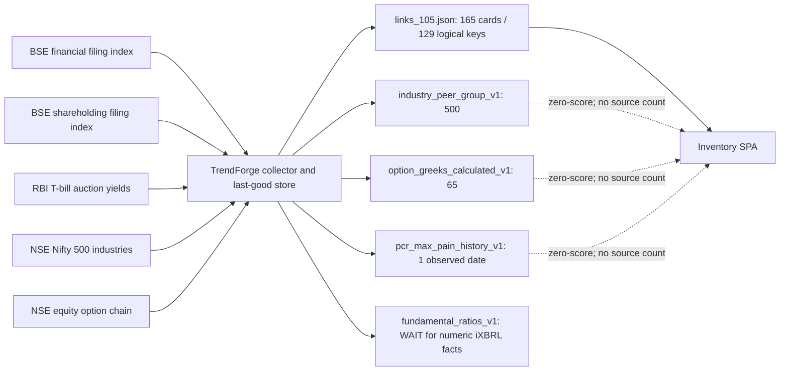

The source registry count is **119**. Calculated keys are content-addressed
research objects only; they do not inflate that count or enter Consensus and
Screener formula registries.

## Files 1-7 recovery flow (historical checkpoint, 2026-08-11)

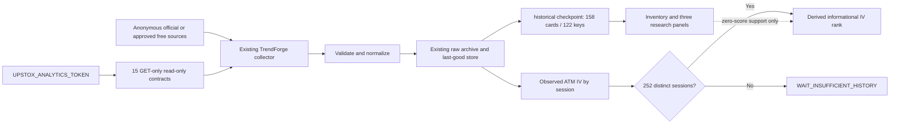

The exact 77-row state map is
`D:\TrendForge\docs\fable\evidence\FREE_SOURCE_RECOVERY_77_MATRIX_20260811.csv`.

## Packs 6-7 option flow (historical checkpoint, 2026-08-11)

```text
Official NSE option endpoint -> TrendForge resolver/archive -> parser v1.1
                                                              |-> identity gate
                                                              |-> Max Pain from OI
                                                              `-> saved overlay -> SPA

Upstox read-only route --------------------------------------> TOKEN REQUIRED
Other credentialed broker/UI routes ------------------------> REPLACED / BLOCKED
Synthetic Greeks/mock predictions ---------------------------> REJECTED
```

## Pack 5 flow (2026-08-11)

```text
NSE marketStatus -----> official session context ----+
NSE PIT(symbol fanout) -> BUY/SELL disclosure support +-> TrendForge archive/store
RupeeVest bundle ------> monthly MF-flow support -----+          |
                                                              catalog sample
                                                                   |
                                                        Inventory cards only
```

All three branches are zero-score. Consensus and Screener formula paths are
unchanged.

## Manual and scheduled entry paths

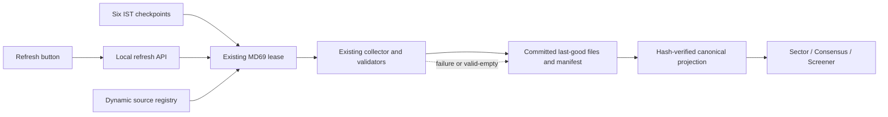

The saved object carries its original source date and fetch timestamp. It may
render as research data, but only fresh panel-critical sources can make the
panel green `LIVE`. See the [operation reference](../TrendForge/docs/fable/MD69_REFRESH_OPERATION_REFERENCE.md)
for source add/remove and state flows.

## MD69 canonical collection path — collector path and activation status

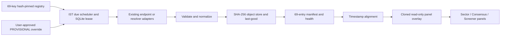

The SPA remains a display/catalog consumer. It does not fetch market sources or
own the scheduler. The named Windows scheduled task was not found during the
2026-08-06 audit, so automatic execution is not claimed until it is recreated
and observed.

Render these diagrams in any Mermaid-capable viewer (GitHub, VS Code Mermaid, Notion, etc.).

Related: [ARCHITECTURE.md](./ARCHITECTURE.md) · [INDEX.md](./INDEX.md) · [README.md](./README.md)

---

## 1. System context

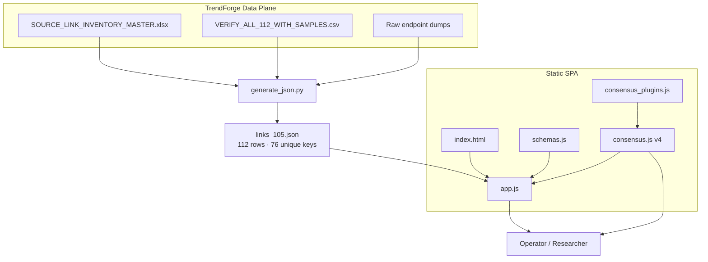

---

## 2. End-to-end data flow

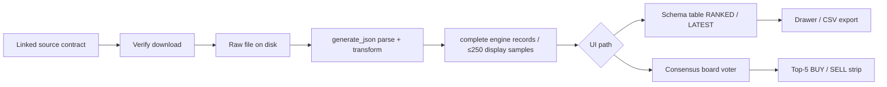

---

## 3. Frontend component graph

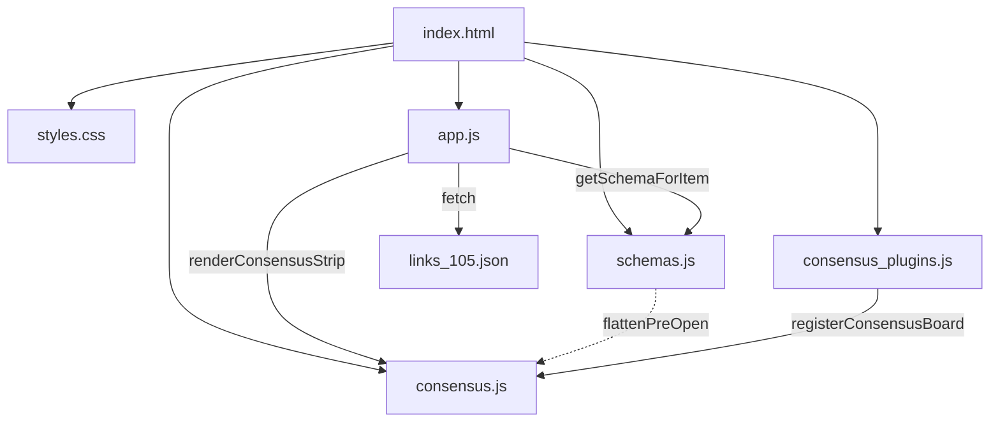

---

## 4. App runtime sequence

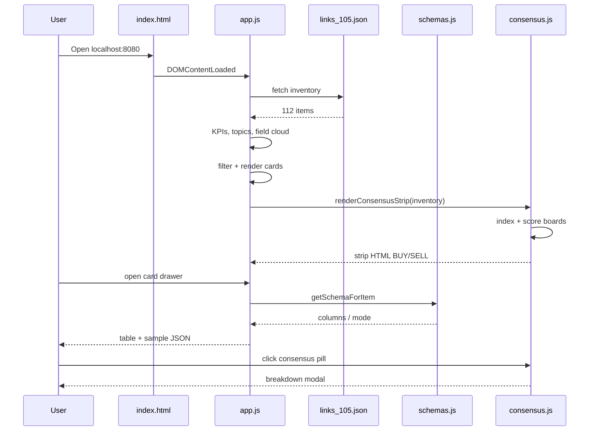

---

## 5. Consensus scoring graph

Shared pipeline for **both** UI strips (score once).

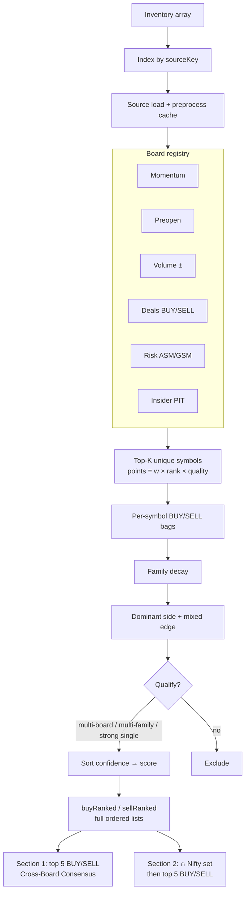

### 5b. Dual strip: Cross-Board vs Nifty filter

How stocks are **calculated, ordered, selected, shown**:

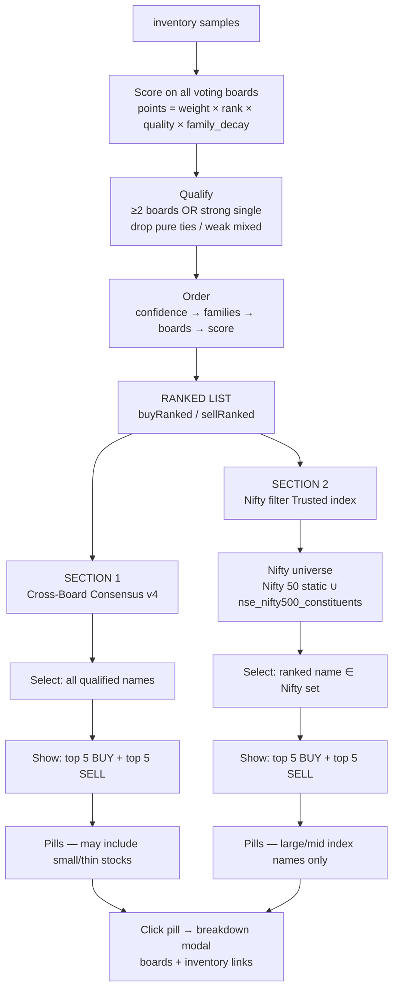

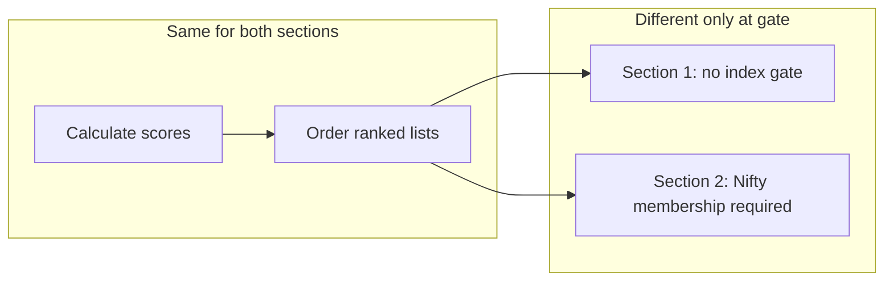

| Step | Cross-Board Consensus v4 | Nifty filter |
|------|--------------------------|--------------|
| Calculate | Board points + family decay | **Same** (reuse ranked lists) |
| Order | confidence → boards → score | **Same** |
| Select | Score rules only | Score rules **+** ∈ Nifty 50/500 |
| Show | Top 5 BUY / SELL any symbol | Top 5 BUY / SELL after Nifty filter |

**One line:** Section 1 = best scores anywhere · Section 2 = best scores **that are also on Nifty**.

**Data for Nifty set:** static Nifty 50 in `consensus.js` + `Symbol` / `entity_list` from inventory `nse_nifty500_constituents`.

**Code files:** `consensus.js` (`computeConsensus`, `buildNiftyUniverse`, `filterToNifty`, `renderConsensusStrip`) · host `#consensus-strip` in `index.html`.

---

## 6. Consensus board families

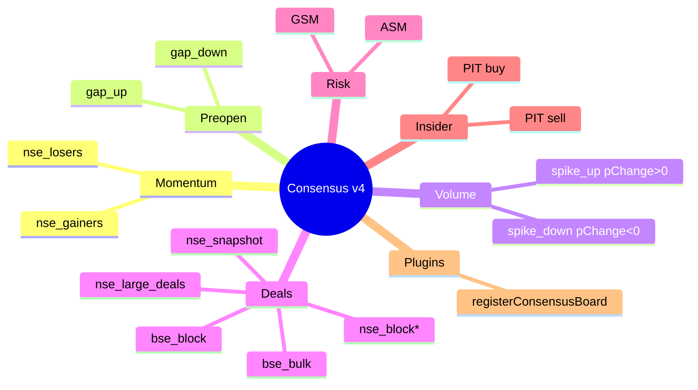

---

## 7. Inventory classification (historical 105-row snapshot)

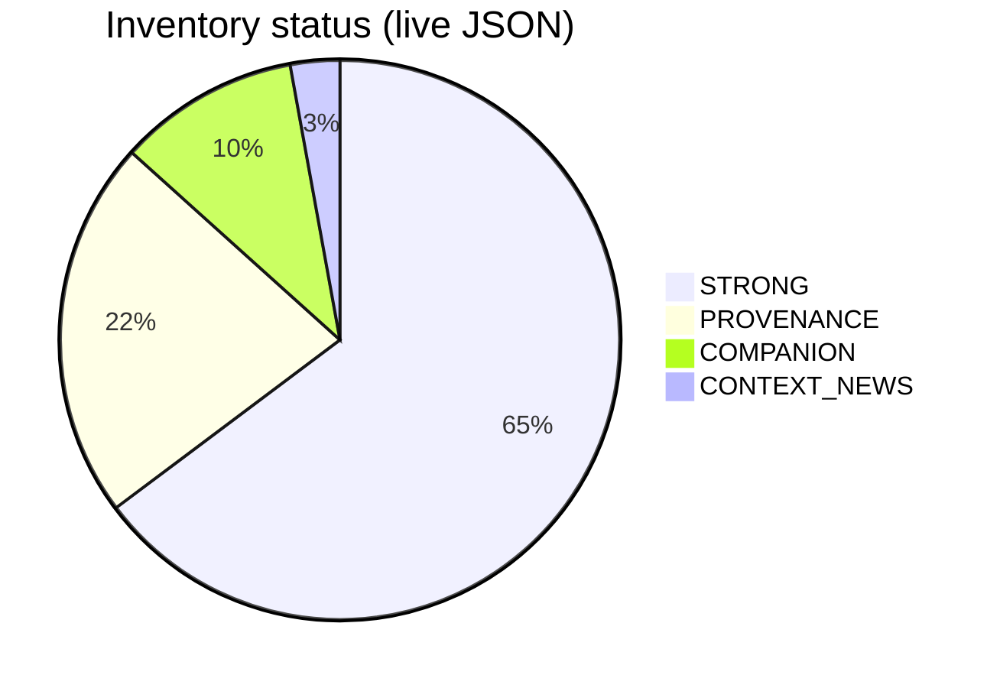

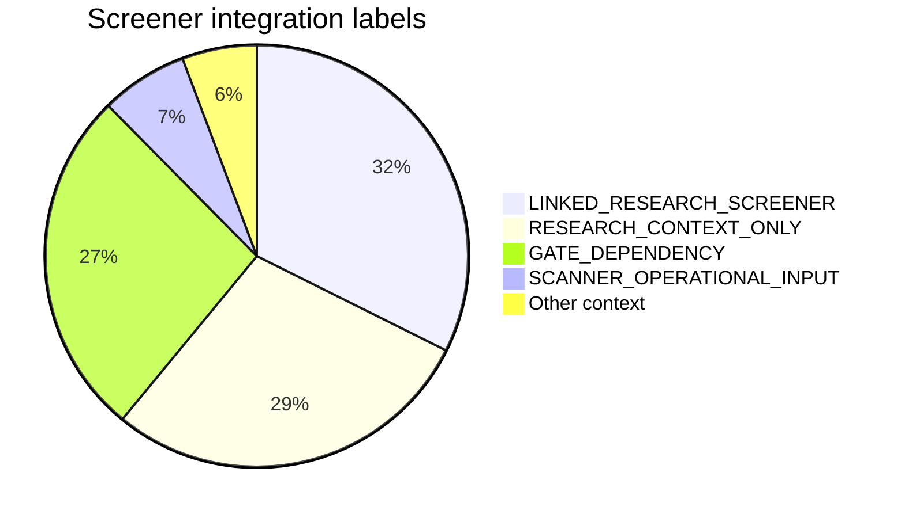

---

## 8. Usefulness model for stock / cross-board screening (historical audit)

**Canonical table + key lists:** [INDEX.md — Screener usefulness audit](./INDEX.md#screener-usefulness-audit-canonical)  
**Audited:** live `links_105.json` (2026-08-03). Not the same as `status=STRONG`.

### 8.1 Historical row split (105)

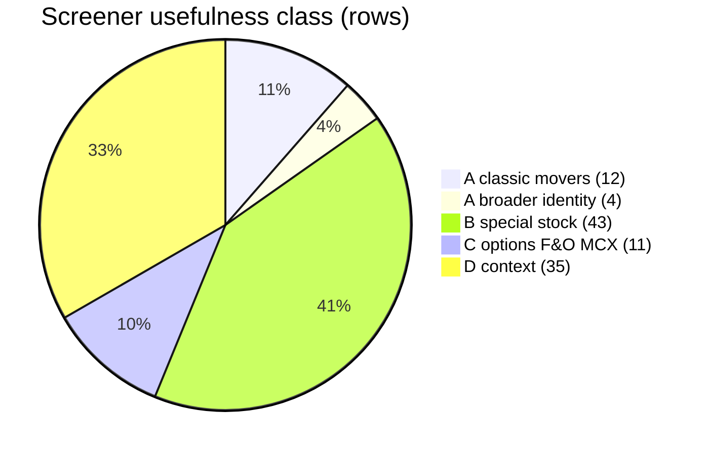

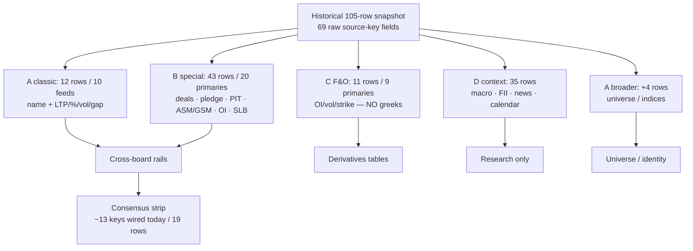

### 8.2 Claim vs audit

| Claim | Verdict | Live |
|-------|---------|------|
| A ~12 rows / ~10 feeds | **TRUE** | 12 / 10 |
| B ~43 rows | **TRUE** | 43 |
| C ~9 (no greeks) | **TRUE** (feeds) | 11 rows / 9 primaries; greeks **0** |
| D ~38 | **≈ TRUE** | 35 |
| A+B+C ~66 useful | **≈ TRUE** | **70** rows |
| ~36 unique boards | **≈ TRUE** | **42** primaries / **48** keys |
| Option chain often empty | **TRUE** | equity+index chain `n=0` |
| STRONG ≠ stock picker | **TRUE** | STRONG=68 includes macro/commodity |

### 8.3 Simple POV (verified)

```
105 inventory link rows
 ├─ ~70  → stock/contract screener useful (A+B+C)
 │         but only ~42 unique primaries / ~48 keys
 ├─  12  → classic volume / % / gap movers (10 feeds)
 ├─  11  → options/F&O/MCX (OI/volume, NOT greeks)
 └─  35  → context / macro / news / calendar
```

### 8.4 Cross-board vs “useful”

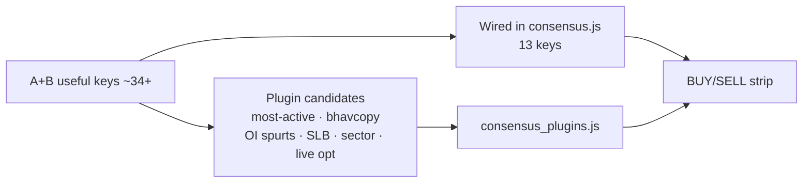

| | Count |
|--|------:|
| Rows touching current consensus keys | **19** |
| Unique consensus keys present | **13** |
| Greeks boards | **0** |

---


## 9. Generate → browse dependency

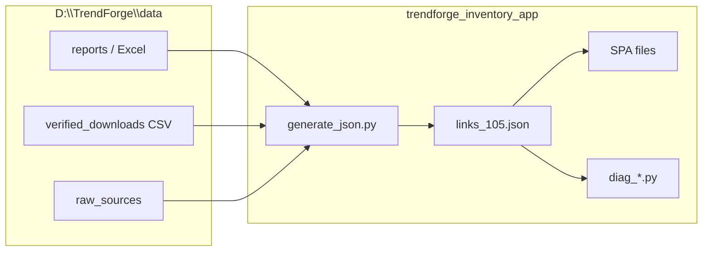

---

## 10. Future link onboarding (engine connection required)

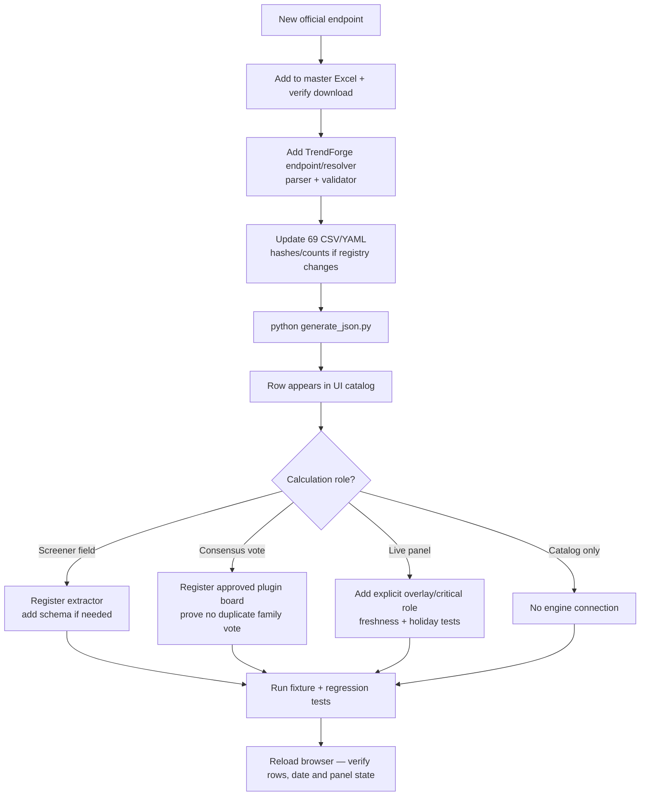

## 10A. Verified dynamic/static source linkage (2026-08-06)

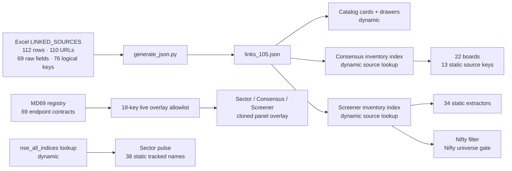

Adding a catalog row changes `CAT` only. It reaches `BOARDS`, `EXT`, `LIVE` or
`SECTOR` only after the corresponding parser/adapter and explicit role
registration are added and tested. This is the reason the three panels do not
automatically consume every catalog link.

---

## 11. File responsibility matrix

```mermaid
flowchart LR
  subgraph Docs
    R[README]
    I[INDEX]
    A[ARCHITECTURE]
    G[GRAPH]
  end

  subgraph Code
    APP[app.js]
    SCH[schemas.js]
    CON[consensus.js]
    PLG[plugins]
  end

  subgraph Data
    J[links_105.json]
    GEN[generate_json.py]
  end

  R --- I
  I --- A
  A --- G
  APP --- J
  SCH --- APP
  CON --- APP
  PLG --- CON
  GEN --- J
```

---

## How to refresh graphs after inventory change

```bash
cd D:\trendforge_inventory_app
python -c "import json;from collections import Counter;i=json.load(open('links_105.json',encoding='utf-8'));print(Counter(x['status'] for x in i));print(len(i))"
```

Update pie counts in this file and [INDEX.md](./INDEX.md) if status totals change.

## Live snapshot flow

```mermaid
flowchart LR
  T[TrendForge AsyncEndpointClient] --> N[10 P0 normalizers]
  N --> G{Date + age + session gates}
  G -->|eligible| S[trendforge.livePanels.v1]
  G -->|invalid or stale| W[WAIT / STALE / MARKET CLOSED]
  S --> C[Clone catalog inventory]
  C --> O[Overlay by source_key]
  O --> P1[Sector]
  O --> P2[Consensus and Nifty]
  O --> P3[Screener v1.3]
  W --> B[Block score and vote overlay]
```

---

## Implemented MD69-M1 registry graph

**Status:** the exact registry, pinned hash, typed profiles, compiler, and offline
tests are implemented. No live fetch or scheduler is activated.

```mermaid
flowchart LR
  CSV["Exact 69-source CSV"] --> HASH["Pinned SHA-256 file"]
  CSV --> COMP["Typed registry compiler"]
  YAML["source_refresh_profiles.yaml"] --> COMP
  HASH --> COMP
  COMP --> GATE{"All 69 contracts valid?"}
  GATE -->|No| FAIL["Fail with source key and reason"]
  GATE -->|Yes| MATRIX["69/69 executable adapter matrix"]
  MATRIX --> ENDPOINT["Existing AsyncEndpointClient endpoint"]
  MATRIX --> RESOLVER["Existing resolver or source monitor"]
  MATRIX --> PARSER["Existing parser or normalization adapter"]
  MATRIX --> PARAMS["Parameters and provider or fan-out"]
  MATRIX --> GROUP["Response reuse or session sharing"]
  MATRIX --> POLICY["PROVISIONAL; activation_ready=false"]
  POLICY -. "M2-M7 inactive" .-> STOP["No network, DB migration, or scheduler"]
```

```mermaid
flowchart LR
  TF["D:\\TrendForge - fetch/archive/normalize/schedule"] --> SNAP["Future validated snapshots"]
  SNAP --> SPA["D:\\trendforge_inventory_app - display/catalog only"]
  SPA -. "never fetch NSE/BSE directly" .-> BLOCK["Live download blocked"]
```

Full contract: [MARKET_DATA_69_CAMPAIGN_PLAN.md](./docs/fable/MARKET_DATA_69_CAMPAIGN_PLAN.md).

Ownership remains explicit: `D:\TrendForge` owns all fetching and processing;
this inventory app remains display/catalog only.

## Pack-2 context sources (collector-only, 2026-08-10)

```mermaid
flowchart LR
  R["TrendForge 104-key registry"] --> F["Existing resolver"]
  F --> B["TradingEconomics BDI"]
  F --> Y["Yahoo BDRY ETF proxy"]
  F --> G["Google Trends India RSS"]
  B --> N["Fail-closed normalize + date + previous/change"]
  Y --> N
  G --> N
  N --> O["Raw archive + canonical object + last-good"]
  O -. "separate catalog approval required" .-> SPA["Inventory SPA"]
```

These three keys are dynamic collector contracts, not hard-coded frontend
feeds. They remain informational and zero-score. No new catalog card,
Consensus vote, or Screener term was added.

```mermaid
flowchart LR
  P3["Pack 3 candidates"] --> R["TrendForge 108-key registry"]
  R --> A["Existing resolver and shared sessions"]
  A --> Q["CRISIL / ICRA / CARE / Google News RSS"]
  Q --> V["Schema + date + age + dedupe validation"]
  V --> S["Raw archive + normalized object + last-good"]
  S --> C["Inventory catalog 150 rows / 114 keys"]
  C -. "informational only" .-> Panels["Research panels"]
  Panels -. "zero vote / zero score" .-> Guard["Consensus and Screener unchanged"]
```

## Dead-route quarantine (2026-08-11)

```mermaid
flowchart LR
  D["Verified dead/unusable route"] --> Q["TrendForge NOT_IN_USE hint"]
  Q -. "never fetch / schedule / parse / score" .-> B["Blocked from production"]
  W["Working replacement source_key"] --> R["119-key typed registry"]
  R --> S["Archive + normalize + last-good"]
  S --> C["161-row catalog / 125 active keys"]
  C -. "existing role rules only" .-> P["Research panels"]
```

Quarantined: Yahoo `^BADI`, `pytrends`, StockEdge "API", BSE `FIIDII/w`,
and BSE `ParticipantWiseOI/w`. They remain documented, but do not enter the
runtime graph. Working replacements remain active. MCX is intermittent, not
dead, so its last-good path remains enabled. Machine-readable authority:
`D:\TrendForge\config\source_route_quarantine.yaml`.

## FII-related stock-name display (2026-08-11)

```mermaid
flowchart LR
  MD["MD69 Refresh pin 123"] --> TP["Screener / Tickertape / Dhan / Equitymaster"]
  TP --> STORE["Saved last-good objects"]
  STORE --> CAT["Catalog cards 162-165"]
  STORE --> API["GET /api/institutional/fii-stock-signals"]
  DEALS["Official bulk/block + SHP"] --> API
  API --> ID["Identity: ticker / ISIN / exact name / NAME ONLY"]
  ID --> UI["Inventory strip below Nifty Filter"]
  UI -. "informational only" .-> ISO["No consensus vote / no screener score"]
  API -. "not wired yet" .-> APP["TrendForge command room frontend"]
```

Last-good 2026-08-13: Screener 105, Tickertape 300, Dhan 32, Equitymaster 25.
Dhan hold % may be null. Command-room UI is `TF-APP-FII-M1` (open).
Log: ADD_40 intake 2026-08-12.

## FII Refresh consumer edge (2026-08-11)

```mermaid
flowchart LR
  R["Refresh button"] --> C["MD69 registry collector"]
  C --> S["Canonical hashed latest objects"]
  S --> P["Sector / Consensus + Nifty / Screener"]
  S --> F["FII stock-name API"]
  F --> U["FII informational strip"]
  C --> H["Completion hook"]
  H --> P
  H --> U
```

Observed 2026-08-13: all four routes persisted and rendered. Card rows are
Screener.in 105, Tickertape 300, Dhan 32 and Equitymaster 25. The inventory FII
API emits all four groups (462 holding/reference rows total), with unresolved
identities labelled `NAME ONLY` and zero scoring/voting authority. The main
TrendForge command room does not consume this API yet.


## Embedded Source Operations flow - 2026-08-15

```mermaid
flowchart LR
  C["Compiler report"] --> P["Source Operations panel"]
  M["Runtime monitor catalog"] --> P
  A["Fetch attempts"] --> P
  O["Parser outputs"] --> P
  F["Freshness status"] --> P
  P --> S["HEALTHY / VALID_EMPTY / STALE_PARTIAL / BLOCKED / FAILED / NOT_ATTEMPTED"]
  P --> D["Research visibility and failure reason"]
  P -. "never authorizes" .-> G["TrendForge gates and public state"]
```

The panel is embedded below the KPI cards when the terminal passes `embed=terminal`.
It is observability and provenance only; it does not create a second collector,
scorer, or decision engine and cannot activate sources, emit `CONFIRMED`,
calculate quantity, or execute orders.


## Hash-pin caveat - 2026-08-15

The source and bundled runtime files are directly byte-identical for this
change, but the existing snapshot manifest still contains the pre-Source-
Operations byte sizes and hashes. The existing `inventory-workbench.test.js`
also still expects the old drawer URL without `embed=terminal`. Its current
observed result is **FAIL: Size mismatch: index.html**. This means the runtime
panel observation is valid, but the manifest/test pin must be refreshed before
claiming a clean snapshot-integrity verdict. No source data, catalog sample, or
TrendForge state authority is affected by this metadata/test discrepancy.
